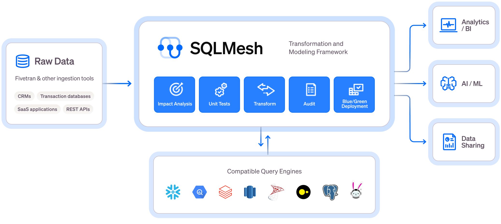

<p align="center">
  
</p>

SQLMesh is a next-generation data transformation framework designed to ship data quickly, efficiently, and without error. Data teams can efficiently run and deploy data transformations written in SQL or Python with visibility and control at any size.

It is more than just a [dbt alternative](https://tobikodata.com/reduce_costs_with_cron_and_partitions.html).

<p align="center">
  
</p>

## Core Features


> Get instant SQL impact analysis of your changes, whether in the CLI or in [SQLMesh Plan Mode](https://sqlmesh.readthedocs.io/en/stable/guides/ui/?h=modes#working-with-an-ide)

  <details>
  <summary><b>Virtual Data Environments</b></summary>

  * See a full diagram of how [Virtual Data Environments](https://whimsical.com/virtual-data-environments-MCT8ngSxFHict4wiL48ymz) work
  * [Watch this video to learn more](https://www.youtube.com/watch?v=weJH3eM0rzc)

  </details>

  * Create isolated development environments without data warehouse costs
  * Plan / Apply workflow like [Terraform](https://www.terraform.io/) to understand potential impact of changes
  * Easy to use [CI/CD bot](https://sqlmesh.readthedocs.io/en/stable/integrations/github/) for true blue-green deployments

<details>
<summary><b>Efficiency and Testing</b></summary>

Running this command will generate a unit test file in the `tests/` folder: `test_stg_payments.yaml`

Runs a live query to generate the expected output of the model

```bash
sqlmesh create_test tcloud_demo.stg_payments --query tcloud_demo.seed_raw_payments "select * from tcloud_demo.seed_raw_payments limit 5"

# run the unit test
sqlmesh test
```

```sql
MODEL (
  name tcloud_demo.stg_payments,
  cron '@daily',
  grain payment_id,
  audits (UNIQUE_VALUES(columns = (
      payment_id
  )), NOT_NULL(columns = (
      payment_id
  )))
);

SELECT
    id AS payment_id,
    order_id,
    payment_method,
    amount / 100 AS amount, /* `amount` is currently stored in cents, so we convert it to dollars */
    'new_column' AS new_column, /* non-breaking change example  */
FROM tcloud_demo.seed_raw_payments
```

```yaml
test_stg_payments:
model: tcloud_demo.stg_payments
inputs:
    tcloud_demo.seed_raw_payments:
      - id: 66
        order_id: 58
        payment_method: coupon
        amount: 1800
      - id: 27
        order_id: 24
        payment_method: coupon
        amount: 2600
      - id: 30
        order_id: 25
        payment_method: coupon
        amount: 1600
      - id: 109
        order_id: 95
        payment_method: coupon
        amount: 2400
      - id: 3
        order_id: 3
        payment_method: coupon
        amount: 100
outputs:
    query:
      - payment_id: 66
        order_id: 58
        payment_method: coupon
        amount: 18.0
        new_column: new_column
      - payment_id: 27
        order_id: 24
        payment_method: coupon
        amount: 26.0
        new_column: new_column
      - payment_id: 30
        order_id: 25
        payment_method: coupon
        amount: 16.0
        new_column: new_column
      - payment_id: 109
        order_id: 95
        payment_method: coupon
        amount: 24.0
        new_column: new_column
      - payment_id: 3
        order_id: 3
        payment_method: coupon
        amount: 1.0
        new_column: new_column
```
</details>

* Never build a table [more than once](https://tobikodata.com/simplicity-or-efficiency-how-dbt-makes-you-choose.html)
* Track what data’s been modified and run only the necessary transformations for [incremental models](https://tobikodata.com/correctly-loading-incremental-data-at-scale.html)
* Run [unit tests](https://tobikodata.com/we-need-even-greater-expectations.html) for free and configure automated audits

<details>
<summary><b>Level Up Your SQL</b></summary>
Write SQL in any dialect and SQLMesh will transpile it to your target SQL dialect on the fly before sending it to the warehouse.

</details>

* Debug transformation errors *before* you run them in your warehouse in [10+ different SQL dialects](https://sqlmesh.readthedocs.io/en/stable/integrations/overview/#execution-engines)
* Definitions using [simply SQL](https://sqlmesh.readthedocs.io/en/stable/concepts/models/sql_models/#sql-based-definition) (no need for redundant and confusing `Jinja` + `YAML`)
* See impact of changes before you run them in your warehouse with column-level lineage

For more information, check out the [website](https://sqlmesh.com) and [documentation](https://sqlmesh.readthedocs.io/en/stable/).

## Getting Started
Install SQLMesh through [pypi](https://pypi.org/project/sqlmesh/) by running:

```bash
mkdir sqlmesh-example
cd sqlmesh-example
python -m venv .venv
source .venv/bin/activate
pip install sqlmesh
source .venv/bin/activate # reactivate the venv to ensure you're using the right installation
sqlmesh init duckdb # get started right away with a local duckdb instance
sqlmesh plan # see the plan for the changes you're making
```

> Note: You may need to run `python3` or `pip3` instead of `python` or `pip`, depending on your python installation.

Follow the [quickstart guide](https://sqlmesh.readthedocs.io/en/stable/quickstart/cli/#1-create-the-sqlmesh-project) to learn how to use SQLMesh. You already have a head start!

Follow this [example](https://sqlmesh.readthedocs.io/en/stable/examples/incremental_time_full_walkthrough/) to learn how to use SQLMesh in a full walkthrough.

## Join Our Community
Together, we want to build data transformation without the waste. Connect with us in the following ways:

* Join the [Tobiko Slack Community](https://tobikodata.com/slack) to ask questions, or just to say hi!
* File an issue on our [GitHub](https://github.com/TobikoData/sqlmesh/issues/new)
* Send us an email at [hello@tobikodata.com](mailto:hello@tobikodata.com) with your questions or feedback
* Read our [blog](https://tobikodata.com/blog)

## Contribution
Contributions in the form of issues or pull requests (from fork) are greatly appreciated. 

[Read more](https://sqlmesh.readthedocs.io/en/stable/development/) on how to contribute to SQLMesh open source.

[Watch this video walkthrough](https://www.loom.com/share/2abd0d661c12459693fa155490633126?sid=b65c1c0f-8ef7-4036-ad19-3f85a3b87ff2) to see how our team contributes a feature to SQLMesh.
