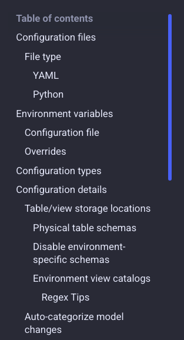
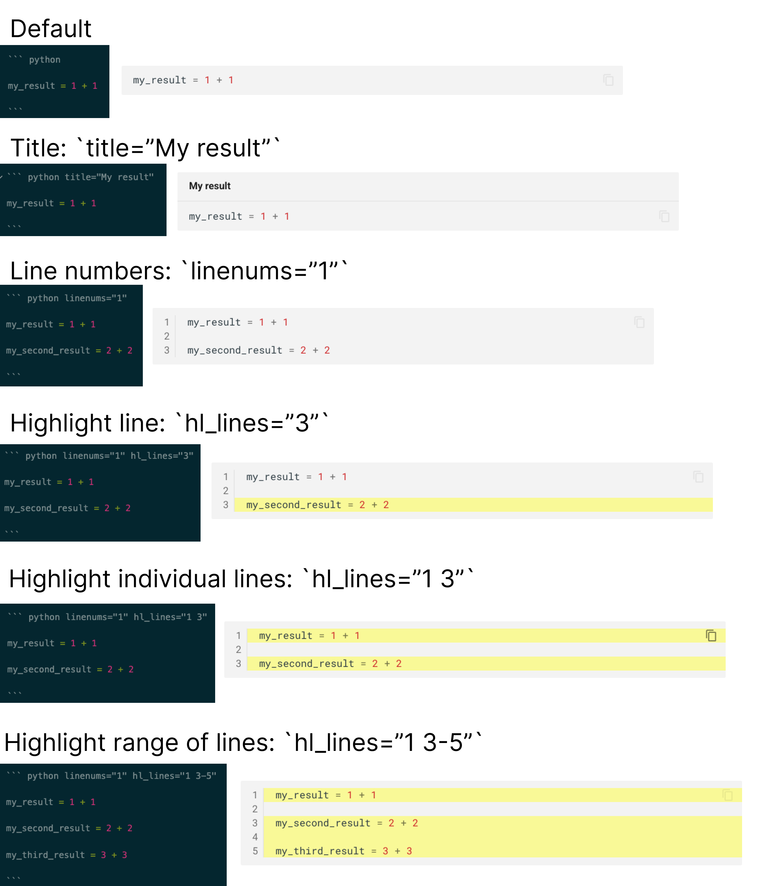
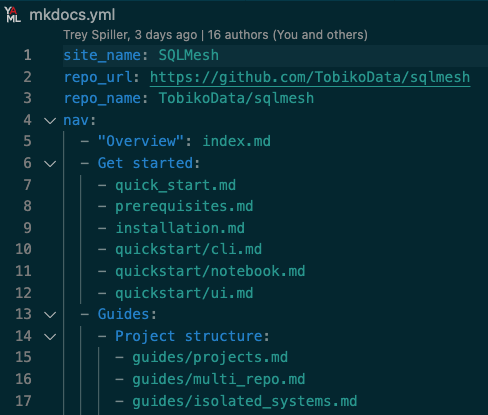
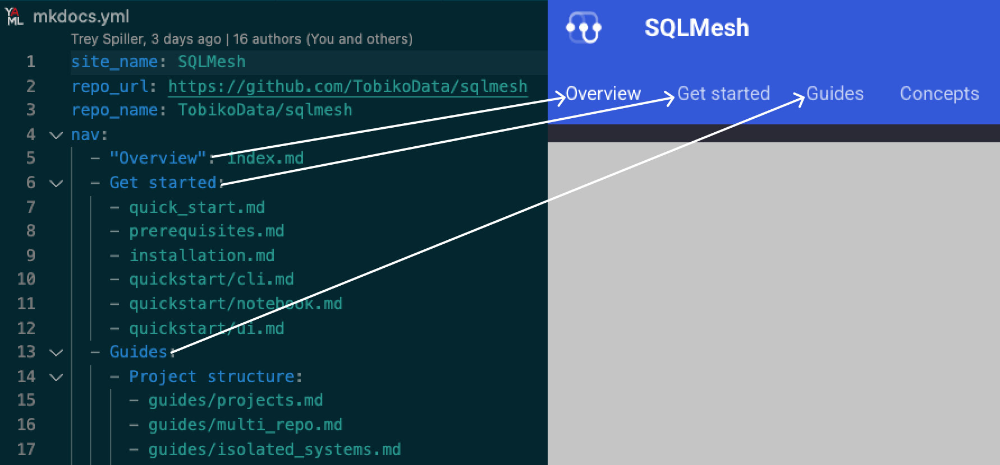
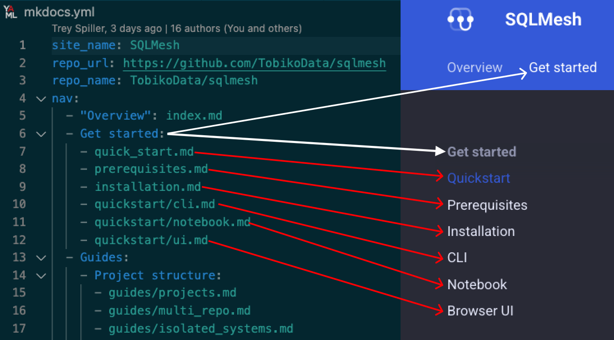
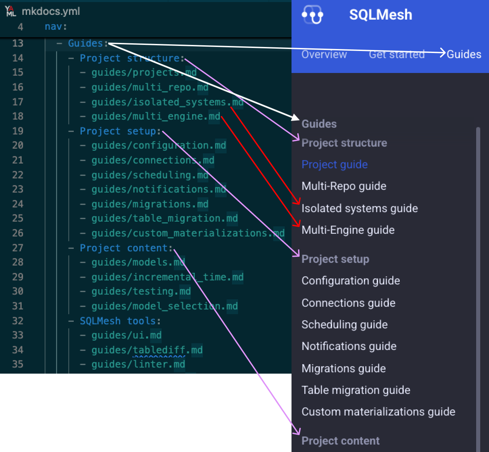
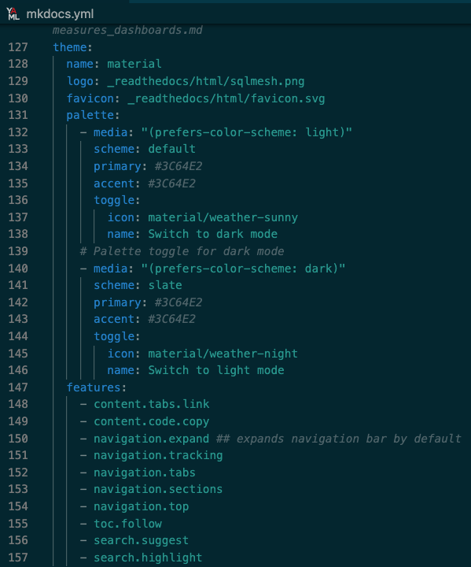
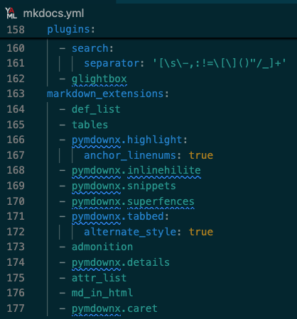
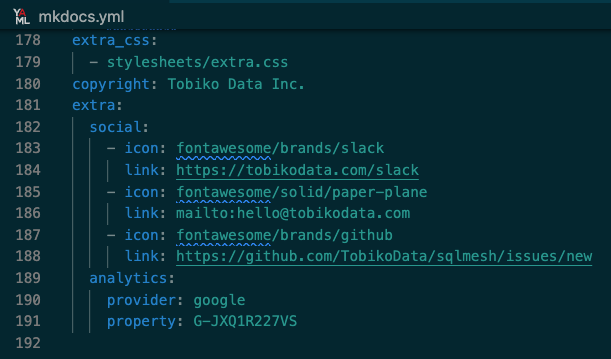

# SQLMesh Docs: Editing Guide

You have been asked/told to work on SQLMesh's docs - congratulations!

This document will get you set up to modify or create new SQLMesh documentation. It describes:

- The workflow for modifying or adding docs
- How we approach writing style for the docs
- The tools used to work with docs
- How to write docs in markdown
- Configuring the docs site
- Hosting the docs on readthedocs.io

From a technical perspective, docs modifications are just like modifications to any other code file. Therefore, they are made and approved via pull requests in the SQLMesh Github repo.

## Workflow

When modifying or adding the docs, you will generally follow these steps:

1. Clone the latest version of the SQLMesh Github repo
2. Locate the file to edit in the repo's `/docs` directory (or create a new file)
3. Ensure the docs tools are [set up](#setup) and working
4. Start a local version of the docs site
5. Make your changes, examining them in the local docs site
6. Create a new git branch
7. Commit your changes to the new branch
8. Push the branch to Github
9. Open a pull request

Depending on the scale/complexity of the changes, reviews may happen in one of two ways:

For larger changes or new pages, Trey will do a full review and editing pass. He will make edits directly in the doc file, create a new git branch, and make a PR **against your PR branch** (NOT against SQLMesh main).

You will review the changes and provide feedback, Trey will update the doc, and you will approve the PR when you are satisfied.

!!! important "Trey edits first"

    Because Trey will make large changes, his review and editing pass should occur BEFORE other team members spend time reviewing.

After Trey's PR has been merged into your branch, you will receive comments/feedback from other team members in the Github PR interface. You will then make the requested changes and push them to the branch, the PR will be approved by Trey or another team member, and it can be merged.

If your changes are smaller, Trey will not do a full edit and will provide comments/feedback in the Github PR interface like everyone else.

### New docs

Brand new docs pages usually require a significant amount of editing. Therefore, when drafting a new page your main focus is ensuring all the content is present, accurate, and ordered/structured sensibly.

If you built the feature being documented, you have the most knowledge about how it works and which parts are important. Your opinion and context are critical.

Do not spend too much time wordsmithing and styling. Because so much editing will happen, language you work hard on may be removed or altered. That's demoralizing, even if it's replaced by something you agree is better (and especially if it's replaced with something worse).

Your wordsmithing and style are important, but they should be the last step of the writing process. Doing them on the first draft does not provide a good ROI.

## Writing style

We do not have a written style guide, but we try to follow a few stylistic conventions.

At a high level, think "simpler is better."

Data engineering is complex, so SQLMesh is complex. We must focus on minimizing cognitive load for readers, while ensuring all the content is present and accurate. This is a difficult balance.

The most important specific stylistic conventions are:

1. Use second person voice when providing instructions
    - DO: "Add an audit to the model."
    - DO: "You can partition the table if necessary."
2. Use first person plural when describing actions but not providing instructions (e.g., extended example)
    - DO: "First, we create a new Python environment."
    - DO: "After running the plan command, we see the following output."
3. Use active voice
    - DO: "SQLMesh automatically infers the table schema."
    - DO NOT: "The table schema is inferred automatically by SQLMesh."
4. Prefer short sentences to long
    - Not dogmatic, use your judgment
5. Liberally use code examples and graphics
    - Abstract discussion is boring and difficult for people to follow
6. Liberally use headers to structure content within a page
    - But don't go overboard

## Tools

SQLMesh docs are built with the [`MkDocs` library](https://www.mkdocs.org/).

`MkDocs` is a static site generator that converts the files in our `/docs` directory into website files. When SQLMesh's Github repo has a PR merged to main, a build is triggered that converts and uploads the files to `readthedocs.io`, which then serves them to end users.

`MkDocs` is configured in the `mkdocs.yml` configuration file, which specifies the site page hierarchy, color theme, and MkDocs plugins used (e.g., [Material for MkDocs](https://squidfunk.github.io/mkdocs-material/)).

### Setup

You will work on the docs in a local copy of the sqlmesh git repository.

If you don't have a copy of the repo on your machine, open a terminal and clone it into a `sqlmesh` directory by executing:

``` bash
git clone https://github.com/TobikoData/sqlmesh.git
```

And navigate to the directory:

``` bash
cd sqlmesh
```

`MkDocs` is a Python library, so we first create and activate a new virtual environment:

```bash
python -m venv .venv
source .venv/bin/activate
```

We will now run three separate installation commands.

First, we install the "pre-commit" tools that automatically validate files when the `git commit` command is run:

```bash
make install-pre-commit
```

Next, we install the core SQLMesh dev dependencies:

```bash
make install-dev
```

And, finally, we install `MkDocs` and other docs dependencies:

```bash
make install-doc
```

The docs requirements file pins library versions, which can sometimes cause unresolvable conflicts. If you receive a "cannot find compatible versions" error for the final command, run this instead:

```bash
pip install mkdocs mkdocs-include-markdown-plugin mkdocs-material mkdocs-material-extensions mkdocs-glightbox pdoc
```

### Usage

It is helpful run a local version of the docs site while editing or adding docs. That way you can preview how your changes will look on the SQLMesh hosted docs.

Navigate to the `sqlmesh` directory we created before and run `mkdocs serve`:

``` bash
> mkdocs serve

INFO     -  Building documentation...
INFO     -  Cleaning site directory
INFO     -  Documentation built in 3.63 seconds
INFO     -  [16:02:59] Watching paths for changes: 'docs', 'mkdocs.yml'
INFO     -  [16:02:59] Serving on http://127.0.0.1:8000/
```

View the docs site by navigating to `http://127.0.0.1:8000/` in a web browser. To view the HOTWO doc, navigate to `http://127.0.0.1:8000/HOWTO/`.

The command will block the terminal in which it is run, so you must open a new terminal to do anything on the command line.

The docs site will update in real time as you edit and save changes to the underlying files.

## Docs markdown

We use `MkDocs` so we can control almost all of the site's appearance and behavior with markdown. That makes it simple to maintain the docs as text files in the SQLMesh Github repo.

This section discusses the different ways we use markdown to control the appearance and behavior of the docs site.

### Document structure

A docs page's structure (headers and within-page navigation) is defined by the use of markdown headers.

A markdown header is a line that begins with between one and four hash marks `#`. The number of hash marks determines the "level" of the header, with one hash mark being the highest level.

Every docs page must begin with a top-level header (one hash mark). This header is used as the page's title in the navigation bar.

!!! important

    The page may only have one top-level header that begins with a single hash mark!

Subsequent headers are used to divide the page into sections, with each level down nested within its parent (e.g., three-level `###` headers are nested within two-level `##` headers).

A within-page table of contents bar is automatically generated from the headers of the page and displayed on the right side.

For example, the [Configuration guide's](./guides/configuration.md) navigation bar uses multiple header levels to group content:



### Lists

We do not want pages that are a "wall of text," which is difficult to read and understand. Instead, use lists to break up a page and more effectively communicate its content.

For example, if we are describing a process with multiple steps, it is clearer to use a numbered list of those steps than a separate sentence for each step.

Similarly, any time a sentence contains a long list of items, you should consider using a bulleted list instead.

Lists are useful for breaking up a page, but that visual distinction draws people's attention. Be careful not to use so many lists that you tip the balance from "too much text" to "too little text."

To specify a list, put each element on its own line. Start the line with:

- A dash `-` or asterisk `*` for a bullet list
- A number and period `1.` for a numbered list
- A letter and period `a.` for a lettered list

!!! important "Empty line before list!"

    You must put an empty line before the first list element, or it will not render.

We can specify a simple bullet list like this:

```
Here's a bullet list!

- First item
- Second item
```

And it renders to this:

Here's a bullet list!

- First item
- Second item

<br>
Or a numbered list:

```
1. First item
2. Second item
```

1. First item
2. Second item

<br>

You can nest list items by adding 4 spaces of indentation:

```
- First item
    - First subitem
    - Second subitem
- Second item
```

- First item
    - First subitem
    - Second subitem
- Second item

### Inline code

Sometimes we need to display a simple code snippet inline with regular text.

For example, we might be describing the `sqlmesh plan` command and want to differentiate the words "sqlmesh plan" from the other words.

Do this by wrapping the code in single backticks:

```
I want to make sure `sqlmesh plan` looks different than the other words!
```

### Code blocks

The SQLMesh docs include many examples of code or command output. These examples are displayed in special "code blocks" that display and highlight the code.

Code blocks begin and end with three backticks ```. The code to display goes between the first and second set of backticks.

Specify the code language next to the first set of backticks to ensure proper syntax highlighting. For example, we could specify Python highlighting like this:

```
 ``` python

 my_result = 1 + 1

 ```
```

For terminal commands and output, specify the language as `bash`.

Code blocks have a number of options for display, the most important of which are line numbers and highlighted lines.

Line numbers are important for larger code blocks, making it easier for the text to reference specific parts of the code.

Highlighted lines provide an even more direct way to draw attention to specific parts of the code.

This figure shows examples of the different code block options:



### Callouts

Callouts are used to draw attention to important points or to highlight important information.

Use them to ensure that readers notice key points. They are particularly useful if the important point is embedded in a large section of text.

We use the "admonitions" library for callouts, and [they have 12 built-in types](https://squidfunk.github.io/mkdocs-material/reference/admonitions/#supported-types) with different icons and styles:

- `note`
- `abstract`
- `info`
- `tip`
- `example`
- `quote`
- `success`
- `question`
- `warning`
- `failure`
- `danger`
- `bug`

Create a callout by starting a line with three exclamation marks `!!!` and the name of the callout type you want to use. For example:

```
!!! note
    This creates a note callout!

```

And this is what that callout looks like:

!!! note
    This creates a note callout!

By default, the callout title is its type. You can change the title by adding it in quote after the callout type:

```
!!! important "Custom title"
    This creates an important callout with a custom title!
```

!!! important "Custom title"
    This creates an important callout with a custom title!

You can make a callout collapsible by using three question marks `???` instead of exclamation marks:

```
??? tip
    This creates a collapsible tip callout!
```

??? tip
    This creates a collapsible tip callout!

You can make the collapsible open by default by adding a plus sign `+` to the three question marks:

```
???+ warning
    This creates a collapsible warning callout that is open by default!
```

???+ warning
    This creates a collapsible warning callout that is open by default!

### Images

The SQLMesh docs use screenshots of output, graphics, and other images to supplement the text.

To add an image, first create it and save it in PNG format. Save it in a folder in the directory where its doc's markdown file is located.

Add the image to a page with this markdown:

```

```

Note that:
- The line starts with an exclamation point `!`
- Brackets containing the image's alt text come next
- The relative path to the image follows the brackets

There may not be spaces between the exclamation point, brackets, and path.

Specify alt text for all images.

### Custom CSS and inline HTML

Sometimes markdown just doesn't cut it.

`MkDocs` supports custom CSS and inline HTML, both of which we use as necessary (but sparingly).

For example, by default you can only link to navigation elements within a page (like section titles). We sometimes want to link to individual pieces of content, so we use inline HTML to create a custom anchor link.

For example, [in the FAQ](./faq/faq.md#schema-question) we make a link to the "schema question" with the inline HTML `<a id="schema-question"></a>`.

## Configuring docs

Docs are configured in the `mkdocs.yml` file.

The first section of the file defines high-level information about SQLMesh, such as the docs site's name and our Github repo URL/name.



We describe subsequent sections below.

### Site layout and navigation

The bulk of the file defines the structure/layout of the docs site's pages under the `nav` key.

It defines a hierarchy of pages and subpages that is reflected in the site's navigation elements (e.g., top menu, left sidebar).

As with all YAML files, indentation plays a key role. Each level of indentation generates a new level down in the hierarchy.

One indentation below `nav` corresponds to top-level navigation elements like the menu bar links.

Here we see links generated from the first three top-level `nav` entries `Overview`, `Get started`, and `Guides`:



As we continue downward in the hierarchy, we may either add specific pages or new section(s) that contain subpages. SQLMesh docs use both these approaches in different places.

For example, the `Get started` section contains 6 subpages, while the `Guides` section contains 4 sections that each specify their own subpages.

Here we see the 6 subpages specified directly under the `Get started` entry in the lefthand navbar:



And here we see the first three subsections `Project structure`, `Project setup`, and `Project content` (and their subpages) specified under the `Guides` entry:



You may continue to add subsections as needed. At the time of writing, only the `Tobiko Cloud` section uses a 3rd level of nested sections.

### Theme and colors

The `theme` section defines the appearance of the docs site. It is rarely modified.

It specifies the theme name, logo, and color palette, and configures features like the navigation bar and sidebar.



### Plugins/extensions

The `plugins` and `markdown_extensions` sections specify different plugins and extensions we use to add functionality to the docs site. It is rarely modified.

Some examples:
- Plugin `glightbox` allows users to expand and zoom on images
- Markdown extension `pymdownx.tabbed` specifies how tabbed content is displayed
- Markdown extension `admonition` allows us to add callout boxes



### Extra

The final sections of the `mkdocs.yml` file define assorted metadata about the site.

The `extra_css` key specifies the location of the file containing custom CSS. We use this to add custom colors to some elements. It is rarely modified.

The `extra` section specifies links embedded in the site footer and our Google Analytics ID. It is rarely modified.



## Docs hosting

Our docs are built with `MkDocs`, but they are hosted on `readthedocs.io`.

When a PR is merged to main, it triggers a docs build and deployment. That process is configured in the `.readthedocs.yaml` file.

Readthedocs supports multiple versions of the docs, with two important versions: `stable` and `latest`.

The `stable` docs are built from the latest Github release tag, while the `latest` docs are built from the latest commit on main.

We have hidden the interface for accessing `latest`, so users will generally not be able to access it. However, you may access it by replacing the word "stable" with "latest" in a URL:

For example, the Getting started page is at:

- Stable: `https://sqlmesh.readthedocs.io/en/stable/quick_start/`
- Latest: `https://sqlmesh.readthedocs.io/en/latest/quick_start/`