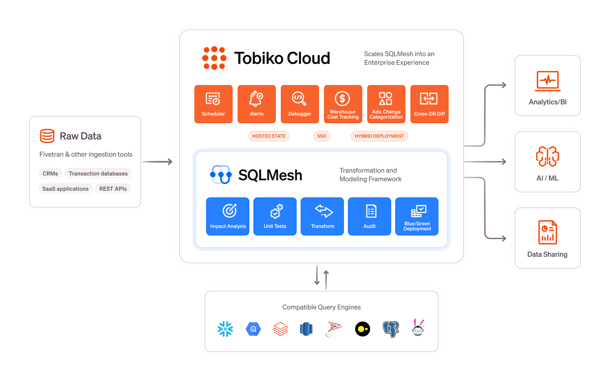

# Welcome to Tobiko Cloud

[Tobiko Cloud](https://tobikodata.com/product.html) is a data transformation platform that enhances the ease and efficiency of managing data pipelines with SQLMesh.

Tobiko Cloud is designed for companies who want to:

- Host SQLMesh on a robust, reliable platform without building and maintaining it themselves
- Understand the status, activity, and performance of data pipelines at a glance
- Rapidly detect and debug problems with their pipelines
- Monitor cloud costs over time, by model (BigQuery and Snowflake engines only)

## How is Tobiko Cloud different from SQLMesh?

Tobiko Cloud complements SQLMesh, supporting companies that need enterprise-level features like scalability, observability, and cost optimization.

Here’s a comparison:

1. **Deployment**: Tobiko Cloud simplifies SQLMesh deployment by hosting it on our infrastructure.

    It provides enterprise-grade hosting and scalability for complex data transformations, freeing teams from managing infrastructure themselves.

2. **Observability and Insights**: Tobiko Cloud integrates deeply with SQLMesh, providing instant visibility into pipeline versions, code changes, and errors.

    This allows teams to  monitor their pipelines, detect changes in pipeline behavior, and rapidly trace the root causes of data issues.

4. **Efficiency**: SQLMesh's built-in features like virtual data environments and automatic change classification reduce computational costs and improve processing speeds.

    Tobiko Cloud's enhanced change classification identifies even more scenarios where code changes don't require rerunning downstream models.

4. **Cost monitoring**: Tobiko Cloud automatically tracks costs per model execution for BigQuery and Snowflake.

    This allows teams to rapidly detect anomalous spending and to identify the models driving cloud costs.

## Learn more

Ready to unlock a faster, smarter, and more efficient way to manage your data pipelines? Book a call with the Tobiko Cloud team today!

Discover how Tobiko's managed SQLMesh platform will empower your team to scale effortlessly, optimize costs, and deliver accurate data faster — all while freeing your team from infrastructure headaches.

Whether you're a data engineer, or decision-maker, Tobiko Cloud gives you data transformation without the waste. Let's talk!

