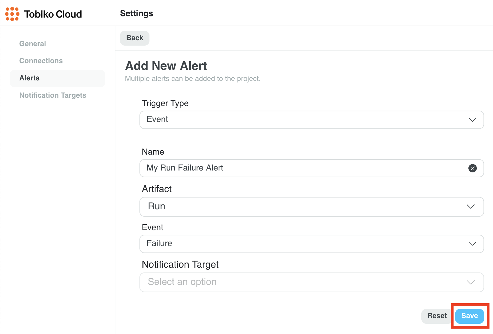
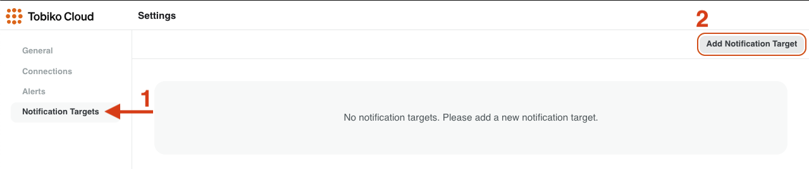

# Alerts 

When something is wrong with your data, you want to be the first to know. You do not want to find out from your stakeholders when their dashboards do not look right. Unit tests and audits help catch issues during development, but Tobiko Cloud can alert you when certain events happen or when a measure exceeds a threshold during runs. They allow you to be quickly informed when something is wrong with your data pipelines.

## Alert Configuration

Alerts can be configured in the Tobiko Cloud Settings section.

To add a new alert, click on Add Alert in the top right.

Then choose the type of alert you would like to configure, enter a descriptive name, fill in the configuration information, and click Save.

Note that an alert will need a notification target to send the alerts to. Please see the section on how to configure notification targets.

## Events

Tobiko Cloud Alerts can be triggered by the following events:

- Plan start
- Plan end
- Plan failure
- Run start
- Run end
- Run failure

## Measures

Tobiko Cloud Alerts can be triggered when a measure exceeds a threshold or meets a condition. This can be a measure for an evaluation or aggregated over a plan application or a run.

# Notification Targets

Notification targets allow you to configure different ways for alerts to contact you. They can be used by multiple alerts so you only have to configure them once.

## Supported Notification Target Types

Tobiko Cloud supports the following notification target types:

- Slack API
- Slack Webhook
- PagerDuty

## Notification Target Configuration

Notification targets can be configured in the Tobiko Cloud Settings section.

To add a new notification target, click on Add Notification Target in the top right.

Then enter a descriptive name for the new notification target, select its type, fill in the configuration information, and click Save.

