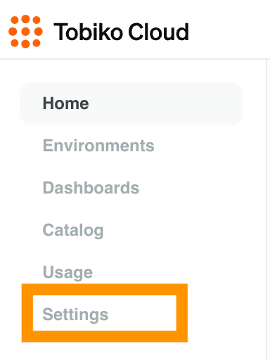
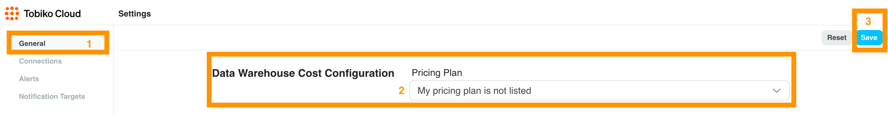
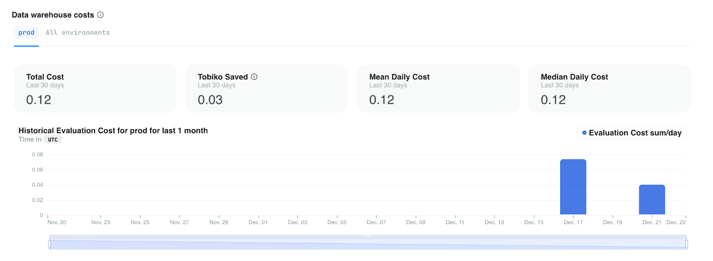

# Data Warehouse Costs and Savings with Tobiko

Understanding and managing data warehouse costs is challenging. Tobiko Cloud helps by tracking your data warehouse costs and integrating them into the Tobiko Cloud UI.

Tobiko Cloud tracks data warehouse cost estimates per model for BigQuery and Snowflake projects. It also estimates how much money Tobiko Cloud has saved you by skipping unnecessary model reruns.

## Supported Data Warehouse Pricing Plans

Tobiko Cloud supports costs and savings data for these data warehouse pricing plans:

- BigQuery On Demand
- Snowflake Credits

## Data Warehouse Cost Configuration

If you use a supported pricing plan, visit Settings to configure Tobiko Cloud's cost estimates.

On the General settings page (1), select your pricing plan (2), enter your costs, and then save (3).

## Where to find cost and savings information

Estimated costs and savings are displayed on the homepage, production environment page, runs and plans pages, and individual model pages.

Cost information on each page will look similar to this:

### Savings Categories

When calculating your data warehouse costs, we also calculate how much you saved by using Tobiko!

Tobiko Cloud comes with even more change categorization capabilities than open-source SQLMesh, such as advanced column-level impact analysis.

Cost savings are broken up into three main categories:

- **Prevented Reruns**: If SQLMesh already executed a change in one environment, we won't rerun it in another environment (backfills from development environments are reused when it is safe to do so).
- **Unaffected Downstream**: SQLMesh understands SQL, so we skip re-execution if a downstream model is not affected by an upstream change.
- **Virtual Environments**: With Virtual data environments, new environments can be created without running any computations at all.

### Where to find cost savings information

Cost savings are included in most places costs are displayed. Find how much you've saved using Tobiko by viewing the homepage, production environment page, or individual model pages.
