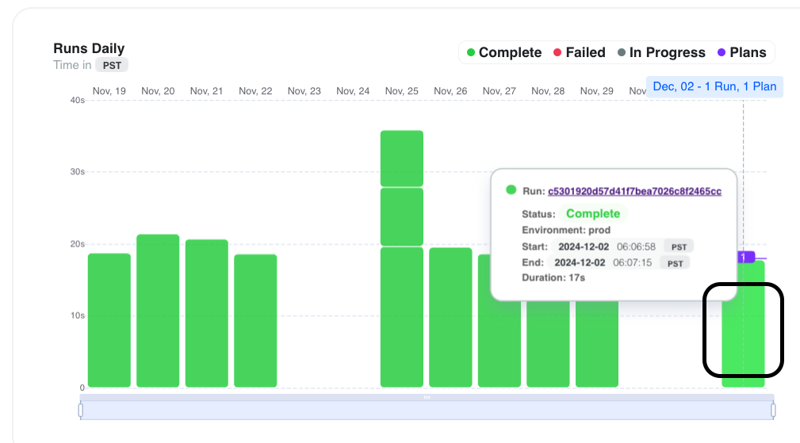
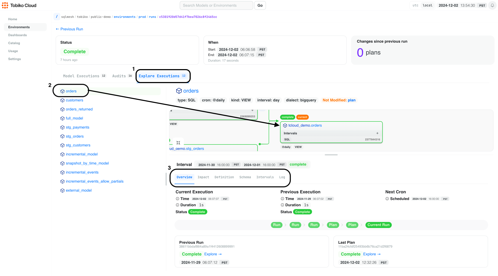
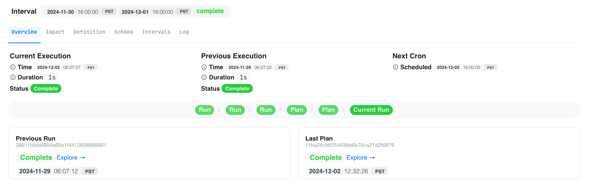
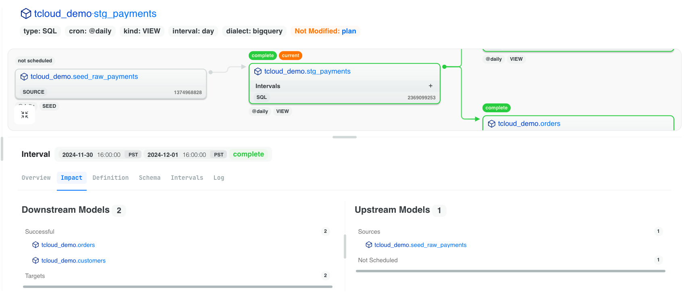
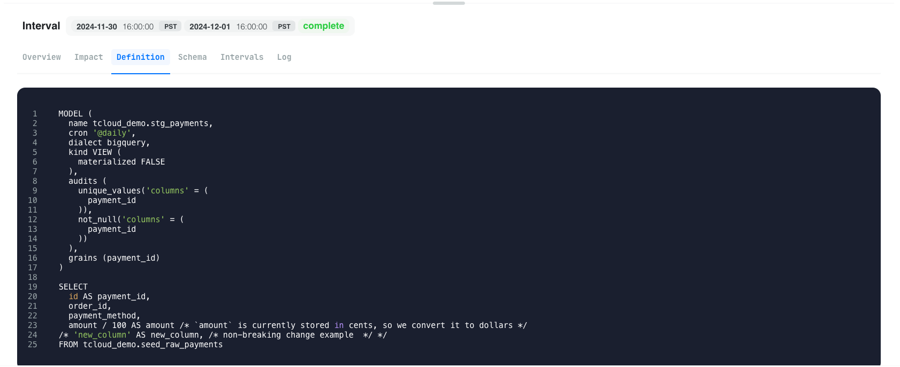
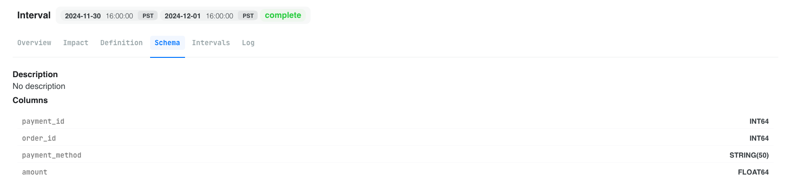
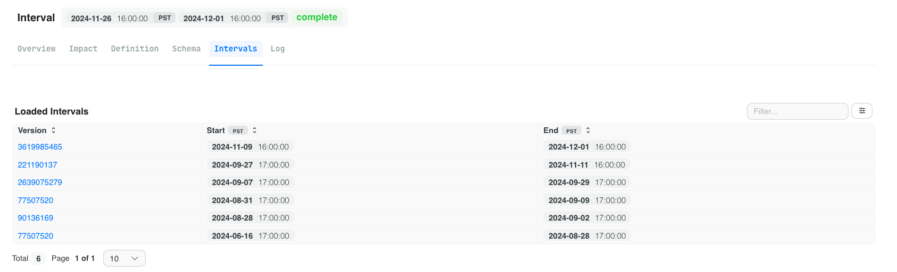
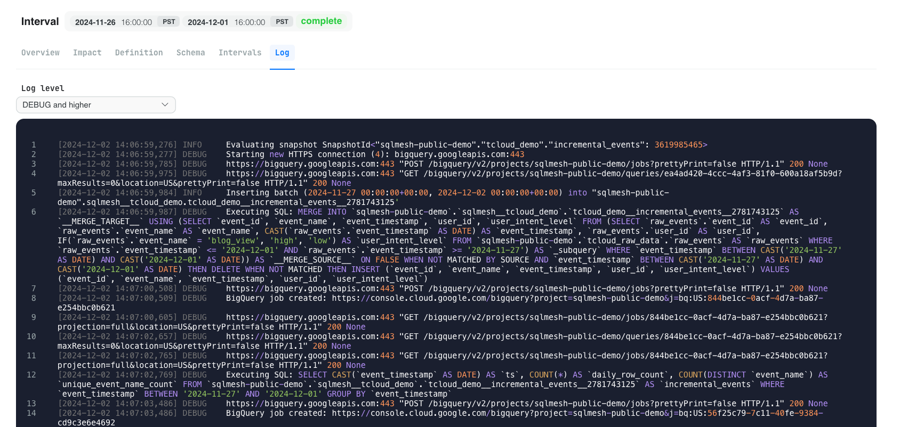

# Debugger View

<iframe src="https://www.loom.com/embed/e8d4f4b3557f47b1a945eee40407f482?sid=49b03511-0415-4715-af04-ac9372247e95" frameborder="0" webkitallowfullscreen mozallowfullscreen allowfullscreen style="position: absolute; top: 0; left: 0; width: 100%; height: 100%;"></iframe>

This view is used to help you debug production run issues with your SQLMesh models in Tobiko Cloud.

Fixing data pipelines in production is a stressful, time-consuming process, so we're here to make it easier with a few visuals/clicks.

> Note: the debugger view is only available for models that have been executed in your data warehouse via the `tcloud sqlmesh plan` or `tcloud sqlmesh run` commands.

## Using the Debugger View

Step 1: On the Tobiko Cloud home page, click any bar in the `Runs Daily` chart to open the debugger view. It doesn't matter whether the bar is green or red.

  
Step 2: Click on the "Explore Executions" tab (bubble 1) to see specific execution details about the run, by model.

Then choose a model to view. We clicked on the `orders` model (bubble 2) - notice that it shows you a focused view of the DAG (think: lineage) centered on whichever model you clicked.

From here, you can explore the execution details of the run with a model's focused tabs (bubble 3).

The rest of this page describes those tabs.

> Pro tip: you can toggle whether timestamps are in UTC or your local timezone in the page's upper right corner.

## Debugger View Tabs

### Overview

See a summary of the model's characteristics and behavior during current and historical runs.

- You'll see a high-level overview of the model's characteristics, including the execution time, duration, completion status, and next scheduled run.
- View the past 5 run and plan activities to see the model's historical behavior. This is useful to get a pulse on how often it succeeds or fails. If you notice it's failing often, this is a good model to investigate further.
- Click on the "Previous Run" tile to explore the details of the previous run. This is useful if you want to compare the previous run to the current one if you notice duration is shorter or longer than expected.
- Click on the "Last Plan" tile to explore the details of the last plan that was applied. This is useful to see if the model's code was changed in a way that sped up or elongated the duration of the run. It's also helpful to verify if the schema changed in a way that might be causing an issue.

### Impact

See the current model's downstream and upstream models in a list format.

This is useful if lots of models are in the DAG view and you want to see the model's full impact at a glance.

### Definition

See the exact code that was executed during the run.

This is useful if you want to determine whether the code changed in a way that might be causing an issue.

### Schema

See the current model's schema.

This is useful to determine whether the schema changed in a way that might be causing an issue.

### Intervals

See the specific time intervals that were processed during the run.

This is useful to see which exact time intervals succeeded or failed. Also, it's useful to determine whether time intervals changed in a way that might be causing an issue such as longer run duration.

### Log

See all the SQLMesh logs from the run.

You can filter for multiple levels of logs: `info`, `warning`, `error`, etc.

