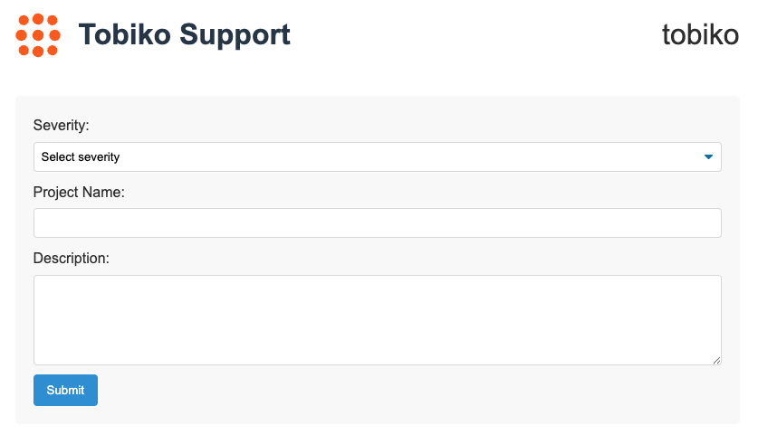

# Incident Reporting

We monitor Tobiko Cloud 24/7 to ensure your projects are running smoothly.

If you encounter any issues, however, you can report incidents directly in Tobiko Cloud itself.

This will notify our support team, who will investigate and resolve the issue as quickly as possible.

### Reporting an incident

Follow these steps to report an incident in Tobiko Cloud:

1. Visit the [Tobiko Cloud Incident Reporting Page](https://incidents.tobikodata.com/)
2. Select one of the three severity levels for your incident
3. Enter the project name the incident is related to
    * The project name is displayed after your organization name in the Cloud UI
4. Write a detailed description of the incident
    * Include all relevant information that will help our support team understand and resolve the issue
5. Click the `Submit` button to send your incident report
6. You will receive a confirmation message indicating that your incident has been reported successfully
7. You will hear from our support team after submitting the incident report

### Reporting an incident when SSO is unavailable

Single Sign-On (SSO) is the default way to log in to Tobiko Cloud. However, SSO could be down or not working when you need to report an incident.

Tobiko Cloud provides a standalone page that doesn't require SSO so you can report an incident when SSO is not working. The page is unique to your organization.

The standalone URL is available in the incident reporting page when you log in with SSO. Because accessing the standalone URL does not require SSO, you should only share it with staff authorized to report incidents.

To store your standalone incident reporting URL:

1. Visit the [Tobiko Cloud Incident Reporting Page](https://incidents.tobikodata.com/)
2. Click the `Copy Standalone URL` button below the incident reporting section
3. Save this URL in an easily accessible location in case you need to report an incident when SSO is not working

!!! note "Don't wait!"
    We recommend copying this URL *right now* so your organization is protected from difficulty reporting an incident.

### SSO not enabled for your organization

SSO login is required for accessing the standalone incident reporting URL.

SSO is enabled by default in Tobiko Cloud. If it is not enabled for your organization, contact your solution architect and ask them to provide you with a standalone incident reporting URL.
