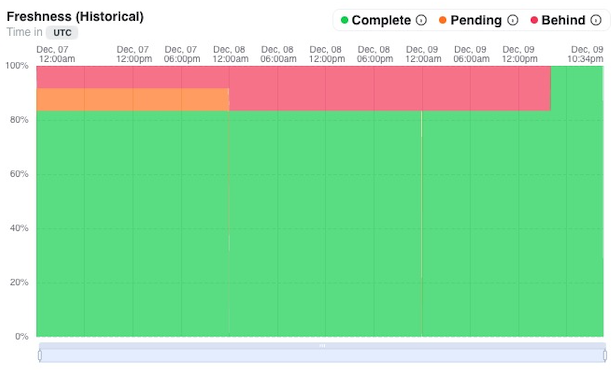

# Model Freshness

1. The model freshness chart shows you the freshness of your models within your datawarehouse relative to the model's configured cron
2. The chart's data is historical, meaning it is showing what freshness looked like at that time. This is helpful if someone reported a data problem and you want to see what the freshness looked like at that time to make a quick determination if the problem may be the data hadn't run yet or deeper than that.
3. Models that have been run for all previous cron periods are considered "complete" (green).
    - All green means the datawarehouse is up-to-date relative to the model crons.
4. Models that have not run for the most recent previous cron period are considered "pending" (yellow).
5. Models that have not run for for multiple previous cron periods are considered "behind" (red).
    - Red is an indication that something may be wrong and should be looked into.
6. The chart can be clicked on at any point in time to see which models were complete, pending, and behind at that time.

