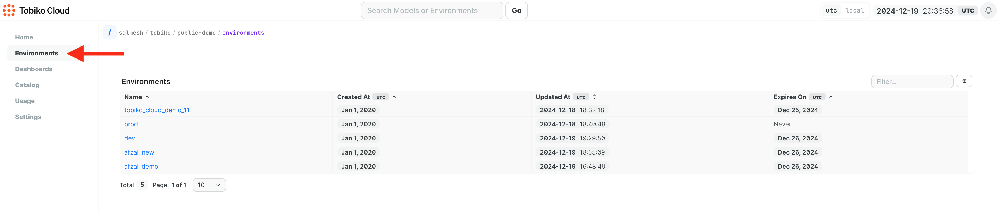
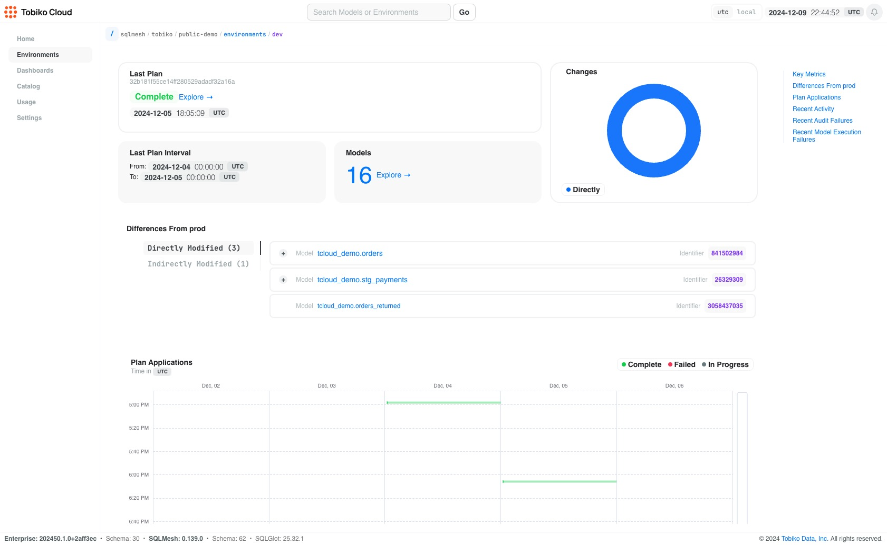
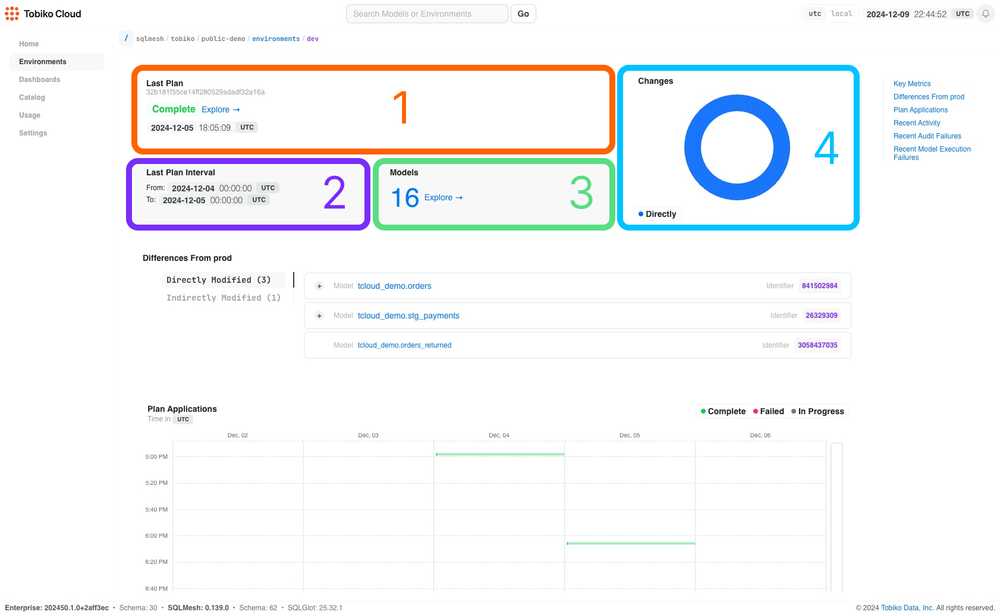
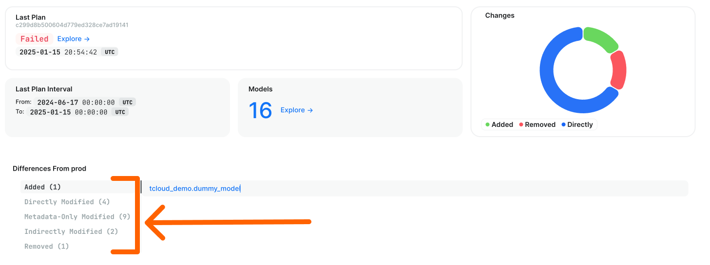
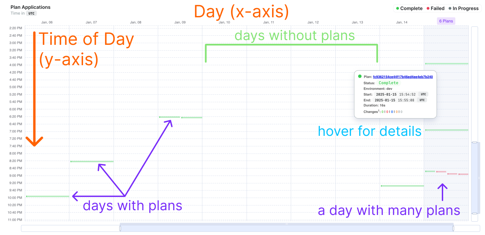

# Development Environment

Tobiko Cloud extends the SQLMesh CLI to advance your development workflow. Instead of relying on a static terminal output isolated to your local machine when running `tcloud sqlmesh plan dev`, Tobiko Cloud tracks development history automatically displayed in a rich user interface. We want mental load at a minimum so you can focus on your most important work. 

At its core, this transforms development from a single-player to a multi-player experience. Instead of sharing screenshots and scrolling through terminal history, all you have to do now is share a link to your work.

### When you might use this

**Team Collaboration**

Developers can easily see who is working on specific models, prevent workflow conflicts, and avoid duplicate efforts. 
<May revert to: The platform helps foster team collaboration by providing clear visibility into team activities. Developers can easily see who is working on specific models, prevent workflow conflicts, and avoid duplicate efforts. This creates a truly collaborative development environment where the team can work together seamlessly, supporting a dynamic, multiplayer-like development experience.>

**Performance Tracking**

You can monitor changes over time, review recent activities including successes and failures, and gain detailed insights into specific plan execution outcomes. You get a better sense of trends.

<TODO: add a screenshot with multiple plans and a glance at if things are running long or short.>

**Simplified Communication and Team Alignment**

Eliminate friction in sharing complex development context through manual pull requests or direct messages. These URLs serve as comprehensive summaries, displaying last run times, data intervals for incremental models, and detailed change information such as metadata modifications and model removals.

<Add gif of url opening in a new tab to feel how fast it should be.>

## Using the Environments Tab
The Environments page shows an overview of all the environments that exist in your project (both yours and any your teammates have created).

The page's table includes a link to each environment's page, along with the environment's creation date, the date it was last updated, and the date it will expire if not updated again. Clicking an environment's name from the main environments page takes you to its individual page.

## Individual Environment page
The page begins with an at-a-glance summary of the most recent plan applied to the environment.

1. Its completion status and time of the last plan applied
2. The latest time interval backfilled by the plan
3. Count of models present in the environment
4. An interactive visualization that summarizes the differences between the environment's models and the `prod` environment's models
    - The count of directly modified models is represented in blue
    - The count of added models is green
    - The count of removed models is red

??? "ProTip:"

    If a stakeholder or else anyone on your team is looking to understand an environment you own and are working on, you can share the link with them and they will be able to access and see all of the information about your environment. 
    
    It's a great place to start to have open conversations about what was recently added, removed or changed in an environment! 

## Differences from Prod section

Development environments are used to prepare and test changes before deploying them to `prod`, with separate tabs for each type of change (directly modified, indirectly modified, metadata-only changes, added, removed). Below is a screen shot from a environement version that shows all these tab options. 

In the summary, each model's name is a link to [its model page](./model.md). This links to the information about the version of the model used in _this environment_ not the overall prod model. This means that you can get insight into what your working on in dev instead of the "stale" version in prod ("stale" relative to your work).

## Plan history information

The plan applications chart is a calendar visualization of all plans that have been applied to the environment in the previous 2 weeks.

The chart represents days on its `x-axis` (each column is a day with the corresponding date across the top) and the time of day on its `y-axis` (each day begins at the top and ends at the bottom). 

Each day displays zero or more horizantal bars representing `plan` duration. If no `plans` occurred on a day, no bars will be displayed. If multiple `plans` occurred on the same day, their horizantal bars will be stacked.

The chart uses color to convey the staus of a `plan` at a glance. Green is completed, grey is in progress, red is failed.

Hovering over a bar reveals summary information about the `plan`, including its completion status, start time, end time, total duration, and change summary. The summary includes a link to [the `plan`'s page](./plan.md). 