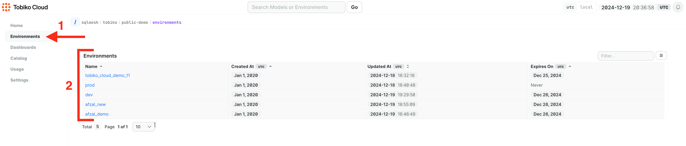
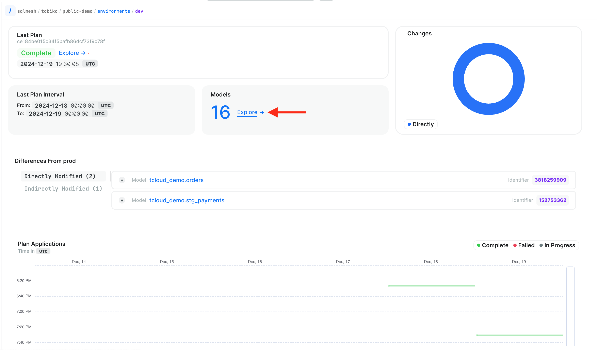
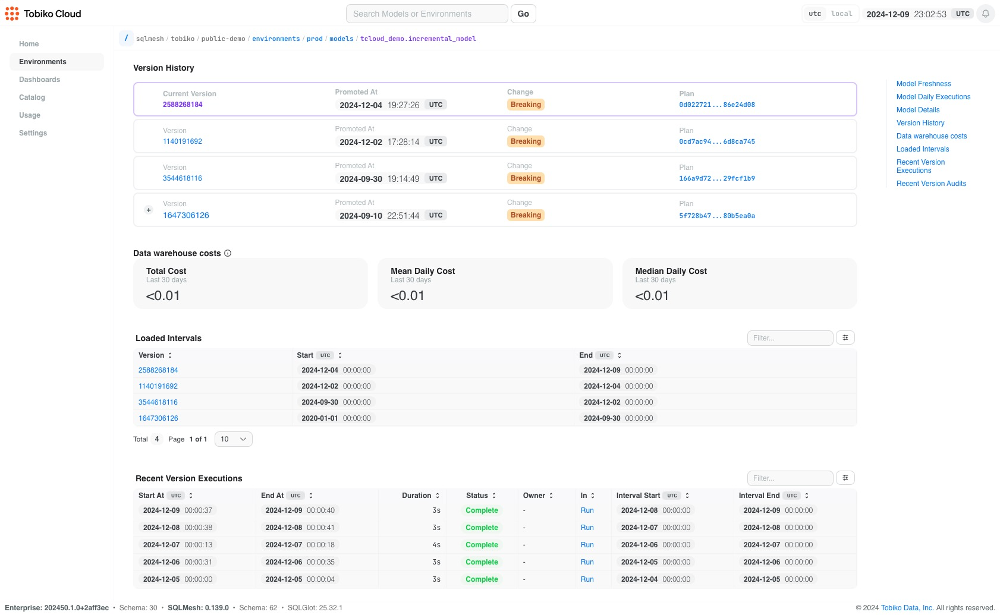
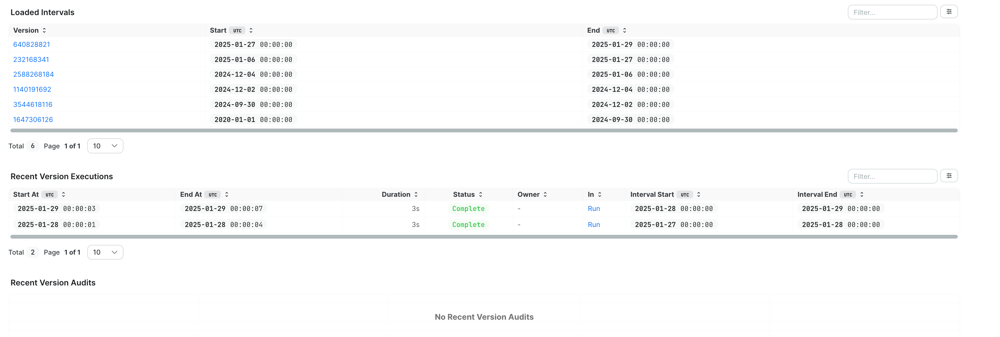

# Models

The model overview page provides comprehensive observability features that let you explore detailed information about a model. This centralized view gives you quick access to critical metrics and performance data, providing a window into the model's health and status.

Model owners typically use this page to monitor and check their models. It provides essential information in an easy-to-scan format, eliminating the need to debug issues through the command line interface. From this page you can quickly diagnose:

1. Model anomalies
    1. Did the model suddenly take a really long time to run? 
    2. Is the model repeatedly failing due to audits or schema evolution? 
2. Downstream impacts 
    1. If the model fails to run, lineage lets you immediately see what other models are affected 
3. Which version introduced errors
    1. Use the model's version history to identify which changes caused a problem

## Navigate to a model

There are a number of ways you can navigate to a models page. This method shows you how to find your model directly from the Environments page. 

1. Select "Environments" from the left hand menu
2. Click the environment you want to explore from the list. 
    
3. Navigate to the Models section and click "Explore" to view available models
    
4. Browse through the model list and select your desired model to access its detailed information
    

## Model page information

Each model page presents a comprehensive summary that includes several key components and metrics for monitoring and analysis. From here you can understand or view any 
anomalies in the run time of the model, and get a sense for the overall processing time and how that is changing (or not!) over time. You can also check other model-critical metrics, 
like the source code for the model, its lineage in relation to other models, the number of versions of this model available to you and even an approximation of how much this model 
is costing (if you have [cost savings set up](../costs_savings.md)). 

The following detailed information outlines the different sections:

- Current status graphs: Provides visual representations of model health through freshness indicators and detailed daily execution graphs
    - Freshness indicator: Shows the current status of the model and the percentage of up-to-date models in production (as long as this is green, you have nothing to worry about in your production environment)
    - Historical Freshness graph: Gives an at-a-glance picture of the history of the model's freshness.
        - Green means it's up to date and has run smoothly for every cron interval
        - Orange means that it is pending and will run on the latest cron
        - Red means the model is behind by at least one cron interval.
    - Daily executions: tells you the length of time it took the model to run on each day. This is a great place to quickly identify anomalies in the model's run time (both running too long *or* too short).
- Model details: Features tabs that display summary statistics, model source code, and interactive model lineage visualizations

- Version history: Delivers a comprehensive chronological view of all model versions, with detailed information including:
    - Precise timestamp of version promotion
    - Clear indication of change impact (breaking or non-breaking modifications)
    - Direct access to the complete implementation plan code
- Data Warehouse costs: estimates the cost of the model as set up by your team in [cost savings](../costs_savings.md)

- Loaded intervals: these periods represent the time spans processed during each job execution, which generally consist of the time between one job and the next. These intervals are crucial for understanding the boundaries of data processing cycles, which may correspond to the start of anomalous model behavior.
    - The table displays the specific model version in effect during that job execution, enabling precise tracking of version-specific outputs
    - Helps track forward-only model changes by maintaining a clear chronological record of modifications, ensuring data consistency and preventing retroactive alterations
    - provides comprehensive visibility into completed data processing operations, allowing users to monitor progress and verify successful execution of scheduled tasks
- Recent activity: Maintains a detailed log of version executions and comprehensive version audits