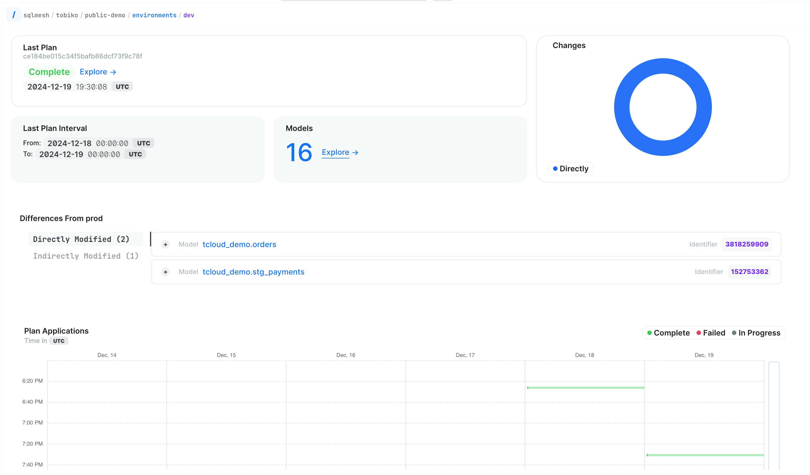
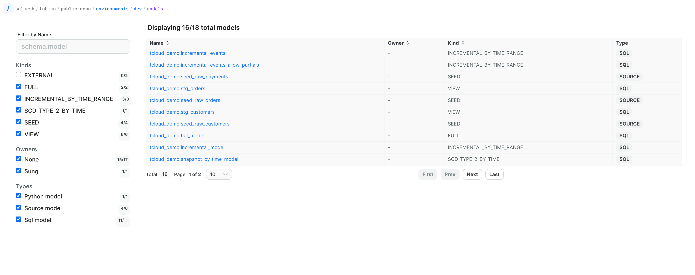

# Model

From the main environments list, you can access individual models to explore their comprehensive observability features and detailed summary information. This centralized view provides quick access to critical model metrics and performance data.

- Click the environment you want to explore from the environments list

- Navigate to the Models section and click "Explore" to view available models

- Browse through the model list and select your desired model to access its detailed information

Each model presents a comprehensive summary overview that includes several key components and metrics for monitoring and analysis. The following detailed information outlines the different sections:

- Current status: Provides visual representations of model health through freshness indicators and detailed daily execution graphs
- Model details: Features comprehensive tabs that display summary statistics, complete source code documentation, and interactive model lineage visualizations

- Version history: Delivers a comprehensive chronological view of all model versions, with detailed information including:
    - Precise timestamp of version promotion
    - Clear indication of change impact (breaking or non-breaking modifications)
    - Direct access to the complete implementation plan code
- Loaded intervals: these periods represent the time spans between consecutive cron job executions, from the start of one cron job to the end of the next cron job. These intervals are crucial for understanding the boundaries of data processing cycles
    - the table displays which specific model version was responsible for generating and processing data during each distinct cron interval, enabling precise tracking of version-specific outputs
    - helps track forward-only model changes by maintaining a clear chronological record of modifications, ensuring data consistency and preventing retroactive alterations
    - provides comprehensive visibility into completed data processing operations, allowing users to monitor progress and verify successful execution of scheduled tasks
- Recent activity: Maintains a detailed log of version executions and comprehensive version audits

