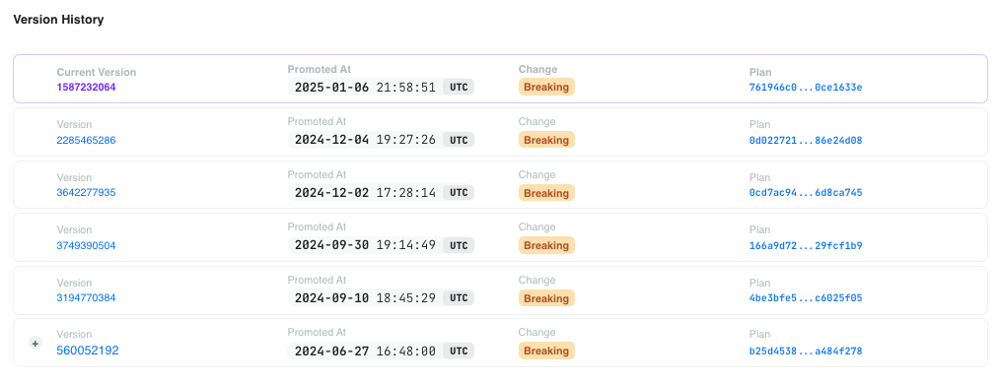
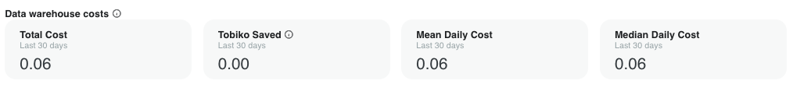
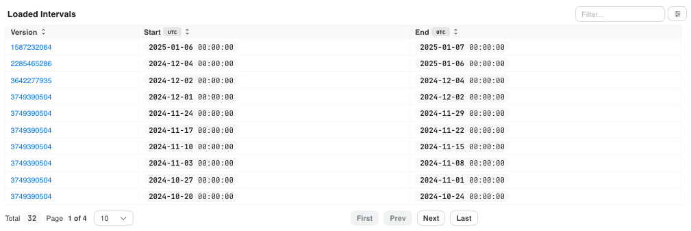
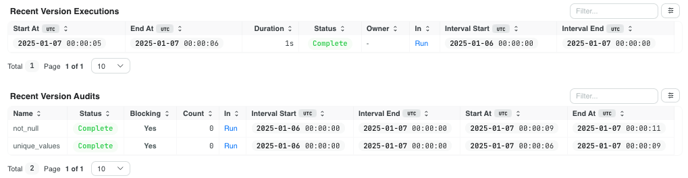

# Models

Models are the core of a SQLMesh project, so Tobiko Cloud makes it easy to understand model behavior in every `plan` or `run`.

SQLMesh models are executed during a `plan` or `run` in a specific environment. In Tobiko Cloud, all model information is tied to a specific environment.

## Environment page

To locate a model in an environment, first navigate to the [Environment page](./development_environment.md) and click the name of the environment where the model execution occurred.

In the environment page's `Models` section, click "Explore" to view the project's models.

## Models page

The models page displays a list of all models in the project. Click a model name to access its detailed information.

### Execution status

Each model's page begins with charts depicting its current and historical execution status.

It continues with details about the model metadata, source code, and lineage in the project DAG:

### Version history

Next, it displays the model's version history - a chronological view of all model versions, with information about:

- When the model version was promoted in the environment
- Whether the version was derived from a breaking or non-breaking change to the previous version
- Link to the `plan` where the model version was first created

### Data warehouse costs

It continues with summary information about the model's [data warehouse costs](../costs_savings.md) (supported engines only).

### Loaded time intervals

The next section lists which time intervals have been loaded for the model.

Every SQLMesh model execution covers a specific time range, or interval. Each row in the table displays the time intervals that have ever been loaded for that model version.

This information is valuable for monitoring and debugging model changes - particularly for [forward-only models](../../../guides/incremental_time.md#forward-only-models).

If a model change introduces a data anomaly that is not detected immediately, the Loaded Intervals table allows you to determine exactly which model version corresponded to the problematic time period's processed data.

### Recent activity

The final two sections on the page list all recent activity for the current model version.

The Recent Version Executions table lists the most recent executions of this model version in `run`s and `plan`s. It provides information about execution time and the intervals loaded during the execution.

The Recent Version Audits table lists the audit results from recent model executions. Each row corresponds to one audit and includes the audit's completion status, number of rows returned, and other information about the model execution.

