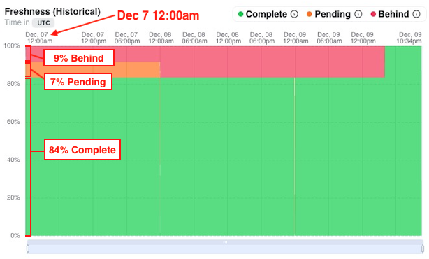

# Model Freshness

The Tobiko Cloud homepage summarizes the status and recent activity of the project's `prod` environment.

One summary element is the Freshness chart, which helps you understand whether models are running behind their `cron` schedule.

## What is model freshness?

Recall that SQLMesh determines when a model should run based on its `cron` value (e.g., a `@daily` cron model should run daily). As time passes, each increment of the `cron` value that occurs is one "interval."

When the project is `run`, SQLMesh examines every model's `cron` and execution history. For each model, it determines how many and which intervals have elapsed since the model's previous execution.

A model's freshness is calculated from the number of the unloaded intervals. The model is:

- "Complete" if all completed intervals have been loaded
- "Pending" if one completed interval has not been loaded
- "Behind" if more than one completed interval has not been loaded

In open-source SQLMesh, a model's outstanding intervals are only determined during a `run`.

In contrast, Tobiko Cloud automatically and continuously tracks each model's outstanding interval count and freshness over time.

## Reading the chart

The Freshness Chart summarizes how many models are in each freshness status over time.

The chart's x-axis represents time, with date and time labels at the top of the chart.

The chart's y-axis represents the distribution of a project's model freshness over time, calculated as the percent of models with each of the three freshness statuses.

The freshness categories are represented by color:

1. Complete models are green (all green indicates the project's models are all fully up-to-date)
2. Pending models are yellow
3. Behind models are red (red signals potential issues that need investigation)

For example, consider the leftmost time point in the chart: December 7 at 12:00am.

At that time, 9% of models were Behind, 7% were Pending, and 84% were Complete.

Hovering over the chart reveals a tooltip displaying the freshness percentages corresponding to the time point underneath:

