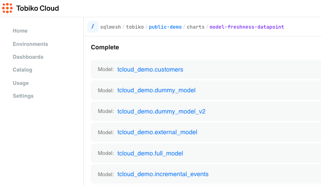

# Model Freshness

Model freshness indicators on the homepage allow you to immediately determine whether the production environment is correct and up to date.

Additional information on the page, such as lists of models and their current status, helps you investigate any freshness issues, identify problematic models, and check if CI/CD processes have stopped running.

## When you might use this

The model freshness chart answers the question "how is the production environment right now?" It summarizes the recent history of production models and whether they were backfilled on time.

When the chart is all green, everything is running smoothly and you're good to go!

Red indicators in the past don't require immediate action, but they may provide lessons that can help prevent similar issues in the future.

Red indicators now mean it's time to take action and debug the issue.

## Finding the model freshness chart

The model freshness chart is near the top of the Tobiko Cloud homepage.

## Model freshness indicators

Model freshness is the timeliness of the data most recently processed by a model. In other words, it measures how up-to-date each model is relative to its `cron`.

The chart displays historical data, showing the percentage of models that were fresh (y-axis) across time (x-axis).

This historical view helps when troubleshooting data issues — you can quickly check if the issue is associated with delayed model runs.

The chart uses color to show the percentage of models in different states:

1. Models that have run for all previous cron periods are "complete" (green).
    - All green indicates the data warehouse is fully up-to-date
2. Models that haven't run for the most recent cron period are "pending" (yellow).
3. Models that haven't run for multiple previous cron periods are "behind" (red).
    - Red signals potential issues that need investigation

Keep in mind that if a model shows red (behind) in the past, that doesn't necessarily reflect its current status. It may have caught up by now!

The chart is interactive — hovering reveals the distribution of model freshness at a specific time point.

Click a time point to open a list of the models that were complete, pending, or behind at that time.

