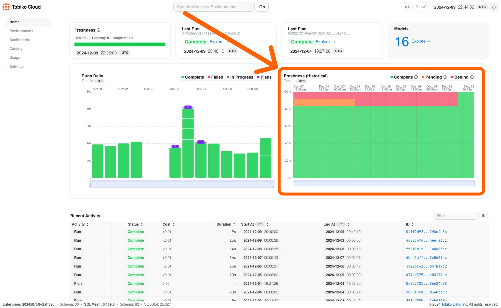
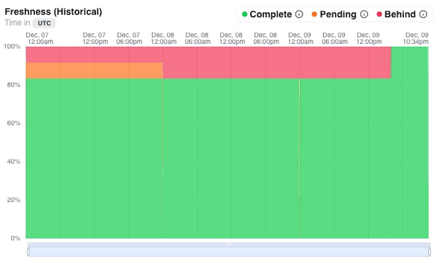
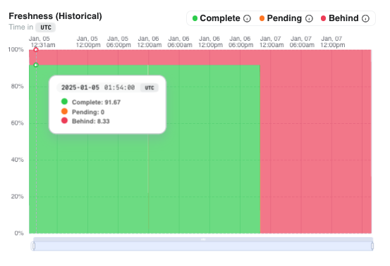

# Model Freshness
From the homescreen of Tobiko Cloud we have the graph on historical freshness.

**Data model freshness** here refers to the timeliness and relevance of the data used in a data model, ensuring that it reflects the most current and accurate state of the underlying system or domain. In other words, it measures how up-to-date and synchronized the model is with the real-world data.
Zooming into that data, the model freshness chart shows you the freshness of your models within your data warehouse relative to the model's configured cron.

The chart displays historical data, showing freshness levels across time (shown on the `x-axis`). This historical view helps when troubleshooting reported data issues—you can quickly check if problems were caused by delayed data runs or other underlying issues.

The chart uses three colors to show the percentage of models in different states:

1. Models that have run for all previous cron periods are "complete" (green).
    - All green indicates the data warehouse is fully up-to-date with model crons.
2. Models that haven't run for the most recent cron period are "pending" (yellow).
3. Models that haven't run for multiple previous cron periods are "behind" (red).
    - Red signals potential issues that need investigation.

To make your life easier, the chart is interactive—you can click any point in time to see which specific models were complete, pending, or behind.

