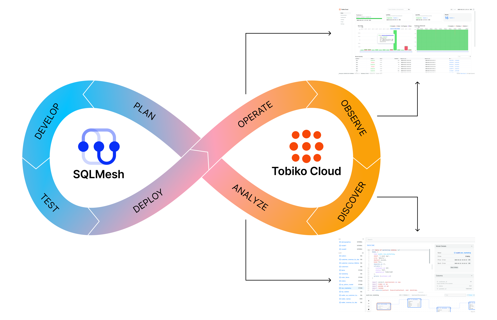
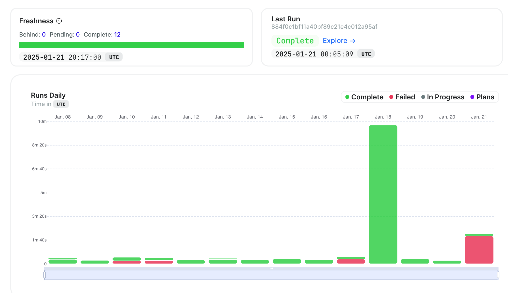

# Overview

Fixing problems with data pipelines is challenging because there are so many potential causes.

For transformation pipelines, those range from upstream source timeouts to SQL query errors to Python library conflicts (and more!).

Tobiko Cloud makes it easy to detect and respond to changes in your pipelines:

- Did a problem occur? 
    - **Alerts notify you immediately.**
- When did the problem occur? 
    - **Historical pipeline information reveals the moment.**
-  Where is the problem coming from? 
    - **Easy navigation through pipeline components lets you pinpoint the source.**
-  What is causing the problem? 
    - **Centralized logs and errors have all the details.**

## How it works

Tobiko Cloud captures detailed metadata throughout your data project's lifecycle.

During the execution of plans and runs, it collects information about model performance and system health to give you complete visibility into your system's operations.

This information allows you to:

- Monitor the health and performance of your data pipelines
- Track the status of current and historical runs
- Review a detailed version history of your models and transformations
- Creation of custom visualizations and metrics
- Troubleshoot problems and optimize inefficient operations

Observability features are seamlessly integrated into Tobiko Cloud, making it simple to monitor and understand your project's behavior. For example, on the Tobiko Cloud Homepage, there is run history, plan executions, and freshness displayed for the production environment: 

Instead of digging through complex logs or piecing together information from multiple sources, you can quickly access the relevant information from any part of your project.

<!---
Learn more about Tobiko Cloud Observability features on these pages:

- [`prod` environment](prod_environment.md) health and recent activity 
- [Development environment](development_environment.md) differences from `prod` and recent activity
- [Plan](plan.md) status and detailed model execution data
- [Run](run.md) status and detailed model execution data
- [Model](model.md) status and version history
- [Dashboards](measures_dashboards.md) and custom visualizations of observability data
-->