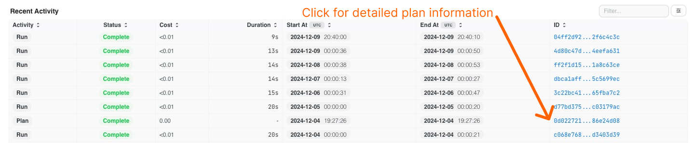
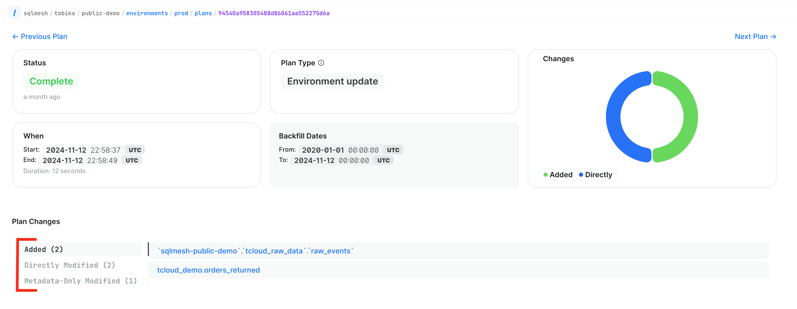

# Plans

Every SQLMesh `plan` is applied to a specific environment. To locate a `plan`, first navigate to its [Environment page](./development_environment.md).

The environment page's Recent Activity table includes a list of every recent `plan` and `run`. To learn more about a `plan`, locate the `plan` by application date and click on its blue ID link in the table's final column.

Clicking the link opens the detailed plan overview page:

The top section provides an at-a-glance overview of the plan, including:

- `Status`: the plan's completion status (possible values: complete, in progress, failed)
- `When`: the times when the plan started and completed
- `Plan Type`: the plan's type classification. Possible values:
    - `Environment update`: the plan includes a modified model
    - `Restatement`: the plan included a restated model
    - `System`: the Tobiko Cloud team has made a upgrade to your system (no models or data were affected)
- `Backfill Dates`: dates for which the model was backfilled
- `Changes`: chart displaying counts of model change types (directly modified model count in blue, added models in green, removed models in red)

## Plan changes

The middle section presents a detailed summary of all plan changes.

Each change category has its own tab: added models, directly modified models, metadata-only modified models, and deleted models.

This figure displays a plan with three Changes tabs: Added models, Directly Modified models, and Metadata-Only Modified models.

## Execution and Audits section

The final section provides tables listing all Model Executions, Virtual Updates, and Audits.

The Model Executions table contains summary information and a link to each model execution's page, which contains detailed information and exeuction logs.

The Virtual Updates table contains a list of all models that were virtually updated by the plan.

The Audits table contains a complete chronological listing of all audits that have been performed.

