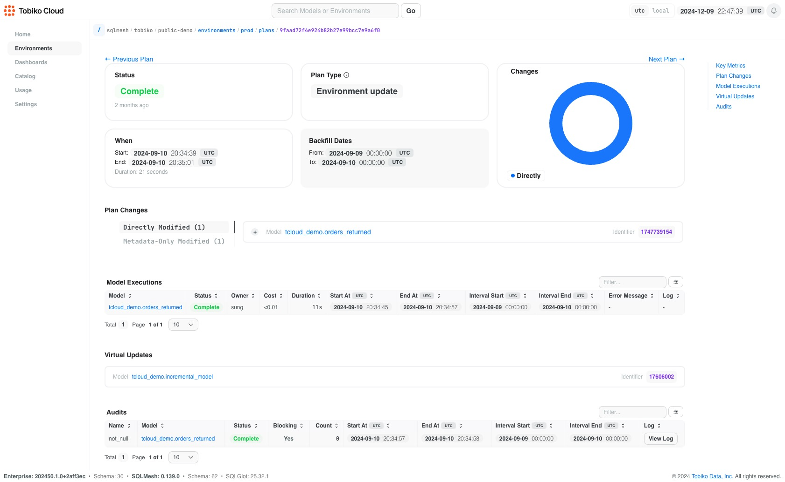
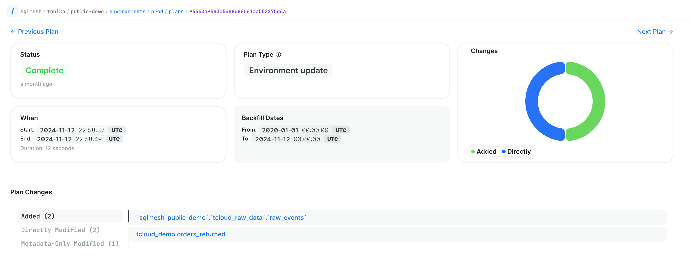
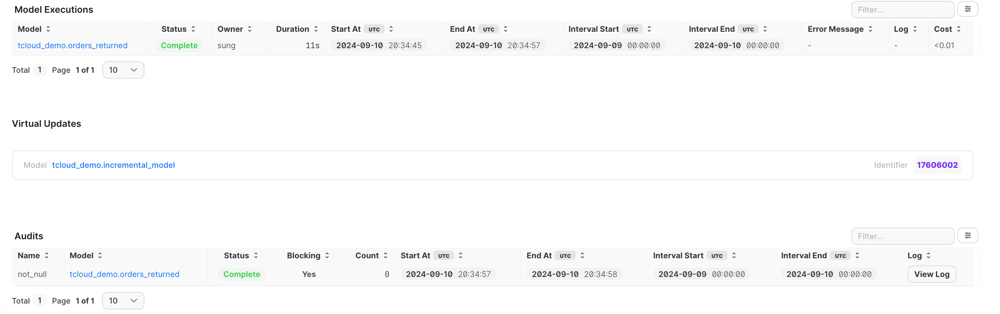

# Plan

From the Recent Activity section within your environment overview (which could be either production or development environments), you can easily access detailed status information and comprehensive metadata for any individual plan. To do this, simply locate the specific plan you're interested in and click on its distinctive blue ID hash that appears within the table. 

This opens the detailed plan overview page: 

The top section provides an intuitive, comprehensive at-a-glance overview of the plan, displaying all essential information in a clear, organized format.

- current plan status, with clear indicators showing whether the plan is complete, currently in progress, or has encountered any failures
- detailed timing information, including both the precise start time when the plan was initiated and the total duration it ran before either completing successfully or encountering a failure
- specific plan type classification; in this particular example, it's identified as an environment update operation. Other options and their explanation are below:
    - Environment Update: models themselves have changed
    - Restatement: updating a model that you already have to get the newest, freshest data
    - System: the Tobiko Data Cloud team has made a upgrade to your system. None of your models or data is affected (general housekeeping)
- comprehensive model backfill dates showing the temporal scope of the operation
- visual graph representation of all model changes, using our standard intuitive colour-coding system: directly modified models are highlighted in blue, newly added models appear in green, and removed models are marked in red for easy identification

## Plan changes

The middle section presents a detailed summary of all plan changes, featuring an interactive interface that allows users to filter and view specific types of changes. Users can toggle between various categories including added models, directly modified models, metadata-only modified models, and deleted models. For reference, below you'll find a screenshot that illustrates a plan containing multiple types of changes: models with direct modifications, models with metadata-only changes, and newly added models.

## Execution and Audits section

The final section provides a comprehensive overview of all execution statuses and audit results. This includes in-depth information about individual model executions (with convenient, direct access to associated logs), virtual updates, and a complete chronological listing of all audits that have been performed.

