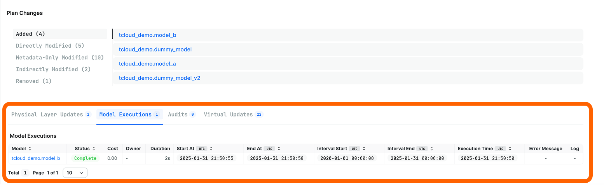

# Plans

Plan pages provide comprehensive, detailed insights into each plan executed across your SQLMesh environments. These pages act as a central hub where team members can monitor and understand all aspects of plan execution, from start to finish.

In open-source SQLMesh, information about plans is stored locally by default, so team members only have immediate visibility into the plans they have executed themselves.

To address this limitation, we've created a comprehensive plan page that serves two essential purposes:

1. Provide a centralized place where every team member can view, track, and understand all plans and their current status.
    - Benefit: increase transparency and improve collaboration across the team
2. Maintains detailed historical records, providing a reference of all a projects' changes, when each change was implemented, and how your project has evolved over time.
    - Benefit: ensure nothing gets lost or forgotten as teams evolve over time

## When you might use this

**Team Collaboration**

Improves team collaboration through an easy-to-understand view of everyone's changes, so the entire team can see the latest updates made to an environment.

**Monitoring**

Tells you exactly what's happening by monitoring plan execution status. Instantly identify plans that are currently running, have completed successfully, or have encountered any issues that need attention.

If you do encounter any issues, this page serves as an ideal starting point for debugging:

- You no longer need to spend time searching through log files trying to locate specific model changes or modifications you've made - everything is organized and easily accessible
- We've carefully curated a log that captures everything that occurred during the plan execution. This provides a consolidated location where you can examine any plan or model and access its relevant logs, eliminating the need to parse CLI output to find what you're interested in
    1. For storage optimization, logs are retained for one week before being automatically cleaned up from the system
- Share monitoring information with teammates via links to plan pages, not screenshots of terminal output

**Change clarification**

Delivers a visualization of a plan's model changes, making it simple to share sets of modifications with team members who do not have direct access to the local development environment.

Summary information at the top of the page provides context and assistance in understanding what might have gone wrong, making troubleshooting more efficient and systematic.

- For example, share changes with teammates without opening a pull request (which could trigger an unwanted CI/CD pipeline)

## Navigating to a Plan page
Every SQLMesh `plan` is applied to a specific environment. To locate a `plan`, first navigate to its [Environment page](./development_environment.md).

The environment page's Recent Activity table includes a list of every recent `plan` and `run`. To visit a `plan`'s page, locate the `plan` by application date and click on its blue ID link in the table's final column.

Clicking the link opens the detailed plan page:

## Plan summary

The top section provides an at-a-glance overview of the plan, including:

- `Status`: the plan's completion status (possible values: complete, in progress, failed)
- `When`: the times when the plan started and completed
- `Plan Type`: the plan's type classification. Possible values:
    - `Environment update`: the plan includes a modified model
    - `Restatement`: the plan included a restated model
    - `System`: the Tobiko Cloud team has made a upgrade to your system (no models or data were affected)
- `Backfill Dates`: dates for which the model was backfilled
- `Changes`: chart displaying counts of model change types (directly modified model count in blue, added models in green, removed models in red)

## Plan changes

The middle section presents a detailed summary of all plan changes.

Each change category has its own tab on the left side: `added` models, `directly modified` models, `metadata-only modified` models, `indirectly modified` models, and `removed` models.

Clicking a model name takes you to its [individual model page](./model.md).

## Updates and Executions section

The final section displays the different actions SQLMesh took when executing the plan, where each type of action has its own tab across the top:

- `Physical Layer Updates` (creating physical tables)
- `Model Executions` (executing model queries)
- `Audits` (running model audits)
- `Virtual Updates` (updating environment views)

The number of models in each category is included in the tab title.

Each tab contains a table with detailed information on and links to the model(s) that have been updated.
