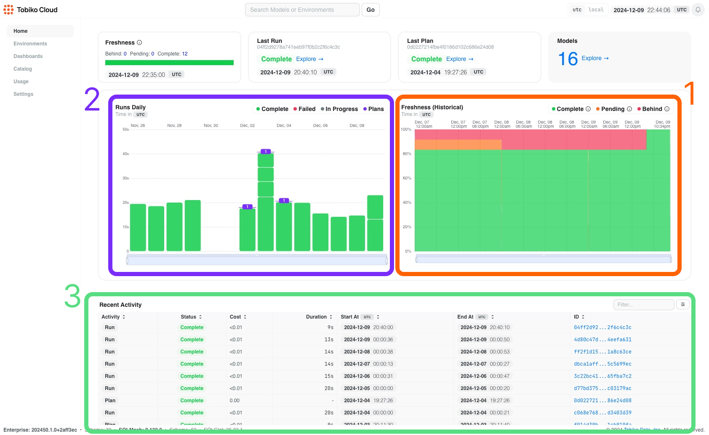
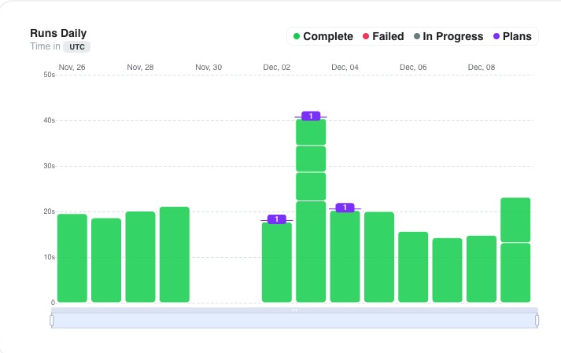
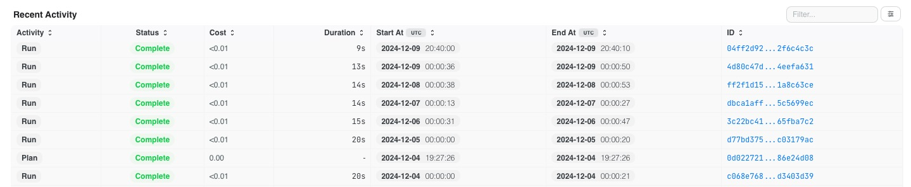

# Prod Environment

For the production environment, there are three main observability features that can be seen directly from the homepage of Tobiko Cloud. They are the: 

1. [Model Freshness](../model_freshness.md)
2. Weekly runs and plans chart
3. Recent activity table

!!! Note

    Model freshness has its own feature page. Please use the link above for more information.

## Weekly Runs and Plans Chart

The weekly runs and plans chart is strategically positioned to the left of the model freshness chart, providing users with an easily accessible visualization of system activity.

Following the established visual language of the model freshness chart, this chart uses an intuitive color-coding system to convey run status at a glance: successfully completed runs are marked in green, failed runs are highlighted in red, and runs currently in progress are displayed in gray.

The chart presents a comprehensive view of daily runs along its `x-axis`, with the vertical bars representing run duration. The height of each bar corresponds directly to the duration of the run, allowing you to quickly assess execution times. As an illustration of this functionality, the screenshot has a specific instance where a single run lasting 20 seconds executed successfully on November 26.

The chart also incorporates plan execution data, represented by distinctive purple horizontal bars that span their respective execution days. Enhanced with interactive functionality, the chart allows users to explore additional details by hovering over these plan indicators, revealing a detailed breakdown of which specific models were executed within each plan's scope.

## Recent Activity Table

The recent activity table provides comprehensive information about system activities, displaying both runs and plans in chronological order. For each activity entry, you can view its current status, estimated cost of execution, total duration from start to finish, precise timestamps for both start and completion times, and a unique identification hash for reference purposes. 

To help you locate specific information within the activity log, the table includes a convenient filtering feature located in the top right corner. This filter allows you to narrow down the displayed activities based on various criteria, making it easier to find and analyze particular events or patterns in your system's operation history.