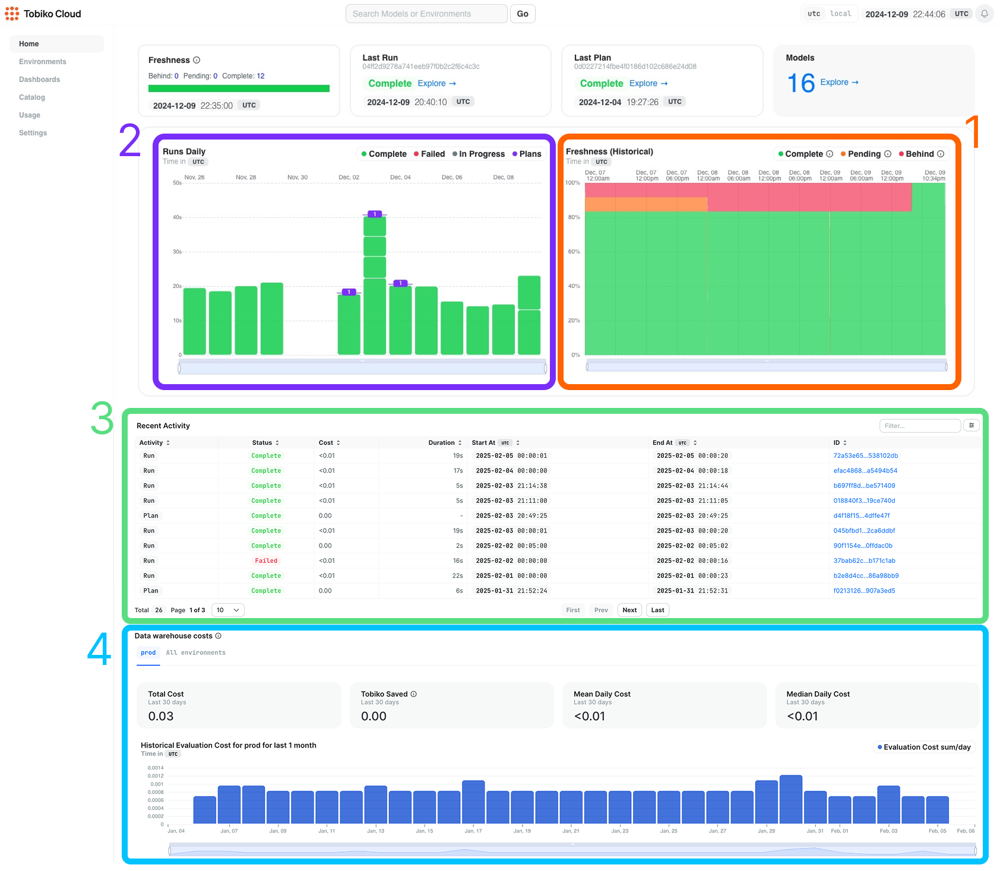
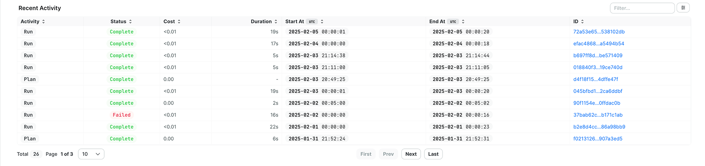

# Prod Environment

A data transformation system's most important component is the production environment, which provides the data your business runs on.

Tobiko Cloud makes it easy to understand your production environment, embedding three observability features directly on your project's homepage:

1. [Model Freshness chart](./model_freshness.md)
2. Runs and plans chart
3. Recent activity table

!!! Note

    Model freshness has its own feature page - learn more [here](./model_freshness.md)!

## Runs and Plans Chart

SQLMesh performs two primary actions: running the project's models on a cadence and applying plans to update the project's content/behavior.

The Runs and Plans Chart displays a summary of all `run`s and `plans` that occurred over the previous two weeks. It shows when they occurred and how long they took to execute.

The chart uses color to convey `run` status at a glance: bars representing `run`s that successfully completed are marked in green, failed `run`s are red, and `run`s currently in progress are gray. `plan`s are always displayed in purple.

The chart represents time on its `x-axis`, where each entry represents one day. The date corresponding to each day is displayed at the top of the chart.

Each day displays zero or more vertical bars representing `run` duration. If no `run`s occurred on a day, no vertical bars will be displayed. If multiple `run`s occurred on the same day, their vertical bars will be stacked.

The chart's `y-axis` represents `run` duration. The height of each `run`'s bar corresponds to its duration, allowing you to quickly assess execution times.

For example, consider the leftmost entry in the figure above:
- The label at the top of the chart shows that it represents November 26
- The entry consists of a single green bar, which tells us that one successful `run` occurred
- The bottom of the bar begins at 0 seconds on the `y-axis`, and the top of the bar ends at 20 seconds, telling us the `run` took 20 seconds to execute

In contrast, consider the rightmost entry in the figure above:
- The label at the top of the chart shows that it represents December 9
- The entry contains two green bars, which tells us that two successful `run`s occurred
- The lower bar begins at 0 seconds on the `y-axis` and reaches up to 13 seconds, telling us the `run` took 13 seconds to execute
- The upper bar begins at 13 seconds on the `y-axis` and reaches up to 22 seconds, telling us that the `run` took 22 - 13 = 9 seconds to execute

Learn more about a `run` or `plan` by hovering over its bar, which displays a link to its page, its start and end times, and its duration.

## Recent Activity Table

The recent activity table provides comprehensive information about recent project activities, displaying both `run`s and `plan`s in chronological order. This provides a more granular view than the runs and plans chart.

For each activity entry, you can view its completion status, estimated cost of execution (BigQuery and Snowflake engines only), total duration from start to finish, start and completion times, and a unique identification hash for reference purposes.

The table provides the ability to filter which rows are displayed by typing into the text box in the top right. This helps you locate specific information within the activity log, making it easier to find and analyze particular events or patterns in your system's operational history.