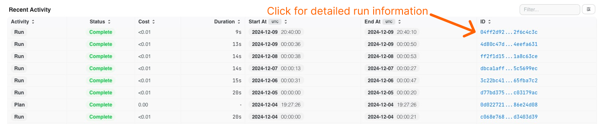
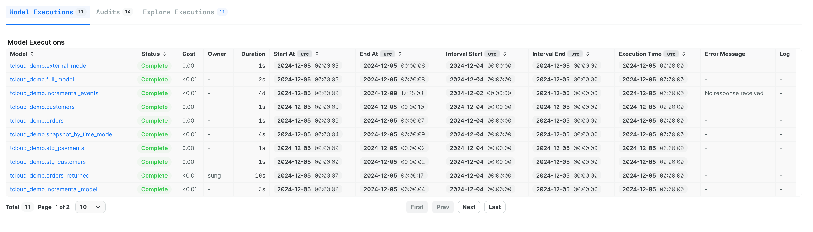
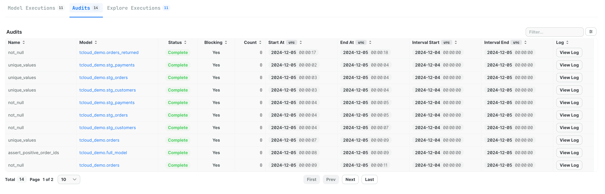
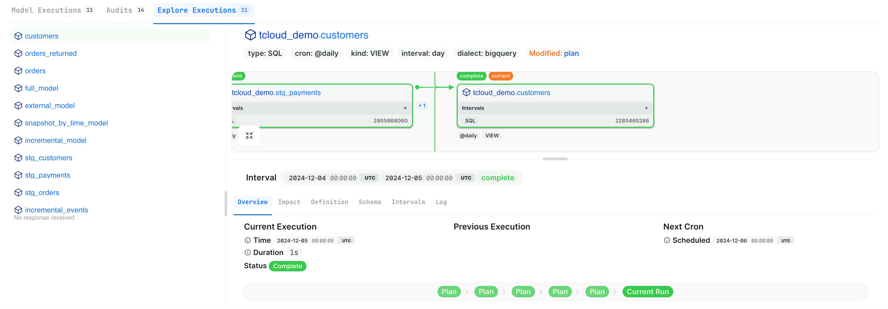

# Runs

Every SQLMesh `run` is applied to a specific environment. To locate a `run`, first navigate to its [Environment page](./development_environment.md).

The environment page's Recent Activity table includes a list of every recent `plan` and `run`. To learn more about a `run`, locate the `run` by application date and click on its blue ID link in the table's final column.

Clicking the link opens the detailed run overview page:

## Summary

The top of the overview page summarizes the `run`, including:

  - `Status`: completion status (completed, in progress, or failed)
  - `When`: start and end times
  - `Changes since previous run`: list of project changes that occurred since the previous `run`

## Details

The lower portion of the page contains a table with three tabs.

`Model Executions`: list of executed models, including completion status, run times, error messages (when applicable), and links to detailed execution logs for troubleshooting

`Audits`: list of audit executions statuses, including completion status, whether the audit is blocking, and links to detailed audit logs for verification

`Explore Executions`: interactive view of executed models, including a lineage graph of model dependencies, and detailed information about impact analysis, model definitions, time intervals processed, and links to associated logs

