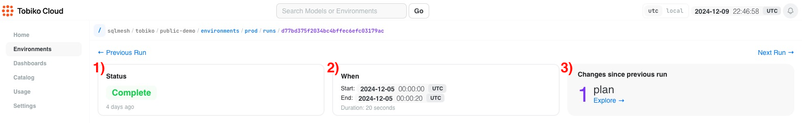

# Runs

Run pages, like [plan pages](./plan.md), serve as centralized information sources that provide detailed insights into individual runs executed across your various environments.

They were created with the same philosophy as the plan pages, providing a consistent user experience and navigation pattern.

These pages act as a central hub where team members can monitor and understand all aspects of a run’s execution, from start to finish. Additionally, they can serve as a jumping off point for investigating run-related errors or unexpected behavior.

## When you might use this

If you're monitoring data pipelines, a common activity is verifying the status of the most recent run.

The run page provides a quick way to check whether a run has succeeded or failed and when exactly it was executed. The page includes a comprehensive view of all model executions and audits that were included in the run.

If you need deeper insights, the [Debugger View](../debugger_view.md) offers advanced analysis capabilities. This powerful tool allows teams to investigate which models are taking the longest time to update, helping identify potential performance bottlenecks in their data pipelines.

## Navigating to a Run page

Every SQLMesh `run` is applied to a specific environment. To locate a `run`, first navigate to its [Environment page](./development_environment.md).

The environment page's Recent Activity table includes a list of every recent `plan` and `run`. To learn more about a `run`, locate the `run` by application date and click on its blue ID link in the table's final column.

Clicking the link opens the detailed run overview page:

## Summary

The top of the overview page summarizes the `run`, including:

  1. `Status`: completion status (completed, in progress, or failed)
  2. `When`: start and end times
  3. `Changes since previous run`: list of project changes that occurred since the previous `run`

## Details

The lower portion of the page contains a table with three tabs.

`Model Executions`: list of executed models, including completion status, run times, error messages (when applicable), and links to detailed execution logs for troubleshooting

`Audits`: list of audit executions statuses, including completion status, whether the audit is blocking, and links to detailed audit logs for verification

`Explore Executions`: interactive view of executed models, including a lineage graph of model dependencies, and detailed information about impact analysis, model definitions, time intervals processed, and links to associated logs (learn more on the [Debugger View page](../debugger_view.md))

