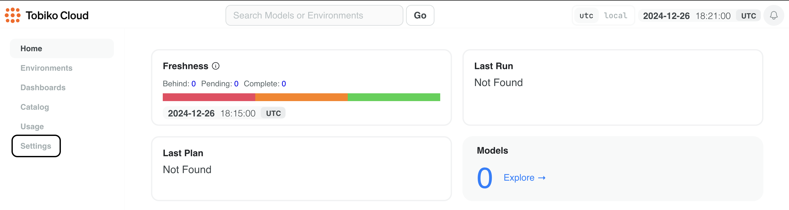
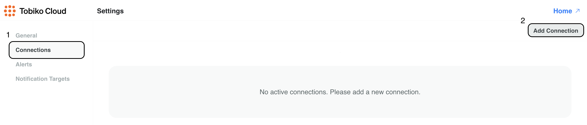
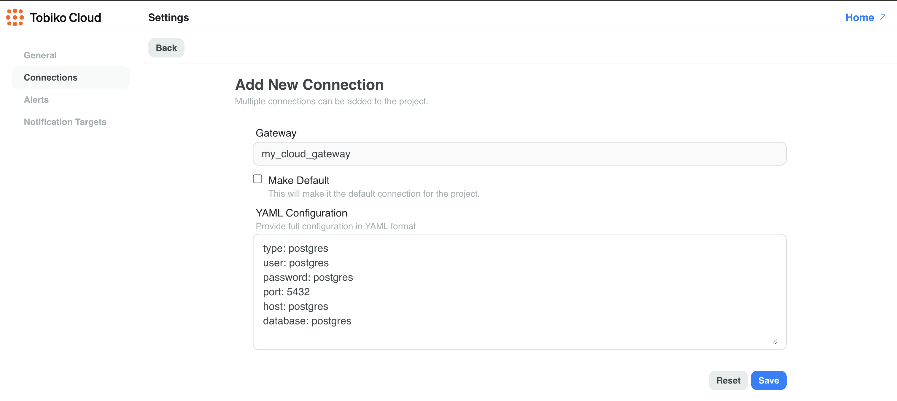
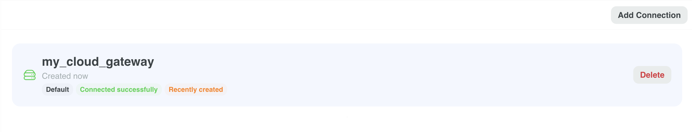
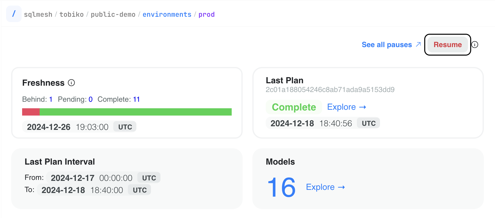
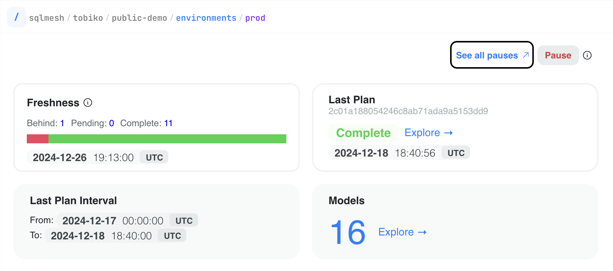
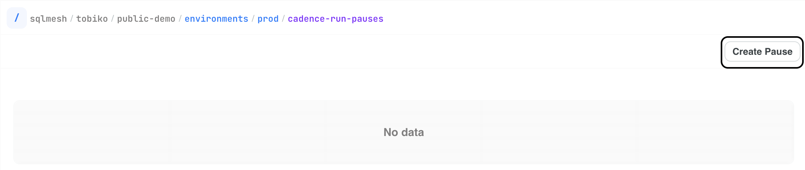
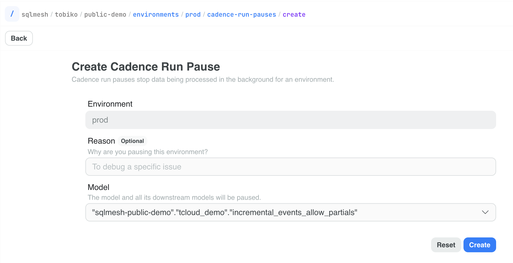
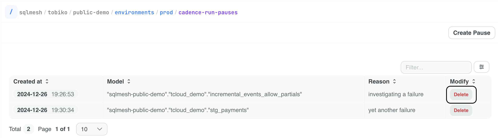

# Scheduler 

Tobiko Cloud offers scheduling capabilities that have several advantages over the scheduler built into the open source version of SQLMesh.

### Cadence Executions

When using Tobiko Cloud, users don't need to configure a cron job that periodically runs the `sqlmesh run` command. Instead, Tobiko Cloud automatically schedules model execution based on the cron expression specified in the model definition.

### Concurrent Runs

Unlike the open source built-in scheduler, Tobiko Cloud parallelizes both model executions and run jobs. This means that if one run job is blocked by a long-running model, other independent models can still execute concurrently in separate run jobs.

### Run Pausing

Tobiko Cloud allows you to pause and resume model execution at both the environment and individual model level. This granular control helps manage maintenance windows and troubleshoot issues.

### Isolated Python Environments

Tobiko Cloud automatically manages Python dependencies of your Python macros and models. Each virtual environment has its own isolated Python environment with its own set of dependencies, ensuring that changes in one environment won't affect other environments.

### Improved Concurrency Control

The cloud scheduler ensures that plan applications targeting the same environment are executed sequentially, preventing race conditions and ensuring correct results.

### Access Control

Connection to the data warehouse is managed through Tobiko Cloud. Users can run `run` and `plan` commands without needing to configure database credentials locally.

Additionally, users can control who in their organization can apply changes to which environments and models (coming soon).

## Connection Configuration

To start using the cloud scheduler, you need to configure the connection to your data warehouse first in the Tobiko Cloud UI.

Step 1: Click on the "Settings" tab in the sidebar.



Step 2: Navigate to the "Connections" tab (1) and click on the "Add Connection" button (2).



Step 3: Enter the name of the gateway and the connection configuration in YAML format. The format follows the [connection configuration](../reference/configuration.md#connection) in the SQLMesh reference guide.

**Note:** The gateway name must match the name of the gateway you specify in the `config.yaml` file of your project.



Step 4: Click the "Save" button to add the connection. Upon saving, the connection will be tested and only saved if the connection is successful. The entered configuration is persisted in encrypted form using AES-256 encryption and is only decrypted for execution purposes.



Step 5: Switch to using the cloud scheduler in the project configuration.

**Note:** The gateway name must match the name of the gateway that was specified when adding the connection.

```yaml linenums="1" hl_lines="3 4"
gateways:
  my_cloud_gateway:
    scheduler:
      type: cloud

default_gateway: my_cloud_gateway
```

## Managing Run Pauses

You can pause and resume model execution at both the environment and individual model level. Temporarily pausing model execution can be useful when troubleshooting issues or during maintenance windows.

### Pausing an Environment

To pause an entire environment, navigate to the target environment page and click the "Pause" button. This will pause **all** model executions in this environment.


To resume the environment, click the "Resume" button.



### Pausing a Model

To pause a model in a specific environment, navigate to the target environment page and click "See all pauses" located next to the "Pause" button.



Click the "Create Pause" button.



Select the model you want to pause and provide an optional reason for pausing it.



Click the "Create" button. The target model and its downstream dependencies will not be run in this environment.

**Note:** Paused models will still be executed as part of the plan application.

To resume a model, click the "Delete" button for the corresponding pause.



## Python Dependencies

Tobiko Cloud automatically manages Python dependencies of your Python macros and models. Each virtual environment has its own isolated Python environment where relevant libraries are installed, ensuring that changes in one environment won't affect other environments.

SQLMesh automatically infers used Python libraries by statically analyzing the code of your models and macros. 

Additionally, dependencies can be specified, pinned, or excluded using the `sqlmesh-requirements.lock` file. See the [Python library dependencies](../guides/configuration.md#python-library-dependencies) section in the SQLMesh configuration guide for more information.

## Self-hosted Executors

Letting Tobiko Cloud manage your data warehouse connections is a secure and convenient way to run your project. However, some organizations may prefer to not share their data warehouse credentials with a third party or bring the execution closer to their data.

To support this, Tobiko Cloud offers a self-hosted executor option. With this approach, Tobiko Cloud continues to manage access control, scheduling, trigger runs, and plan applications while storing project metadata, but all query execution and data access occurs within your own infrastructure. This gives you complete control over data security and network access while still benefiting from Tobiko Cloud's orchestration capabilities.

### How it works

TBD

### Configuration

TBD