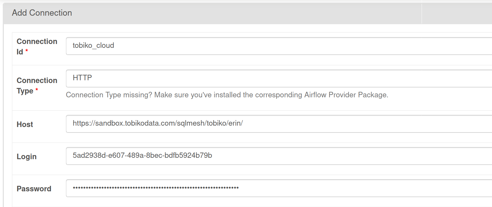
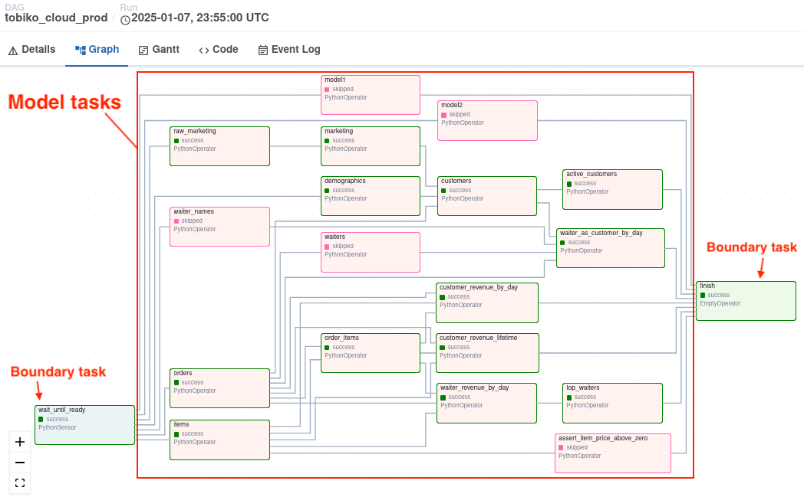

# Airflow

Tobiko Cloud's Airflow integration allows you to combine Airflow system monitoring with the powerful debugging tools in Tobiko Cloud.

## Setup

Your SQLMesh project must be configured and connected to Tobiko Cloud before using the Airflow integration.

Learn more about connecting to Tobiko Cloud in the [Getting Started page](../../tcloud_getting_started.md).

### Install libraries

After connecting your project to Tobiko Cloud, you're ready to set up the Airflow integration.

Start by installing the `tobiko-cloud-scheduler-facade` library in your Airflow runtime environment.

Make sure to include the `[airflow]` extra in the installation command:

``` bash
$ pip install tobiko-cloud-scheduler-facade[airflow]
```

!!! info "Mac Users"

    On Mac OS, you may get the following error:

    `zsh: no matches found: tobiko-cloud-scheduler-facade[airflow]`

    In which case, the argument to `pip install` needs to be quoted like so:

    ```
    $ pip install 'tobiko-cloud-scheduler-facade[airflow]'
    ```

### Connect Airflow to Tobiko Cloud

Next, add an Airflow [connection](https://airflow.apache.org/docs/apache-airflow/stable/howto/connection.html#creating-a-connection-with-the-ui) containing your Tobiko Cloud credentials.

Specify these fields when adding the connection:

- **Connection ID**: connection name of your choice
    - May not contain spaces, single quotes `'`, or double quotes `"`
- **Connection Type**: always HTTP
- **Host**: URL for your Tobiko Cloud project
- **Password**: your Tobiko Cloud API token

The host URL and password values will be provided to you during your Tobiko Cloud onboarding.

It is convenient to specify the connection in the Airflow UI, as in this example with the name `tobiko_cloud`:



If the connection is successful, it will appear in the connection list:


!!! info "Remember the connection name!"

    Name the connection whatever you like, but remember that name because it's used for the `conn_id` parameter below.

## Create a DAG

You are now ready to create an Airflow DAG that connects to Tobiko Cloud.

This example code demonstrates the creation process, which requires:

- Importing the `SQLMeshEnterpriseAirflow` operator
- Creating a `SQLMeshEnterpriseAirflow` instance with your Airflow connection id (the name from [above](#connect-airflow-to-tobiko-cloud!))
- Creating the DAG object with the `create_cadence_dag()` method


```python linenums="1"
# folder: dags/
# file name: tobiko_cloud_airflow_integration.py

# Import SQLMeshEnterpriseAirflow operator
from tobikodata.scheduler_facades.airflow import SQLMeshEnterpriseAirflow

# Create SQLMeshEnterpriseAirflow instance with connection ID
tobiko_cloud = SQLMeshEnterpriseAirflow(conn_id="tobiko_cloud")

# Create DAG for `prod` environment from SQLMeshEnterpriseAirflow instance
first_task, last_task, dag = tobiko_cloud.create_cadence_dag(environment="prod")
```

This is all that's needed to integrate with Tobiko Cloud!

## Monitor Tobiko Cloud actions

Once your DAG is loaded by Airflow, it will be populated with the SQLMesh models for the specified `environment` and will automatically trigger when the next Cloud Scheduler run happens.

You will see an entry in the DAG list:


You can browse the DAG just like any other - each node is a SQLMesh model:


## How it works

Tobiko Cloud uses a custom approach to Airflow integration - this section describes how it works.

The Airflow DAG task mirrors the progress of the Tobiko Cloud scheduler run. Each local task reflects the outcome of its corresponding remote task.

This allows you to observe at a glance how your data pipeline is progressing, displayed alongside your other pipelines in Airflow. No need to navigate to Tobiko Cloud!

### Why a custom approach?

Tobiko Cloud's scheduler performs multiple optimizations to ensure that your pipelines run correctly and efficiently. Those optimizations are only possible within our SQLMesh-aware scheduler.

Our approach allows you to benefit from those optimizations while retaining the flexibility to attach extra tasks or logic to the DAG in your broader pipeline orchestration context.

Because `run`s are still triggered by the Tobiko Cloud scheduler and tasks in the local DAG just reflect their remote equivalent in Tobiko Cloud, we call our custom approach a *facade*.

## Debugging

Each task in the local DAG writes logs that include a link to its corresponding remote task in Tobiko Cloud.

In the Airflow UI, find these logs in the task's Logs tab:


Clicking the link opens the remote task in the Tobiko Cloud [Debugger View](../debugger_view.md), which provides information and tools to aid debugging:


## Extending the DAG

You may extend the local DAG with arguments to the `create_cadence_dag()` method.

This section describes how to extend your local DAG and demonstrates some simple extensions.

### Base DAG structure

The local DAG represents your SQLMesh project's models and their activity in Tobiko Cloud. This section describes how the DAG is structured.

The DAG is composed of SQLMesh models, but there must be a boundary around those models to separate them from your broader Airflow pipeline. The boundary consists of two tasks that serve as entry and exit nodes for the entire Tobiko Cloud run.

The first and last tasks in the DAG are the boundary tasks. The tasks are the same in every local DAG instance:

- First task: `Sensor` task that synchronizes with Tobiko Cloud
- Last task: `DummyOperator` task that ensures all models without downstream dependencies have completed before declaring the DAG completed



### Using `create_cadence_dag()`

The local DAG is extended at the time of creation via arguments to the `create_cadence_dag()` method.

Each DAG corresponds to a specific SQLMesh project environment (`prod` by default). Specify another environment by passing its name to `create_cadence_dag()`'s `environment` argument.

The `create_cadence_dag()` method returns a tuple of references:

- `first_task` - a reference to the first task in the DAG (always the `Sensor` boundary task)
- `last_task` - a reference to the last task in the DAG (always the `DummyOperator` boundary task)
- `dag` - a reference to the Airflow `DAG` object

Use these references to manipulate the DAG and attach extra behavior.

### Examples

#### Slack notification when run begins

Attach a task to the `first_task` to send a Slack notification when a `run` completes:

```python
# Create DAG
first_task, last_task, dag = tobiko_cloud.create_cadence_dag(environment="prod")

# Attach Slack operator to first_task
first_task >> SlackAPIPostOperator(task_id="notify_slack", channel="#notifications", ...)
```

Airflow DAG view:


#### Send email and trigger DAG when run completes

Attach tasks to the `last_task` to send an email and trigger another DAG on `run` completion:

```python
# Create DAG
first_task, last_task, dag = tobiko_cloud.create_cadence_dag(environment="prod")

# Attach Email operator to last_task
last_task >> EmailOperator(task_id="notify_admin", to="admin@example.com", subject="SQLMesh run complete")

# Attach DAG trigger operator to last_task
last_task >> TriggerDagRunOperator(task_id="trigger_job", trigger_dag_id="some_downstream_job")
```

Airflow DAG view:


#### Trigger DAG when specific model completes

Trigger another DAG after a specific model has completed, without waiting for the entire run to complete:

```python
# Create DAG
first_task, last_task, dag = tobiko_cloud.create_cadence_dag(environment="prod")

# Get `sushi.customers` model task
customers_task = dag.get_task("sushi.customers")

# Attach DAG trigger operator to `sushi.customers` model task
customers_task >> TriggerDagRunOperator(task_id="customers_updated", trigger_dag_id="some_other_pipeline", ...)
```

Airflow DAG view:


!!! info "Model task names"

    Each model's Airflow `task_id` is the SQLMesh fully qualified model name. View a task's `task_id` by hovering over its node in the Airflow DAG view.

    Each model's display name in the Airflow DAG view is just the *table* portion of the fully qualified model name. For example, a SQLMesh model named `foo.model_a` will be labeled `model_a` in the Airflow DAG view.

## Configuration

### `SQLMeshEnterpriseAirflow` parameters

| Option    | Description                                                              | Type | Required |
|-----------|--------------------------------------------------------------------------|:----:|:--------:|
| `conn_id` | The Airflow connection ID containing the Tobiko Cloud connection details | str  | Y        |

### `create_cadence_dag()` parameters

| Option               | Description                                                                            | Type | Required |
|----------------------|----------------------------------------------------------------------------------------|:----:|:--------:|
| `environment`        | Which SQLMesh environment to target. Default: `prod`                                   | str  | N        |
| `dag_kwargs`         | A dict of arguments to pass to the Airflow DAG object when it is created.              | dict | N        |
| `common_task_kwargs` | A dict of kwargs to pass to all task operators in the DAG                              | dict | N        |
| `sensor_task_kwargs` | A dict of kwargs to pass to just the sensor task operators in the DAG                  | dict | N        |
| `report_task_kwargs` | A dict of kwargs to pass to just the model / progress report task operators in the DAG | dict | N        |