# Dagster

Tobiko Cloud's Dagster integration allows you to combine Dagster system monitoring with the powerful debugging tools in Tobiko Cloud.

<div style="position: relative; padding-bottom: 55.27756059421422%; height: 0;"><iframe src="https://www.loom.com/embed/18492cf6d4f94eab9f178bae7539d2ab?sid=c4f7b616-16bc-4964-985c-4f4bb5052a6d" frameborder="0" webkitallowfullscreen mozallowfullscreen allowfullscreen style="position: absolute; top: 0; left: 0; width: 100%; height: 100%;"></iframe></div>

## How it works

Tobiko Cloud uses a custom approach to Dagster integration.

The `mirror` job mirrors the progress of the Tobiko Cloud scheduler run. Each local task reflects the outcome of its corresponding remote task. If an asset is materialized remotely, the job emits a Dagster materialization event.

This allows you to observe at a glance how your data pipeline is progressing, displayed alongside your other pipelines in Dagster. No need to context switch to Tobiko Cloud!

### Why a custom approach?

Tobiko Cloud's scheduler performs multiple optimizations to ensure that your pipelines run correctly and efficiently. Those optimizations are only possible within our SQLMesh-aware scheduler.

Our approach allows you to benefit from those optimizations while retaining the flexibility to attach extra tasks or logic to the Dagster Assets created by Tobiko Cloud.

Because `run`s are still triggered by the Tobiko Cloud scheduler and tasks in the local DAG just reflect their remote equivalent in Tobiko Cloud, we call our custom approach a *facade*.

## Setup

Your SQLMesh project must be configured and connected to Tobiko Cloud before using the Dagster integration.

Learn more about connecting to Tobiko Cloud in the [Getting Started page](../../tcloud_getting_started.md).

!!! info "Supported Dagster versions"
    This integration is supported on Dagster 1.9.1 or later. Earlier versions may work but they are not tested.

### Configure Dagster project

After connecting your project to Tobiko Cloud, you're ready to set up the Dagster integration.

First, navigate to your Dagster project or [create a new one](https://docs.dagster.io/guides/build/projects/creating-a-new-project).

Next, add the `tobiko-cloud-scheduler-facade` library to the `dependencies` section of your [Dagster project](https://docs.dagster.io/guides/understanding-dagster-project-files)'s `pyproject.toml`:

```python title="pyproject.toml" hl_lines="4"
[project]
dependencies = [
    "dagster",
    "tobiko-cloud-scheduler-facade[dagster]"
],
```

And then install it into the Python environment used by your Dagster project:

```sh
$ pip install -e '.[dev]'
```

### Connect Dagster to Tobiko Cloud

Dagster recommends [injecting secret values using Environment Variables](https://docs.dagster.io/guides/dagster/using-environment-variables-and-secrets#using-environment-variables-and-secrets). The exact method you should use depends on how your organization deploys Dagster.

On this page, we demonstrate the secrets method Dagster recommends for **local development**.

First, provision an OAuth Client for Dagster to use by following the guide on how to [provision client credentials](../security/single_sign_on.md#provisioning-client-credentials).

After provisioning the credentials, you can obtain the `Client ID` and `Client Secret` values for Dagster to use to connect to Tobiko Cloud.

In your Dagster project, create an `.env` file if it does not already exist. Next, specify environment variables containing the Tobiko Cloud URL and OAuth secrets:

```sh title=".env"
TCLOUD_BASE_URL=<URL for your Tobiko Cloud project> # ex: https://cloud.tobikodata.com/sqlmesh/tobiko/public-demo/
TCLOUD_CLIENT_ID=<your OAuth Client ID for Dagster> # ex: '5ad2938d-e607-489a-8bec-bdfb5924b79b'
TCLOUD_CLIENT_SECRET=<your OAuth Client Secret for Dagster> # ex: 'psohFoOcgweYnbx-bmYn3XXRDSNIP'
```

### Create Dagster objects

You are now ready to create Dagster objects connected to Tobiko Cloud.

This example code demonstrates the creation process, which requires:

- Importing the `SQLMeshEnterpriseDagster` class from the `tobikodata` Python library
- Creating a `SQLMeshEnterpriseDagster` instance configured with the environment variables from the project's `.env` file
- Creating a `Definitions` object with the instance's `create_definitions()` method

In your Dagster project's `definitions.py` file, insert the following:

```python title="definitions.py" linenums="1"
from tobikodata.scheduler_facades.dagster import SQLMeshEnterpriseDagster
from dagster import EnvVar # for accessing variables in .env file

# create and configure SQLMeshEnterpriseDagster instance named `sqlmesh`
sqlmesh = SQLMeshEnterpriseDagster(
    url=EnvVar("TCLOUD_BASE_URL").get_value(), # environment variable from .env file
    oauth_client_id=EnvVar("TCLOUD_CLIENT_ID").get_value(), # environment variable from .env file
    oauth_client_secret=EnvVar("TCLOUD_CLIENT_SECRET").get_value(), # environment variable from .env file
)

# create Definitions object with `sqlmesh` object's `create_definitions()` method
tobiko_cloud_definitions = sqlmesh.create_definitions(environment="prod")
```

!!! info
    If there is an existing definitions object already declared in your Dagster project, merge in the Tobiko Cloud definitions like this:

    ```python
    defs = Definitions(...) # existing Definitions object

    defs = Definitions.merge(defs, sqlmesh.create_definitions(environment="prod"))
    ```

This is all that's needed to integrate with Tobiko Cloud!

Once Dagster loads your project, the new SQLMesh objects will be available.

## Available Dagster objects

The Tobiko Cloud Dagster integration exports the following objects to Dagster:

- An `Asset` object for every SQLMesh Model
  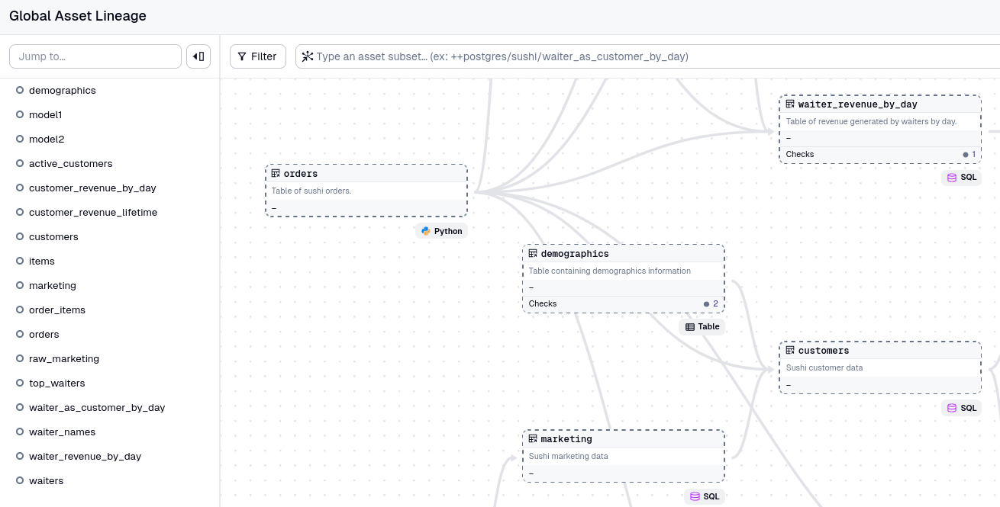
<br></br>

- An `AssetCheck` object attached to the relevant `Asset`'s for every SQLMesh Audit
  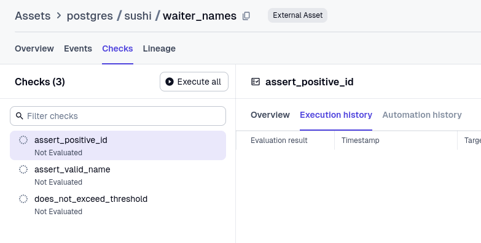
<br></br>

- Two `Jobs`:
    - A `sync` job to synchronise the current state of all Assets and Asset Checks from Tobiko Cloud to Dagster
    - A `mirror` job that tracks a Cloud Scheduler run and mirrors the results to Dagster
      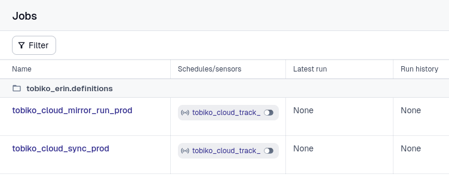
<br></br>

- A `Sensor` to monitor Tobiko Cloud for new cadence runs and trigger the `mirror` job when one is detected
  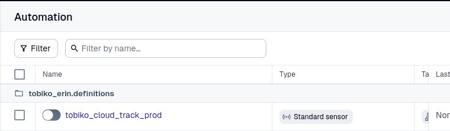

Once your Definitions are loaded by Dagster, these objects will be available in the Dagster UI.

## Monitor Tobiko Cloud actions

Dagster retrieves information from Tobiko Cloud with a [Sensor](https://docs.dagster.io/guides/automate/sensors).

To start monitoring Tobiko Cloud actions, enable the Sensor [in the Dagster UI](https://docs.dagster.io/guides/automate/sensors/monitoring-sensors-in-the-dagster-ui):

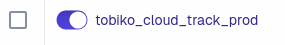

The Sensor is configured to run every 30 seconds. It does the following:

- On the first run, it triggers the `sync` job. This synchronizes the materialization status of the Dagster assets with the Models and Audits from Tobiko Cloud.
- On subsequent runs, it checks if a new Cloud Scheduler run has occurred. If so, it triggers the `mirror` job to mirror the outcome of that run in Dagster.

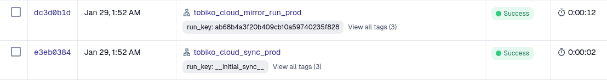

!!! question "Why are there two jobs?"
    The Tobiko Cloud scheduler does everything it can to prevent unnecessary work, such as only reporting materialization information for the models that were updated in a run.

    Therefore, Dagster does not receive materialization information for excluded models or objects that are never part of a cadence run (such as [seeds](../../../concepts/models/seed_models.md)).

    The `sync` jobs addresses this by copying the current state of the entire project. The `mirror` job then updates that information based on what happens during a specific cadence run.

To manually refresh materialization information for all models, run the `sync` job manually from the Dagster UI:

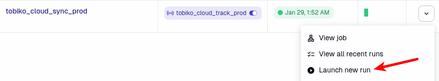

## Debugging

When something goes wrong, the first priority is getting more information.

Tobiko Cloud makes it easy to access that information from Dagster via links to each object's corresponding remote task in Tobiko Cloud.

In the Dagster UI, the links are available in the job's Logs page:

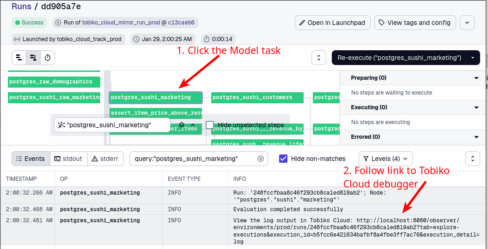

Alternatively, in the Asset Catalog, the link is included in the last evaluation's logs as Metadata:

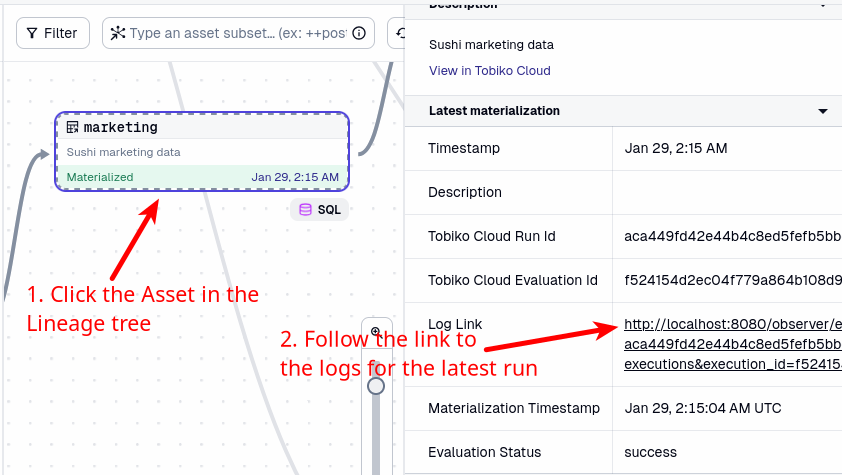

Clicking the link opens the remote task in the Tobiko Cloud [Debugger View](../debugger_view.md), which provides information and tools to aid debugging:


## Picking up new Models

Dagster does not automatically reload the Asset `Definitions` defined in the code [above](#create-dagster-objects). This means that models added or removed during a `plan` will not automatically appear in Dagster.

This section describes two methods for refreshing Dagster and picking up those models.

### Automatic method

Dagster runs user code in an isolated sandbox for security purposes, which complicates automatic reloading of Asset `Definitions`.

Specifically, we must use Dagster's GraphQL API, which is not enabled by default. To enable it, specify a GraphQL host and port when creating the `SQLMeshEnterpriseDagster` instance:

```python title="definitions.py" linenums="1" hl_lines="4 5"
sqlmesh = SQLMeshEnterpriseDagster(
    url=EnvVar("TCLOUD_BASE_URL").get_value(),
    #...SNIP...,
    dagster_graphql_host="localhost", # Example GraphQL host (could be passed in an environment variable instead)
    dagster_graphql_port=3000 # Example GraphQL port (could be passed in an environment variable instead)
)
```

The GraphQL host and port above reflect the specific Dagster deployment used for this example. (A Dagster deployment in local development mode that was started with `dagster dev` typically uses hostname `localhost` and port `3000`.)

The values you should specify for `dagster_graphql_host` and `dagster_graphql_port` depend on the GraphQL hostname and port in your Dagster deployment.

The `mirror` job's Sensor automatically picks up the new/removed assets by issuing a GraphQL request to reload the Code Location. It then executes the `mirror` job as usual.

### Manual method

At any time, you can update Dagster's asset information by clicking the "Reload" Code Location button:

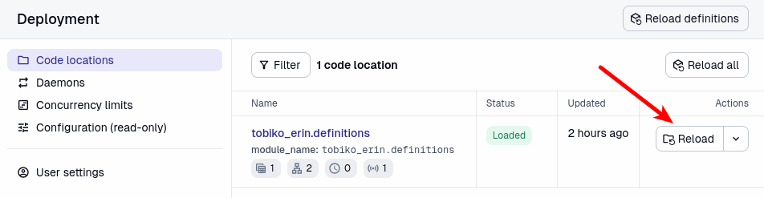

## Attaching custom logic

Dagster includes a robust events system that lets you detect and respond to events issued by your Assets or Jobs.

Tobiko Cloud's Dagster integration lets you run your own custom logic in response to events emitted by Tobiko Cloud assets.

To listen for materialization events on Assets, use an [Asset Sensor](https://docs.dagster.io/concepts/partitions-schedules-sensors/asset-sensors).

To listen for job runs, use a [Run Status Sensor](https://docs.dagster.io/concepts/partitions-schedules-sensors/sensors#run-status-sensors).

Dagster also provides a framework called [Declarative Automation](https://docs.dagster.io/concepts/automation/declarative-automation) that builds on top of these sensors.

### Examples

Here are some examples of running custom logic in response to Tobiko Cloud events.

Note that Dagster has a lot of flexibility in how it can be configured, and the methods we describe below aren't necessarily the right choice for every configuration.

We recommend familiarizing yourself with Dagster's [Automation](https://docs.dagster.io/concepts/automation) features to get the most out of your Tobiko Cloud deployment with Dagster.

#### Respond to run status

To listen for Tobiko Cloud run events, create a [Run Status Sensor](https://docs.dagster.io/concepts/partitions-schedules-sensors/sensors#run-status-sensors) that listens for events on the `mirror` job and triggers your custom job in response.

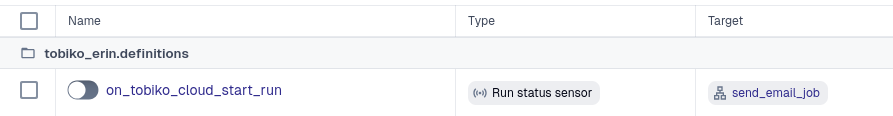

Creating the Run Status Sensor has three steps: defining a custom job, detecting Tobiko Cloud events, and creating a Sensor that executes your custom job when events are detected.

Step 1: Define a custom job

Your custom job has full access to Python and any libraries installed in your Dagster environment, so you can implement any logic you like.

Define a function executing your logic and decorate it with `@op`. Then define a function calling the logic function and decorate it with `@job` to group it into a Job:

``` python linenums="1"
# function that implements custom logic
@op
def send_email():
    import smtplib

    with smtplib.SMTP("smtp.yourdomain.com") as server:
        server.sendmail(...)

# function that creates job to execute custom logic function
@job
def send_email_job():
    send_email()
```

Step 2: Detect Tobiko Cloud events

There are two approaches to detecting Tobiko Cloud events. In the examples below, both approaches create a `mirror_job` object used by the Run Status Sensor.

The reference approach detects events based on a reference to the Tobiko Cloud mirror job, which is always named `tobiko_cloud_mirror_run_prod`. It extracts the reference from the Definitions object we created above:

``` python
mirror_job = tobiko_cloud_definitions.get_job_def("tobiko_cloud_mirror_run_prod")
```

Alternatively, use the [JobSelector](https://docs.dagster.io/concepts/partitions-schedules-sensors/sensors#cross-code-location-run-status-sensors) approach if the Tobiko Cloud Definitions are in their own Code Location and not directly accessible from your job code:

``` python
from dagster import JobSelector

mirror_job = JobSelector(job_name="tobiko_cloud_mirror_run_prod")
```

Step 3: Create a Run Status Sensor

With our `mirror_job` object in hand, we are ready to create a `@run_status_sensor` that listens to the mirror job and triggers your custom job when the mirror job is complete:

```python
@run_status_sensor(
    run_status=DagsterRunStatus.SUCCESS,
    monitored_jobs=[mirror_job], # Sensor should listen to `mirror_job`
    request_job=send_email_job # Sensor should execute `send_email_job` when `mirror_job` is complete
)
def on_tobiko_cloud_start_run(context: RunStatusSensorContext):
    return RunRequest()
```

You can adjust the decorator's `run_status` argument to listen for different statuses, the `monitored_jobs` argument to monitor other Tobiko Cloud jobs, and the `request_job` argument to trigger a different custom job when an event is detected.

Here's an example that triggers a Slack notification when a new run starts:

```python title="Sensor sends Slack notification when a new run starts" linenums="1"
from dagster import run_status_sensor, job, DagsterRunStatus, EnvVar, RunRequest, RunStatusSensorContext
from dagster_slack import SlackResource

# get reference to mirror job
mirror_job = tobiko_cloud_definitions.get_job_def("tobiko_cloud_mirror_run_prod")

# define custom logic function
@op
def slack_op(slack: SlackResource):
    # see the dagster-slack docs here: https://docs.dagster.io/_apidocs/libraries/dagster-slack
    slack.get_client().chat_postMessage(channel="#notifications", ...)

# define job function that calls custom logic function
@job
def notify_slack():
    slack_op()

# define Sensor
@run_status_sensor(
    run_status=DagsterRunStatus.STARTED, # Listens for STARTED runs
    monitored_jobs=[mirror_job],
    request_job=notify_slack
)
def on_tobiko_cloud_start_run(context: RunStatusSensorContext):
    return RunRequest()
```

#### Respond to Asset Materialization

When Tobiko Cloud refreshes or adds new data to a model, a Materialization event occurs for its corresponding Asset in Dagster. The Materialization event provides a hook we can use to run custom logic.

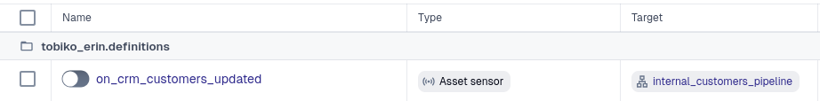

As before, the custom logic can do anything you want, such as triggering the materialization of another Asset fully managed by Dagster or running some custom task. Triggering the materialization of Tobiko Cloud Assets will not work correctly, as they simply reflect the operations performed by Tobiko Cloud.

To listen for Asset Materialization events, create an [Asset Sensor](https://docs.dagster.io/concepts/partitions-schedules-sensors/asset-sensors).

For example, let's say your Tobiko Cloud project has a model called `postgres.crm.customers`, and it's showing in the Dagster Asset Catalog under "postgres / crm / customers".

Define an Asset Sensor to respond to this model's materialization events like this:

```python
from dagster import AssetKey, SensorEvaluationContext, EventLogEntry

@job
def internal_customers_pipeline():
    # custom logic goes here
    pass

@asset_sensor(
    asset_key=AssetKey(["postgres", "crm", "customers"]), # Asset key found in Dagster Asset Catalog
    job=internal_customers_pipeline
)
def on_crm_customers_updated(context: SensorEvaluationContext, asset_event: EventLogEntry):
    yield RunRequest()
```

The sensor will trigger every time the Asset with the key `postgres / crm / customers` is materialized.

To identify the `AssetKey`'s of your Assets, check Dagster's Asset Catalog. Each part of the path is a segment of the Asset Key.

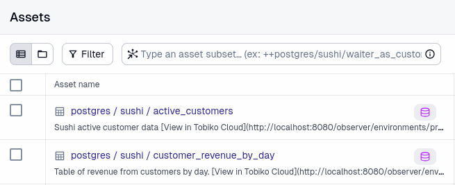

These `AssetKey` values correspond to the models in the screenshot above:

```python
from dagster import AssetKey

active_customers = AssetKey(["postgres", "sushi", "active_customers"])
customer_revenue_by_day = AssetKey(["postgres", "sushi", "customer_revenue_by_day"])
```

## Configuration

### `SQLMeshEnterpriseDagster` parameters

| Option                     | Description                                                                                                                                                                            | Type | Required |
|----------------------------|----------------------------------------------------------------------------------------------------------------------------------------------------------------------------------------|:----:|:--------:|
| `url`                      | The Base URL to your Tobiko Cloud instance                                                                                                                                             | str  | Y        |
| `oauth_client_id`          | OAuth Client ID of the credentials you [provisioned](../security/single_sign_on.md#provisioning-client-credentials) for Dagster                                                                 | str  | N        |
| `oauth_client_secret`      | OAuth Client Secret of the credentials you [provisioned](../security/single_sign_on.md#provisioning-client-credentials) for Dagster                                                             | str  | N        |
| `dagster_graphql_host`     | Hostname of the Dagster Webserver GraphQL endpoint                                                                                                                                     | str  | N        |
| `dagster_graphql_port`     | Port of the Dagster Webserver GraphQL endpoint                                                                                                                                         | int  | N        |
| `dagster_graphql_kwargs`   | Extra args to pass to the [DagsterGraphQLClient](https://docs.dagster.io/api/python-api/libraries/dagster-graphql#dagster_graphql.DagsterGraphQLClient) class when it is instantiated  | dict | N        |

### `create_definitions()` parameters

| Option                     | Description                                                                            | Type | Required |
|----------------------------|----------------------------------------------------------------------------------------|:----:|:--------:|
| `environment`              | Which SQLMesh environment to target. Default: `prod`                                   | str  | N        |
| `asset_prefix`             | Top-level category to nest Tobiko Cloud assets under                                   | str  | N        |
| `enable_sensor_by_default` | Whether the Sensor that polls for new runs should be enabled by default. Default: True | bool | N        |
