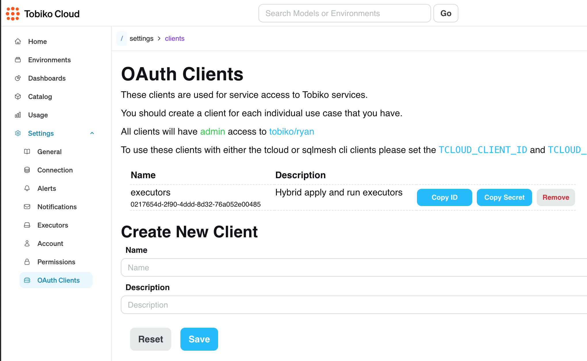

# Tobiko Cloud Hybrid Executors - Docker Compose Setup

This Docker Compose configuration allows you to run Tobiko Cloud hybrid executors locally or on any server that supports Docker Compose. Hybrid executors enable your own infrastructure to connect to Tobiko Cloud for operations while keeping your data warehouse credentials within your environment.

## What This Setup Provides

The hybrid executors connect your data warehouse to Tobiko Cloud in a secure way:

- **Apply Executor**: Executes operations that change state, like creating and updating models
- **Run Executor**: Runs read-only operations like planning and analysis

## Prerequisites

- Access to a data warehouse (e.g., Postgres, Snowflake, BigQuery)
- Docker and Docker Compose
- A Tobiko Cloud account with client ID and client secret



## Quick Start Guide

1. **Get docker-compose file**:

   Download the [docker-compose file](https://raw.githubusercontent.com/TobikoData/sqlmesh/refs/heads/main/docs/cloud/features/scheduler/scheduler/docker-compose.yml) and [.env.example](https://raw.githubusercontent.com/TobikoData/sqlmesh/refs/heads/main/docs/cloud/features/scheduler/scheduler/.env.example) to a local directory.

2. **Create your environment file**:

   ```bash
   cp .env.example .env
   ```

3. **Edit the .env file** with your specific configuration:

   - Set your Tobiko Cloud organization, project, client ID, and client secret
   - Configure your database connection details
   - Adjust resource limits if needed

4. **Start the executors**:

   ```bash
   docker compose up -d
   ```

5. **Check the logs**:

   ```bash
   docker compose logs -f
   ```

## Configuration Options

### Database Configuration

The default configuration is set up for Postgre, but you can use any supported database by adjusting the connection parameters in your `.env` file:

### Multiple Gateways

To configure multiple gateways, edit the docker compose.yml file to add additional environment variables for each gateway:

```yaml
environment:
  # First gateway
  SQLMESH__GATEWAYS__GATEWAY_A__CONNECTION__TYPE: ${DB_TYPE:-postgres}
  # ... other GATEWAY_A configuration ...
  
  # Second gateway
  SQLMESH__GATEWAYS__GATEWAY_B__CONNECTION__TYPE: snowflake
  SQLMESH__GATEWAYS__GATEWAY_B__CONNECTION__ACCOUNT: ${SNOWFLAKE_ACCOUNT}
  # ... other GATEWAY_B configuration ...
```

## Health Checking

You can verify executor health by running:

```bash
docker compose exec apply-executor /app/pex executor apply --check
docker compose exec run-executor /app/pex executor run --check
```

Check for exit code 0 using `echo $?` to confirm the executors are healthy.
Example successful output:

```bash
> docker compose exec apply-executor /app/pex executor apply --check
2025-04-09 21:24:49,873 - MainThread - httpx - INFO - HTTP Request: GET https://cloud.tobikodata.com/sqlmesh/<YOUR ORG>/<YOUR PROJECT>/api/state-sync/enterprise-version/upgrade "HTTP/1.1 200 OK" (_client.py:1025)
2025-04-09 21:24:49,889 - MainThread - tobikodata.tcloud.installer - INFO - Executor is installed (installer.py:180
```

## Stopping the Executors

To stop the executors:

```bash
docker compose down
```

## Troubleshooting

If you encounter issues:

1. Check the logs: `docker compose logs -f`
2. Verify your connection settings in the `.env` file
3. Ensure your client ID and client secret are correct
4. Check that your database is accessible from the Docker containers

## Security Considerations

- The `.env` file contains sensitive information. Never commit it to version control.
- Consider using Docker secrets or a secrets management solution in production environments.
- For production deployments, consider using the Kubernetes Helm chart instead, which offers more robust reliability and secret management options. 