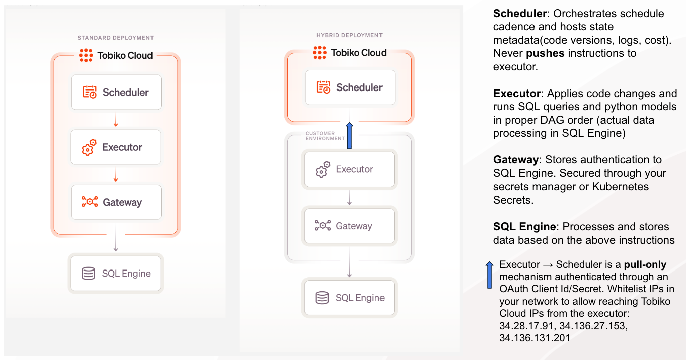
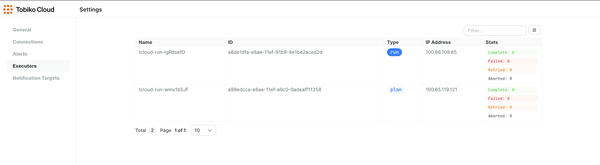

# Overview

In a standard deployment, Tobiko Cloud securely manages your data warehouse connections so it can run your project.

However, you may prefer not to share your data warehouse credentials or want to bring the execution closer to your data. To support this, Tobiko Cloud offers hybrid deployments where we host the scheduler and you host the executors that perform the scheduled actions.

With this approach, Tobiko Cloud uses project metadata to manage SQLMesh user access control, schedule and trigger runs, and apply plans, but all data access and query execution occurs within your infrastructure. Tobiko Cloud has no access to your data or warehouse credentials.

This gives you complete control over data security and network access while still benefiting from Tobiko Cloud's powerful scheduling capabilities.

## How it works

Tobiko Cloud has three primary tasks: determine what should happen when (scheduling), make those things happen (executing), and monitor everything that happens (observing).

In a standard deployment, all three of these occur within the Tobiko Cloud environment. You configure a gateway in Tobiko Cloud, and Tobiko Cloud uses it to execute work tasks (such as a `plan` or `run`).

In a hybrid deployment, Tobiko Cloud does not execute tasks directly with the engine. Instead, it passes tasks to the executors hosted in your environment, which then execute the tasks with the engine. This extra layer between Tobiko Cloud and your SQL engine means Tobiko Cloud has no knowledge of your credentials.



Executors are Docker containers that connect to both Tobiko Cloud and your SQL engine. They pull work tasks from the Tobiko Cloud scheduler and execute them with your SQL engine.

## Deployment Options

You can deploy the executor containers using any method that works for your infrastructure and operational requirements.

The executors are standard Docker containers that can be deployed in any container environment as long as they're configured with the required environment variables.

We provide two reference implementations:

1. [**Kubernetes with Helm Chart**](./hybrid_executors_helm.md): For production environments, we provide a [Helm chart](./hybrid_executors_helm.md) that includes robust configurability, secret management, and scaling options.

2. [**Docker Compose**](./hybrid_executors_docker_compose): For simpler environments or testing, we offer a [Docker Compose setup](./hybrid_executors_docker_compose) to quickly deploy executors on any machine with Docker.

You're free to adapt these reference implementations or create your own deployment method that fits your specific needs.

As described below, two executor instances must be running and properly configured at all times (one executor for `run` operations and one for `apply` operations).

## Configuration

This section describes basic configuration concepts for hybrid executors. For detailed configuration options, refer to the documentation for your chosen deployment method above.

Tobiko Cloud requires 2 executor instances to be running at all times:

1. **Run Executor**: Handles scheduled model execution
2. **Apply Executor**: Handles applying changes to the data warehouse

Both executors need to be properly configured with environment variables for connecting to Tobiko Cloud and your data warehouse.

### Environment Variables

Executors require different types of information to connect to Tobiko Cloud and your data warehouse. Provide that information via environment variables.

#### TCLOUD variables

One important type of environment variable is the `TCLOUD` variables used for connecting to Tobiko Cloud.

The first required `TCLOUD` variable is a unique Tobiko Cloud URL for your project, which your Solutions Architect will provide after your project is created.

You also need the Client ID and Client Secret variables, which are generated when you [create an OAuth Client](../single_sign_on.md#provisioning-client-credentials) in the Tobiko Cloud UI.

Specify the URL, Client ID, and Client Secret in these environment variables:

``` bash
TCLOUD_URL={your Tobiko Cloud project URL}
TCLOUD_CLIENT_ID={your Client ID}
TCLOUD_CLIENT_SECRET={your Client Secret}
```

!!! important "Set TCLOUD variables on the Docker container"

    Environment variables used for connecting to Tobiko Cloud, such as `TCLOUD_URL`, `TCLOUD_CLIENT_ID`, and `TCLOUD_CLIENT_SECRET`, must be set on the executor's Docker container.

#### Other environment variables

The executors also require configuration parameters for other aspects of your project.

For example, your executor must know how to connect to your SQL engine, so you must configure a [gateway via environment variables](../../../guides/configuration.md#overrides).

This example specifies a Postgres gateway named "GATEWAY_A" and set it as the default gateway:

```env
SQLMESH__GATEWAYS__GATEWAY_A__CONNECTION__TYPE=postgres
SQLMESH__GATEWAYS__GATEWAY_A__CONNECTION__HOST=10.10.10.10
SQLMESH__GATEWAYS__GATEWAY_A__CONNECTION__PORT=5432
SQLMESH__GATEWAYS__GATEWAY_A__CONNECTION__DATABASE=example_db
SQLMESH__GATEWAYS__GATEWAY_A__CONNECTION__USER=example_user
SQLMESH__GATEWAYS__GATEWAY_A__CONNECTION__PASSWORD=example_password

# make it the default gateway
SQLMESH__DEFAULT_GATEWAY=GATEWAY_A
```

**Note**: If your project uses multiple gateways, each gateway requires its own set of environment variables.

For example, we might add a second gateway named "GATEWAY_B" like this. Note that the gateway names `GATEWAY_A` and `GATEWAY_B` are embedded in the environment variable name:

```env
SQLMESH__GATEWAYS__GATEWAY_A__CONNECTION__TYPE=<connection type>
# <Gateway A connection settings>

SQLMESH__GATEWAYS__GATEWAY_B__CONNECTION__TYPE=<connection type>
# <Gateway B connection settings>
```

For more configuration details, including secure secret management options, refer to the [Helm chart](./hybrid_executors_helm.md) or [Docker Compose](./hybrid_executors_docker_compose) deployment documentation.

After the executors are configured and running, they will connect to Tobiko Cloud. Once connected, they will appear in the cloud UI and be ready to apply `plan`s and execute scheduled `run`s.



We strongly recommend setting up a monitoring system for the executor containers to ensure they run smoothly and to help troubleshoot issues. Monitoring should include logs and system metrics like memory and CPU usage.

#### .env file

As mentioned above, `TCLOUD` environment variables **must** be set on the executor's Docker container. However, other environment variables can be set later because they are only needed after the executor is connected to Tobiko Cloud.

Instead of setting a variable on the container, you can use a `.env` file. This can be useful for environment variables that require frequent updating, such as API tokens.

Create a `.env` file and define your environment variables in it. Then, mount the `.env` file into the docker image. Any external process can update the file with a new variable value, and the executor will automatically pick up the changes.

Tell the executor where to find the `.env` file by specifying the file's full path in the `TCLOUD` environment variable `TCLOUD_ENV_FILE`.

**Note**: the `TCLOUD_ENV_FILE` environment variable **must** be set on the executor's Docker container, just like the `TCLOUD_URL`, `TCLOUD_CLIENT_ID`, and `TCLOUD_CLIENT_SECRET` variables.

### Network Configuration

Tobiko Cloud never pushes information into your network, so it doesn't need inbound access.

Instead, the executors you host make outbound requests polling Tobiko Cloud for work tasks and other information.

Inside your network, executors have no direct connection to local user environments. They are only required to connect to Tobiko Cloud and your SQL engine, with all information flowing via outbound requests.

If the executors are running in a network without public internet access, configure the network to allow executor and local user access to Tobiko Cloud on these IP addresses:

```bash
34.28.17.91
34.136.27.153
34.136.131.201
```

### Project Configuration

Project configuration is the same for hybrid and standard Tobiko Cloud deployments.

See [connection configuration](./scheduler.md#connection-configuration) for details.

## Required system specs

The exact system requirements for executors vary depending on your project and work processes.

In general, we recommend a minimum of 2GB of RAM and 1 vCPU for each executor.

Complex or resource-intensive Python models may require executors with more resources.

## Health checks

In production settings, we recommend setting up health checks to monitor the status of your executors.

Health checks help ensure your executors are operating correctly and can identify issues before they impact your workflows.

For detailed information on implementing health checks:

- **Kubernetes/Helm**: see the [Hybrid Executors Helm Chart documentation](./hybrid_executors_helm.md#verifying-the-installation) for information on health check configuration in Kubernetes.

- **Docker Compose**: see the [Docker Compose setup documentation](./hybrid_executors_docker_compose#health-checking) for health check implementation with Docker Compose.

Both executor types (run and apply) should have appropriate health checks to ensure proper system monitoring and reliability.

**Note** When configuring health checks, ensure timeouts are set appropriately based on your executors' resources. Default timeouts can sometimes be too short.
