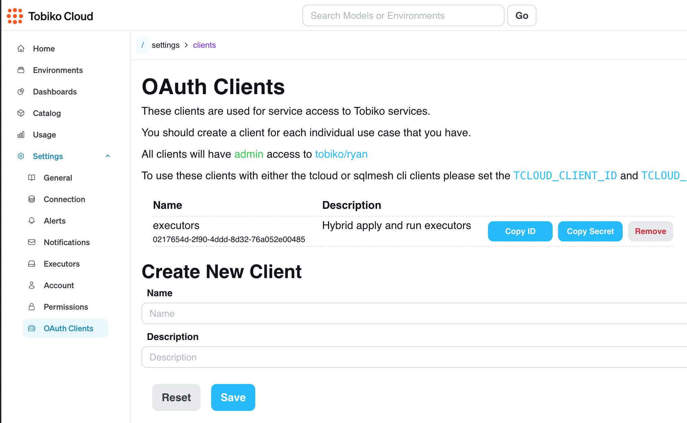
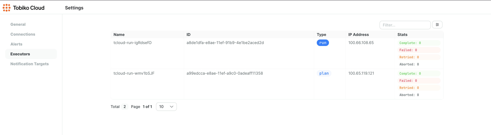

# Scheduler

Tobiko Cloud offers scheduling capabilities that have several advantages over the scheduler built into the open source version of SQLMesh.

## Cloud scheduler benefits

This section describes the specific advantages of using the Tobiko Cloud scheduler.

### Schedule executions

With Tobiko Cloud, users don't need to configure a cron job that periodically runs the `sqlmesh run` command.

Instead, Tobiko Cloud automatically schedules model execution based on the cron expressions in the project's model definitions.

### Concurrent runs

Unlike the built-in scheduler, Tobiko Cloud parallelizes both model executions and run jobs.

This means that if one run job is blocked by a long-running model, other independent models can still execute concurrently in separate run jobs.

### Run pausing

Tobiko Cloud allows you to pause and resume model execution at both the environment and individual model level.

This granular control helps prevent problems during maintenance windows and troubleshoot issues.

### Isolated Python environments

Tobiko Cloud automatically manages Python dependencies of your Python macros and models.

Each virtual environment has its own isolated Python environment and set of dependencies, ensuring that changes in one environment won't affect other environments.

### Improved concurrency control

The cloud scheduler ensures that plans targeting the same environment are applied sequentially, preventing race conditions and ensuring correct results.

### Access control

Tobiko Cloud manages your data warehouse connection. This allows users to execute `run` and `plan` commands without needing local access to warehouse credentials.

Tobiko Cloud also provides fine-grained access control for the `run` and `plan` commands. User permissions may be limited to specific  environments or models (coming soon).

## Using the Cloud scheduler

This section describes how to configure and use the Tobiko Cloud scheduler.

### Connection configuration

To start using the cloud scheduler, configure the connection to your data warehouse in the Tobiko Cloud UI.
<br></br>

**Step 1**: Click on the "Settings" tab in the sidebar.


<br></br>

**Step 2**: Navigate to the "Connections" tab (1) and click on the "Add Connection" button (2).


<br></br>

**Step 3**: Enter the name of the gateway in the Gateway field and the connection configuration in YAML format in the YAML Configuration field.

The format follows the [connection configuration](../../../guides/configuration.md#connections) in the SQLMesh Connections guide.

!!! warning "Gateway names must match"

    This gateway name must match the name of the gateway specified in the project's `config.yaml` file.


<br></br>

**Step 4**: Click the "Save" button to add the connection.

The connection will be tested and only saved if the connection is successful. The configuration is stored in encrypted form using AES-256 encryption and is only decrypted for execution purposes.


<br></br>

**Step 5**: Switch to the Cloud scheduler in the project's configuration file.

Update your project's `config.yaml` file to specify a scheduler of type `cloud`.

!!! warning "Gateway name must match"

    This gateway name must match the name of the gateway that was specified when adding the connection in the Tobiko Cloud UI.

=== "YAML"

    ```yaml linenums="1" hl_lines="3 4"
    gateways:
      gateway_a:
        scheduler:
          type: cloud
    
    default_gateway: gateway_a
    ```

=== "Python"

    ```python linenums="1" hl_lines="8"
    from sqlmesh.core.config import GatewayConfig
    
    from tobikodata.sqlmesh_enterprise.config import EnterpriseConfig, RemoteCloudSchedulerConfig
    
    config = EnterpriseConfig(
        gateways={
            "gateway_a": GatewayConfig(
                scheduler=RemoteCloudSchedulerConfig()
            ),
        },
        default_gateway="gateway_a",
    )
    ```

### Pausing model executions

Temporarily pausing model execution can be useful when troubleshooting issues or during maintenance windows.

Tobiko Cloud allows you to pause and resume model execution at both the environment and individual model level.

#### Pausing all models in an environment

To pause all models in an environment, navigate to the environment's page and click the "Pause" button.

This will pause **all** model executions in this environment.


To resume the environment, click the "Resume" button.


<br></br>

#### Pausing a model

To pause a model in a specific environment, navigate to the environment's page and click "See all pauses" (located next to the "Pause" button).


In that page, click the "Create Pause" button.


Select the model you want to pause and provide a reason for pausing it (optional).


Click the "Create" button in the bottom right.

The target model and its downstream dependencies will not be run in this environment.

!!! note "Paused models included in plans"

    Paused models will not execute during a `run`, but they will execute during a `plan` application (if affected by the plan's changes).
<br></br>

#### Resuming a model

To resume a model, navigate to an environment's pauses page and click the "Delete" button for that model's pause.


## Python Dependencies

Tobiko Cloud automatically manages Python dependencies of your Python macros and models. Each virtual environment has its own isolated Python environment where relevant libraries are installed, ensuring that changes in one environment won't affect other environments.

SQLMesh automatically infers which Python libraries are used by statically analyzing the code of your models and macros.

For fine-grained control, dependencies can be specified, pinned, or excluded using the `sqlmesh-requirements.lock` file. See the [Python library dependencies](../../../guides/configuration.md#python-library-dependencies) section in the SQLMesh configuration guide for more information.

## Hybrid Deployment (Self-hosted executors)

Letting Tobiko Cloud manage your data warehouse connections is a secure and convenient way to run your project.

However, some organizations may prefer not to share their data warehouse credentials with a third party or to bring the execution closer to their data. To support this, Tobiko Cloud offers the ability for you to host your own SQLMesh executors.

With this approach, Tobiko Cloud uses project metadata to manage user access control, schedule and trigger runs, and apply plans, but all data access and query execution occurs within your own infrastructure. Tobiko cloud has no access to your data or warehouse credentials.

This gives you complete control over data security and network access while still benefiting from Tobiko Cloud's scheduling capabilities.

### How it works

Self-hosted executors as the name indicates are self-hosted workers that take on the responsibility of "executing" changes to the data warehouse. While Tobiko Cloud schedules and plans changes, the executors are responsible for executing those changes. Executors are docker containers that are configured to connect to Tobiko Cloud as well as your data warehouse. Connected to both, the executor pulls work from the cloud, whether it's a plan or scheduled background work from a run, and execute it on your data warehouse.

### Deployment Options

You can deploy the executor containers using any method that works for your infrastructure and operational requirements. The executors are standard Docker containers that can be deployed in any container environment as long as they're properly configured with the required environment variables.

For your convenience, we provide two reference implementations:

1. **Kubernetes with Helm Chart**: For production environments, we provide a [Helm chart](./hybrid_executors_helm.md) that includes robust configurability, secret management, and scaling options.

2. **Docker Compose**: For simpler environments or testing, we offer a [Docker Compose setup](./hybrid_executors_docker_compose) to quickly deploy executors on any machine with Docker.

You're free to adapt these reference implementations or create your own deployment method that fits your specific needs. The only requirement is that two executor instances must be running (one for run operations and one for apply operations) and properly configured.

### Configuration

The following covers basic configuration concepts for hybrid executors. For detailed configuration options, please refer to the specific documentation for your chosen deployment method above.

Tobiko Cloud requires 2 executor instances to be running:

1. **Run Executor**: Handles scheduled model execution
2. **Apply Executor**: Handles applying changes to the data warehouse

Both executors need to be properly configured with environment variables to connect to Tobiko Cloud and your data warehouse.

#### Basic Environment Variables

To connect to Tobiko Cloud, you'll need to provide:

```env
TCLOUD_URL=https://cloud.tobikodata.com/sqlmesh/acme/analytics_project
TCLOUD_CLIENT_ID=your_client_id
TCLOUD_CLIENT_SECRET=your_client_secret
```



To connect to your data warehouse, configure a gateway:

```env
SQLMESH__DEFAULT_GATEWAY=GATEWAY_A
SQLMESH__GATEWAYS__GATEWAY_A__CONNECTION__TYPE=postgres
SQLMESH__GATEWAYS__GATEWAY_A__CONNECTION__HOST=10.10.10.10
SQLMESH__GATEWAYS__GATEWAY_A__CONNECTION__PORT=5432
SQLMESH__GATEWAYS__GATEWAY_A__CONNECTION__DATABASE=example_db
SQLMESH__GATEWAYS__GATEWAY_A__CONNECTION__USER=example_user
SQLMESH__GATEWAYS__GATEWAY_A__CONNECTION__PASSWORD=example_password
```

**Note**: For multiple gateways, each gateway needs its own set of environment variables:

```env
SQLMESH__GATEWAYS__GATEWAY_A__CONNECTION__TYPE=<connection type>  
# <Gateway A connection settings>  
SQLMESH__GATEWAYS__GATEWAY_B__CONNECTION__TYPE=<connection type>  
# <Gateway B connection settings>  
```

For more details, including secure secret management options, refer to the [Helm chart](./hybrid_executors_helm.md) or [Docker Compose](./hybrid_executors_docker_compose) documentation.

After the executors are properly configured and running, they will appear in the cloud UI where they can be used to apply plans and execute scheduled runs.



We recommend setting up monitoring for the executors to ensure they run smoothly and to help troubleshoot issues. This monitoring should include logs and system metrics like memory and CPU usage.

#### Network Configuration

No ingress is required from executor containers to user environments. All network requests are outbound from user environments to Tobiko Cloud. If the hybrid executors are running in a secure network, where public internet access is not available, you will need to configure the network to allow access to Tobiko Cloud on the following IPs:

```bash
34.28.17.91
34.136.27.153
34.136.131.201
```

#### Project Configuration

Configuring a project using hybrid executors is the same as configuring a project for cloud scheduler. See [connection configuration](#connection-configuration) for details.

### Required specs

While the exact requirements for executors vary depending on the customer's specific needs and primarily depend on the Python models being run (whose requirements can vary greatly), we recommend a minimum of 2GB of RAM and 1 vCPU for each executor.

### '.env' file

Environment variables may also be passed to SQLMesh by mounting a `.env` file into the docker image and specifying it's full path with the environment variable `TCLOUD_ENV_FILE`. 

**Note** These variables are only read at SQLMesh run time so variables that are used by `tcloud` such as `TCLOUD_URL`, `TCLOUD_CLIENT_ID`, `TCLOUD_CLIENT_SECRET`, etc. must be passed as variables. 

### Health checks

In production settings, we recommend setting up health checks to monitor the status of your executors. Health checks help ensure your executors are operating correctly and can identify issues before they impact your workflows.

For detailed information on implementing health checks:

- **Kubernetes/Helm**: See the [Hybrid Executors Helm Chart documentation](./hybrid_executors_helm.md#verifying-the-installation) for information on health check configuration in Kubernetes.

- **Docker Compose**: Refer to the [Docker Compose setup documentation](./hybrid_executors_docker_compose#health-checking) for health check implementation with Docker Compose.

Both executor types (run and apply) should have appropriate health checks implemented to ensure proper monitoring and reliability.

**Note** When configuring health checks, ensure timeouts are set appropriately based on your resources. Default timeouts can sometimes be too aggressive depending on the allocated resources.
