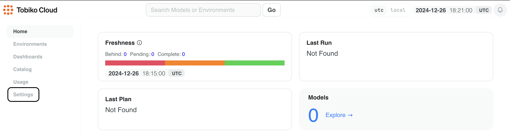

# Scheduler

Tobiko Cloud offers scheduling capabilities that have several advantages over the scheduler built into the open source version of SQLMesh.

## Cloud scheduler benefits

This section describes the specific advantages of using the Tobiko Cloud scheduler.

### Schedule executions

With Tobiko Cloud, users don't need to configure a cron job that periodically runs the `sqlmesh run` command.

Instead, Tobiko Cloud automatically schedules model execution based on the cron expressions in the project's model definitions.

### Concurrent runs

Unlike the built-in scheduler, Tobiko Cloud parallelizes both model executions and run jobs.

This means that if one run job is blocked by a long-running model, other independent models can still execute concurrently in separate run jobs.

### Run pausing

Tobiko Cloud allows you to pause and resume model execution at both the environment and individual model level.

This granular control helps prevent problems during maintenance windows and troubleshoot issues.

### Isolated Python environments

Tobiko Cloud automatically manages Python dependencies of your Python macros and models.

Each virtual environment has its own isolated Python environment and set of dependencies, ensuring that changes in one environment won't affect other environments.

### Improved concurrency control

The cloud scheduler ensures that plans targeting the same environment are applied sequentially, preventing race conditions and ensuring correct results.

### Access control

Tobiko Cloud manages your data warehouse connection. This allows users to execute `run` and `plan` commands without needing local access to warehouse credentials.

Tobiko Cloud also provides fine-grained access control for the `run` and `plan` commands. User permissions may be limited to specific  environments or models (coming soon).

## Using the Cloud scheduler

This section describes how to configure and use the Tobiko Cloud scheduler.

### Connection configuration

To start using the cloud scheduler, configure the connection to your data warehouse in the Tobiko Cloud UI.
<br></br>

**Step 1**: Click on the "Settings" tab in the sidebar.


<br></br>

**Step 2**: Navigate to the "Connections" tab (1) and click on the "Add Connection" button (2).


<br></br>

**Step 3**: Enter the name of the gateway in the Gateway field and the connection configuration in YAML format in the YAML Configuration field.

The format follows the [connection configuration](../../../guides/configuration.md#connections) in the SQLMesh Connections guide.

!!! warning "Gateway names must match"

    This gateway name must match the name of the gateway specified in the project's `config.yaml` file.


<br></br>

**Step 4**: Click the "Save" button to add the connection.

The connection will be tested and only saved if the connection is successful. The configuration is stored in encrypted form using AES-256 encryption and is only decrypted for execution purposes.


<br></br>

**Step 5**: Switch to the Cloud scheduler in the project's configuration file.

Update your project's `config.yaml` file to specify a scheduler of type `cloud`.

!!! warning "Gateway name must match"

    This gateway name must match the name of the gateway that was specified when adding the connection in the Tobiko Cloud UI.

=== "YAML"

    ```yaml linenums="1" hl_lines="3 4"
    gateways:
      gateway_a:
        scheduler:
          type: cloud

    default_gateway: gateway_a
    ```

=== "Python"

    ```python linenums="1" hl_lines="8"
    from sqlmesh.core.config import GatewayConfig

    from tobikodata.sqlmesh_enterprise.config import EnterpriseConfig, RemoteCloudSchedulerConfig

    config = EnterpriseConfig(
        gateways={
            "gateway_a": GatewayConfig(
                scheduler=RemoteCloudSchedulerConfig()
            ),
        },
        default_gateway="gateway_a",
    )
    ```

### Pausing model executions

Temporarily pausing model execution can be useful when troubleshooting issues or during maintenance windows.

Tobiko Cloud allows you to pause and resume model execution at both the environment and individual model level.

#### Pausing all models in an environment

To pause all models in an environment, navigate to the environment's page and click the "Pause" button.

This will pause **all** model executions in this environment.


To resume the environment, click the "Resume" button.


<br></br>

#### Pausing a model

To pause a model in a specific environment, navigate to the environment's page and click "See all pauses" (located next to the "Pause" button).


In that page, click the "Create Pause" button.


Select the model you want to pause and provide a reason for pausing it (optional).


Click the "Create" button in the bottom right.

The target model and its downstream dependencies will not be run in this environment.

!!! note "Paused models included in plans"

    Paused models will not execute during a `run`, but they will execute during a `plan` application (if affected by the plan's changes).
<br></br>

#### Resuming a model

To resume a model, navigate to an environment's pauses page and click the "Delete" button for that model's pause.


## Python Dependencies

Tobiko Cloud automatically manages Python dependencies of your Python macros and models. Each virtual environment has its own isolated Python environment where relevant libraries are installed, ensuring that changes in one environment won't affect other environments.

SQLMesh automatically infers which Python libraries are used by statically analyzing the code of your models and macros.

For fine-grained control, dependencies can be specified, pinned, or excluded using the `sqlmesh-requirements.lock` file. See the [Python library dependencies](../../../guides/configuration.md#python-library-dependencies) section in the SQLMesh configuration guide for more information.

## Secret Manager

Tobiko Cloud provides a secrets manager where you can define environment variables for your project's Python models.

These variables are most commonly used to provide sensitive information to Python models, such as API keys or other credentials.

Secret values are encrypted at rest and only available in the environment of your running Python models.

!!! note "Cloud Scheduler Only"

    Secrets from the secret manager do not load into hybrid executors. They are only used for cloud scheduler executors.

Secret names have two restrictions - they must:

- Start with a letter or an underscore
- Only include letters, numbers, and underscores (no spaces or other symbols)

Secret values have no limits or restrictions. We recommend base64 encoding any secrets that contain binary data.

### Defining secrets

Define a secret on the Secrets page, accessible via the Settings section in Tobiko Cloud's left side navigation bar.

The Secrets page has a single panel you use to create a new secret, edit the value of an existing secret, or remove an existing secret. You cannot view the value of any existing secret.

In this example, only one secret has been defined: `MY_SECRET`. Update its value by entering a new value in the Secret field and clicking the `Update` button, or delete it by clicking the `Remove` button.


### Python Model Example

This Python model demonstrates how to read the `MY_SECRET` secret from an environment variable.

!!! danger "Protecting Secrets"

    Only read environment variables from inside a Python model's `execute` function definition (not in the global scope).

    If the variable is read in the global scope, SQLMesh will load the value from *your local system* when it renders the Python model instead of loading it at runtime on our executors.

    This could expose sensitive information or embed an incorrect local value in the rendered model.

```python linenums="1"
import os
import pandas as pd
import typing as t
from datetime import datetime

from sqlmesh import ExecutionContext, model

# DO NOT read environment variables here.
# Only inside the `execute` function definition!

@model(
    "my_model.name",
    columns={
        "column_name": "int",
    },
)
def execute(
    context: ExecutionContext,
    start: datetime,
    end: datetime,
    execution_time: datetime,
    **kwargs: t.Any,
) -> pd.DataFrame:

    # Read a secret from the MY_SECRET environment variable
    my_secret = os.environ["MY_SECRET"]

    ...
```
