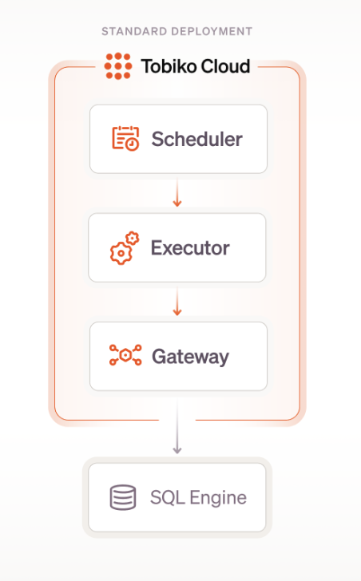
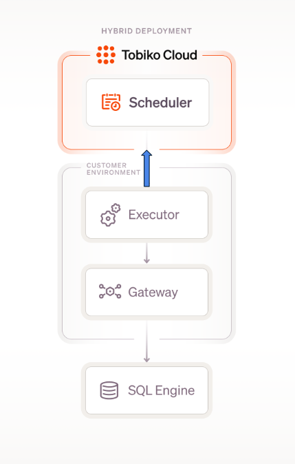

# Security Overview

At Tobiko, we treat security as a first-class citizen because we know how valuable your data assets are. Our team follows and executes security best practices across each layer of our product. 

## Tobiko Cloud Standard Deployment

Our standard Tobiko Cloud deployment consists of several components that are each responsible for different parts of the product. 

Below is a diagram of the components along with their descriptions. 

{ width=80% height=60% style="display: block; margin: 0 auto" }

- **Scheduler**: Orchestrates schedule cadence and hosts state metadata(code versions, logs, cost)
- **Executor**: Applies code changes and runs SQL queries (actual data processing in SQL Engine) and python models in proper DAG order.
- **Gateway**: Stores authentication to SQL Engine. Secured through encryption.
- **SQL Engine**: Processes and stores data based on the above instructions within the **customer’s** environment.

## Tobiko Cloud Hybrid Deployment

For some customers, our hybrid deployment option is a great fit. It provides a seamless experience with Tobiko Cloud but within your own VPC and infrastructure.  

In a hybrid deployment, Tobiko Cloud does not execute tasks directly with the engine. Instead, it passes tasks to the executors hosted in your environment, which then execute the tasks with the engine. 

Executors are Docker containers that connect to both Tobiko Cloud and your SQL engine. They pull work tasks from the Tobiko Cloud scheduler and execute them with your SQL engine. This is a pull-only mechanism authenticated through an OAuth Client ID/Secret. Whitelist IPs in your network to allow reaching Tobiko Cloud IPs from the executor: 34.28.17.91, 34.136.27.153, 34.136.131.20

Below is a diagram of the components along with their description. 

{ width=80% height=60% style="display: block; margin: 0 auto" }

- **Scheduler**: Orchestrates schedule cadence and hosts state metadata(code versions, logs, cost). Never **pushes** instructions to executor.
- **Executor**: Appplies code changes and runs SQL queries and python models in proper DAG order (actual data processing in SQL Engine)
- **Gateway**: Stores authentication to SQL Engine. Secured through your secrets manager or Kubernetes Secrets.
- **SQL Engine**: Processes and stores data based on the above instructions
- **Executor -> Scheduler**: This is a pull-only mechanism as stated abvoe. 
- **Helm Chart**: For production environements, we provide a [Helm chart](../scheduler/hybrid_executors_helm.md) that includes robust configurability, secret management, and scaling options.
- **Docker Compose**: For simpler environments or testing, we offer a [Docker Compose setup](../scheduler/hybrid_executors_docker_compose) to quickly deploy executors on any machine with Docker.

## Internal Code Practices

Our coding standards are guidelines we enforce throughout the organization to write, maintain, and collaborate on code effectively. These practice ensure consistency, maintainability, reliability, and most importantly, trust. 

Below you will find a few examples of our internal code requirements. 

- We used signed commits, required approvers, and signed Docker artifacts.
- Each commit to main must be approved by someone other than the author.
- We follow the standard of signing commits and registering the key with GitHub. [Github Docs](https://docs.github.com/en/authentication/managing-commit-signature-verification/signing-commits)
- Binary is signed using cosign and OIDC for keyless. [Signing docs](https://docs.sigstore.dev/cosign/signing/overview/)
- Attestations are created to certify an image. We use GCP Binary Authorization to enforce this. [Attestation docs](https://cloud.google.com/binary-authorization/docs/key-concepts#attestations)
- Encryption is a key feature of our security posture and is enforced at each stage of access. For example, the state database automatically encrypts all data. Credentials are also securely encrypted and stored. 
- We back up each state database nightly and before upgrades. These backups are stored indefinitely.
 

## Asset and Access Management 

### How do we protect PGP keys?

If an employee loses their laptop, we don't need to get the old PGP key back. We use GitHub to sign code. At the time the code was committed, the PGP key was valid. When an employee loses their laptop, we will invalidate it, and they will regenerate a new key. The old commits are valid because the PGP key was valid at the time.

### How do we invalidate PGP keys if someone did steal it and could potentially use it?

Revoke access for the GitHub user account associated with the compromised key and not give them access again until the old PGP key is deprecated and issue a new PGP key.

### If someone steals a laptop, what's our continuity plan in protecting code?

- All employee devices are monitored for proper encryption and password policies.
- Laptop protection is enforced through file encryption via Vanta.
- Mandatory lock screen after a timeout.
- We follow a formal IT asset disposal procedure to prevent key compromise through improper hardware disposal.
- See above for PGP key protection.
- Binaries are signed using Cosign and OIDC for keyless signing.

