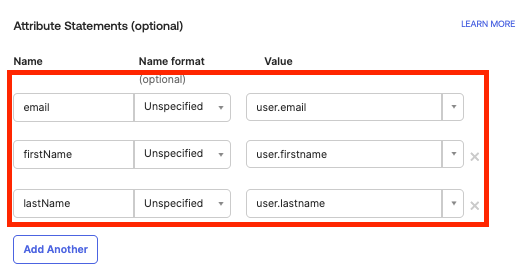

# SSO (Single Sign-On) 

## Overview

Tobiko Cloud supports single sign-on (SSO) through OpenID and SAML 2.0 providers. 

This makes it easy to provision access to users and simplifies authentication. 


## Setup & Prerequsites 

You must have an active Tobiko Cloud instance with SSO enabled. Please contact your account team to ensure this is enabled. 

If your Tobiko Cloud instance is setup to require SSO, then you won't need to provide a token in your `tcloud.yml` configuration. 

Below is an example of a `tcloud.yml` configuration:
```yaml
projects:
    <Project name>:
        url: <The project URL>
        token: <The access token> # you won't need this anymore
        gateway: <The name of the SQLMesh gateway to use with this project>
        extras: <Optional - Any extras that should be installed with sqlmesh-enterprise>
        pip_executable: <Optional - The path to the pip executable to use. Ex: `uv pip` or `pip3`. Must install packages to the python environment running the tcloud command>
default_project: <The name of a project to use by default>
```

## Identity Providers

Tobiko Cloud currently supports OpenID and SAML 2.0. 

### OpenID

This provider implements [OpenID Connect Core
1.0](https://openid.net/specs/openid-connect-core-1_0.html) in order to allow us
to login with most OAuth2 login providers.

There are two ways to use OpenID Providers. The first is a
if you use a shared provider like Google, Github,
Microsoft, etc. 

#### Google OAuth

To enable Google OAuth, all we need is your domain (ex: `yourname@companyname.com`, `companyname.com` is the domain). From here, we can switch SSO on with Google OAuth. 

The login  flow will look like the following if you access [cloud.tobikodata.com/auth/login](https://cloud.tobikodata.com/auth/login) directly from your browser. If authenticating through CLI see [here](https://sqlmesh.readthedocs.io/en/stable/cloud/features/single_sign_on/#status) for more details. 

<div style="position: relative; padding-bottom: 56.25%; height: 0;"><iframe src="https://www.loom.com/embed/71da13d6fa284daca7ebc0c1f68758fe?sid=85e5f795-f40b-496d-bdf7-098ee6093468" frameborder="0" webkitallowfullscreen mozallowfullscreen allowfullscreen style="position: absolute; top: 0; left: 0; width: 100%; height: 100%;"></iframe></div>

#### Other OAuth Providers 

If you use Okta and other custom OpenID/OAuth2 providers you need to add us
as an Application or Client (terms differ across providers).

You will need the following information to do this:

| Name         | Purpose                                                                                                                              | Value                                                  |
|--------------|--------------------------------------------------------------------------------------------------------------------------------------|--------------------------------------------------------|
| Redirect URI | Where the OAuth provider should redirect users to after a successfull login. Can also be called "Callback URL" or something similar. | `https://cloud.tobikodata.com/auth/handler/<provider>` |
| Logout URL   | Where users can go to log out of our system                                                                                          | `https://cloud.tobikodata.com/auth/logout`             |
| Web Origin   | Which host names our OAuth service uses                                                                                              | `https://cloud.tobikodata.com`                         |

Often only a Redirect URI is required, but some providers like the additional
information as well.

We will need the following information from you once you set us up:

| Name                      | Purpose                                                                                                                                                                                                          | Example                                                                                 |
|---------------------------|------------------------------------------------------------------------------------------------------------------------------------------------------------------------------------------------------------------|-----------------------------------------------------------------------------------------|
| Client ID                 | The random ID we use to communicate with their OAuth service                                                                                                                                                     | `<random string>`                                                                       |
| Client Secret             | The random secret we use to authentication with their OAuth service                                                                                                                                              | `<random string>`                                                                       |
| Open ID Configuration URL | This is the URL we use to gather the rest of their OpenID Configuration. We can often find this on our own and don't need to request it from them, check with the onboarding engineer to make sure we know this. | 

Once we have the above information, we can enable SSO on your account. You will then follow the login flow through your provider such as logging in through Okta. 

### SAML V2.0

This provider uses [python3-saml](https://github.com/SAML-Toolkits/python3-saml)
to support SAML V2.0 authentication.

#### Requirements

If you are using a  SAML provider we need to receive three pieces of
information from you below:

| Name        | Purpose                                            | Example                                                                                                           |
|-------------|----------------------------------------------------|-------------------------------------------------------------------------------------------------------------------|
| Entity ID   | This is the providers Entity ID                    | `https://saml.example.com/entityid`                                                                               |
| SSO URL     | This is the URL to use for SSO                     | `https://mocksaml.com/api/saml/sso`                                                                               |
| Certificate | The certificate of the SAML Provider in PEM format | [PEM Certificates](https://www.ssl.com/guide/pem-der-crt-and-cer-x-509-encodings-and-conversions/#ftoc-heading-1) |

We will provide a similar set of information below:

| Name        | Purpose                               | Example                                                      |
|-------------|---------------------------------------|--------------------------------------------------------------|
| Metadata URL| TThis URL contains all of this information | `https://cloud.tobikodata.com/auth/saml/metadata/<provider>`                               |
| Entity ID   | This is our Entity ID                 | `https://cloud.tobikodata.com`                               |
| SSO URL     | This is our HTTP-Redirect Binding URL | `https://cloud.tobikodata.com/auth/saml/callback/<provider>` |
| Certificate | Our SAML Certificate                  | **TBD**                                                      |

All data except the certificate will change per provider. For example if we had
a provider named `acme`:

- **Metadata URL**: `https://cloud.tobikodata.com/auth/saml/metadata/acme`
- **Entity ID**: `https://cloud.tobikodata.com/auth/saml/metadata/acme`
- **SSO URL**: `https://cloud.tobikodata.com/auth/saml/callback/acme`

### Okta Integration

The following instructions will walk you through configuring Okta as your identity provider. 
Log into your Okta account. Navigate to Application and create a new app. You will want to select SAML 2.0


Next, name your app "Tobiko Cloud". You can add the app logo by downloading the image [here](https://avatars.githubusercontent.com/u/113925670?s=200&v=4). 


#### SAML Configurations and Settings

1. We now need to fill in the SAML Settings. Please enter the following values: 


    - **Single sign-on URL**: `https://cloud.tobikodata.com/auth/saml/callback/acme`   
    - **Audience URI (SP Entity ID)**: `https://cloud.tobikodata.com/auth/saml/metadata/acme`

    

2. Fill in the Attribute Statements section with email, firstName, and lastName: These are required to properly map to your users. 

    

3. Click next and now you are on the last step. Check off the box `Contact app vendor` and hit `Finish`. Now you're all set! 

    

Here is what you will see if you are accessing Tobiko Cloud via Okta. Click on the Tobiko Cloud icon to be redirected to the application. 


## Authentication Workflow

### Status

You can see what the status of your session is with the `status` command: 

``` bash
$ tcloud auth status
```


### Login

Run the `login` command to begin the login process:

``` bash
$ tcloud auth login
```


At this point your system browser should open and allow you to log in. If you are already logged in, this should be a very quick process. It will look like the below:


After you have authenticated, you will be prompted with a success message in your browser and a message telling you that it's safe to close your browser window. Your terminal will then have the following result:

``` bash
Success! ✅

Current Tobiko Cloud SSO session expires in 1439 minutes
```


### Logging Out

In order to delete your session information you can use the log out command:

``` bash
> tcloud auth logout
Logged out of Tobiko Cloud

> tcloud auth status
Not currently authenticated
```


Otherwise, you will be logged out automatically when the SSO session expires (every 24 hours). 

## OAuth Clients

Sometimes, you want to grant an external service access to your Tobiko Cloud project. For example, the external service could be the [CICD bot](../../integrations/github.md) or a [scheduler integration](./scheduler/airflow.md).

These services take `Client ID` and `Client Secret` credentials.

!!! Info "One set of credentials per service"
    It's best practice to provision a separate set of credentials for each service that you wish to connect to Tobiko Cloud. This gives you the flexibility to revoke credentials for a specific service without affecting access for other services.

### Provisioning client credentials

To provision OAuth credentials for a new service, browse to `Settings -> OAuth Clients` in the lefthand navigation menu.

In the page's Create new Client section, enter a client name and human readable description:


Once you click `Save`, the client will be added to the list:


To fetch the Client ID or Client Secret, click `Copy ID` or `Copy Secret`. The values will be copied to the system clipboard.

Paste these values into an external service's authentication configuration so it can connect to your Tobiko Cloud project.