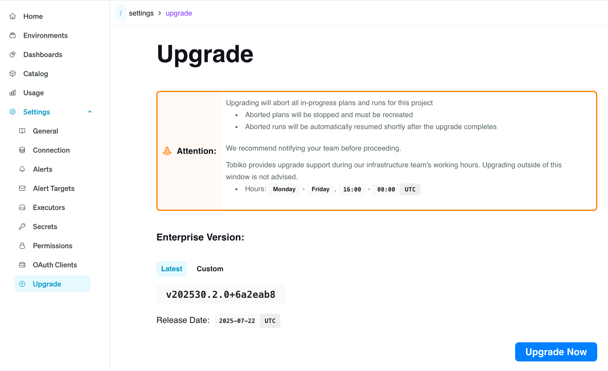

# Upgrading Tobiko Cloud

Tobiko regularly releases new versions of Tobiko Cloud that add features and improve reliability.

This page describes how to upgrade your Tobiko Cloud projects to a newer version.

## Upgrade availability

Navigate to `Settings > Upgrade` in the Tobiko Cloud UI to determine whether a new version of Tobiko Cloud is available for your project.

If your project is already up to date, you will see a grey message:

If a new version is available for your project, the page will include a notification box, version, and blue Upgrade Now button:

## Upgrading a project

On the Upgrade page, you can choose to upgrade to the latest version or specify a custom version.

!!! info "Upgrade Permissions"
    Only users with Tobiko Cloud `Admin` permissions can perform upgrades.

!!! danger "Upgrade Side Effects"
    The upgrade process may take a few minutes to complete. During this time, your Tobiko Cloud project will be unavailable.

    Any in-progress plans and runs will be aborted:

      - Aborted plans will be stopped, and you must **manually** start them again.
      - Aborted runs will be automatically resumed shortly after the upgrade completes.

    To avoid unexpected interruptions, please notify your team before starting the upgrade.

### Latest Version

Click the **Upgrade Now** button and confirm to begin upgrading your project to the latest version.

### Custom Version

We recommend upgrading your Tobiko Cloud project to the latest version, but you may prefer to upgrade to a specific version.

For example, consider a team that has separate staging and production Tobiko Cloud projects. They upgrade the staging project first, run tests, and only upgrade the production project after verifying that staging works as expected.

If a new version of Tobiko Cloud is released during this testing period, the latest available version will not match the version tested in staging. The team can specify a custom Tobiko Cloud version to upgrade production to the specific version that was already tested in staging.

To specify a custom version, select the **Custom** tab on the Upgrade page and enter your desired version in the text box.

Make sure you are entering a valid custom version by:

  - Entering the custom version **without** the leading `v`
  - Confirming that the version is valid and later than the current version of the project

If your custom version is not valid, Tobiko Cloud will display an error message.

After entering the custom version, click the **Upgrade Now** button and confirm to begin the upgrade process.

## Upgrade Progress

Tobiko Cloud will display a progress page while the upgrade is in progress:

Once the upgrade is complete, Tobiko Cloud will automatically redirect you back to your upgraded project.

## Upgrade Support

If you encounter an issue during the upgrade process, please [report an incident](./incident_reporting.md). Our support team will follow up as soon as possible.

For the quickest response, we recommend upgrading Monday through Friday between 9am and 5pm PST.