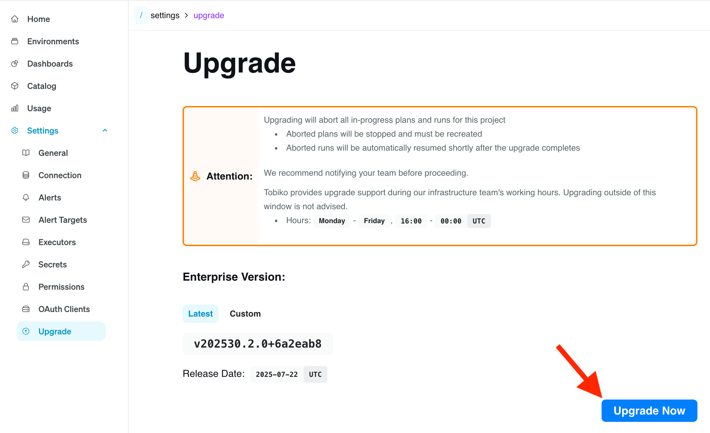
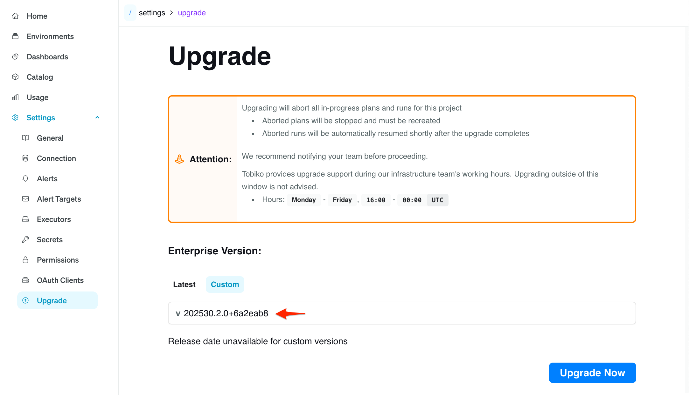
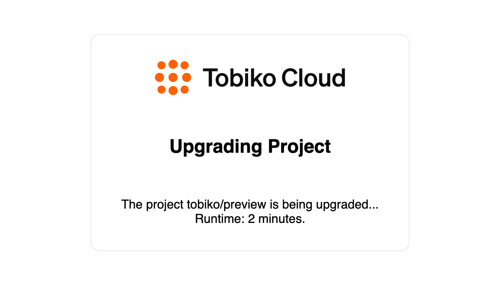
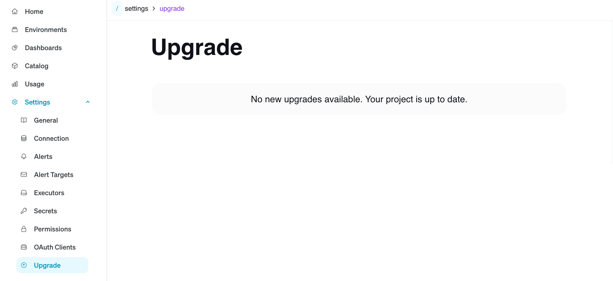

# Upgrades

Upgrading a Tobiko Cloud project can be done by going to `Settings > Upgrade`.
If a new version is available for your project, you'll see an upgrade page like the one below.
You can choose to upgrade to the latest version or specify a custom version.
Clicking the **Upgrade Now** button and confirming will start the upgrade process.

!!! info "Upgrade Permissions"
    Only users with `Admin` permissions can perform upgrades.

!!! warning "Upgrade Preparations"
    The upgrade process can take anywhere from a few minutes to over 30 minutes.
    The total time depends on the size of your project and the complexity of the upgrade.
    During this time, your Tobiko Cloud project will be unavailable. Any in-progress plans and runs will be aborted:

    - Aborted plans will be stopped and must be recreated.
    - Aborted runs will be automatically resumed shortly after the upgrade completes.

    To avoid unexpected interruptions, please notify your team before starting the upgrade.

## Custom Version

Although it is recommended to always upgrade your Tobiko Cloud project to the latest version,
there may be cases where a team needs to upgrade to a specific version.

For example, a team might have separate staging and production projects.
They may upgrade the staging project first, run tests, and only upgrade the production project after verifying that staging works as expected.
If a new version is released during this testing period, the team may want to upgrade production to the same version used in staging.
Custom version selection supports this workflow.

To specify a custom version, select the **Custom** tab on the Upgrade page and enter the desired version in the text box.

!!! info "Valid Custom Version"
    Enter the custom version **without** the leading `v`.
    The version must be valid and greater than the current version of the project.
    If the custom version is not valid, an error message will be displayed.

## Upgrade Progress

After starting the upgrade, a progress page will be shown.
Once the upgrade is complete, you’ll be automatically redirected back to the upgraded Tobiko Cloud project.

## Project Already Up-to-Date

If the project is already on the latest version, you’ll see a message like the one below.

## Upgrade Support

If you encounter an issue during the upgrade process, please [report an incident](./incident_reporting.md).
Our support team will follow up as soon as possible.
For the quickest response, we recommend upgrading Monday through Friday between 9 AM and 5 PM PST.
