# Dashboards

Tobiko Cloud automatically captures and stores [built-in measures](measures.md#built-in-measures) of SQLMesh actions like `plan` and `run`. These measures are displayed in built-in charts and tables in the relevant interface.

Tobiko Cloud also allows you to define [custom measures](./measures.md#custom-measures) for models. Custom measures let you record and store any aspect of a model that can be represented by a SQL query.

Tobiko Cloud displays your custom measures in dashboards, which are easy to create and modify with our graphical dashboard building tools.

## Dashboards page

Dashboards are displayed on a standalone Dashboards page in Tobiko Cloud.

Navigate to the Dashboards page by clicking the `Dashboards` link on the left-side navigation menu:

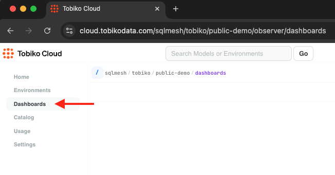{ loading=lazy }

The Dashboards page is empty until we add a new dashboard.

## Creating a dashboard

Begin a new dashboard by clicking the `New Dashboard` button in the top right of the Dashboards page:

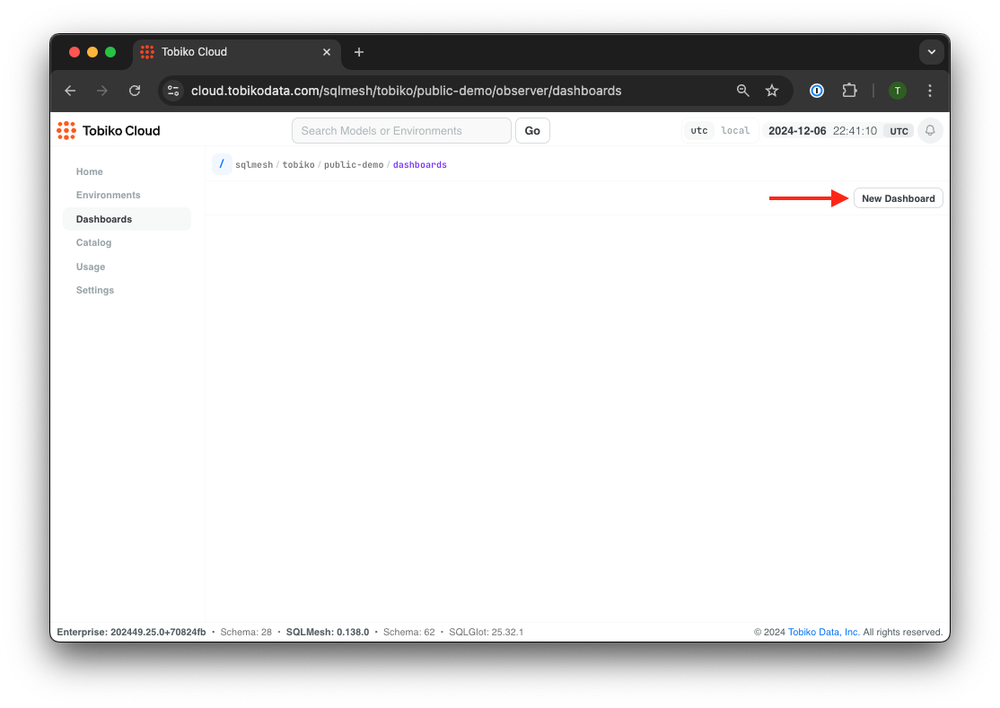{ loading=lazy }

The dashboard builder interface will open with an empty dashboard.

The interface has two sections: the right section contains the fields and buttons you use to configure a dashboard element, and the left section previews the dashboard element as you build it:

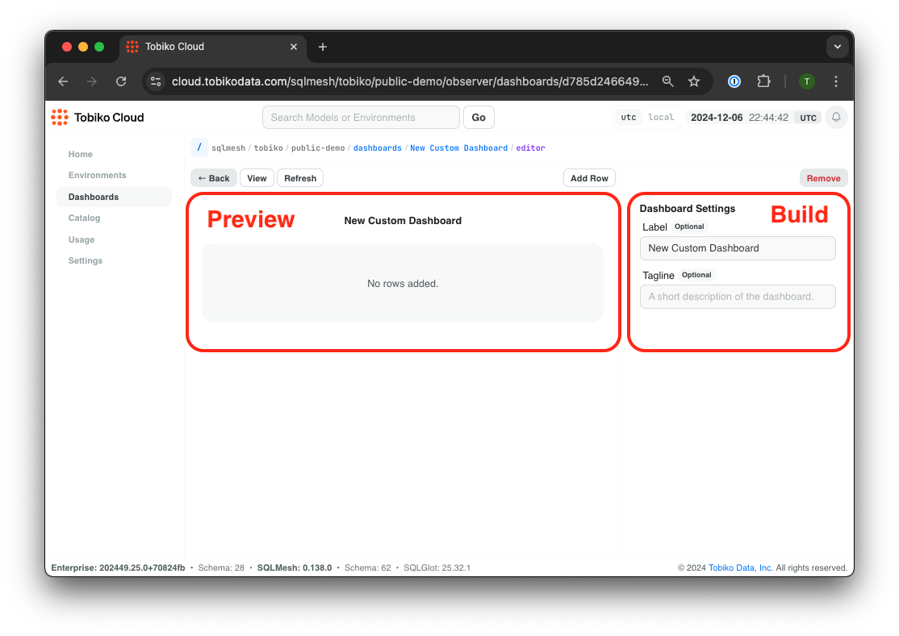{ loading=lazy }

We begin building a new dashboard by adding a label - let's call this one "My Demo Dashboard."

The dashboard preview updates in real time as we make changes, and in this interface Tobiko Cloud will autosave those changes. A temporary green `Saved` indicator will appear above the right section after an autosave occurs:

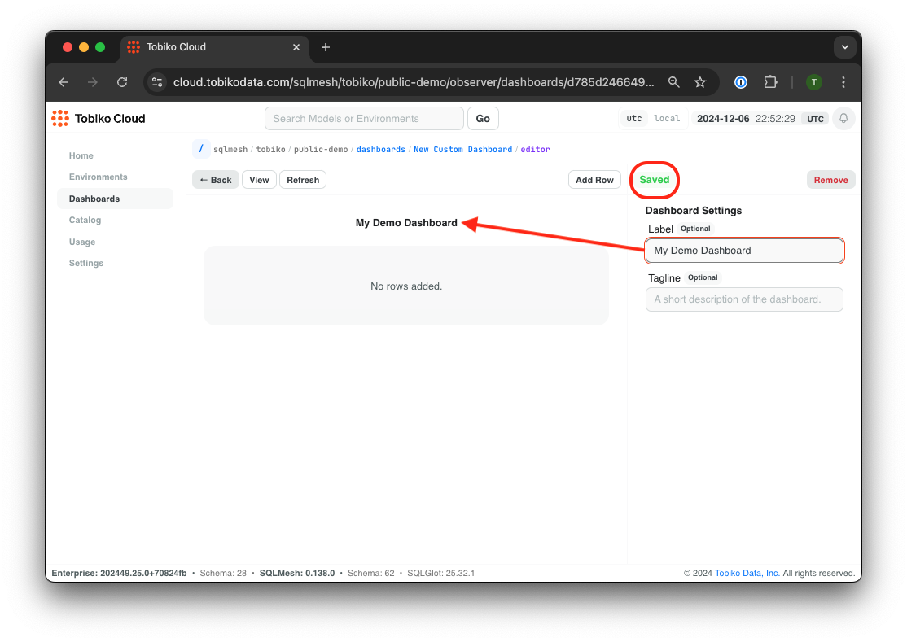{ loading=lazy }

### Rows and widgets

The dashboard's visual layout is defined by **rows**. Each row may contain between one and three widgets that display information.

Add a row by clicking the `Add Row` button above the right section of the page. Choose the number of widgets the row should display in the dropdown menu:

{ loading=lazy }

After clicking the top dropdown entry to create a row with one widget, a new `Chart` widget appears:

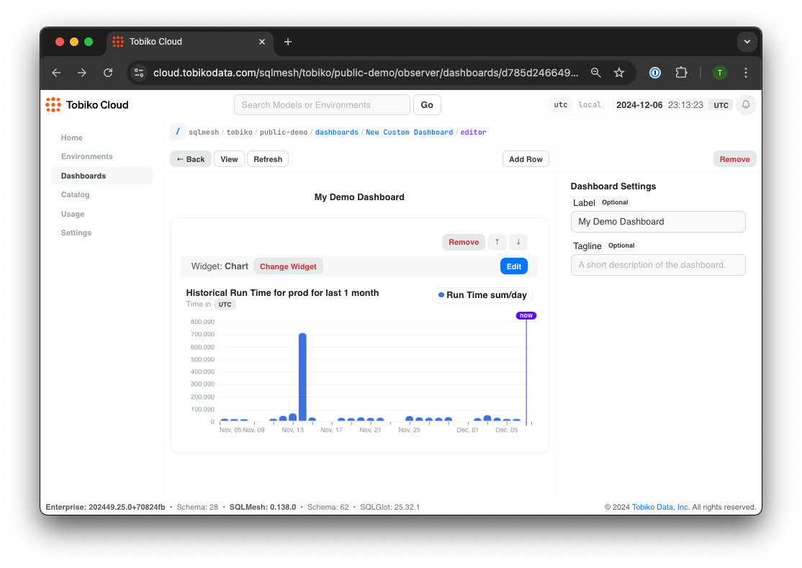{ loading=lazy }

Tobiko Cloud support two widget types: `Chart` and `Table`. Use the `Change Widget` button to switch to the other widget type:

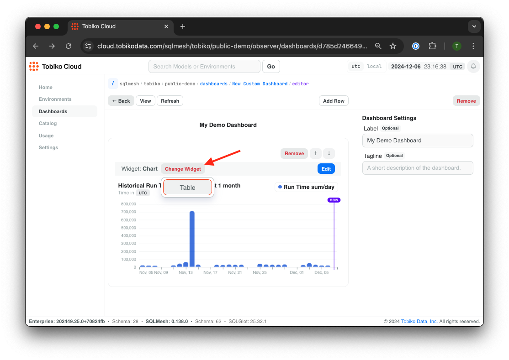{ loading=lazy }

We will keep the default `Chart` widget in this example. To modify the widget, click the blue `Edit` button in the widget's top right:

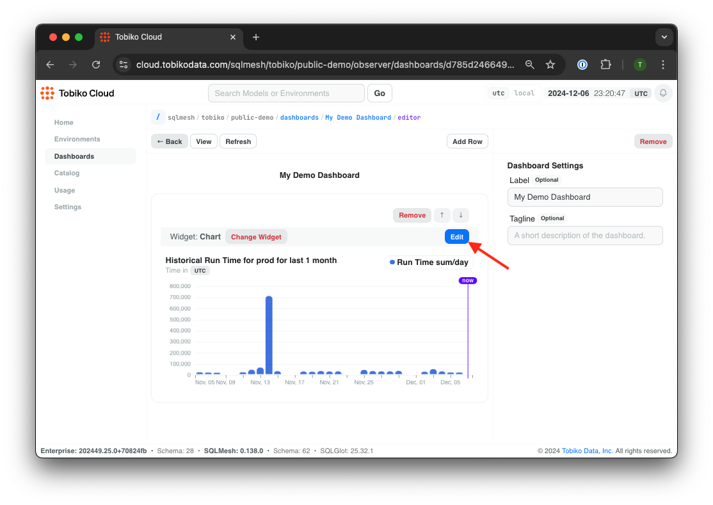{ loading=lazy }

The widget editing interface now opens in the right section, where you can configure the chart's input data, type (bar/line), and style:

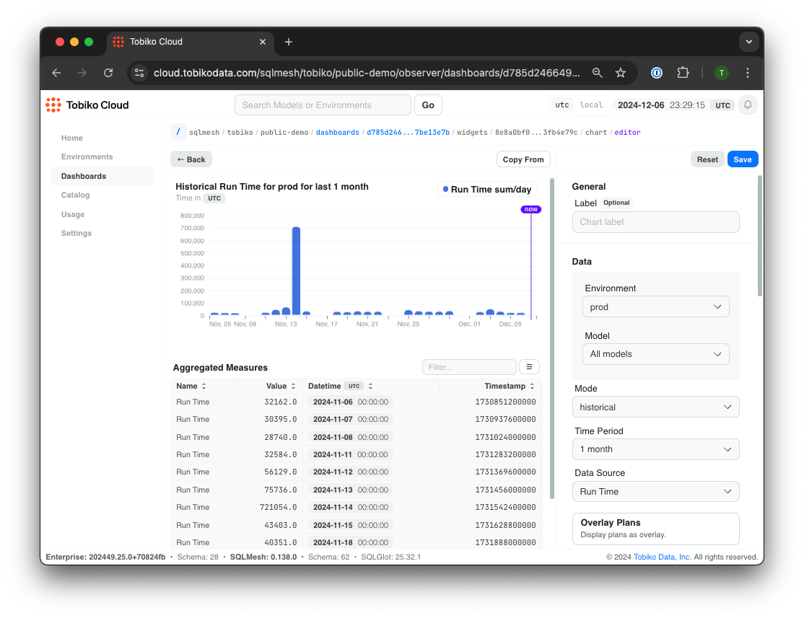{ loading=lazy }

## TODO: keep any of this? Charts

Tobiko Cloud presents historical information via charts and tables. Most charts represent time on the x-axis and share the same appearance and user options.

In a chart's top left corner is the `Time` selector, which sets the range of the x-axis. For example, the first chart displays 1 week of data, from November 27 through December 4. The second chart displays the same data but includes 3 months of historical data beginning on September 4:

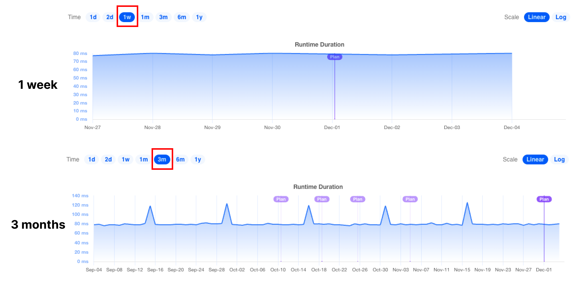{ loading=lazy }

In a chart's top right corner is the `Scale` selector, which toggles between a linear and log y-axis scale. A log scale may be helpful for comparing highly variable data series over time. This example displays the data from the second chart in the previous figure with a log y-axis scale:

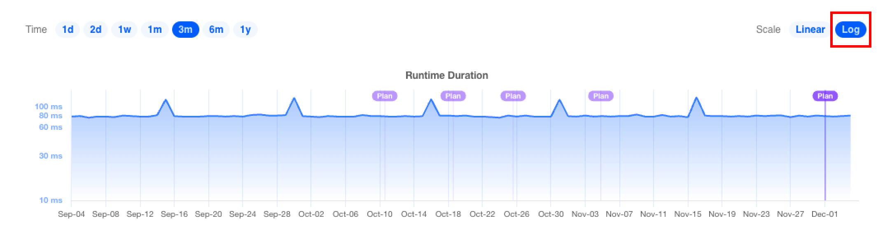{ loading=lazy }

Charts also display the data underlying a specific data point when the mouse hovers over it:

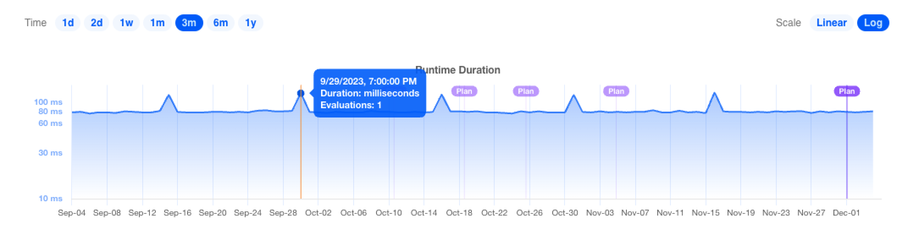{ loading=lazy }

Many charts display purple `Plan` markers, which provide contextual information about when changes to the project occurred. Clicking on the marker will open a page containing [more information about the plan](#plan-applications).

Some Tobiko Cloud tables include a button that toggles a chart of the measures in the table:

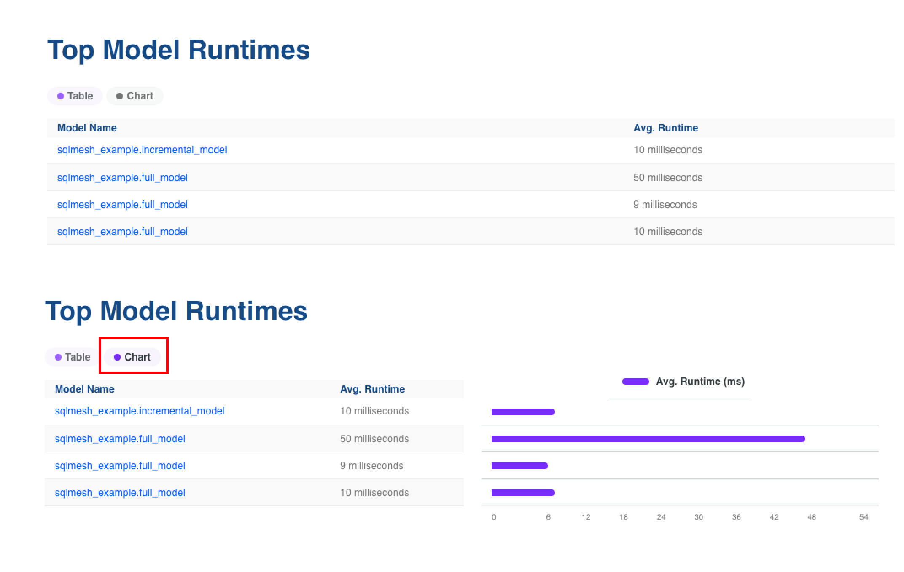{ loading=lazy }
