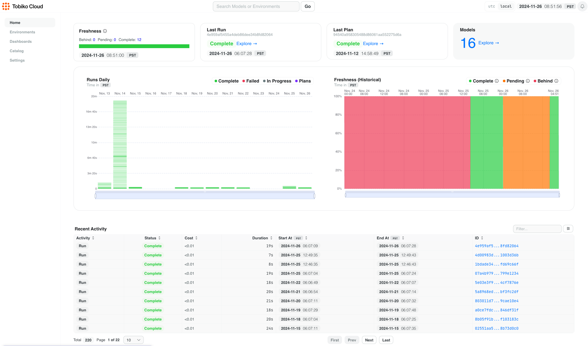
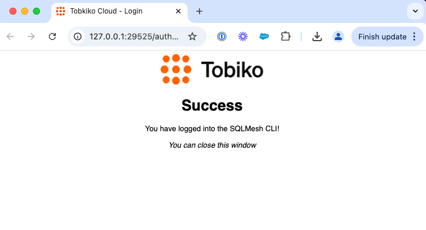
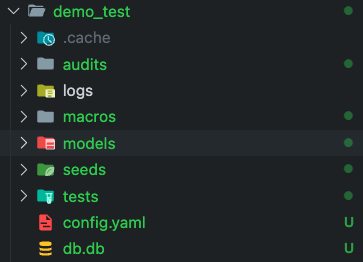

# Tobiko Cloud: Getting Started

Tobiko Cloud is a data platform that extends SQLMesh to make it easy to manage data at scale without the waste.

We're here to make it easy to get started and feel confident that everything is working as expected. After you've completed the steps below, you'll have achieved the following:

- Log in to Tobiko Cloud via the browser
- Connect Tobiko Cloud to your local machine via the CLI
- Connect Tobiko Cloud to your data warehouse
- Verify that Tobiko Cloud interacts with your data warehouse as expected

## Prerequisites

Before you start, the Tobiko team must complete a few steps.

Your Tobiko Solutions Architect will:

- Set up a 1 hour meeting with you to fully onboard
- Request that a new Tobiko Cloud account be created for you (single tenant by default)
- Share a temporary password link that expires in 7 days
- Make sure you save the password in your own password manager

To prepare for the meeting, ensure you or another attendee have data warehouse administrator rights to:

- Update warehouse user and object permissions
- Create new users and grant them create/update/delete permissions on a specific database (ex: `database.schema.table`)

For migrations from SQLMesh (open source) to Tobiko Cloud only:

- Your Tobiko Solutions Architect will send you a script to extract your current state
- You send that state to the Tobiko Cloud engineers to validate before the migration occurs
- After validation, Tobiko Solutions Architect will schedule a migration date and meeting to move your state to Tobiko Cloud. There will be some downtime if you are running SQLMesh in a production environment.

> Note: if you must be on VPN to access your data warehouse or have specific security requirements, please let us know and we can discuss options to ensure Tobiko Cloud can securely connect.

Technical Requirements:

- Tobiko Cloud requires Python version between 3.9 and 3.12

!!! note
    If you don't have a supported Python version installed, you can use [uv](https://docs.astral.sh/uv/getting-started/installation/#installation-methods) to install it.
    At the time of writing, these are the suggested commands to install uv and Python:

    === "macOS and Linux"
   
        ```bash
        curl -LsSf https://astral.sh/uv/install.sh | sh
        ```
   
    === "Windows"
   
        ```powershell
        powershell -ExecutionPolicy ByPass -c "irm https://astral.sh/uv/install.ps1 | iex"
        ```
    
    ```bash
    uv python install 3.12
    ```


## Log in to Tobiko Cloud

The first step to setting up Tobiko Cloud is logging in to the web interface:

1. We will authenticate into your Tobiko Cloud instance. If it is your first time going through this flow, your Solutions Architect will    guide you on [how to get SSO configured](https://sqlmesh.readthedocs.io/en/stable/cloud/features/single_sign_on/). Open the url below.
    ```bash
    https://cloud.tobikodata.com/auth/login
    ```
2. Once logged in, you should see the home page. If you are not redirected, then input your Tobiko Cloud URL in the browser (ex: 
https://cloud.tobikodata.com/sqlmesh/tobiko/public-demo/observer/)  

    Your view should be empty, but the figure below shows a populated example with Tobiko Cloud running in production:

<br></br>


## Install the `tcloud` CLI

Now we need to configure the `tcloud` command line interface tool.

First, open a terminal within your terminal/IDE (ex: VSCode). Then follow the following steps to install the `tcloud` CLI:

1. Create a new project directory, or an existing SQLMesh project, and navigate into it:

    ```bash
    mkdir tcloud_project
    cd tcloud_project
    ```

2. Create a new file called `requirements.txt` and add `tcloud` to it:

    ```bash
    echo 'tcloud' > requirements.txt
    ```

    > Pypi source: [tcloud](https://pypi.org/project/tcloud/)

    > Note: your Tobiko Solutions Architect will provide you a pinned version of `tcloud`

3. Create a Python virtual environment in the project directory and install `tcloud`. The following demonstrates how to do this using [uv](https://docs.astral.sh/uv/pip/environments/#creating-a-virtual-environment) ([installation instructions](#prerequisites)):

    ```bash linenums="1"
    uv venv --python 3.12 --seed  # create a virtual environment inside the project directory
    source .venv/bin/activate # activate the virtual environment
    uv pip install -r requirements.txt # install the tcloud CLI
    which tcloud # verify the tcloud CLI is installed in the venv in the path above
    ```

!!! note
    You may need to run `python3` or `pip3` instead of `python` or `pip`, depending on your python installation.

    If you do not see `tcloud` in the virtual environment path above, you may need to reactivate the venv:

    ```bash
    source .venv/bin/activate
    which tcloud
    # expected path: /Users/person/Desktop/git_repos/tobiko-cloud-demo/.venv/bin/tcloud
    ```

- Create an alias to ensure use of `tcloud`:

    We recommend using a command line alias to ensure all `sqlmesh` commands run on Tobiko Cloud.

    Set the alias in the terminal by running `alias sqlmesh='tcloud sqlmesh'` in every session.

    Or add this to your shell profile file (ex: `~/.zshrc` or `~/.bashrc`) so you don't have to run the command every time:

    ```bash
    alias sqlmesh='tcloud sqlmesh'
    ```

    Note: the rest of the commands in this document will NOT use the alias to avoid confusion with the open source SQLMesh CLI.

## Connect Tobiko Cloud to Data Warehouse

Now we're ready to connect your data warehouse to Tobiko Cloud:

1. Create a new file called `tcloud.yaml` and add the project configuration below, substituting the appropriate values for your project:

    ```yaml
    projects:
      public-demo: # TODO: update this for the project name in the URL
        url: https://cloud.tobikodata.com/sqlmesh/tobiko/public-demo/ # TODO: update for your unique URL
        gateway: tobiko_cloud
        extras: bigquery,web,github  # TODO: update bigquery for your data warehouse
        pip_executable: uv pip
    default_project: public-demo # TODO: update this for the project name in the URL
    ```

2. If you are going through the SSO flow then, run the following command:
    ``` bash
    tcloud auth login
    ``` 
    This will fire off the SSO flow and open a link in your browser to authenticate. 

    Once authenticated, you will see the following screen. 

    

3. Initialize a new SQLMesh project:

    ```bash
    tcloud sqlmesh init <your data warehouse>
    ```

4. Update your project's `config.yaml` with your data warehouse connection information:

    Your new SQLMesh project will contain a configuration file named `config.yaml` that includes a DuckDB connection.

    Replace the DuckDB connection information with your data warehouse's information.

    This example shows a Bigquery warehouse connection; see more examples [here](../integrations/overview.md).

    ```yaml linenums="1"
    gateways:
      tobiko_cloud: # this will use the config in tcloud.yaml for state_connection
        scheduler: # TODO: add the connection in the Tobiko Cloud Connections Page with the credentials for your data warehouse
          type: cloud

    default_gateway: tobiko_cloud

    model_defaults:
      dialect: bigquery # TODO: update for your data warehouse
      start: 2024-08-19 # TODO: I recommend updating this to an earlier date representing the historical data you want to backfill

    # make Tobiko Cloud only allow deploying to dev environments, use env var to override in CI/CD
    # allow_prod_deploy: {{ env_var('ALLOW_PROD_DEPLOY', 'false') }}

    # enables synchronized deployments to prod when a pull request gets a `/deploy` command or is approved by a required approver
    cicd_bot:
      type: github
      merge_method: squash
      skip_pr_backfill: false
      enable_deploy_command: true
      auto_categorize_changes:
        external: full
        python: full
        sql: full
        seed: full

    # preview data for forward only models
    plan:
      enable_preview: true

    # list of users that are allowed to approve PRs for synchronized deployments
    users:
      - username: sung_tcloud_demo
        github_username: sungchun12
        roles:
          - required_approver
    ```

5. Create a `tcloud` user in the warehouse

    During your onboarding call, we will walk through instructions live to create a new `tcloud` data warehouse user with the necessary permissions.

    SQLMesh will run as this user to create, update, and delete tables in your data warehouse. You can scope the user permissions to a specific database if needed.

    Find additional data warehouse specific instructions here: [Data Warehouse Integrations](../integrations/overview.md).


6. Verify the connection between Tobiko Cloud and data warehouse:

    Now we're ready to verify that the connection between Tobiko Cloud and the data warehouse is working properly.

    Run the `info` command from your terminal:

    ```bash
    tcloud sqlmesh info
    ```

    It will return output similar to this:

    ```bash
    (.venv) ➜  tcloud_project git:(main) ✗ tcloud sqlmesh info
    Models: 3
    Macros: 0
    Data warehouse connection succeeded
    State backend connection succeeded
    ```

## Verify SQLMesh functionality

Let's run a `plan` to verify that SQLMesh is working correctly.

Run `tcloud sqlmesh plan` in your terminal and enter `y` at the prompt to apply the changes.

```bash
tcloud sqlmesh plan
```

It will return output similar to this:

```bash
(.venv) ➜  tcloud_project git:(main) ✗ tcloud sqlmesh plan
======================================================================
Successfully Ran 1 tests against duckdb
----------------------------------------------------------------------
New environment `prod` will be created from `prod`
Summary of differences against `prod`:
Models:
└── Added:
    ├── sqlmesh_example.full_model
    ├── sqlmesh_example.incremental_model
    └── sqlmesh_example.seed_model
Models needing backfill (missing dates):
├── sqlmesh_example.full_model: 2024-11-24 - 2024-11-24
├── sqlmesh_example.incremental_model: 2020-01-01 - 2024-11-24
└── sqlmesh_example.seed_model: 2024-11-24 - 2024-11-24
Apply - Backfill Tables [y/n]: y

[1/1] sqlmesh_example.seed_model evaluated in 0.00s
[1/1] sqlmesh_example.incremental_model evaluated in 0.01s
[1/1] sqlmesh_example.full_model evaluated in 0.01s
Evaluating models ━━━━━━━━━━━━━━━━━━━━━━━━━━━━━━━━━━━━━━━━ 100.0% • 3/3 • 0:00:00


All model batches have been executed successfully

Virtually Updating 'prod' ━━━━━━━━━━━━━━━━━━━━━━━━━━━━━━━━━━━━━━━━ 100.0% • 0:00:00

The target environment has been updated successfully
```

Tobiko Cloud and SQLMesh are working!

## Next steps

Your `tcloud` project directory should look and feel like this:



From here, if you have an existing SQLMesh project, you can copy over your existing models and macros to the `models` and `macros` directories (along with other files as needed).

You are now fully onboarded with Tobiko Cloud. We recommend reviewing the helpful links below to get familiar with SQLMesh and Tobiko Cloud.

Here's to data transformation without the waste!

### Helpful Links
- [Walkthrough Example](../examples/incremental_time_full_walkthrough.md)
- [Quickstart](../quick_start.md)
- [Project Guide and getting setup](../guides/projects.md)
- [Models Guide](../guides/models.md)
- [GitHub Actions CI/CD bot](../integrations/github.md)
- [Testing Models](../concepts/tests.md)
- [SQLMesh Macros](../concepts/macros/sqlmesh_macros.md)