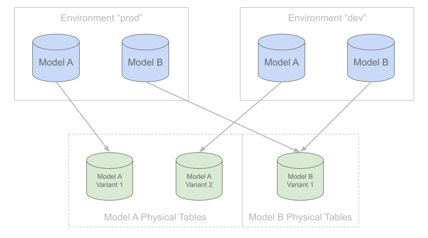

# Plans

A plan is a set of changes that summarizes the difference between the local state of a project and the state of a target [environment](environments.md). In order for any model changes to take effect in a target environment, a plan needs to be created and applied.

During plan creation:

* The local state of the SQLMesh project is compared to the state of a target environment. The difference between the two and the actions needed to synchronize the environment with the local state are what constitutes a plan.
* Users may be prompted to [categorize changes](#change-categories) to existing models so SQLMesh can determine what actions to take for indirectly affected models (the downstream models that depend on the updated models). By default, SQLMesh attempts to categorize changes automatically, but this behavior can be changed through [configuration](../reference/configuration.md#auto_categorize_changes).
* Each plan requires a date range to which it will be applied. If not specified, the date range is derived automatically based on model definitions and the target environment.

The benefit of plans is that all changes can be reviewed and verified before they are applied to the data warehouse and any computations are performed. A typical plan contains a combination of the following:

* A list of added models
* A list of removed models
* A list of directly modified models and a text diff of changes that have been made
* A list of indirectly modified models
* Missing data intervals for affected models
* A date range that will be affected by the plan application

To create a new plan, run the following command:
```bash
sqlmesh plan [environment name]
```

If no environment name is specified, the plan is generated for the `prod` environment.

## Change categories
Categories only need to be provided for models that have been modified directly. The categorization of indirectly modified downstream models is inferred based on the types of changes to the directly modified models.

If more than one upstream dependency of an indirectly modified model has been modified and they have conflicting categories, the most conservative category (breaking) is assigned to this model.

### Breaking change
If a directly modified model change is categorized as breaking, it and its downstream dependencies will be backfilled.

In general, this is the safest option because it guarantees all downstream dependencies will reflect the change. However, it is a more expensive option because it involves additional data reprocessing, which has a runtime cost associated with it (refer to [backfilling](#backfilling)).

Choose this option when a change has been made to a model's logic that has a functional impact on its downstream dependencies. For example, adding or modifying a model's `WHERE` clause is a breaking change because downstream models contain rows that would now be filtered out.

### Non-breaking change
A directly-modified model that is classified as non-breaking will be backfilled, but its downstream dependencies will not.

This is a common choice in scenarios such as an addition of a new column, an action which doesn't affect downstream models, as new columns can't be used by downstream models without modifying them directly to select the column. If any downstream models contain a `select *` from the model, SQLMesh attempts to infer breaking status on a best-effort basis. We recommend explicitly specifying a query's columns to avoid unnecessary recomputation.

### Forward-only change
A modified (either directly or indirectly) model that is categorized as forward-only will continue to use the existing physical table once the change is deployed to production (the `prod` environment). This means that no backfill will take place.

While iterating on forward-only changes in the development environment, the model's output will be stored in either a temporary table or a shallow clone of the production table if supported by the engine. In either case the data produced this way in the development environment can only be used for preview and will **not** be reused once the change is deployed to production. See [Forward-only Plans](#forward-only-plans) for more details.

This category is assigned by SQLMesh automatically either when a user opts into using a [forward-only plan](#forward-only-plans) or when a model is explicitly configured to be forward-only.

### Summary

| Change Category                      | Change Type                                                                                | Behaviour                                          |
|--------------------------------------|--------------------------------------------------------------------------------------------|----------------------------------------------------|
| [Breaking](#breaking-change)         | [Direct](glossary.md#direct-modification) or [Indirect](glossary.md#indirect-modification) | [Backfill](glossary.md#backfill)                   |
| [Non-breaking](#non-breaking-change) | [Direct](glossary.md#direct-modification)                                                  | [Backfill](glossary.md#backfill)                   |
| [Non-breaking](#non-breaking-change) | [Indirect](glossary.md#indirect-modification)                                              | [No Backfill](glossary.md#backfill)                |
| [Forward-only](#forward-only-change) | [Direct](glossary.md#direct-modification) or [Indirect](glossary.md#indirect-modification) | [No Backfill](glossary.md#backfill), schema change |

## Plan application
Once a plan has been created and reviewed, it is then applied to the target [environment](environments.md) in order for its changes to take effect.

Every time a model is changed as part of a plan, a new variant of this model gets created behind the scenes (a [snapshot](architecture/snapshots.md) with a unique [fingerprint](architecture/snapshots.md#fingerprints) is assigned to it). In turn, each model variant's data is stored in a separate physical table. Data between different variants of the same model is never shared, except for [forward-only](#forward-only-plans) plans.

When a plan is applied to an environment, the environment gets associated with the set of model variants that are part of that plan. In other words, each environment is a collection of references to model variants and the physical tables associated with them.



*Each model variant gets its own physical table while environments only contain references to these tables.*

This unique approach to understanding and applying changes is what enables SQLMesh's Virtual Environments. This technology allows SQLMesh to ensure complete isolation between environments while allowing it to share physical data assets between environments when appropriate and safe to do so. Additionally, since each model change is captured in a separate physical table, reverting to a previous version becomes a simple and quick operation (refer to [Virtual Update](#virtual-update)) as long as its physical table hasn't been garbage collected by the janitor process. SQLMesh makes it easy to be correct and really hard to accidentally and irreversibly break things.

### Backfilling
Despite all the benefits, the approach described above is not without trade-offs. When a new model version is just created, a physical table assigned to it is empty. Therefore, SQLMesh needs to re-apply the logic of the new model version to the entire date range of this model in order to populate the new version's physical table. This process is called backfilling.

At the moment, we are using the term backfilling broadly to describe any situation in which a model is updated. That includes these operations:

* When a VIEW model is created
* When a FULL model is built
* When an INCREMENTAL model is built for the first time
* When an INCREMENTAL model has recent data appended to it
* When an INCREMENTAL model has older data inserted (i.e., resolving a data gap or prepending historical data)

We will be iterating on terminology to better capture the nuances of each type in future versions.

Note for incremental models: despite the fact that backfilling can happen incrementally (see `batch_size` parameter on models), there is an extra cost associated with this operation due to additional runtime involved. If the runtime cost is a concern, a [forward-only plan](#forward-only-plans) can be used instead.

#### Data preview
As mentioned earlier, the data output produced by [forward-only changes](#forward-only-change) in the development environment can only be used for preview and will not be reused upon deployment to production.

The same holds true for any subsequent changes that depend on undeployed forward-only changes - data can be previewed but can't be reused in production.

Backfills that are exclusively for preview purposes and will not be reused upon deployment to production are explicitly labeled as such in the plan summary:
```bash
Models needing backfill (missing dates):
├── sushi__dev.customers: 2023-12-22 - 2023-12-28 (preview)
├── sushi__dev.waiter_revenue_by_day: 2023-12-22 - 2023-12-28
├── sushi__dev.top_waiters: 2023-12-22 - 2023-12-28
└── sushi__dev.waiter_as_customer_by_day: 2023-12-22 - 2023-12-28 (preview)
```

### Virtual Update
Another benefit of the SQLMesh approach is that data for a new model version can be fully pre-built while still in a development environment. That way all changes and their downstream dependencies can be fully previewed before they are promoted to the production environment.

With this approach, the process of promoting a change to production is reduced to reference swapping. If during plan creation no data gaps have been detected and only references to new model versions need to be updated, then the update is referred to as a Virtual Update. Virtual Updates impose no additional runtime overhead or cost.

## Forward-only plans
Sometimes the runtime cost associated with rebuilding an entire physical table is too high and outweighs the benefits a separate table provides. This is when a forward-only plan comes in handy.

When a forward-only plan is applied to the `prod` environment, none of the plan's changed models will have new physical tables created for them. Instead, physical tables from previous model versions are reused. The benefit of this is that no backfilling is required, so there is no runtime overhead or cost. The drawback is that reverting to a previous version is no longer simple and requires a combination of additional forward-only changes and [restatements](#restatement-plans).

Note that once a forward-only change is applied to `prod`, all development environments that referred to the previous versions of the updated models will be impacted.

A core component of the development process is to execute code and verify its behavior. To enable this while preserving isolation between environments, `sqlmesh plan [environment name]` evaluates code in non-`prod` environments while targeting shallow (a.k.a. "zero-copy") clones of production tables for engines that support them or newly created temporary physical tables for engines that don't. This means that only a limited preview of changes is available in the development environment before the change is promoted to `prod`. The date range of the preview is provided as part of plan creation command.

Engines for which table cloning is supported include:

* `BigQuery`
* `Databricks`
* `Snowflake`

Note that all changes made as part of a forward-only plan automatically get a **forward-only** category assigned to them. These types of changes can't be mixed together with [breaking and non-breaking changes](#change-categories) within the same plan.

To create a forward-only plan, add the `--forward-only` option to the `plan` command:
```bash
sqlmesh plan [environment name] --forward-only
```

**Note:** The `--forward-only` flag is not required when applying changes to models that have been explicitly configured as [forward-only](models/overview.md#forward_only). Use it only if you need to provide a time range for the preview window or the [effective date](#effective-date).

### Destructive changes

Some model changes destroy existing data in a table. SQLMesh automatically detects and optionally prevents destructive changes to [forward-only models](../guides/incremental_time.md#forward-only-models) - learn more [here](../guides/incremental_time.md#destructive-changes).

Forward-only plans treats all of the plan's model changes as forward-only. In these plans, SQLMesh will check all modified incremental models for destructive schema changes, not just forward-only models.

SQLMesh determines what to do for each model based on this setting hierarchy: the [model's `on_destructive_change` value](../guides/incremental_time.md#destructive-changes) (if present), the `on_destructive_change` [model defaults](../reference/model_configuration.md#model-defaults) value (if present), and the SQLMesh global default of `error`.

If you want to temporarily allow destructive changes to models that don't allow them, use the `plan` command's `--allow-destructive-change` selector to specify which models. Learn more about model selectors [here](../guides/model_selection.md).

### Effective date
Changes that are part of the forward-only plan can also be applied retroactively to the production environment by specifying the effective date:
```bash
sqlmesh plan --forward-only --effective-from 2023-01-01
```
This way SQLMesh will know to recompute data intervals starting from the specified date once forward-only changes are deployed to production.

## Restatement plans
There are cases when models need to be re-evaluated for a given time range, even though changes may not have been made to those model definitions. This could be due to an upstream issue with a dataset defined outside the SQLMesh platform, or when a [forward-only plan](#forward-only-plans) change needs to be applied retroactively to a bounded interval of historical data.

For this reason, the `plan` command supports the `--restate-model`, which allows users to specify one or more names of a model or model tag (using `tag:<tag name>` syntax) to be reprocessed. These can also refer to an external table defined outside SQLMesh.

Application of a plan will trigger a cascading backfill for all specified models (other than external tables), as well as all models downstream from them. The plan's date range determines the data intervals that will be affected.

Please note that models of kinds [INCREMENTAL_BY_UNIQUE_KEY](models/model_kinds.md#INCREMENTAL_BY_UNIQUE_KEY), [SCD_TYPE_2_BY_TIME](models/model_kinds.md#scd-type-2), and [SCD_TYPE_2_BY_COLUMN](models/model_kinds.md#scd-type-2) cannot be partially restated. Therefore, such models will be fully refreshed regardless of the start/end dates provided by a user in the plan.

To prevent models from ever being restated, set the [disable_restatement](models/overview.md#disable_restatement) attribute to `true`.

See examples below for how to restate both based on model names and model tags.


=== "Names Only"

    ```bash
    sqlmesh plan --restate-model "db.model_a" --restate-model "tag:expensive"
    ```

=== "Upstream"

    ```bash
    # All selected models (including upstream models) will also include their downstream models
    sqlmesh plan --restate-model "+db.model_a" --restate-model "tag:+expensive"
    ```

=== "Wildcards"

    ```bash
    sqlmesh plan --restate-model "db*" --restate-model "tag:exp*"
    ```

=== "Upstream + Wildcards"

    ```bash
    sqlmesh plan --restate-model "+db*" --restate-model "tag:+exp*"
    ```
