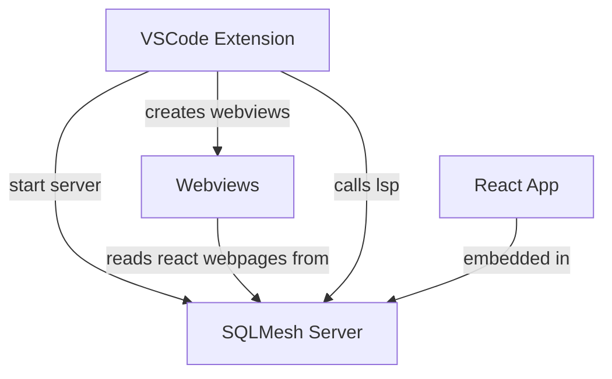

# Contribute to development

SQLMesh is licensed under [Apache 2.0](https://github.com/TobikoData/sqlmesh/blob/main/LICENSE). We encourage community contribution and would love for you to get involved. The following document outlines the process to contribute to SQLMesh.

## Prerequisites

Before you begin, ensure you have the following installed on your machine. Exacltly how to install these is dependent on your operating system.

* Docker
* Docker Compose V2
* OpenJDK >= 11
* Python >= 3.9 < 3.13

## Virtual environment setup

We do recommend using a virtual environment to develop SQLMesh.

```bash
python -m venv .venv
source .venv/bin/activate
```

Once you have activated your virtual environment, you can install the dependencies by running the following command.

```bash
make install-dev
```

Optionally, you can use pre-commit to automatically run linters/formatters:

```bash
make install-pre-commit
```

## Python development

Run linters and formatters:

```bash
make style
```

Run faster tests for quicker local feedback:

```bash
make fast-test
```

Run more comprehensive tests that run on each commit:

```bash
make slow-test
```

Run Airflow tests that will run when PR is merged to main:

```bash
make airflow-docker-test-with-env
```

## Documentation

In order to run the documentation server, you will need to install the dependencies by running the following command.

```bash
make install-doc
```

Once you have installed the dependencies, you can run the documentation server by running the following command.

```bash
make docs-serve
```

Run docs tests:

```bash
make doc-test
```

## UI development

In addition to the Python development, you can also develop the UI.

The UI is built using React and Typescript. To run the UI, you will need to install the dependencies by running the following command.

```bash
npm install 
```

Run ide:

```bash
make ui-up
```

## Developing the VSCode extension

Developing the VSCode extension is most easily done by launching the debug process from a visual studio code workspace.

By default, the VSCode extension will run the SQLMesh server locally and open a new visual studio code window that allows you to try out the SQLMesh IDE. It by default opens the `examples/sushi` project. 

Please see the below diagram for a high level overview of the UI.



For development purposes, the React app is not embedded into the python server. Instead a separate instance of the React app is run. This allows you to make changes to the UI and see them immediately.

This makes the architecture diagram at development time look like the following.

```mermaid
graph TD
    A[VSCode Extension] --> |start server| B[SQLMesh Server]
    A --> |creates webviews| C[Webviews]
    React [React Server] --> |passes on api requests| B
    C --> |reads react webpages from| React
```
