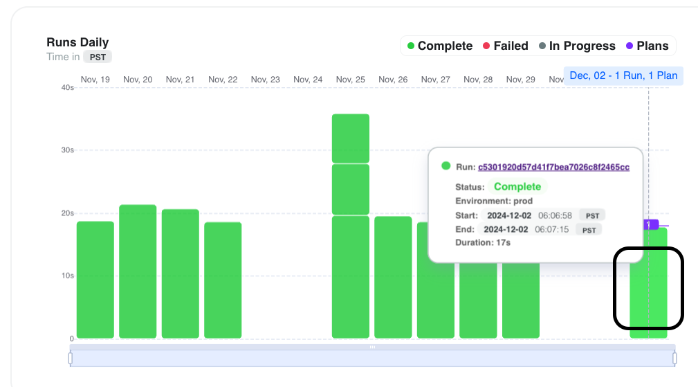
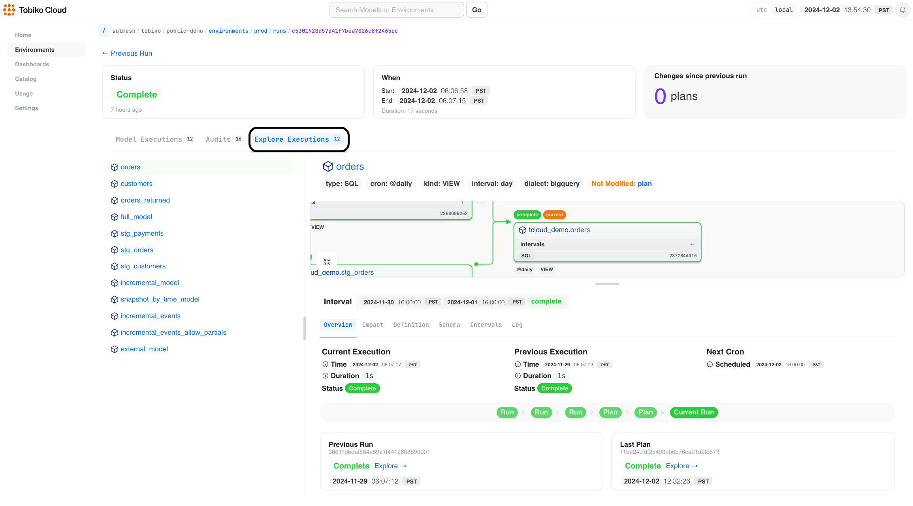
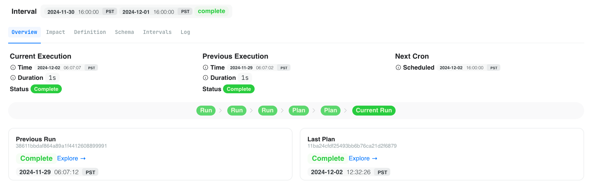
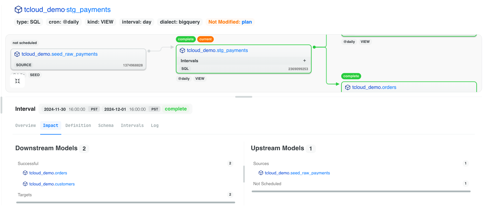
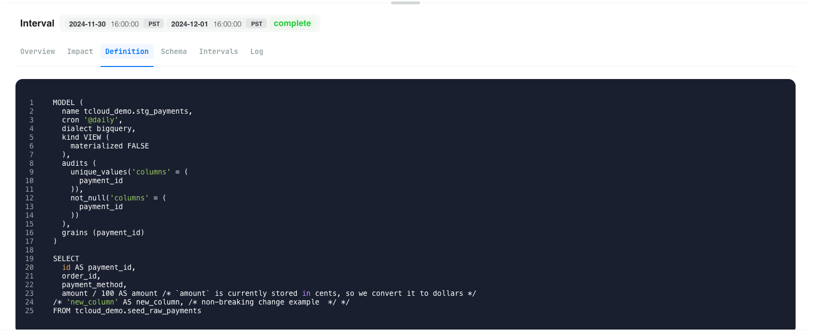
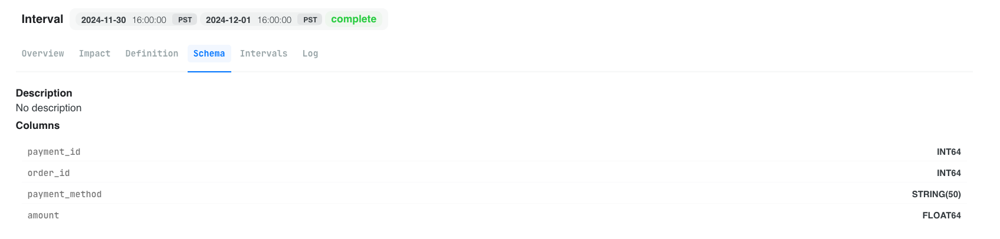
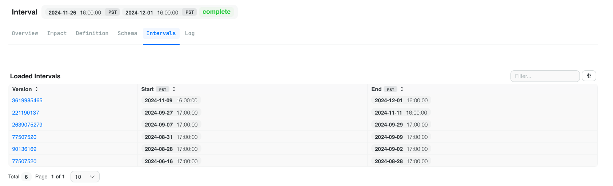
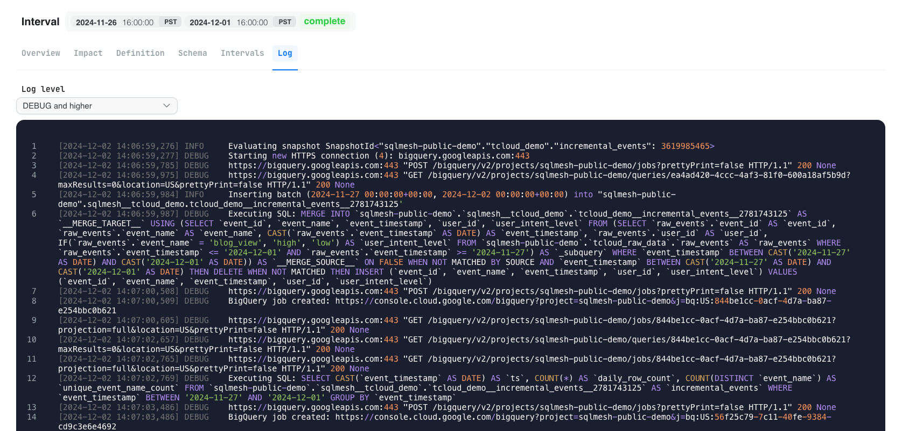

# Debugger View

<iframe src="https://www.loom.com/embed/e8d4f4b3557f47b1a945eee40407f482?sid=49b03511-0415-4715-af04-ac9372247e95" frameborder="0" webkitallowfullscreen mozallowfullscreen allowfullscreen style="position: absolute; top: 0; left: 0; width: 100%; height: 100%;"></iframe>

This view is used to help you debug production run issues with your SQLMesh models in Tobiko Cloud. Fixing data pipelines in production is a stressful, time-consuming process, so we're here to make it easier with a few visuals/clicks.

> Note: the debugger view is only available for models that have been applied via the `tcloud sqlmesh plan` or `tcloud sqlmesh run` commands to your data warehouse.

## How to Use the Debugger View

Step 1: Click on any bar within the run history chart to open the debugger view whether green or red.

Step 2: Click on the "Explore Executions" tab to see specific execution details about the run per model. You'll notice it shows you a focused view of the DAG (think: lineage) with the model that you clicked on.

From here you can explore the execution details of the run per model with focused tabs. 

> Pro tip: you can toggle the timestamps to be in UTC or your local timezone in the upper right.

### Overview

- You'll see a high-level overview of the run including the execution time, duration, status, and the next run scheduled.
- View the past 5 activities of runs and plans to see its historical status. This is useful to get a pulse on how often it succeeds or fails. If you notice it's failing often, this is a good model to start investigating.
- Click on the "Previous Run" tile to explore the details of the previous run. This is useful if you want to compare the previous run to the current one if you notice duration is shorter or longer than expected.
- Click on the "Last Plan" tile to explore the details of the last plan that was applied. This is useful to see if a code change was made in a way to speed up or elongate the duration of the run. Also, it's helpful to verify if the schema changed in a way that might be causing an issue.

### Impact

A list format of all the upstream and downstream models that are impacted by this run. This is useful if lots of models are in the DAG view and you want to see all impact at a glance. 

### Definition

See the exact code that was applied for the run. This is useful if you want to verify if the code changed in a way that might be causing an issue.

### Schema

See the current schema of the model. This is useful to verify if the schema changed in a way that might be causing an issue.

### Intervals

See the specific intervals that were processed in the run. This is useful to verify which exact time ranges succeeded or failed. Also, it's useful to see if interval ranges changed in a way that might be causing an issue such as longer duration.

### Log

All the logs from the run. You can filter for multiple levels of logs: `info`, `warning`, `error`, etc.

