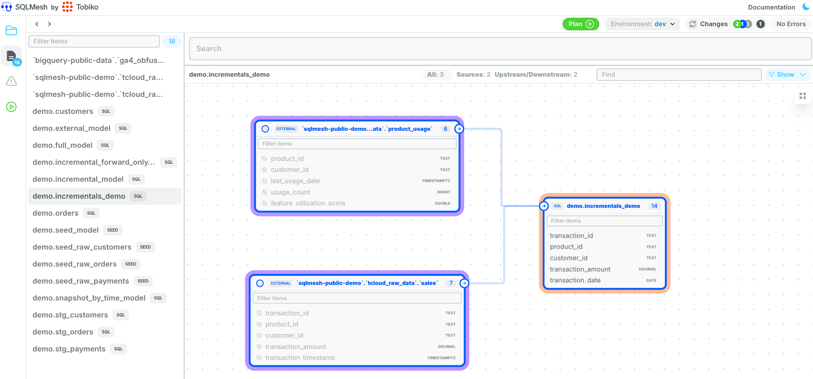
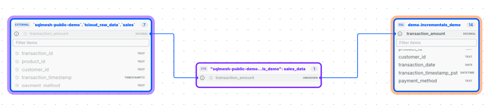

# Incremental by Time Range: Full Walkthrough

SQLMesh incremental models are a powerful feature that come in many flavors and configurations so you can fine tune your query performance and scheduled runs **exactly** how you want with a plethora of guardrails.

However, we recognize with all this power comes a responsibility to make sure you’re equipped to succeed confidently.

We’re going to walk you through a clear story problem step by step. The end outcome is for you to feel confident with this new workflow to:

- Build a mental model for how to solve data transformation problems with SQLMesh incremental models
- Know which configs to update and why
- Run a sequence of `sqlmesh` commands and know exactly what’s running and why
- Understand the tradeoffs between different approaches and make the right decisions for your use case
- Save precious time and money running your data transformation pipelines

## Story Problem

I am a data engineer working for a company selling software directly to customers. I have sales data with millions of transactions per day, and I want to add dimensions from other raw sources to better understand what sales/product trends are happening.

So I have two raw data sources like this:

- Source A: raw sales data is extracted and loaded into my data warehouse (think: BigQuery, Snowflake, Databricks, etc.) hourly
- Source B: product usage data from a backend database (think: Postgres) is extracted and loaded into my data warehouse daily

On first impression, this looks like a piece of cake. However, as I reflect on what success looks like for this to be built AND maintained well, there’s a lot of problems to solve for. Don’t worry, we answer all these questions at the end.

- How do I handle late-arriving data?
- How do I account for UTC vs. PST (California) timestamps, do I convert them?
- What schedule should I run these at?
- How do I test this data?
- How do I make this run fast and only the intervals necessary (read: partitions)?
- How do I make patch changes when an edge case error occurs with incorrect data from months ago?
- What do unit tests look and feel like for this?
- How do I prevent data gaps with unprocessed or incomplete intervals?
- Am I okay processing incomplete intervals (think: allow partials)?
- What tradeoffs am I willing to make for fresh data?
- How to make this not feel so complex during development?
- How do I know SQLMesh is behaving how I want it to behave?

## Development Workflow

You’ll be following this general sequence of actions when working with SQLMesh:

1. `sqlmesh plan dev`: create a dev environment for your new SQL model
2. `sqlmesh fetchdf`: preview data in dev
3. `sqlmesh create_external_models`: automatically generate documentation for raw source tables' column-level lineage
4. `sqlmesh plan`: promote model from dev to prod
5. `sqlmesh plan dev --forward-only`: make more code changes and only process new data going forward with those code changes; leave historical data alone
6. `sqlmesh fetchdf`: preview data in dev
7. `sqlmesh create_test`: automatically generate unit tests
8. `sqlmesh test`: run those unit tests
9. `sqlmesh plan`: promote dev to prod

> Note: If this is the first time you're running SQLMesh, I recommend following the [CLI Quickstart](../quickstart/cli.md) first and then coming back to this example.

## Setup

Let’s start with some demo data coupled with an existing SQLMesh project with models already in production.

I recommend not reading too much into the exact contents of this data outside of timestamps and primary/foreign keys. All of this is fabricated for the purposes of this guide.

We have data like the below that gets ingested into our data warehouse on a daily basis.

??? "Raw product usage data"

    | product_id | customer_id | last_usage_date           | usage_count | feature_utilization_score | user_segment |
    | ---------- | ----------- | ------------------------- | ----------- | ------------------------- | ------------ |
    | PROD-101   | CUST-001    | 2024-10-25 23:45:00+00:00 | 120         | 0.85                      | enterprise   |
    | PROD-103   | CUST-001    | 2024-10-27 12:30:00+00:00 | 95          | 0.75                      | enterprise   |
    | PROD-102   | CUST-002    | 2024-10-25 15:15:00+00:00 | 150         | 0.92                      | enterprise   |
    | PROD-103   | CUST-002    | 2024-10-26 14:20:00+00:00 | 80          | 0.68                      | enterprise   |
    | PROD-101   | CUST-003    | 2024-10-25 18:30:00+00:00 | 45          | 0.45                      | professional |
    | PROD-102   | CUST-003    | 2024-10-27 19:45:00+00:00 | 30          | 0.35                      | professional |
    | PROD-103   | CUST-004    | 2024-10-25 21:20:00+00:00 | 15          | 0.25                      | starter      |
    | PROD-102   | CUST-005    | 2024-10-25 23:10:00+00:00 | 5           | 0.15                      | starter      |
    | PROD-102   | CUST-006    | 2024-10-26 15:30:00+00:00 | 110         | 0.88                      | enterprise   |
    | PROD-101   | CUST-007    | 2024-10-26 17:45:00+00:00 | 60          | 0.55                      | professional |
    | PROD-103   | CUST-008    | 2024-10-26 22:20:00+00:00 | 25          | 0.30                      | starter      |
    | PROD-101   | CUST-009    | 2024-10-27 05:15:00+00:00 | 75          | 0.65                      | professional |
    | PROD-102   | CUST-010    | 2024-10-27 08:40:00+00:00 | 3           | 0.10                      | starter      |

??? "Raw sales data"

    | transaction_id | product_id | customer_id | transaction_amount | transaction_timestamp     | payment_method | currency |
    | -------------- | ---------- | ----------- | ------------------ | ------------------------- | -------------- | -------- |
    | TX-001         | PROD-101   | CUST-001    | 99.99              | 2024-10-25 08:30:00+00:00 | credit_card    | USD      |
    | TX-002         | PROD-102   | CUST-002    | 149.99             | 2024-10-25 09:45:00+00:00 | paypal         | USD      |
    | TX-003         | PROD-101   | CUST-003    | 99.99              | 2024-10-25 15:20:00+00:00 | credit_card    | USD      |
    | TX-004         | PROD-103   | CUST-004    | 299.99             | 2024-10-25 18:10:00+00:00 | credit_card    | USD      |
    | TX-005         | PROD-102   | CUST-005    | 149.99             | 2024-10-25 21:30:00+00:00 | debit_card     | USD      |
    | TX-006         | PROD-101   | CUST-001    | 99.99              | 2024-10-26 03:15:00+00:00 | credit_card    | USD      |
    | TX-007         | PROD-103   | CUST-002    | 299.99             | 2024-10-26 07:45:00+00:00 | paypal         | USD      |
    | TX-008         | PROD-102   | CUST-006    | 149.99             | 2024-10-26 11:20:00+00:00 | credit_card    | USD      |
    | TX-009         | PROD-101   | CUST-007    | 99.99              | 2024-10-26 14:30:00+00:00 | debit_card     | USD      |
    | TX-010         | PROD-103   | CUST-008    | 299.99             | 2024-10-26 19:45:00+00:00 | credit_card    | USD      |
    | TX-011         | PROD-101   | CUST-009    | 99.99              | 2024-10-27 02:30:00+00:00 | paypal         | USD      |
    | TX-012         | PROD-102   | CUST-010    | 149.99             | 2024-10-27 05:15:00+00:00 | credit_card    | USD      |
    | TX-013         | PROD-103   | CUST-001    | 299.99             | 2024-10-27 08:40:00+00:00 | credit_card    | USD      |
    | TX-014         | PROD-101   | CUST-002    | 99.99              | 2024-10-27 13:25:00+00:00 | debit_card     | USD      |
    | TX-015         | PROD-102   | CUST-003    | 149.99             | 2024-10-27 16:50:00+00:00 | credit_card    | USD      |

??? "Code to load the data into BigQuery"

    If you want to follow along, here are BigQuery SQL queries to make it easier for you! Just run it directly in the query console. Feel free to adjust for your data warehouse.

    ```sql
    -- Create the product_usage table with appropriate schema
    CREATE OR REPLACE TABLE `sqlmesh-public-demo.tcloud_raw_data.product_usage` (
        product_id STRING NOT NULL,
        customer_id STRING NOT NULL,
        last_usage_date TIMESTAMP NOT NULL,
        usage_count INT64 NOT NULL,
        feature_utilization_score FLOAT64 NOT NULL,
        user_segment STRING NOT NULL,
    );

    -- Insert the data
    INSERT INTO `sqlmesh-public-demo.tcloud_raw_data.product_usage`
    (product_id, customer_id, last_usage_date, usage_count, feature_utilization_score, user_segment)
    VALUES
        ('PROD-101', 'CUST-001', TIMESTAMP '2024-10-25 23:45:00+00:00', 120, 0.85, 'enterprise'),
        ('PROD-103', 'CUST-001', TIMESTAMP '2024-10-27 12:30:00+00:00', 95, 0.75, 'enterprise'),
        ('PROD-102', 'CUST-002', TIMESTAMP '2024-10-25 15:15:00+00:00', 150, 0.92, 'enterprise'),
        ('PROD-103', 'CUST-002', TIMESTAMP '2024-10-26 14:20:00+00:00', 80, 0.68, 'enterprise'),
        ('PROD-101', 'CUST-003', TIMESTAMP '2024-10-25 18:30:00+00:00', 45, 0.45, 'professional'),
        ('PROD-102', 'CUST-003', TIMESTAMP '2024-10-27 19:45:00+00:00', 30, 0.35, 'professional'),
        ('PROD-103', 'CUST-004', TIMESTAMP '2024-10-25 21:20:00+00:00', 15, 0.25, 'starter'),
        ('PROD-102', 'CUST-005', TIMESTAMP '2024-10-25 23:10:00+00:00', 5, 0.15, 'starter'),
        ('PROD-102', 'CUST-006', TIMESTAMP '2024-10-26 15:30:00+00:00', 110, 0.88, 'enterprise'),
        ('PROD-101', 'CUST-007', TIMESTAMP '2024-10-26 17:45:00+00:00', 60, 0.55, 'professional'),
        ('PROD-103', 'CUST-008', TIMESTAMP '2024-10-26 22:20:00+00:00', 25, 0.30, 'starter'),
        ('PROD-101', 'CUST-009', TIMESTAMP '2024-10-27 05:15:00+00:00', 75, 0.65, 'professional'),
        ('PROD-102', 'CUST-010', TIMESTAMP '2024-10-27 08:40:00+00:00', 3, 0.10, 'starter');

    ```

    ```sql
    --Create the sales table with appropriate schema
    CREATE OR REPLACE TABLE `sqlmesh-public-demo.tcloud_raw_data.sales` (
        transaction_id STRING NOT NULL,
        product_id STRING NOT NULL,
        customer_id STRING NOT NULL,
        transaction_amount NUMERIC(10,2) NOT NULL,
        transaction_timestamp TIMESTAMP NOT NULL,
        payment_method STRING,
        currency STRING,
    );

    -- Then, insert the data
    INSERT INTO `sqlmesh-public-demo.tcloud_raw_data.sales`
    (transaction_id, product_id, customer_id, transaction_amount, transaction_timestamp, payment_method, currency)
    VALUES
        ('TX-001', 'PROD-101', 'CUST-001', 99.99, TIMESTAMP '2024-10-25 08:30:00+00:00', 'credit_card', 'USD'),
        ('TX-002', 'PROD-102', 'CUST-002', 149.99, TIMESTAMP '2024-10-25 09:45:00+00:00', 'paypal', 'USD'),
        ('TX-003', 'PROD-101', 'CUST-003', 99.99, TIMESTAMP '2024-10-25 15:20:00+00:00', 'credit_card', 'USD'),
        ('TX-004', 'PROD-103', 'CUST-004', 299.99, TIMESTAMP '2024-10-25 18:10:00+00:00', 'credit_card', 'USD'),
        ('TX-005', 'PROD-102', 'CUST-005', 149.99, TIMESTAMP '2024-10-25 21:30:00+00:00', 'debit_card', 'USD'),
        ('TX-006', 'PROD-101', 'CUST-001', 99.99, TIMESTAMP '2024-10-26 03:15:00+00:00', 'credit_card', 'USD'),
        ('TX-007', 'PROD-103', 'CUST-002', 299.99, TIMESTAMP '2024-10-26 07:45:00+00:00', 'paypal', 'USD'),
        ('TX-008', 'PROD-102', 'CUST-006', 149.99, TIMESTAMP '2024-10-26 11:20:00+00:00', 'credit_card', 'USD'),
        ('TX-009', 'PROD-101', 'CUST-007', 99.99, TIMESTAMP '2024-10-26 14:30:00+00:00', 'debit_card', 'USD'),
        ('TX-010', 'PROD-103', 'CUST-008', 299.99, TIMESTAMP '2024-10-26 19:45:00+00:00', 'credit_card', 'USD'),
        ('TX-011', 'PROD-101', 'CUST-009', 99.99, TIMESTAMP '2024-10-27 02:30:00+00:00', 'paypal', 'USD'),
        ('TX-012', 'PROD-102', 'CUST-010', 149.99, TIMESTAMP '2024-10-27 05:15:00+00:00', 'credit_card', 'USD'),
        ('TX-013', 'PROD-103', 'CUST-001', 299.99, TIMESTAMP '2024-10-27 08:40:00+00:00', 'credit_card', 'USD'),
        ('TX-014', 'PROD-101', 'CUST-002', 99.99, TIMESTAMP '2024-10-27 13:25:00+00:00', 'debit_card', 'USD'),
        ('TX-015', 'PROD-102', 'CUST-003', 149.99, TIMESTAMP '2024-10-27 16:50:00+00:00', 'credit_card', 'USD');
    ```

## Model Configuration

I can answer some of the questions above by walking through the model's config, coupled with the business logic/code I prepared ahead of time.

You can see this code in a SQLMesh project context [here](https://github.com/sungchun12/sqlmesh-demos/blob/incremental-demo/models/examples/incrementals_demo.sql).

```sql
MODEL (
  name demo.incrementals_demo,
  kind INCREMENTAL_BY_TIME_RANGE (
    -- How does this model kind behave?
    --   DELETE by time range, then INSERT
    time_column transaction_date,

    -- How do I handle late-arriving data?
    --   Handle late-arriving events for the past 2 (2*1) days based on cron
    --   interval. Each time it runs, it will process today, yesterday, and
    --   the day before yesterday.
    lookback 2,
  ),

  -- Don't backfill data before this date
  start '2024-10-25',

  -- What schedule should I run these at?
  --   Daily at Midnight UTC
  cron '@daily',

  -- Good documentation for the primary key
  grain transaction_id,

  -- What tradeoffs am I willing to make for fresh data?
  --   I'm okay with allowing partial intervals to be processed for things
  --   like logging data, but for sales and product data I want to make sure
  --   complete intervals are processed so end users don't confuse incomplete
  --   data with incorrect data.
  allow_partials false, -- NOTE: false is default value

  -- How do I test this data?
  --   Validate that the `transaction_id` primary key values are both unique
  --   and non-null. Data audit tests only run for the processed intervals,
  --   not for the entire table.
  audits (
    UNIQUE_VALUES(columns = (transaction_id)),
    NOT_NULL(columns = (transaction_id))
  )
);

WITH sales_data AS (
  SELECT
    transaction_id,
    product_id,
    customer_id,
    transaction_amount,
    -- How do I account for UTC vs. PST (California baby) timestamps?
    --   Make sure all time columns are in UTC and convert them to PST in the
    --   presentation layer downstream.
    transaction_timestamp,
    payment_method,
    currency
  FROM sqlmesh-public-demo.tcloud_raw_data.sales  -- Source A: sales data
  -- How do I make this run fast and only process the necessary intervals?
  --   Use our date macros that will automatically run the necessary intervals.
  --   Because SQLMesh manages state, it will know what needs to run each time
  --   you invoke `sqlmesh run`.
  WHERE transaction_timestamp BETWEEN @start_dt AND @end_dt
),

product_usage AS (
  SELECT
    product_id,
    customer_id,
    last_usage_date,
    usage_count,
    feature_utilization_score,
    user_segment
  FROM sqlmesh-public-demo.tcloud_raw_data.product_usage  -- Source B
  -- Include usage data from the 30 days before the interval
  WHERE last_usage_date BETWEEN DATE_SUB(@start_dt, INTERVAL 30 DAY) AND @end_dt
)

SELECT
  s.transaction_id,
  s.product_id,
  s.customer_id,
  s.transaction_amount,
  -- Extract the date from the timestamp to partition by day
  DATE(s.transaction_timestamp) as transaction_date,
  -- Convert timestamp to PST using a SQL function in the presentation layer for end users
  DATETIME(s.transaction_timestamp, 'America/Los_Angeles') as transaction_timestamp_pst,
  s.payment_method,
  s.currency,
  -- Product usage metrics
  p.last_usage_date,
  p.usage_count,
  p.feature_utilization_score,
  p.user_segment,
  -- Derived metrics
  CASE
    WHEN p.usage_count > 100 AND p.feature_utilization_score > 0.8 THEN 'Power User'
    WHEN p.usage_count > 50 THEN 'Regular User'
    WHEN p.usage_count IS NULL THEN 'New User'
    ELSE 'Light User'
  END as user_type,
  -- Time since last usage
  DATE_DIFF(s.transaction_timestamp, p.last_usage_date, DAY) as days_since_last_usage
FROM sales_data s
LEFT JOIN product_usage p
  ON s.product_id = p.product_id
  AND s.customer_id = p.customer_id
```

## Creating the model

I’m creating this model for the first time against an existing SQLMesh project that already has data in production. So let’s run this in a `dev` environment.

Run this command to add this incremental model to a `dev` environment:

```bash
sqlmesh plan dev
```

*Note: Using `sqlmesh` version `0.132.1` at the time of writing*

Keep pressing enter on the date prompts, as we want to backfill all of history since 2024-10-25.

```bash
(venv) ✗ sqlmesh plan dev
======================================================================
Successfully Ran 2 tests against duckdb
----------------------------------------------------------------------
Summary of differences against `dev`:
Models:
└── Added:
    └── demo__dev.incrementals_demo
Models needing backfill (missing dates):
└── demo__dev.incrementals_demo: 2024-10-25 - 2024-11-04
Enter the backfill start date (eg. '1 year', '2020-01-01') or blank to backfill from the beginning of history:
Enter the backfill end date (eg. '1 month ago', '2020-01-01') or blank to backfill up until now:
Apply - Backfill Tables [y/n]: y
Creating physical table ━━━━━━━━━━━━━━━━━━━━━━━━━━━━━━━━━━━━━━━━ 100.0% • 1/1 • 0:00:07

All model versions have been created successfully

[1/1] demo__dev.incrementals_demo evaluated in 6.97s
Evaluating models ━━━━━━━━━━━━━━━━━━━━━━━━━━━━━━━━━━━━━━━━ 100.0% • 1/1 • 0:00:06


All model batches have been executed successfully

Virtually Updating 'dev' ━━━━━━━━━━━━━━━━━━━━━━━━━━━━━━━━━━━━━━━━ 100.0% • 0:00:01

The target environment has been updated successfully
```

Now I’m thinking to myself "what exact SQL queries are running to make sure this is behaving as I expect?"

This sequence of queries is exactly what’s happening in the query engine. Click on the toggles to see the SQL queries.

??? "Create an empty table with the proper schema that’s also versioned (ex: `__50975949`)"

    ```sql
    CREATE TABLE IF NOT EXISTS `sqlmesh-public-demo`.`sqlmesh__demo`.`demo__incrementals_demo__50975949` (
      `transaction_id` STRING,
      `product_id` STRING,
      `customer_id` STRING,
      `transaction_amount` NUMERIC,
      `transaction_date` DATE OPTIONS (description='We extract the date from the timestamp to partition by day'),
      `transaction_timestamp_pst` DATETIME OPTIONS (description='Convert this to PST using a SQL function'),
      `payment_method` STRING,
      `currency` STRING,
      `last_usage_date` TIMESTAMP,
      `usage_count` INT64,
      `feature_utilization_score` FLOAT64,
      `user_segment` STRING,
      `user_type` STRING OPTIONS (description='Derived metrics'),
      `days_since_last_usage` INT64 OPTIONS (description='Time since last usage')
      )
      PARTITION BY `transaction_date`
    ```

??? "Validate the SQL before processing data (note the `WHERE FALSE LIMIT 0` and the placeholder timestamps)"

    ```sql
    WITH `sales_data` AS (
      SELECT
        `sales`.`transaction_id` AS `transaction_id`,
        `sales`.`product_id` AS `product_id`,
        `sales`.`customer_id` AS `customer_id`,
        `sales`.`transaction_amount` AS `transaction_amount`,
        `sales`.`transaction_timestamp` AS `transaction_timestamp`,
        `sales`.`payment_method` AS `payment_method`,
        `sales`.`currency` AS `currency`
      FROM `sqlmesh-public-demo`.`tcloud_raw_data`.`sales` AS `sales`
      WHERE (
        `sales`.`transaction_timestamp` <= CAST('1970-01-01 23:59:59.999999+00:00' AS TIMESTAMP) AND
        `sales`.`transaction_timestamp` >= CAST('1970-01-01 00:00:00+00:00' AS TIMESTAMP)) AND
        FALSE
    ),
    `product_usage` AS (
      SELECT
        `product_usage`.`product_id` AS `product_id`,
        `product_usage`.`customer_id` AS `customer_id`,
        `product_usage`.`last_usage_date` AS `last_usage_date`,
        `product_usage`.`usage_count` AS `usage_count`,
        `product_usage`.`feature_utilization_score` AS `feature_utilization_score`,
        `product_usage`.`user_segment` AS `user_segment`
      FROM `sqlmesh-public-demo`.`tcloud_raw_data`.`product_usage` AS `product_usage`
      WHERE (
        `product_usage`.`last_usage_date` <= CAST('1970-01-01 23:59:59.999999+00:00' AS TIMESTAMP) AND
        `product_usage`.`last_usage_date` >= CAST('1969-12-02 00:00:00+00:00' AS TIMESTAMP)
        ) AND
        FALSE
    )

    SELECT
      `s`.`transaction_id` AS `transaction_id`,
      `s`.`product_id` AS `product_id`,
      `s`.`customer_id` AS `customer_id`,
      CAST(`s`.`transaction_amount` AS NUMERIC) AS `transaction_amount`,
      DATE(`s`.`transaction_timestamp`) AS `transaction_date`,
      DATETIME(`s`.`transaction_timestamp`, 'America/Los_Angeles') AS `transaction_timestamp_pst`,
      `s`.`payment_method` AS `payment_method`,
      `s`.`currency` AS `currency`,
      `p`.`last_usage_date` AS `last_usage_date`,
      `p`.`usage_count` AS `usage_count`,
      `p`.`feature_utilization_score` AS `feature_utilization_score`,
      `p`.`user_segment` AS `user_segment`,
      CASE
        WHEN `p`.`feature_utilization_score` > 0.8 AND `p`.`usage_count` > 100 THEN 'Power User'
        WHEN `p`.`usage_count` > 50 THEN 'Regular User'
        WHEN `p`.`usage_count` IS NULL THEN 'New User'
        ELSE 'Light User'
      END AS `user_type`,
      DATE_DIFF(`s`.`transaction_timestamp`, `p`.`last_usage_date`, DAY) AS `days_since_last_usage`
    FROM `sales_data` AS `s`
    LEFT JOIN `product_usage` AS `p`
      ON `p`.`customer_id` = `s`.`customer_id` AND
      `p`.`product_id` = `s`.`product_id`
    WHERE FALSE
    LIMIT 0
    ```

??? "Merge data into empty table"

    ```sql
    MERGE INTO `sqlmesh-public-demo`.`sqlmesh__demo`.`demo__incrementals_demo__50975949` AS `__MERGE_TARGET__` USING (
      WITH `sales_data` AS (
        SELECT
          `transaction_id`,
          `product_id`,
          `customer_id`,
          `transaction_amount`,
          `transaction_timestamp`,
          `payment_method`,
          `currency`
        FROM `sqlmesh-public-demo`.`tcloud_raw_data`.`sales` AS `sales`
        WHERE `transaction_timestamp` BETWEEN CAST('2024-10-25 00:00:00+00:00' AS TIMESTAMP) AND CAST('2024-11-04 23:59:59.999999+00:00' AS TIMESTAMP)
      ),
      `product_usage` AS (
        SELECT
          `product_id`,
          `customer_id`,
          `last_usage_date`,
          `usage_count`,
          `feature_utilization_score`,
          `user_segment`
        FROM `sqlmesh-public-demo`.`tcloud_raw_data`.`product_usage` AS `product_usage`
        WHERE `last_usage_date` BETWEEN DATE_SUB(CAST('2024-10-25 00:00:00+00:00' AS TIMESTAMP), INTERVAL '30' DAY) AND CAST('2024-11-04 23:59:59.999999+00:00' AS TIMESTAMP)
      )

      SELECT
        `transaction_id`,
        `product_id`,
        `customer_id`,
        `transaction_amount`,
        `transaction_date`,
        `transaction_timestamp_pst`,
        `payment_method`,
        `currency`,
        `last_usage_date`,
        `usage_count`,
        `feature_utilization_score`,
        `user_segment`,
        `user_type`,
        `days_since_last_usage`
      FROM (
        SELECT
          `s`.`transaction_id` AS `transaction_id`,
          `s`.`product_id` AS `product_id`,
          `s`.`customer_id` AS `customer_id`,
          `s`.`transaction_amount` AS `transaction_amount`,
          DATE(`s`.`transaction_timestamp`) AS `transaction_date`,
          DATETIME(`s`.`transaction_timestamp`, 'America/Los_Angeles') AS `transaction_timestamp_pst`,
          `s`.`payment_method` AS `payment_method`,
          `s`.`currency` AS `currency`,
          `p`.`last_usage_date` AS `last_usage_date`,
          `p`.`usage_count` AS `usage_count`,
          `p`.`feature_utilization_score` AS `feature_utilization_score`,
          `p`.`user_segment` AS `user_segment`,
          CASE
            WHEN `p`.`usage_count` > 100 AND `p`.`feature_utilization_score` > 0.8 THEN 'Power User'
            WHEN `p`.`usage_count` > 50 THEN 'Regular User'
            WHEN `p`.`usage_count` IS NULL THEN 'New User'
            ELSE 'Light User'
          END AS `user_type`,
          DATE_DIFF(`s`.`transaction_timestamp`, `p`.`last_usage_date`, DAY) AS `days_since_last_usage`
        FROM `sales_data` AS `s`
        LEFT JOIN `product_usage` AS `p`
          ON `s`.`product_id` = `p`.`product_id`
          AND `s`.`customer_id` = `p`.`customer_id`
      ) AS `_subquery`
      WHERE `transaction_date` BETWEEN CAST('2024-10-25' AS DATE) AND CAST('2024-11-04' AS DATE)
    ) AS `__MERGE_SOURCE__`
    ON FALSE
    WHEN NOT MATCHED BY SOURCE AND `transaction_date` BETWEEN CAST('2024-10-25' AS DATE) AND CAST('2024-11-04' AS DATE) THEN DELETE
    WHEN NOT MATCHED THEN
      INSERT (
        `transaction_id`, `product_id`, `customer_id`, `transaction_amount`, `transaction_date`, `transaction_timestamp_pst`,
        `payment_method`, `currency`, `last_usage_date`, `usage_count`, `feature_utilization_score`, `user_segment`, `user_type`,
        `days_since_last_usage`
      )
      VALUES (
        `transaction_id`, `product_id`, `customer_id`, `transaction_amount`, `transaction_date`, `transaction_timestamp_pst`,
        `payment_method`, `currency`, `last_usage_date`, `usage_count`, `feature_utilization_score`, `user_segment`, `user_type`,
        `days_since_last_usage`
      )
    ```

??? "Run data audits to test if `transaction_id` is unique and not null (SQL is automatically generated)"

    `UNIQUE_VALUES()` audit
    ```sql
    SELECT
      COUNT(*)
    FROM (
      SELECT *
      FROM (
        SELECT
          ROW_NUMBER() OVER (
            PARTITION BY (`transaction_id`) O
            RDER BY (`transaction_id`)
          ) AS `rank_`
        FROM (
          SELECT *
          FROM `sqlmesh-public-demo`.`sqlmesh__demo`.`demo__incrementals_demo__50975949` AS `demo__incrementals_demo__50975949`
          WHERE `transaction_date` BETWEEN CAST('2024-10-25' AS DATE) AND CAST('2024-11-05' AS DATE)
        ) AS `_q_0`
      WHERE TRUE
    ) AS `_q_1`
    WHERE `rank_` > 1
    ) AS `audit`
    ```

    `NOT_NULL()` audit
    ```sql
    SELECT
      COUNT(*)
    FROM (
      SELECT *
      FROM (
        SELECT *
        FROM `sqlmesh-public-demo`.`sqlmesh__demo`.`demo__incrementals_demo__50975949` AS `demo__incrementals_demo__50975949`
        WHERE `transaction_date` BETWEEN CAST('2024-10-25' AS DATE) AND CAST('2024-11-05' AS DATE)
      ) AS `_q_0`
    WHERE
      `transaction_id` IS NULL
      AND TRUE
    ) AS `audit`
    ```

??? "Create development schema based on the name of the plan dev environment"

    ```sql
    CREATE SCHEMA IF NOT EXISTS `sqlmesh-public-demo`.`demo__dev`
    ```

??? "Create a view in the virtual layer to officially query this new table."

    Don’t worry, you won’t get view performance penalties - modern query engines employ pushdown predicate to query the base table directly [example](https://docs.snowflake.com/en/developer-guide/pushdown-optimization).

    ```sql
    CREATE OR REPLACE VIEW `sqlmesh-public-demo`.`demo__dev`.`incrementals_demo` AS
    SELECT *
    FROM `sqlmesh-public-demo`.`sqlmesh__demo`.`demo__incrementals_demo__50975949`
    ```

Now let’s make sure the look and feel is what I want. Let’s query the new `dev` table:

```bash
sqlmesh fetchdf "select * from demo__dev.incrementals_demo limit 5"
```

```bash
(.venv) ✗ sqlmesh fetchdf "select * from demo__dev.incrementals_demo limit 5"

  transaction_id product_id customer_id transaction_amount transaction_date  ... usage_count feature_utilization_score  user_segment     user_type  days_since_last_usage
0         TX-010   PROD-103    CUST-008      299.990000000       2024-10-26  ...          25                      0.30       starter    Light User                      0
1         TX-008   PROD-102    CUST-006      149.990000000       2024-10-26  ...         110                      0.88    enterprise    Power User                      0
2         TX-006   PROD-101    CUST-001       99.990000000       2024-10-26  ...         120                      0.85    enterprise    Power User                      0
3         TX-009   PROD-101    CUST-007       99.990000000       2024-10-26  ...          60                      0.55  professional  Regular User                      0
4         TX-007   PROD-103    CUST-002      299.990000000       2024-10-26  ...          80                      0.68    enterprise  Regular User                      0

[5 rows x 14 columns]
```

## Track Column Level Lineage

Now that I have a solid start to my development, I want to document and visualize how this transformation logic works without manually writing a bunch of `yaml` for the next hour.

Thankfully, I don’t have to. I’ll get an automatically generated `external_models.yaml` file that will parse my `incrementals_demo.sql` model and query BigQuery metadata to get all columns AND their data types. All of it neatly formatted.

Run this command:

```bash
sqlmesh create_external_models
```

```yaml
# external_models.yaml
- name: '`sqlmesh-public-demo`.`tcloud_raw_data`.`product_usage`'
  columns:
    product_id: STRING
    customer_id: STRING
    last_usage_date: TIMESTAMP
    usage_count: INT64
    feature_utilization_score: FLOAT64
    user_segment: STRING
- name: '`sqlmesh-public-demo`.`tcloud_raw_data`.`sales`'
  columns:
    transaction_id: STRING
    product_id: STRING
    customer_id: STRING
    transaction_amount: NUMERIC(10,2)
    transaction_timestamp: TIMESTAMP
    payment_method: STRING
    currency: STRING
```

Now, when I run the command below in my terminal and click on the link it will open up my browser to show the column level lineage I know and love.

```bash
sqlmesh ui
```

```bash
(venv) ✗ sqlmesh ui
INFO:     Started server process [89705]
INFO:     Waiting for application startup.
INFO:     Application startup complete.
INFO:     Uvicorn running on http://127.0.0.1:8000 (Press CTRL+C to quit)
```



When I click on a column in `demo.incrementals_demo`, it will trace the column to the source!



Now, typically, I will promote these changes to production using SQLMesh’s open source GitHub CICD bot as shown in [this demo pull request](https://github.com/TobikoData/tobiko-cloud-demo/pull/4), but to keep this guide simpler, let’s run `sqlmesh plan` directly.

This is where I feel the claim “data transformation without the waste” feels tangible. I did all this great work in my dev environment, and I’m used to reprocessing and duplicating storage in production. However, by default SQLMesh will bypass all that and create new views to point to the same physical tables created in `dev`! You can see for yourself in the query history.

```bash
(venv) ✗ sqlmesh plan
======================================================================
Successfully Ran 2 tests against duckdb
----------------------------------------------------------------------
Summary of differences against `prod`:
Models:
├── Added:
    ├── demo.incrementals_demo
    ├── tcloud_raw_data.product_usage
    └── tcloud_raw_data.sales
Apply - Virtual Update [y/n]: y
Creating physical tables ━━━━━━━━━━━━━━━━━━━━━━━━━━━━━━━━━━━━━━━━ 100.0% • 15/15 • 0:00:03

All model versions have been created successfully

Virtually Updating 'prod' ━━━━━━━━━━━━━━━━━━━━━━━━━━━━━━━━━━━━━━━━ 100.0% • 0:00:02

The target environment has been updated successfully
```

??? "Create production schema if it does not exist"

    ```sql
    CREATE SCHEMA IF NOT EXISTS `sqlmesh-public-demo`.`demo`
    ```

??? "Create a production version of the view. This is where SQLMesh reuses the hard work you’ve already done."

    ```sql
    CREATE OR REPLACE VIEW `sqlmesh-public-demo`.`demo`.`incrementals_demo` AS
    SELECT *
    FROM `sqlmesh-public-demo`.`sqlmesh__demo`.`demo__incrementals_demo__3076101542`
    ```

??? "Run data audits to test if `transaction_id` is unique and not null (SQL is automatically generated)"

    **Made you look! No need to rerun audits we already passed in dev.**

## Making Changes

Alright, it feels pretty neat to go through this workflow, but now comes the part that represents the majority of my job as a data engineer:

- Making changes
- Testing those changes
- Promoting those changes safely and confidently to production

Let’s say I want to change my code's definition of a power user but ONLY going forward because we want to broaden our definition. However, I still want to retain how we defined power users historically.

At first glance, this is a very surgical operation that can feel intimidating with custom `DML` operations, but thankfully SQLMesh has a native way to solve this problem.

First, I make the change to decrease the threshold in my SQL logic:

```sql
CASE
  WHEN p.usage_count > 50 AND p.feature_utilization_score > 0.5 THEN 'Power User'
```

Unlike last time, I run `sqlmesh plan dev --forward-only` with the `--forward-only` flag, which tells SQLMesh it should not run the changed model against all the existing data.

In the terminal output, I can see the change displayed like before, but I see some new date prompts.

I leave the [effective date](../concepts/plans.md#effective-date) prompt blank because I do not want to reprocess historical data in `prod` - I only want to apply this new business logic going forward.

However, I do want to preview the new business logic in my `dev` environment before pushing to `prod`. Because I have [configured SQLMesh to create previews](https://github.com/TobikoData/sqlmesh-demos/blob/e0e3899e173cf7b8447ae707402a9df59911d1c0/config.yaml#L42) for forward-only models in my `config.yaml` file, SQLMesh has created a temporary copy of the `prod` table in my `dev` environment, so I can test the new logic on historical data.

I specify the beginning of the preview's historical data window as `2024-10-27` in the preview start date prompt, and I specify the end of the window as now by leaving the preview end date prompt blank.

```bash
sqlmesh plan dev --forward-only
```

```bash
(venv) ➜  sqlmesh-demos git:(incremental-demo) ✗ sqlmesh plan dev --forward-only
======================================================================
Successfully Ran 2 tests against duckdb
----------------------------------------------------------------------
Summary of differences against `dev`:
Models:
└── Directly Modified:
    └── demo__dev.incrementals_demo
---

+++

@@ -57,7 +57,7 @@

   p.feature_utilization_score,
   p.user_segment,
   CASE
-    WHEN p.usage_count > 100 AND p.feature_utilization_score > 0.6
+    WHEN p.usage_count > 50 AND p.feature_utilization_score > 0.5
     THEN 'Power User'
     WHEN p.usage_count > 50
     THEN 'Regular User'
Directly Modified: demo__dev.incrementals_demo (Forward-only)
Enter the effective date (eg. '1 year', '2020-01-01') to apply forward-only changes retroactively or blank to only apply them going forward once changes
are deployed to prod:
Models needing backfill (missing dates):
└── demo__dev.incrementals_demo: 2024-11-07 - 2024-11-07 (preview)
Enter the preview start date (eg. '1 year', '2020-01-01') or blank to backfill to preview starting from yesterday: 2024-10-27
Enter the preview end date (eg. '1 month ago', '2020-01-01') or blank to preview up until '2024-11-08 00:00:00':
Apply - Preview Tables [y/n]: y
Creating physical table ━━━━━━━━━━━━━━━━━━━━━━━━━━━━━━━━━━━━━━━━ 100.0% • 1/1 • 0:00:16

All model versions have been created successfully

[1/1] demo__dev.incrementals_demo evaluated in 6.18s
Evaluating models ━━━━━━━━━━━━━━━━━━━━━━━━━━━━━━━━━━━━━━━━ 100.0% • 1/1 • 0:00:06


All model batches have been executed successfully

Virtually Updating 'dev' ━━━━━━━━━━━━━━━━━━━━━━━━━━━━━━━━━━━━━━━━ 100.0% • 0:00:01

The target environment has been updated successfully

```

??? "Create another empty table with the proper schema that’s also versioned (ex: `__2896326998__temp__schema_migration_source`)."

    ```sql
    CREATE TABLE IF NOT EXISTS `sqlmesh-public-demo`.`sqlmesh__demo`.`demo__incrementals_demo__2896326998__temp__schema_migration_source` (
      `transaction_id` STRING, `product_id` STRING, `customer_id` STRING, `transaction_amount` NUMERIC, `transaction_date` DATE,
      `transaction_timestamp_pst` DATETIME, `payment_method` STRING, `currency` STRING, `last_usage_date` TIMESTAMP, `usage_count` INT64,
      `feature_utilization_score` FLOAT64, `user_segment` STRING, `user_type` STRING, `days_since_last_usage` INT64
    )
    PARTITION BY `transaction_date`
    ```


??? "Validate new SQL (note the `WHERE FALSE LIMIT 0` and the placeholder timestamps)"

    ```sql
    WITH `sales_data` AS (
      SELECT
        `sales`.`transaction_id` AS `transaction_id`,
        `sales`.`product_id` AS `product_id`,
        `sales`.`customer_id` AS `customer_id`,
        `sales`.`transaction_amount` AS `transaction_amount`,
        `sales`.`transaction_timestamp` AS `transaction_timestamp`,
        `sales`.`payment_method` AS `payment_method`,
        `sales`.`currency` AS `currency`
      FROM `sqlmesh-public-demo`.`tcloud_raw_data`.`sales` AS `sales`
      WHERE (
        `sales`.`transaction_timestamp` <= CAST('1970-01-01 23:59:59.999999+00:00' AS TIMESTAMP)
        AND `sales`.`transaction_timestamp` >= CAST('1970-01-01 00:00:00+00:00' AS TIMESTAMP))
        AND FALSE
      ),
    `product_usage` AS (
      SELECT
        `product_usage`.`product_id` AS `product_id`,
        `product_usage`.`customer_id` AS `customer_id`,
        `product_usage`.`last_usage_date` AS `last_usage_date`,
        `product_usage`.`usage_count` AS `usage_count`,
        `product_usage`.`feature_utilization_score` AS `feature_utilization_score`,
        `product_usage`.`user_segment` AS `user_segment`
      FROM `sqlmesh-public-demo`.`tcloud_raw_data`.`product_usage` AS `product_usage`
      WHERE (
        `product_usage`.`last_usage_date` <= CAST('1970-01-01 23:59:59.999999+00:00' AS TIMESTAMP)
        AND `product_usage`.`last_usage_date` >= CAST('1969-12-02 00:00:00+00:00' AS TIMESTAMP))
        AND FALSE
      )
      SELECT
        `s`.`transaction_id` AS `transaction_id`,
        `s`.`product_id` AS `product_id`,
        `s`.`customer_id` AS `customer_id`,
        CAST(`s`.`transaction_amount` AS NUMERIC) AS `transaction_amount`,
        DATE(`s`.`transaction_timestamp`) AS `transaction_date`,
        DATETIME(`s`.`transaction_timestamp`, 'America/Los_Angeles') AS `transaction_timestamp_pst`,
        `s`.`payment_method` AS `payment_method`,
        `s`.`currency` AS `currency`,
        `p`.`last_usage_date` AS `last_usage_date`,
        `p`.`usage_count` AS `usage_count`,
        `p`.`feature_utilization_score` AS `feature_utilization_score`,
        `p`.`user_segment` AS `user_segment`,
        CASE
          WHEN `p`.`feature_utilization_score` > 0.5 AND `p`.`usage_count` > 50 THEN 'Power User'
          WHEN `p`.`usage_count` > 50 THEN 'Regular User'
          WHEN `p`.`usage_count` IS NULL THEN 'New User'
          ELSE 'Light User'
        END AS `user_type`,
        DATE_DIFF(`s`.`transaction_timestamp`, `p`.`last_usage_date`, DAY) AS `days_since_last_usage`
      FROM `sales_data` AS `s`
      LEFT JOIN `product_usage` AS `p` ON
        `p`.`customer_id` = `s`.`customer_id`
        AND `p`.`product_id` = `s`.`product_id`
      WHERE FALSE
      LIMIT 0
    ```

??? "Create a **CLONE** of the table in the `preview` process so that we work with physical data for these specific backfill date ranges."

    This will NOT be reused when deployed to prod.

    ```sql
    CREATE OR REPLACE TABLE `sqlmesh-public-demo`.`sqlmesh__demo`.`demo__incrementals_demo__2896326998__temp`
    CLONE `sqlmesh-public-demo`.`sqlmesh__demo`.`demo__incrementals_demo__843752089`
    ```

??? "Inspect metadata for this newly versioned table we’re creating, so we can properly track it from its journey from dev to prod eventually."

    This query examines the table's `INFORMATION_SCHEMA` metadata about column names and types to confirm for SQLMesh’s state that objects exist as expected.

    Since other actors could hypothetically touch/modify the project's tables, SQLMesh doesn’t ever reuse this info because it could have changed. That’s why we see this query executed so many times in the logs.

    ```sql
    WITH `clustering_info` AS (
      SELECT
        `table_catalog`,
        `table_schema`,
        `table_name`,
        STRING_AGG(`column_name` ORDER BY `clustering_ordinal_position`) AS `clustering_key`
      FROM `sqlmesh-public-demo`.`sqlmesh__demo`.`INFORMATION_SCHEMA`.`COLUMNS`
      WHERE `clustering_ordinal_position` IS NOT NULL
      GROUP BY 1, 2, 3
    )
    SELECT
      `table_catalog` AS `catalog`,
      `table_name` AS `name`,
      `table_schema` AS `schema_name`,
      CASE
        WHEN `table_type` = 'BASE TABLE' THEN 'TABLE'
        WHEN `table_type` = 'CLONE' THEN 'TABLE'
        WHEN `table_type` = 'EXTERNAL' THEN 'TABLE'
        WHEN `table_type` = 'SNAPSHOT' THEN 'TABLE'
        WHEN `table_type` = 'VIEW' THEN 'VIEW'
        WHEN `table_type` = 'MATERIALIZED VIEW' THEN 'MATERIALIZED_VIEW'
        ELSE `table_type` END
      AS `type`,
      `ci`.`clustering_key` AS `clustering_key`
    FROM `sqlmesh-public-demo`.`sqlmesh__demo`.`INFORMATION_SCHEMA`.`TABLES`
    LEFT JOIN `clustering_info` AS `ci` USING (`table_catalog`, `table_schema`, `table_name`)
    WHERE `table_name` IN ('demo__incrementals_demo__2896326998__temp')
    ```

??? "Inspect metadata to track journey for the migration source schema"

    ```sql
    WITH `clustering_info` AS (
      SELECT
        `table_catalog`,
        `table_schema`,
        `table_name`,
        STRING_AGG(`column_name` ORDER BY `clustering_ordinal_position`) AS `clustering_key`
      FROM `sqlmesh-public-demo`.`sqlmesh__demo`.`INFORMATION_SCHEMA`.`COLUMNS`
      WHERE `clustering_ordinal_position` IS NOT NULL
      GROUP BY 1, 2, 3
    )
    SELECT
      `table_catalog` AS `catalog`,
      `table_name` AS `name`,
      `table_schema` AS `schema_name`,
      CASE
        WHEN `table_type` = 'BASE TABLE' THEN 'TABLE'
        WHEN `table_type` = 'CLONE' THEN 'TABLE'
        WHEN `table_type` = 'EXTERNAL' THEN 'TABLE'
        WHEN `table_type` = 'SNAPSHOT' THEN 'TABLE'
        WHEN `table_type` = 'VIEW' THEN 'VIEW'
        WHEN `table_type` = 'MATERIALIZED VIEW' THEN 'MATERIALIZED_VIEW'
        ELSE `table_type`
        END
      AS `type`,
      `ci`.`clustering_key` AS `clustering_key`
    FROM `sqlmesh-public-demo`.`sqlmesh__demo`.`INFORMATION_SCHEMA`.`TABLES`
    LEFT JOIN `clustering_info` AS `ci` USING (`table_catalog`, `table_schema`, `table_name`)
    WHERE `table_name` IN ('demo__incrementals_demo__2896326998__temp__schema_migration_source')
    ```

??? "Drop the migration source table because we have the metadata we need now for proper state tracking"

    ```sql
    DROP TABLE IF EXISTS `sqlmesh-public-demo`.`sqlmesh__demo`.`demo__incrementals_demo__2896326998__temp__schema_migration_source`
    ```

??? "Merge data into empty table for only the intervals I care about: 2024-10-27 to 'up until now'"

    ```sql
    MERGE INTO `sqlmesh-public-demo`.`sqlmesh__demo`.`demo__incrementals_demo__2896326998__temp` AS `__MERGE_TARGET__` USING (
      WITH `sales_data` AS (
        SELECT
          `sales`.`transaction_id` AS `transaction_id`,
          `sales`.`product_id` AS `product_id`,
          `sales`.`customer_id` AS `customer_id`,
          `sales`.`transaction_amount` AS `transaction_amount`,
          `sales`.`transaction_timestamp` AS `transaction_timestamp`,
          `sales`.`payment_method` AS `payment_method`,
          `sales`.`currency` AS `currency`
        FROM `sqlmesh-public-demo`.`tcloud_raw_data`.`sales` AS `sales`
        WHERE
          `sales`.`transaction_timestamp` <= CAST('2024-11-07 23:59:59.999999+00:00' AS TIMESTAMP)
          AND `sales`.`transaction_timestamp` >= CAST('2024-10-27 00:00:00+00:00' AS TIMESTAMP)
      ),
      `product_usage` AS (
        SELECT
          `product_usage`.`product_id` AS `product_id`,
          `product_usage`.`customer_id` AS `customer_id`,
          `product_usage`.`last_usage_date` AS `last_usage_date`,
          `product_usage`.`usage_count` AS `usage_count`,
          `product_usage`.`feature_utilization_score` AS `feature_utilization_score`,
          `product_usage`.`user_segment` AS `user_segment`
        FROM `sqlmesh-public-demo`.`tcloud_raw_data`.`product_usage` AS `product_usage`
        WHERE
          `product_usage`.`last_usage_date` <= CAST('2024-11-07 23:59:59.999999+00:00' AS TIMESTAMP)
          AND `product_usage`.`last_usage_date` >= CAST('2024-09-27 00:00:00+00:00' AS TIMESTAMP)
      )
      SELECT
        `transaction_id`,
        `product_id`,
        `customer_id`,
        `transaction_amount`,
        `transaction_date`,
        `transaction_timestamp_pst`,
        `payment_method`,
        `currency`,
        `last_usage_date`,
        `usage_count`,
        `feature_utilization_score`,
        `user_segment`,
        `user_type`,
        `days_since_last_usage`
      FROM (
        SELECT
          `s`.`transaction_id` AS `transaction_id`,
          `s`.`product_id` AS `product_id`,
          `s`.`customer_id` AS `customer_id`,
          CAST(`s`.`transaction_amount` AS NUMERIC) AS `transaction_amount`,
          DATE(`s`.`transaction_timestamp`) AS `transaction_date`,
          DATETIME(`s`.`transaction_timestamp`, 'America/Los_Angeles') AS `transaction_timestamp_pst`,
          `s`.`payment_method` AS `payment_method`,
          `s`.`currency` AS `currency`,
          `p`.`last_usage_date` AS `last_usage_date`,
          `p`.`usage_count` AS `usage_count`,
          `p`.`feature_utilization_score` AS `feature_utilization_score`,
          `p`.`user_segment` AS `user_segment`,
          CASE
            WHEN `p`.`feature_utilization_score` > 0.5 AND `p`.`usage_count` > 50 THEN 'Power User'
            WHEN `p`.`usage_count` > 50 THEN 'Regular User'
            WHEN `p`.`usage_count` IS NULL THEN 'New User'
            ELSE 'Light User'
            END
          AS `user_type`,
          DATE_DIFF(`s`.`transaction_timestamp`, `p`.`last_usage_date`, DAY) AS `days_since_last_usage`
        FROM `sales_data` AS `s`
        LEFT JOIN `product_usage` AS `p` ON
          `p`.`customer_id` = `s`.`customer_id`
          AND `p`.`product_id` = `s`.`product_id`
      ) AS `_subquery`
      WHERE `transaction_date` BETWEEN CAST('2024-10-27' AS DATE) AND CAST('2024-11-07' AS DATE)
    ) AS `__MERGE_SOURCE__
    ON FALSE
    WHEN NOT MATCHED BY SOURCE AND `transaction_date` BETWEEN CAST('2024-10-27' AS DATE) AND CAST('2024-11-07' AS DATE) THEN DELETE
    WHEN NOT MATCHED THEN INSERT (
      `transaction_id`, `product_id`, `customer_id`, `transaction_amount`, `transaction_date`, `transaction_timestamp_pst`,
      `payment_method`, `currency`, `last_usage_date`, `usage_count`, `feature_utilization_score`, `user_segment`, `user_type`,
      `days_since_last_usage`)
      VALUES (`transaction_id`, `product_id`, `customer_id`, `transaction_amount`, `transaction_date`, `transaction_timestamp_pst`,
      `payment_method`, `currency`, `last_usage_date`, `usage_count`, `feature_utilization_score`, `user_segment`, `user_type`,
      `days_since_last_usage`)
    ```

??? "Run data audits to test if `transaction_id` is unique and not null."

    SQL is automatically generated for the preview data range in scope: 2024-10-27 to “up until now”.

    `UNIQUE_VALUES()` audit
    ```sql
    SELECT
      COUNT(*)
    FROM (
      SELECT *
      FROM (
        SELECT ROW_NUMBER() OVER (
          PARTITION BY (`transaction_id`)
          ORDER BY (`transaction_id`)
          ) AS `rank_`
        FROM (
          SELECT *
          FROM `sqlmesh-public-demo`.`sqlmesh__demo`.`demo__incrementals_demo__2896326998__temp` AS `demo__incrementals_demo__2896326998__temp`
          WHERE `transaction_date` BETWEEN CAST('2024-10-27' AS DATE) AND CAST('2024-11-08' AS DATE)
        ) AS `_q_0`
      WHERE TRUE
      ) AS `_q_1`
    WHERE `rank_` > 1
    ) AS `audit`
    ```

    `NOT_NULL()` audit
    ```sql
    SELECT
      COUNT(*)
    FROM (
        SELECT *
        FROM (
          SELECT *
          FROM `sqlmesh-public-demo`.`sqlmesh__demo`.`demo__incrementals_demo__2896326998__temp` AS `demo__incrementals_demo__2896326998__temp`
        WHERE `transaction_date` BETWEEN CAST('2024-10-27' AS DATE) AND CAST('2024-11-08' AS DATE)
      ) AS `_q_0`
    WHERE
      (`transaction_id`) IS NULL
      AND TRUE
    ) AS `audit`
    ```

??? "Create development schema based on the name of the plan dev environment"

    ```sql
    CREATE SCHEMA IF NOT EXISTS `sqlmesh-public-demo`.`demo__dev`
    ```

??? "Create a view in the virtual layer to officially query this new table version"

    ```sql
    CREATE OR REPLACE VIEW `sqlmesh-public-demo`.`demo__dev`.`incrementals_demo` AS
    SELECT * FROM `sqlmesh-public-demo`.`sqlmesh__demo`.`demo__incrementals_demo__2896326998__temp`
    ```

Now I’m getting exactly what I expect when I preview the data.

- Backfill (reprocess) the new definition of power user on and after 2024-10-27 in `dev` only
- See the new power user definition apply from 2024-10-27 to now
- Retain the old definition of power user before 2024-10-27 to preview the comparison

An experience I’d manually do outside of my transformation workflow with a cobbling of python scripts and ad hoc SQL is now both clear and predictable and tracked in SQLMesh’s state history.

```bash
sqlmesh fetchdf "select * from demo__dev.incrementals_demo where usage_count>=50"
```

```bash
(venv) ✗ sqlmesh fetchdf "select * from demo__dev.incrementals_demo where usage_count>=50"

  transaction_id product_id customer_id transaction_amount  ... feature_utilization_score  user_segment     user_type days_since_last_usage
0         TX-002   PROD-102    CUST-002      149.990000000  ...                      0.92    enterprise    Power User                     0
1         TX-001   PROD-101    CUST-001       99.990000000  ...                      0.85    enterprise    Power User                     0
2         TX-008   PROD-102    CUST-006      149.990000000  ...                      0.88    enterprise    Power User                     0
3         TX-006   PROD-101    CUST-001       99.990000000  ...                      0.85    enterprise    Power User                     0
4         TX-007   PROD-103    CUST-002      299.990000000  ...                      0.68    enterprise  Regular User                     0
5         TX-009   PROD-101    CUST-007       99.990000000  ...                      0.55  professional  Regular User                     0
6         TX-011   PROD-101    CUST-009       99.990000000  ...                      0.65  professional    Power User                     0
7         TX-013   PROD-103    CUST-001      299.990000000  ...                      0.75    enterprise    Power User                     0

[8 rows x 14 columns]
```

Now, here, I may think through this question during development:

- What if I don’t like the data results during the preview part of my `sqlmesh plan dev --forward-only`?
    - I update my code changes, go through the above workflow again, and preview data for a specific date range whether for a regular `sqlmesh plan dev` or `sqlmesh plan dev --forward-only`

## Adding Unit Tests

Data audits are great, but they only verify basic things like primary key integrity. They don’t validate my SQL logic is doing exactly what I want.

I know SQLMesh has unit tests, but the quiet part out loud is that I dislike writing so much `yaml` by hand. Thankfully, I don’t have to.

I can use the `sqlmesh create_test` command to generate the unit test configuration file for me, using SQL queries to select and store the data the tests will run on.

```bash
sqlmesh create_test demo.incrementals_demo \
--query sqlmesh-public-demo.tcloud_raw_data.product_usage "select * from sqlmesh-public-demo.tcloud_raw_data.product_usage where customer_id='CUST-001'" \
--query sqlmesh-public-demo.tcloud_raw_data.sales "select * from sqlmesh-public-demo.tcloud_raw_data.sales where customer_id='CUST-001'" \
--var start_dt '2024-10-25' \
--var end_dt '2024-10-27'
```

It’ll create a unit test configuration file automatically like the below based on live queried data called `test_incrementals_demo.yaml`. I can then modify this file to my liking.

??? "Unit test configuration file"

    ```yaml
    test_incrementals_demo:
      model: demo.incrementals_demo
      inputs:
        '`sqlmesh-public-demo`.`tcloud_raw_data`.`product_usage`':
        - product_id: PROD-101
          customer_id: CUST-001
          last_usage_date: 2024-10-25 23:45:00+00:00
          usage_count: 120
          feature_utilization_score: 0.85
          user_segment: enterprise
        - product_id: PROD-103
          customer_id: CUST-001
          last_usage_date: 2024-10-27 12:30:00+00:00
          usage_count: 95
          feature_utilization_score: 0.75
          user_segment: enterprise
        '`sqlmesh-public-demo`.`tcloud_raw_data`.`sales`':
        - transaction_id: TX-013
          product_id: PROD-103
          customer_id: CUST-001
          transaction_amount: '299.990000000'
          transaction_timestamp: 2024-10-27 08:40:00+00:00
          payment_method: credit_card
          currency: USD
        - transaction_id: TX-006
          product_id: PROD-101
          customer_id: CUST-001
          transaction_amount: '99.990000000'
          transaction_timestamp: 2024-10-26 03:15:00+00:00
          payment_method: credit_card
          currency: USD
        - transaction_id: TX-001
          product_id: PROD-101
          customer_id: CUST-001
          transaction_amount: '99.990000000'
          transaction_timestamp: 2024-10-25 08:30:00+00:00
          payment_method: credit_card
          currency: USD
      outputs:
        query:
        - transaction_id: TX-006
          product_id: PROD-101
          customer_id: CUST-001
          transaction_amount: 99.99
          transaction_date: 2024-10-25
          transaction_timestamp_pst: 2024-10-25 20:15:00
          payment_method: credit_card
          currency: USD
          last_usage_date: 2024-10-25 16:45:00-07:00
          usage_count: 120
          feature_utilization_score: 0.85
          user_segment: enterprise
          user_type: Power User
          days_since_last_usage: 0
        - transaction_id: TX-001
          product_id: PROD-101
          customer_id: CUST-001
          transaction_amount: 99.99
          transaction_date: 2024-10-25
          transaction_timestamp_pst: 2024-10-25 01:30:00
          payment_method: credit_card
          currency: USD
          last_usage_date: 2024-10-25 16:45:00-07:00
          usage_count: 120
          feature_utilization_score: 0.85
          user_segment: enterprise
          user_type: Power User
          days_since_last_usage: 0
      vars:
        start_dt: '2024-10-25'
        end_dt: '2024-10-27'
    ```

Now, when I run `sqlmesh test` I run all my unit tests for free on my local machine.

SQLMesh runs these unit test fixtures directly in [duckdb](https://duckdb.org/) in-memory by transpiling your specific database’s SQL syntax into the same meaning via [SQLGlot](https://github.com/tobymao/sqlglot). That’s why it runs so fast!

??? "I can also run my unit tests against my main query engine to test things like UDFs or if there’s very specific SQL functions that do not neatly transpile to duckdb. Example test connection."

    ```yaml
    gateways:
      bigquery:
        connection:
          concurrent_tasks: 24
          register_comments: true
          type: bigquery
          method: service-account-json
          keyfile_json: {{ env_var('GOOGLE_SQLMESH_CREDENTIALS') }}
          project: sqlmesh-public-demo
        test_connection:
          concurrent_tasks: 24
          register_comments: true
          type: bigquery
          method: service-account-json
          keyfile_json: {{ env_var('GOOGLE_SQLMESH_CREDENTIALS') }}
          project: sqlmesh-public-demo
    ```

```sql
(venv) ✗ sqlmesh test
...
----------------------------------------------------------------------
Ran 3 tests in 0.090s

OK
```

## Promoting Changes to Production

Now that I’ve done all this great work, how do I get this promoted into production?

Typically, I will open a pull request combined with the [SQLMesh GitHub CI/CD bot](../integrations/github.md) as I mentioned earlier in this guide. But to keep it simple, I’ll run `sqlmesh plan` as I did above.

This time because it it’s promoting a forward-only dev model into prod, it’s a virtual update to the SQL definition.

We run a bunch of metadata queries to version tables. More queries (read: 15/15 in the progress bar) are run in this forward-only model promotion to track schema evolution, if it appears, between the old and new schema.

Next time it’s run, it’ll backfill new data with this new definition of ‘Power User’.

```bash
sqlmesh plan
```

```sql
(venv) ➜  sqlmesh-demos git:(incremental-demo) ✗ sqlmesh plan
======================================================================
Successfully Ran 3 tests against duckdb
----------------------------------------------------------------------
Summary of differences against `prod`:
Models:
└── Directly Modified:
    └── demo.incrementals_demo
---

+++

@@ -57,7 +57,7 @@

   p.feature_utilization_score,
   p.user_segment,
   CASE
-    WHEN p.usage_count > 100 AND p.feature_utilization_score > 0.6
+    WHEN p.usage_count > 50 AND p.feature_utilization_score > 0.5
     THEN 'Power User'
     WHEN p.usage_count > 50
     THEN 'Regular User'
Directly Modified: demo.incrementals_demo (Forward-only)
Apply - Virtual Update [y/n]: y
Creating physical tables ━━━━━━━━━━━━━━━━━━━━━━━━━━━━━━━━━━━━━━━━ 100.0% • 15/15 • 0:00:02

All model versions have been created successfully

Virtually Updating 'prod' ━━━━━━━━━━━━━━━━━━━━━━━━━━━━━━━━━━━━━━━━ 100.0% • 0:00:02

The target environment has been updated successfully
```

??? "Create production schema if it does not exist"

    ```sql
    CREATE SCHEMA IF NOT EXISTS `sqlmesh-public-demo`.`demo`
    ```

??? "Create a production version of the view. This is where SQLMesh reuses the hard work you’ve already done. No need to rerun audits."

    ```sql
    CREATE OR REPLACE VIEW `sqlmesh-public-demo`.`demo`.`incrementals_demo` AS
    SELECT * FROM `sqlmesh-public-demo`.`sqlmesh__demo`.`demo__incrementals_demo__2896326998`
    ```

Now, when a cron job runs on a schedule SQLMesh will track that midnight UTC has passed for a full day before running new intervals to backfill in this SQL model. Note: it will skip backfilling this model if a full day interval has not passed.

The run will look and feel like the below as an example.

```bash
sqlmesh run --select-model "demo.incrementals_demo"
```

```bash
(venv) ✗ sqlmesh run --select-model "demo.incrementals_demo"
[1/1] demo.incrementals_demo evaluated in 8.40s
Evaluating models ━━━━━━━━━━━━━━━━━━━━━━━━━━━━━━━━━━━━━━━━ 100.0% • 1/1 • 0:00:08


All model batches have been executed successfully

Run finished for environment 'prod'
```

??? "Merge data into empty table for only the intervals I have not backfilled since last running this command"

    ```sql
    MERGE INTO `sqlmesh-public-demo`.`sqlmesh__demo`.`demo__incrementals_demo__922005762` AS `__MERGE_TARGET__` USING (
      WITH `sales_data` AS (
        SELECT
          `sales`.`transaction_id` AS `transaction_id`,
          `sales`.`product_id` AS `product_id`,
          `sales`.`customer_id` AS `customer_id`,
          `sales`.`transaction_amount` AS `transaction_amount`,
          `sales`.`transaction_timestamp` AS `transaction_timestamp`,
          `sales`.`payment_method` AS `payment_method`,
          `sales`.`currency` AS `currency`
        FROM `sqlmesh-public-demo`.`tcloud_raw_data`.`sales` AS `sales`
        WHERE
          `sales`.`transaction_timestamp` <= CAST('2024-11-07 23:59:59.999999+00:00' AS TIMESTAMP)
          AND `sales`.`transaction_timestamp` >= CAST('2024-11-03 00:00:00+00:00' AS TIMESTAMP)
      ),
      `product_usage` AS (
        SELECT
          `product_usage`.`product_id` AS `product_id`,
          `product_usage`.`customer_id` AS `customer_id`,
          `product_usage`.`last_usage_date` AS `last_usage_date`,
          `product_usage`.`usage_count` AS `usage_count`,
          `product_usage`.`feature_utilization_score` AS `feature_utilization_score`,
          `product_usage`.`user_segment` AS `user_segment`
        FROM `sqlmesh-public-demo`.`tcloud_raw_data`.`product_usage` AS `product_usage`
        WHERE
          `product_usage`.`last_usage_date` <= CAST('2024-11-07 23:59:59.999999+00:00' AS TIMESTAMP)
          AND `product_usage`.`last_usage_date` >= CAST('2024-10-04 00:00:00+00:00' AS TIMESTAMP)
      )
      SELECT
        `transaction_id`,
        `product_id`,
        `customer_id`,
        `transaction_amount`,
        `transaction_date`,
        `transaction_timestamp_pst`,
        `payment_method`,
        `currency`,
        `last_usage_date`,
        `usage_count`,
        `feature_utilization_score`,
        `user_segment`,
        `user_type`,
        `days_since_last_usage`
      FROM (
        SELECT
          `s`.`transaction_id` AS `transaction_id`,
          `s`.`product_id` AS `product_id`,
          `s`.`customer_id` AS `customer_id`,
          `s`.`transaction_amount` AS `transaction_amount`,
          DATE(`s`.`transaction_timestamp`) AS `transaction_date`,
          DATETIME(`s`.`transaction_timestamp`, 'America/Los_Angeles') AS `transaction_timestamp_pst`,
          `s`.`payment_method` AS `payment_method`,
          `s`.`currency` AS `currency`,
          `p`.`last_usage_date` AS `last_usage_date`,
          `p`.`usage_count` AS `usage_count`,
          `p`.`feature_utilization_score` AS `feature_utilization_score`,
          `p`.`user_segment` AS `user_segment`,
          CASE
            WHEN `p`.`feature_utilization_score` > 0.6 AND `p`.`usage_count` > 60 THEN 'Power User'
            WHEN `p`.`usage_count` > 50 THEN 'Regular User'
            WHEN `p`.`usage_count` IS NULL THEN 'New User'
            ELSE 'Light User'
            END
          AS `user_type`,
          DATE_DIFF(`s`.`transaction_timestamp`, `p`.`last_usage_date`, DAY) AS `days_since_last_usage`
        FROM `sales_data` AS `s`
        LEFT JOIN `product_usage` AS `p` ON
          `p`.`customer_id` = `s`.`customer_id`
          AND `p`.`product_id` = `s`.`product_id`
        ) AS `_subquery`
      WHERE
        `transaction_date` BETWEEN CAST('2024-11-03' AS DATE)
        AND CAST('2024-11-07' AS DATE)
    ) AS `__MERGE_SOURCE__`
    ON FALSE
    WHEN NOT MATCHED BY SOURCE AND `transaction_date` BETWEEN CAST('2024-11-03' AS DATE) AND CAST('2024-11-07' AS DATE) THEN DELETE
    WHEN NOT MATCHED THEN INSERT (
        `transaction_id`, `product_id`, `customer_id`, `transaction_amount`, `transaction_date`, `transaction_timestamp_pst`,
        `payment_method`, `currency`, `last_usage_date`, `usage_count`, `feature_utilization_score`, `user_segment`, `user_type`,
        `days_since_last_usage`)
        VALUES (`transaction_id`, `product_id`, `customer_id`, `transaction_amount`, `transaction_date`, `transaction_timestamp_pst`,
        `payment_method`, `currency`, `last_usage_date`, `usage_count`, `feature_utilization_score`, `user_segment`, `user_type`,
        `days_since_last_usage`)
    ```

??? "Run data audits to test if transaction_id is unique and not null. SQL is automatically generated."

    `UNIQUE_VALUES()` audit
    ```sql
    SELECT
      COUNT(*)
    FROM (
      SELECT *
      FROM (
        SELECT
          ROW_NUMBER() OVER (
            PARTITION BY (`transaction_id`)
            ORDER BY (`transaction_id`)
          ) AS `rank_`
        FROM (
          SELECT *
          FROM `sqlmesh-public-demo`.`sqlmesh__demo`.`demo__incrementals_demo__922005762` AS `demo__incrementals_demo__922005762`
        WHERE `transaction_date` BETWEEN CAST('2024-11-03' AS DATE) AND CAST('2024-11-08' AS DATE)
        ) AS `_q_0`
      WHERE TRUE
      ) AS `_q_1`
    WHERE `rank_` > 1
    ) AS `audit`
    ```

    `NOT_NULL()` audit
    ```sql
    SELECT
      COUNT(*)
    FROM (
      SELECT *
      FROM (
        SELECT *
        FROM `sqlmesh-public-demo`.`sqlmesh__demo`.`demo__incrementals_demo__922005762` AS `demo__incrementals_demo__922005762`
        WHERE `transaction_date` BETWEEN CAST('2024-11-03' AS DATE) AND CAST('2024-11-08' AS DATE)
      ) AS `_q_0`
    WHERE
      (`transaction_id`) IS NULL
      AND TRUE
    ) AS `audit`
    ```

## Summary

I went through a full workflow for an intimidating problem, and it feels really good knowing what goes on behind the scenes when I run these SQLMesh commands. For those coming from other transformation frameworks like dbt, this is a new way to work.

It respects data as infrastructure vs. things to rebuild many times over each time you change something. I hope you feel equipped AND confident to start using SQLMesh and especially incremental models today!

I’ll make it convenient for you in making sure we answered all the pertinent questions.

- How do I handle late arriving data?
    - Use the `lookback` config.
- How do I account for UTC vs. PST (California baby) timestamps, do I convert them?
    - See the SQL logic for how everything is in UTC by default for safe and reliable processing and then convert the presentation timestamp to PST for downstream tools (ex: business intelligence, data sharing)
- What schedule should I run these at?
    - Daily is a default as we don’t want to show incomplete intervals when merging product and sales information. You can go as low as 5 minutes.
- How do I test this data?
    - Unit tests for code, audits for data
- How do I make this run fast and only the intervals necessary (read: partitions)?
    - SQLMesh macros work by default to run and test only the intervals necessary because it manages state.
    - No `max(timestamp)` acrobatics.
- How do I make patch changes when an edge case error occurs with incorrect data for specific time ranges?
    - Make code changes and backfill only what’s necessary safely in dev before promoting to prod.
    - Retain history AND correct changes for specific time ranges.
    - Check out the forward-only example above and notice you can make **retroactive** changes to prod.
- What do unit tests look and feel like for this?
    - See automatic unit test creation above. No manual `yaml` handwriting!
- How do I prevent data gaps with unprocessed or incomplete intervals?
    - SQLMesh manages state, so it will track which intervals were backfilled vs. not.
    - Even if an interval failed during a scheduled `sqlmesh run`, it will recognize that the next time this command is run and attempt to backfill that previously failed interval.
    - No `max(timestamp)` acrobats.
- Am I okay processing incomplete intervals (think: allow partials)?
    - I'm only okay with allowing partial intervals to be processed for things like logging event data, but for sales and product data, I want to make sure complete intervals are processed so end users don't confuse incomplete data with incorrect data.
- What tradeoffs am I willing to make for fresh data?
    - I prefer complete data over fresh data for its own sake. Correctness matters when viewing revenue data.
- How to make this not feel so complex during development?
    - Hopefully this guide helps ;)
- How do I know SQLMesh is behaving how I want it to behave?
    - See the queries run by SQLMesh above. They’re listed out exactly as listed in the query history.
    - I skip listing out basic metadata queries and test connection queries like `SELECT 1` as those are more background tasks than core logic tasks.
- Bonus question: How does this compare to dbt’s way of handling incrementals?
    - [See here for a complete comparison](https://tobikodata.com/dbt-incremental-but-incomplete.html)
