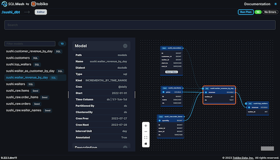

# FAQ

## General

???+ question "What is SQLMesh?"
    SQLMesh is an open source data transformation framework that brings the best practices of DevOps to data teams. It enables data engineers, scientists, and analysts to efficiently run and deploy data transformations written in SQL or Python.

    It is created and maintained by Tobiko Data, a company founded by data leaders from Airbnb, Apple, and Netflix.

    Check out the [quickstart guide](../quick_start.md) to see it in action.

??? question "What is SQLMesh used for?"
    SQLMesh is used to manage and execute data transformations - the process of converting raw data into a form useful for making business decisions.

??? question "What problems does SQLMesh solve?"
    **Problem: organizing, maintaining, and changing data transformation code in SQL or Python**

    Solutions:

    - Identify dependencies among data transformation models and determine the order in which they should run
    - Run data audits and unit tests to prevent unintended side effects from code changes
    - Implement best practices from the DevOps paradigm, such as development environments and continuous integration/continuous development (CI/CD)
    - Execute transformations written in one SQL dialect on an engine/database that runs a different SQL dialect (SQL transpilation)

     

    **Problem: understanding a complex set of data transformations**

    Solutions:

    - Determine and display the flow of data through data transformation models
    - Trace which columns in a table contribute to a column in another table (column-level lineage)

     

    **Problem: inefficient, unnecessarily expensive data transformations**

    Solutions:

    - Understand the impacts of a code change on the codebase and underlying data tables *without running the code*
    - Efficiently deploy code changes by only running the transformations impacted by the changes
    - Safely promote transformations executed in a development environment to production so computations aren’t needlessly re-executed

     

    **Problem: complex business requirements and data transformations**

    Solutions:

    - Easily and safely implement incremental data loading
    - Perform complex data transformations or operations with Python models (e.g., machine learning models, geocoding)

     

    ...and more!

??? question "What is semantic understanding of SQL?"
    Semantic understanding is the result of analyzing SQL code to determine what it does at a granular level. SQLMesh uses the free, open-source Python library [SQLGlot](https://github.com/tobymao/sqlglot) to parse the SQL code and build the semantic understanding.

    Semantic understanding allows SQLMesh to do things like transpilation (executing one SQL dialect on an engine running another dialect) and protecting incremental loading queries from duplicating data.

??? question "Does SQLMesh work like Terraform?"
    SQLMesh was inspired by Terraform, but its commands are not equivalent.

    Terraform's "plan" approach compares a local configuration to a remote configuration and determines what actions are needed to synchronize the two. Similarly, SQLMesh compares the state of local project files (such as SQL models) to an environment and determines the actions needed to synchronize them.

    However, the commands to create and apply a plan are different. In Terraform, the "plan" command generates a plan and saves it to file. The "apply" command reads a plan file and applies it.

    In SQLMesh, the `sqlmesh plan` command generates a plan, runs any unit tests, and prompts the user to apply the plan. There is no "apply" command in SQLMesh.

## Getting Started

??? question "How do I install SQLMesh?"
    SQLMesh is a Python library. After ensuring you have [an appropriate Python runtime](../prerequisites.md), install it [with `pip`](../installation.md).

??? question "How do I use SQLMesh?"
    SQLMesh has three interfaces: [command line](../reference/cli.md), [Jupyter or Databricks notebook](../reference/notebook.md), and graphical user interface.

    The [quickstart guide](../quick_start.md) demonstrates an example project in each of the interfaces.

## Usage

??? question "Why does SQLMesh create schemas?"
    SQLMesh creates schemas for two reasons:

    - SQLMesh stores state/metadata information about a project in the `sqlmesh` schema. This schema is created in the project's default gateway, or you can [specify a different location](../reference/configuration.md#state-connection).
    - SQLMesh uses [Virtual Data Environments](https://tobikodata.com/virtual-data-environments.html) to prevent duplicative computation whenever possible.

    Virtual Data Environments work by maintaining a *virtual layer* of views that users interact with when building models and a *physical layer* of tables that stores the actual data.

    Each SQLMesh environment consists of a collection of views. When changes are promoted from one environment to another (e.g., dev to prod), SQLMesh determines whether the data in an underlying physical table is equivalent between the environments. If it is, SQLMesh simply modifies the environment's view to pull from a different underlying physical table instead of redoing the computations that have already occurred.

    SQLMesh creates schemas for both the physical and virtual layers. The physical layer is stored in a schema named `sqlmesh__[project name]`. For example, the [quickstart example's](../quick_start.md) physical layer is stored in the `sqlmesh__sqlmesh_example` schema.

    The virtual layers are stored in one schema per environment. All SQLMesh projects contain a `prod` environment by default - its virtual layer is stored in the project name schema (e.g., `sqlmesh_example` for the quickstart). Other environments' virtual layers are stored in schemas of the form `[project name]__[environment name]`. For example, the quickstart example `dev` environment's virtual layer is in the `sqlmesh_example__dev` schema.

    The SQLMesh janitor automatically deletes unused environment schemas. It determines whether an environment schema should be deleted based on the elapsed time since the `sqlmesh plan [environment name]` command was successfully executed for the environment. If that time is greater than the environment time to live (default value of 1 week), the environment schema is deleted.

    SQLMesh's default behavior is appropriate for most deployments, but you can override where SQLMesh creates physical tables and views with [schema configuration options](../guides/configuration.md#environment-schemas).

??? question "What's the difference between a `test` and an `audit`?"
    A SQLMesh [`test`](../concepts/tests.md) is analogous to a "unit test" in software engineering. It tests *code* based on known inputs and outputs. In SQLMesh, the inputs and outputs are specified in a YAML file, and SQLMesh automatically runs them when `sqlmesh plan` is executed.

    A SQLMesh [`audit`](../concepts/audits.md) validates that transformed *data* meet some criteria. For example, an `audit` might verify that a column contains no `NULL` values or has no duplicated values. SQLMesh automatically runs audits when a `sqlmesh plan` is executed and the plan is applied or when `sqlmesh run` is executed.

??? question "How does a model know when to run?"
    A SQLMesh model determines when to run based on its [`cron`](#cron-question) parameter and how much time has elapsed since its previous run.

    Models are not aware of upstream data updates and do not run based on what has happened in an upstream data source.

??? question "What is the model `cron` parameter?"
    SQLMesh does not fully refresh models every time a project is run. Instead, you specify how frequently each model should run with its [`cron` parameter](../concepts/models/overview.md#cron) (defaults to daily).

    When you execute `sqlmesh run`, SQLMesh compares each model's `cron` value to its record of when the model was last run. If enough time has elapsed it will run the model, otherwise it does nothing.

    For example, consider a model whose `cron` is daily. The first time you execute `sqlmesh run` today the model will run. If you execute `sqlmesh run` again, SQLMesh will detect that the model has already run today and will not re-run the model.

??? question "What's the difference between `sqlmesh plan` and `sqlmesh run`?"
    During project development, there are two things in play: the current state of your project files and the existing states of each environment you have.

    SQLMesh’s `plan` command is the primary tool for understanding the effects of changes you make to your project. If your project files have changed or are different from the state of an environment, you execute `sqlmesh plan [environment name]` to synchronize the environment's state with your project files. `sqlmesh plan` will generate a summary of the actions needed to implement the changes, automatically run unit tests, and prompt you to `apply` the plan and implement the changes.

    If your project files have not changed, you execute `sqlmesh run` to run your project's models and audits. You can execute `sqlmesh run` yourself or with the native [Airflow integration](../integrations/airflow.md). If running it yourself, a sensible approach is to use Linux’s `cron` tool to execute `sqlmesh run` on a cadence at least as frequent as your briefest SQLMesh model `cron` parameter. For example, if your most frequent model’s `cron` is hour, your `cron` tool should execute `sqlmesh run` at least every hour.

??? question "What are start date and end date for?"
    SQLMesh uses the ["intervals" approach](https://tobikodata.com/data_load_patterns_101.html) to determine the date ranges that should be included in an incremental by time model query. It divides time into disjoint intervals and tracks which intervals have ever been processed.

    Start date plays two separate roles in SQLMesh. In an incremental model configuration, the `start` parameter tells SQLMesh the first date that should be included in the model's set of time intervals.

    Start date and end date also play a role as parameters for SQLMesh commands like [`plan`](../reference/cli.md#plan) and [`run`](../reference/cli.md#run). In this context, start and end tell SQLMesh that only certain time intervals should be included when executing the command. For example, you might process only a few intervals to iterate quickly during development before processing all of time when deploying to production.

??? question "How do I reprocess data I already transformed?"
    Sometimes you need to reprocess data that has already been loaded and transformed. In SQLMesh, you do that with [restatement plans](../concepts/plans.md#restatement-plans).

    Specify the [`plan` command's](../reference/cli.md#plan) `--restate-model` option and the model name(s) you want to reprocess. Applying the plan will reprocess those models and all models downstream from them. You can use the `--start` and `--end` options to limit the reprocessing to a specific date range.

??? question "How do I reuse an existing table instead of creating a new one?"
    Sometimes a table is too large to completely rebuild for a breaking change, so you need to reuse the existing table. This is done with [forward-only plans](../concepts/plans.md#forward-only-plans). Create one by adding the `--forward-only` option to the [`plan` command](../reference/cli.md#plan): `sqlmesh plan [environment name] --forward-only`.

    When a forward-only plan is applied to the `prod` environment, none of the plan's changed models will have new physical tables created for them. Instead, physical tables from previous model versions are reused. All changes made as part of a forward-only plan automatically get a forward-only category assigned to them - they can't be mixed together with regular breaking/non-breaking changes.

    You can retroactively apply the forward-only plan's changes to existing data in the production environment with [`plan`'s `--effective-from` option](../reference/cli.md#plan).

## Databases/Engines

??? question "What databases/engines does SQLMesh work with?"
    SQLMesh works with BigQuery, Databricks, DuckDB, MySQL, PostgreSQL, GCP PostgreSQL, Redshift, Snowflake, and Spark. See [this page](../integrations/overview.md) for more information.

??? question "When would you use different databases for executing data transformations and storing state information?"
    SQLMesh requires storing state information about projects and when their transformations were run. By default, it stores this information in the same database where the models run.

    Unlike data transformations, storing state information requires database transactions. Some databases, like BigQuery, aren’t optimized for executing transactions, so storing state information in them can slow down your project. If this occurs, you can store state information in a different database, such as PostgreSQL, that executes transactions more efficiently.

    Learn more about storing state information at the [configuration reference page](../reference/configuration.md#state-connection).

## Scheduling

??? question "How do I run SQLMesh models on a schedule?"
    You can run SQLMesh models using the [built-in scheduler](../guides/scheduling.md#built-in-scheduler) or with the native [Airflow integration](../integrations/airflow.md).

    Both approaches use each model's `cron` parameter to determine when the model should run - see the [question about `cron` above](#cron-question) for more information.

    The built-in scheduler works by executing the command `sqlmesh run`. A sensible approach to running on your project on a schedule is to use Linux’s `cron` tool to execute `sqlmesh run` on a cadence at least as frequent as your briefest SQLMesh model `cron` parameter. For example, if your most frequent model’s `cron` is hour, the `cron` tool should execute `sqlmesh run` at least every hour.

??? question "How do I use SQLMesh with Airflow?"
    SQLMesh has first-class support for Airflow - learn more [here](../integrations/airflow.md).

## Warnings and Errors

??? question "Why did I get the warning 'Query cannot be optimized due to missing schema(s) for model(s): [...]'?"
    SQLMesh uses its knowledge of table schema (column names and data types) to optimize model queries and create column-level lineage. SQLMesh does not have schema knowledge for data sources outside the project and will generate this warning when a model selects from one.

    You can resolve this by creating an [`external` model](../concepts/models/external_models.md) for each external data source. The `sqlmesh create_external_models` command captures schema information for external data sources and stores them in the project's `schema.yml` file. You can create the file manually instead, if desired.

??? question "Why did I get the error 'Table "xxx" must match the schema's nesting level: 3'?"
    SQLMesh throws this error when a model’s name does not include a schema. Model names must be of the form `schema.table` or `catalog.schema.table`.

## How is this different from dbt?

??? question "Terminology differences?"
    - dbt “materializations” are analogous to [model `kinds` in SQLMesh](../concepts/models/model_kinds.md)
    - dbt seeds are a [model kind in SQLMesh](../concepts/models/model_kinds.md#seed)
    - dbt’s “tests” are called [`audits` in SQLMesh](../concepts/audits.md) because they are auditing the contents of *data* that already exists. [SQLMesh `tests`](../concepts/tests.md) are equivalent to “unit tests” in software engineering - they evaluate the correctness of *code* based on known inputs and outputs.
    - `dbt build` is analogous to [`sqlmesh run`](../reference/cli.md#run)

??? question "Workflow differences?"
    **dbt workflow**

    - Configure your project and set up one database connection target for each environment you will use during development
    - Create, configure, and modify models, seeds, tests, and other project components
    - Execute `dbt build` (or its constituent parts `dbt run`, `dbt seed`, etc.) to evaluate and test the project components
    - Execute `dbt build` (or its constituent parts `dbt run`, `dbt seed`, etc.) on a schedule to ingest and transform new data

    **SQLMesh workflow**

    - Configure your project and set up a project database (using DuckDB locally or a database connection)
    - Create, configure, and modify models, audits, tests, and other project components
    - Execute `sqlmesh plan [environment name]` to:
        - Generate a summary of the differences between your project files and the environment and whether each change is `breaking`. The `plan` includes a list of the actions needed to implement the changes and automatically runs the project's unit `test`s.
        - Optionally apply the plan to implement the actions and run the project's `audit`s.
    - Execute `sqlmesh run` on a schedule to ingest and transform new data

??? question "Differences in running models?"
    dbt projects are executed with the commands `dbt run` (models only) or `dbt build` (models, tests, snapshots).

    In SQLMesh, the execution depends on whether the project’s contents have been modified since the last execution:

    - If they have been modified, the `sqlmesh plan` command both:
        1. Generates a summary of the actions that will occur to implement the code changes and
        2. Prompts the user to "apply" the plan and execute those actions.
    - If they have not been modified, the [`sqlmesh run`](../reference/cli.md#run) command will evaluate the project models and run the audits. SQLMesh determines which project models should be executed based on their [`cron` configuration parameter](../concepts/models/overview.md#cron).

        For example, if a model’s `cron` is `daily` then `sqlmesh run` will only execute the model once per day. If you issue `sqlmesh run` the first time on a day the model will execute; if you issue `sqlmesh run` again nothing will happen because the model shouldn’t be executed again until tomorrow.

??? question "Differences in state management?"
    **dbt**

    By default, dbt runs/builds are independent and have no knowledge of previous runs/builds. This knowledge is called “state” (as in “the state of things”).

    dbt has the ability to store/maintain state with the `state` selector method and the `defer` feature. dbt stores state information in `artifacts` like the manifest JSON file and reads the files at runtime.

    The dbt documentation [“Caveats to state comparison” page](https://docs.getdbt.com/reference/node-selection/state-comparison-caveats) comments on those features: “The state: selection method is a powerful feature, with a lot of underlying complexity.”

    **SQLMesh**

    SQLMesh always maintains state about the project structure, contents, and past runs. State information enables powerful SQLMesh features like virtual data environments and easy incremental loads.

    State information is stored by default - you do not need to take any action to maintain or to use it when executing models. As the dbt caveats page says, state information is powerful but complex. SQLMesh handles that complexity for you so you don't need to learn about or understand the underlying mechanics.

    SQLMesh stores state information in database tables. By default, it stores this information in the same [database/connection where your project models run](../reference/configuration.md#gateways). You can specify a [different database/connection](../reference/configuration.md#state-connection) if you would prefer to store state information somewhere else.

    SQLMesh adds information to the state tables via transactions, and some databases like BigQuery are not optimized to execute transactions. Changing the state connection to another database like PostgreSQL can alleviate performance issues you may encounter due to state transactions.

??? question "How do I get column-level lineage for my dbt project?"
    SQLMesh can run dbt projects with its [dbt adapter](../integrations/dbt.md). After configuring the dbt project to work with SQLMesh, you can view the column-level lineage in the SQLMesh browser UI:

    

??? question "Do I have to run Python models in my SQL engine?"
    No! SQLMesh executes [Python models](../concepts/models/python_models.md) wherever SQLMesh is running, and there are no restrictions on what they can do as long as they return a Pandas or Spark DataFrame instance.

    If the data is too large to fit in memory, the model can process it in batches or execute the transformations on an external Spark cluster.

??? question "How do incremental models determine which dates to ingest?"
    dbt uses the "most recent record" approach to determine which dates should be included in an incremental load. It works by querying the existing data for the most recent date it contains, then ingesting all records after that date from the source system in a single query.

    SQLMesh uses the "intervals" approach instead. It divides time into disjoint intervals based on a model's `cron` parameter then records which intervals have ever been processed. It ingests source records from only unprocessed intervals. The intervals approach enables features like loading in batches.

??? question "How do I run an append only model in SQLMesh?"
    SQLMesh does not support append-only models as implemented in dbt. You can achieve a similar outcome by defining a time column and using an [incremental by time range](../concepts/models/model_kinds.md#incremental_by_time_range) model or specifying a unique key and using an [incremental by unique key](../concepts/models/model_kinds.md#incremental_by_unique_key) model.

## Company

??? question "How does Tobiko Data make money?"

    - Model execution observability and monitoring tools (in development)
    - Enterprise Github Actions CI/CD App (in development)
        - Advanced version of [open source CI/CD bot](../integrations/github.md)
    - Providing hands-on support for companies' SQLMesh projects
