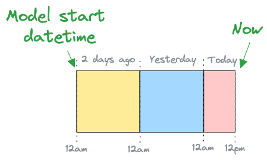

# Incremental by time guide

SQLMesh models are classified by [kind](../concepts/models/model_kinds.md). One powerful model kind is "incremental by time range" - this guide describes how these models work and demonstrates how to use them.

See the [models guide](./models.md) to learn more about working with models in general or the [model kinds concepts page](../concepts/models/model_kinds.md) for an overview of the different model kinds.

## Load the right data

The incremental by time approach to data loading is motivated by efficiency. It is based on the principle of only loading a given data row one time.

Model kinds such as `VIEW` or `FULL` reload the entirety of the source system's data every time they run. In some cases, reloading all the data is not feasible. In other cases, it is an inefficient use of time and computational resources - both of which equate to money your business could spend on something else.

Incremental by time models only load new data, drastically decreasing the computational resources required for each model run.

## Counting time

Incremental by time models work by first identifying the date range for which data should be read from the source table.

One approach to determining the date range bases it on the most recent record timestamp observed in the data. That approach is simple to implement, but it makes three assumptions: the table already exists, there are no temporal gaps in the data, and that the query is able to run in a single pass.

SQLMesh takes a different approach by using time *intervals*.

### Calculating intervals

The first step to using time intervals is to create the set of all intervals based on the model's *start datetime* and *interval unit*. The start datetime specifies when time "begins" for the model, and interval unit specifies how finely time should be divided.

For example, consider a model with a start datetime of 12am two days ago that we are working with today at 12pm. This is illustrated in Figure 1:



*__Figure 1: Illustration of model with start datetime of 12am two days ago that we are working with today at 12pm__*

<br>

If the model's interval unit was 1 day, the model's set of intervals would have 3 entries:

- 1 for two days ago
- 1 for yesterday
- 1 for today

Today's interval is not yet complete because it's 12pm right now. This is illustrated in the top panel of Figure 2:


*__Figure 2: Illustration of counting intervals over a 60 hour period with interval units of 1 day and 1 hour__*

<br>

If the model's interval unit was 1 hour instead, its set of time intervals would have 60 entries:

- 24 for each hour of two days ago
- 24 for each hour of yesterday
- 12 for each hour today from 12am to 12pm

All intervals are complete because it is 12pm (so the 11am interval has ended). This is illustrated in the bottom panel of Figure 2.

When we first execute and backfill the bottom model as part of a `sqlmesh plan` today at 12pm, SQLMesh calculates its set of 60 time intervals and records that all 60 of them were backfilled. It retains this information in the SQLMesh state tables for future use.

If we `sqlmesh run` the model *tomorrow* at 12pm, SQLMesh calculates the set of all intervals as:

- 24 for two days ago
- 24 for yesterday
- 24 for today
- 12 for tomorrow 12am to 12pm

This gives a total of 84 intervals.

It compares this set of 84 to the stored set of 60 that we already backfilled to identify the 24 un-processed intervals from 12pm yesterday to 12pm today. It then processes only those 24 intervals during today's run.

## Running `run`

SQLMesh has two different commands for processing data. If any model has been changed, [`sqlmesh plan`](../reference/cli.md#plan) is used to apply the change to data in a specific environment. If no models have changed, [`sqlmesh run`](../reference/cli.md#run) is used to execute the project's models.

Data accumulation rates and freshness requirements may differ across models. If `sqlmesh run` ran every model whenever the command was executed, all models would be held to the same freshness requirements as the most stringent model. This is inefficient and wastes computational resources (and money).

Instead, you specify the [`cron` parameter](../concepts/models/overview.md#cron) for each model. `sqlmesh run` uses each model's `cron` to determine whether that model should be executed in a given run.

For example, if your most frequent model's `cron` is hourly, you need to execute the `sqlmesh run` command at least hourly (with a tool like Linux's cron). That model will run once every hour, but another model with a `cron` of daily will only run once per day when 24 hours have elapsed since its previous run.

### Scheduling computations

By default, SQLMesh processes all intervals that have elapsed since a model's previous run in a single job. If a model's source data is large, you may want to break the computations up into smaller jobs - this is done with the model configuration's `batch_size` parameter.

When `batch_size` is specified, the total number of intervals to process is divided into batches of size `batch_size`, and one job is executed for each batch.

## Model time

Incremental by time models require specification of a time column in their configuration. In addition, their model SQL queries should specify a `WHERE` clause that filters the data on a time range.

This example shows an incremental by time model that could be added to the SQLMesh [quickstart project](../quick_start.md):

``` sql linenums="1"
MODEL (
  name sqlmesh_example.new_model,
  kind INCREMENTAL_BY_TIME_RANGE (
    time_column (model_time_column, '%Y-%m-%d'), -- Time column `model_time_column` with format '%Y-%m-%d'
  ),
);

SELECT
  *
FROM
  sqlmesh_example.incremental_model
WHERE
  model_time_column BETWEEN @start_ds and @end_ds -- WHERE clause filters based on time
```

The model configuration specifies that the column `model_time_column` represents the time stamp for each row, and the model query contains a `WHERE` clause that uses the time column to filter the data.

The `WHERE` clause uses the [SQLMesh predefined macro variables](../concepts/macros/macro_variables.md#predefined-variables) `@start_ds` and `@end_ds` to specify the date range. SQLMesh automatically substitutes in the correct dates based on which intervals are being processed in a job.

!!! tip "Important"

    The `time_column` should be in the [UTC time zone](https://en.wikipedia.org/wiki/Coordinated_Universal_Time) to ensure correct interaction with SQLMesh's scheduler and predefined macro variables.

In addition to the query `WHERE` clause, SQLMesh prevents data leakage by automatically wrapping the query in another time-filtering `WHERE` clause using the time column in the model's configuration.

This raises a question: if SQLMesh automatically adds a time filtering `WHERE` clause, why do you need to include one in the query? Because the two filters play different roles:

- The model query `WHERE` clause filters the data *read into the model*
- The SQLMesh wrapper `WHERE` clause filters the data *output by the model*

The model query ensures that only the necessary data is processed by the model, so no resources are wasted. It also adds flexibility - if an upstream model uses a different time column than the model itself, that column can be used in addition to (or in place of) the model's time column in the query `WHERE` clause.

The SQLMesh wrapper clause prevents data leakage by ensuring the model does not return records outside the time range. This is a safety mechanism that guards against improperly specified queries.

For some queries, the two filters are functionally duplicative, but for others they are not. There is no way for SQLMesh to determine whether they are duplicative in any given instance, so the model query should always include a time-filtering `WHERE` clause.

## Forward-only models

Every time a model is modified, SQLMesh classifies the change as "[breaking](../concepts/plans.md#breaking-change)" or "[non-breaking](../concepts/plans.md#non-breaking-change)."

Breaking changes may invalidate data for downstream models, so a new physical table is created and fully refreshed for the changed model and all models downstream of it. Non-breaking changes only affect the changed model, so only its physical table is refreshed.

Sometimes a model's data may be so large that it is not feasible to rebuild either its own or its downstream models' physical tables. In those situations a third type of change, "forward only," can be used. The name reflects that the change is only applied "going forward" in time.

### Specifying forward-only

Forward-only changes can be specified in two ways. First, a model can be [configured as forward-only](../guides/configuration.md#models) such that all changes to them are automatically classified as forward-only. This guarantees that the model's physical table will never be fully refreshed.

This example configures the model in the previous example to be forward only:

``` sql linenums="1"
MODEL (
  name sqlmesh_example.new_model,
  kind INCREMENTAL_BY_TIME_RANGE (
    time_column (model_time_column, '%Y-%m-%d'),
    forward_only true -- All changes will be forward only
  )
);

SELECT
  *
FROM
  sqlmesh_example.incremental_model
WHERE
  model_time_column BETWEEN @start_ds and @end_ds
```

Alternatively, all the changes contained in a *specific plan* can be classified as forward-only with a flag: `sqlmesh plan --forward-only`. A subsequent plan that did not include the forward-only flag would fully refresh the model's physical table. Learn more about forward-only plans [here](../concepts/plans.md#forward-only-plans).

### Destructive changes

Some model changes destroy existing data in a table. Dropping a column from the model is the most direct cause, but changing a column's data type (such as casting a column from a `STRING` to `INTEGER`) can also require a drop. (Whether or not a specific change requires dropping a column may differ across SQL engines.)

Forward-only models are used to retain existing data. Before executing forward-only changes to incremental models, SQLMesh performs a check to determine if existing data will be destroyed.

The check is performed at plan time based on the model definition. SQLMesh may not be able to resolve all of a model's column data types and complete the check, so the check is performed again at run time based on the physical tables underlying the model.

#### Changes to forward-only models

A model's `on_destructive_change` [configuration setting](../reference/model_configuration.md#incremental-models) determines what happens when SQLMesh detects a destructive change.

By default, SQLMesh will error so no data is lost. You can set `on_destructive_change` to `warn` or `allow` in the model's `MODEL` block to allow destructive changes.

This example configures a model to silently `allow` destructive changes:

``` sql linenums="1"
MODEL (
    name sqlmesh_example.new_model,
    kind INCREMENTAL_BY_TIME_RANGE (
        time_column model_time_column,
        forward_only true,
        on_destructive_change allow
    ),
);
```

A default `on_destructive_change` value can be set for all incremental models that do not specify it themselves in the [model defaults configuration](../reference/model_configuration.md#model-defaults).

#### Changes in forward-only plans

The SQLMesh `plan` [`--forward-only` option](../concepts/plans.md#forward-only-plans) treats all the plan's model changes as forward-only. When this option is specified, SQLMesh will check all modified incremental models for destructive schema changes, not just models configured with `forward_only true`.

SQLMesh determines what to do for each model based on this setting hierarchy: the model's `on_destructive_change` value (if present), the `on_destructive_change` [model defaults](../reference/model_configuration.md#model-defaults) value (if present), and the SQLMesh global default of `error`.

If you want to temporarily allow destructive changes to models that don't allow them, use the `plan` command's [`--allow-destructive-change` selector](../concepts/plans.md#destructive-changes) to specify which models. Learn more about model selectors [here](../guides/model_selection.md).
