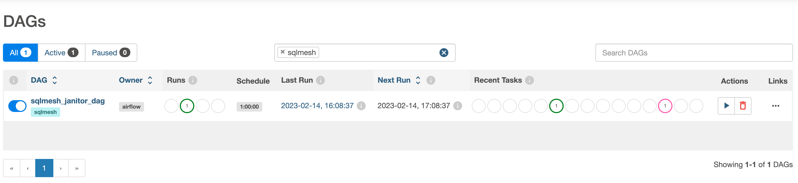
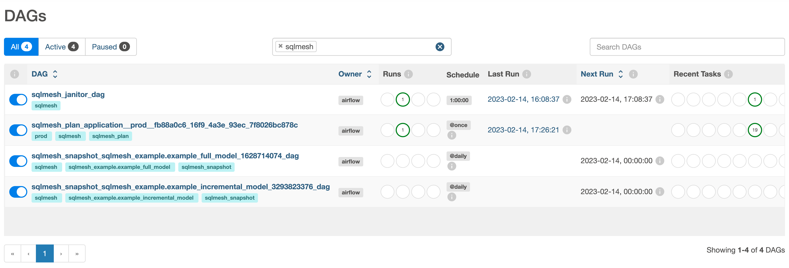

# Integrate with Airflow

## Airflow cluster configuration

SQLMesh integrates with an open source Airflow instance, as well as cloud composer.

To integrate with [Airflow](../integrations/airflow.md):

1. Install the SQLMesh Python package on all nodes of the Airflow cluster using the following command:

        pip install sqlmesh

    **Note:** The Airflow webserver must be restarted after installation.

2. Within the Airflow `dags/` folder, create a file called `sqlmesh.py`.

3. Within the file add the following, making sure to replace "spark" with your engine if you are using a different one:

        from sqlmesh.schedulers.airflow.integration import SQLMeshAirflow

        sqlmesh_airflow = SQLMeshAirflow("spark")

        for dag in sqlmesh_airflow.dags:
            globals()[dag.dag_id] = dag

    The example above uses `spark` as the engine of choice. Other engines can be configured instead by providing a corresponding string as an argument to the `SQLMeshAirflow` constructor. Supported strings are `"spark"`, `"databricks"`, `"snowflake"`, `"bigquery"` and `"redshift"`. Please note that an Airflow Connection must be configured for each engine accordingly. See [Engine support](../integrations/airflow.md#engine-support) for more details.

If the setup was successful, the following DAGs should become available on Airflow UI when filtered by the `sqlmesh` tag:



## Client configuration

On the client side, you must configure the connection to your Airflow cluster in the `config.yaml` file as follows:

        scheduler:
            type: airflow
            airflow_url: http://localhost:8080/
            username: airflow
            password: airflow

Alternatively, the configuration above can be generated automatically as part of the project initialization using the `airflow` template:
```bash
$ sqlmesh init -t airflow
```

For Airflow configuration types specific to Google Cloud Composer, configure the file as follows:

        scheduler:
            type: cloud_composer
            airflow_url: https:/XXXXXXXX.composer.googleusercontent.com/

## Running plan

Now, when running the `sqlmesh plan` command, all changes will be applied on the target Airflow cluster.

Below is an example of running the `sqlmesh plan` command in the example project generated by the `sqlmesh init` command:
```bash
$ sqlmesh plan
======================================================================
Successfully Ran 1 tests against duckdb
----------------------------------------------------------------------
Summary of differences against `prod`:
└── Added Models:
    ├── sqlmesh_example.example_incremental_model
    └── sqlmesh_example.example_full_model
Models needing backfill (missing dates):
├── sqlmesh_example.example_incremental_model: (2020-01-01, 2023-02-13)
└── sqlmesh_example.example_full_model: (2023-02-13, 2023-02-13)
Enter the backfill start date (eg. '1 year', '2020-01-01') or blank for the beginning of history: 2023-02-13
Apply - Backfill Tables [y/n]: y
Waiting for the plan application DAG 'sqlmesh_plan_application__prod__fb88a0c6_16f9_4a3e_93ec_7f8026bc878c' to be provisioned on Airflow
Track plan application progress using link
```

Once the command above finishes, the following DAGs should become available on Airflow UI:


