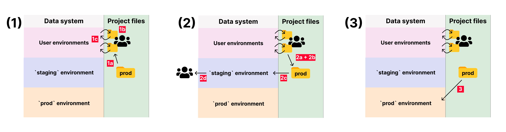
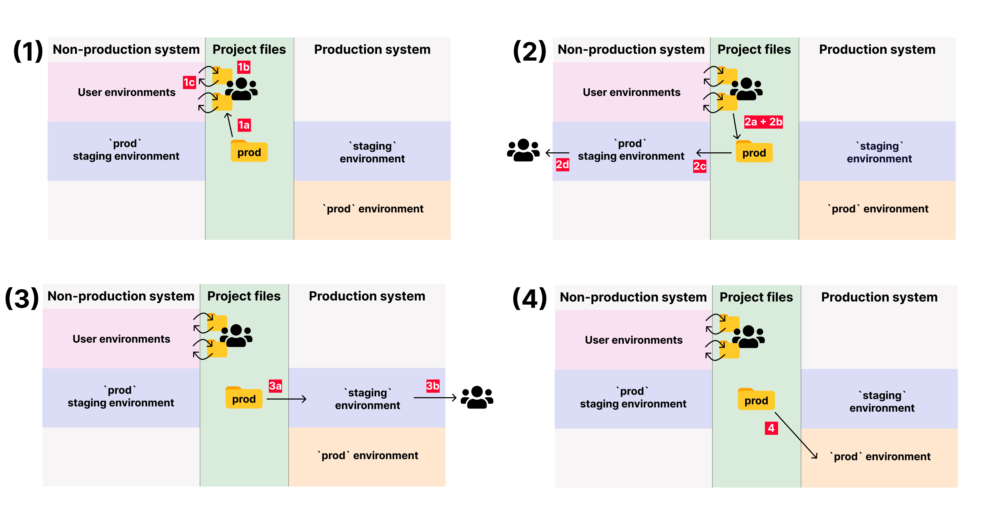

# Isolated systems guide

SQLMesh is optimized for use in systems where developers have access to production data.

Writing code against partial or unrepresentative data can be problematic because developers don't become aware of changes in production data until errors have already occurred. Other data products, such as machine learning models, may depend on the distribution of values in the training data - building them on unrepresentative data may lead to different behavior in production than in development.

However, some companies store production and non-production data in different data warehouses that can't talk to one another ("isolated systems"). This is usually motivated by information security concerns, as the non-production warehouse may be accessible to more users and/or have looser security restrictions.

This guide explains how to use SQLMesh with isolated systems. It also clarifies how isolating systems affects SQLMesh's behavior and why the systems still enjoy the benefits of many SQLMesh features.

## Terminology

Isolated systems are sometimes referred to as "isolated environments," but we avoid that term because "environments" has a specific meaning in SQLMesh.

Instead, we will refer to them as isolated systems - the "production system" and "non-production system."

When we refer to "environments," we are always talking about [SQLMesh environments](../concepts/environments.md) - the isolated namespaces created and managed by SQLMesh.

## Configuring SQLMesh

### Separate state data

SQLMesh maintains a record of every model version so it can identify changes when models are updated. Those records are called "state" data, as in "the state of the model at that point in time."

State data can be stored alongside other data in the primary data warehouse or in a [separate database](./connections.md#state-connection). (We recommend using a separate transactional database for projects running on cloud SQL engines.)

Isolated systems must use a **separate** state database for each system. The state of models and other objects in the non-production system is not accurate for the production system, and sharing state data will prevent the project from running correctly.

### Multiple gateways

SQLMesh database connections are configured with [gateways](./configuration.md#gateways) that contain [connections](./connections.md) and other configuration parameters.

A gateway must contain a connection to a SQL engine and may optionally contain a different connection to the database where SQLMesh should store its state data.

Isolated systems should configure two separate gateways: one for the production system and one for the non-production system.

For example, this configuration creates gateways named `nonproduction` and `production`. You may omit the `state_connection` keys if state data will be stored in the gateway's primary connection.

```yaml linenums="1"
gateways:
    nonproduction:
        connection:
            ...[your non-production connection parameters]...
        state_connection:
            ...[your non-production state connection parameters]...
    production:
        connection:
            ...[your production connection parameters]...
        state_connection:
            ...[your production state connection parameters]...
```

SQLMesh will use the first gateway in the configuration as the default when executing a command. For example, with that configuration SQLMesh would use the `nonproduction` gateway when executing the command `sqlmesh plan`.

Commands can override the default gateway with the `--gateway` option, such as `sqlmesh --gateway production plan`.

### Gateway-specific schemas

We recommend using identical schema and model names in both systems, but in some scenarios that is not possible.

Schema and model names may be parameterized by gateway using the predefined [`@gateway` macro variable](../concepts/macros/macro_variables.md#runtime-variables).

This example demonstrates conditioning the model schema name on the current gateway with the SQLMesh [`@IF` macro operator](../concepts/macros/sqlmesh_macros.md#if). If the gateway is named "production," `my_model`'s schema is `prod_schema`; otherwise, it is `dev_schema`.

```sql linenums="1"
MODEL (
    name @IF(@gateway = 'production', prod_schema, dev_schema).my_model
)
```

To embed the gateway name directly in the schema name, use the `@{gateway}` syntax:

```sql linenums="1"
MODEL (
    name @{gateway}_schema.my_model
)
```

## Workflow

### Linking systems

The point of isolating systems is to prevent sharing of data by limiting network communications between the systems. Given this, how can a SQLMesh project be shared between them at all?

The SQLMesh project files provide the link between the systems. The files should be stored in a mutually accessible location, such as a Git repository, or moved from one system to another as needed.


### Workflow with one system

This section outlines a generic workflow for SQLMesh projects with one system, which serves as a baseline to which we will compare the workflow for isolated systems.

We assume that a version of the SQLMesh project is currently running in production and serves as the starting point for code modifications.

The simplest version of the workflow is:

1. Developers modify project code

    a. Developers clone the production code repository

    b. Developers update code in local git branches

    c. Developers create SQLMesh environments and validate their code updates

2. Update production project code

    a. A set of git branches are selected for deployment to production

    b. The changes in the selected git branches are merged into the production branch

3. Deploy to production

    a. Execute the `sqlmesh plan` command to apply the updates to the `prod` environment



When applying the updates to the `prod` environment, all model changes that were previously applied in user environments will not run again due to SQLMesh's virtual data environments.

#### Staging environment

In the workflow described in the previous section, individual code modifications have been tested by the developers that made them, but the collection of all changes being deployed may not have been tested together.

A common expansion of the simple workflow (that we recommend) is to add a staging environment where the set of changes can be evaluated before deploying to production.

The single system workflow with a staging environment is the same as the [generic workflow above](#workflow-with-one-system), but with additional `staging` environment creation and validation in step 2:

1. [Same as [above](#workflow-with-one-system)]

2. Update production project code

    a. A set of code updates is selected for deployment to production

    b. The production SQLMesh project files are modified with the updates

    c. Execute the `sqlmesh plan staging` command to apply the updates to the `staging` environment (or another environment of your choosing)

    d. Developers validate the set of code updates in the `staging` environment

3. [Same as [above](#workflow-with-one-system)]


Because the code updates have run in the `staging` environment, the deployment to the `prod` environment will not require additional computation due to SQLMesh's virtual data environments. The deployment only requires updates to views so will be very rapid.

### Workflow with isolated systems

We now describe the SQLMesh project workflow with isolated systems.

The primary difference from the single-system workflows described above is that some steps now occur in the nonproduction system and others in the production system.

In some isolated system implementations, the data in the non-production system is different from that in the production system. For example, columns containing sensitive information may be masked or altered in the non-production system's data. These potential differences increase the likelihood of unintentional errors, so we describe (and recommend) a workflow with staging environments.

In the steps below, we assume that the non-production system is the default gateway. The isolated system workflow with staging environments begins like the [staging workflow above](#staging-environment), but with additional staging environment creation and validation in the production system after validation in the default non-production system:

1. [Same as [above](#staging-environment)]

2. [Same as [above](#staging-environment)]

3. Deploy to production system `staging` environment

    a. Execute the `sqlmesh --gateway production plan staging` command to apply the updates to the production system `staging` environment. Note that your production system's gateway may have a different name and that you may choose any environment name other than `prod`.

    b. Developers validate the set of code updates in the production system `staging` environment

4. Deploy to production

    a. Execute the `sqlmesh  --gateway production plan` command to apply the updates to the production system's `prod` environment



The classification of changes as breaking/non-breaking in the non-production system plan (step 2) will not be available to the production system plan (step 3) because the systems do not share SQLMesh state data. Therefore, the classification must occur again in the production system.

In isolated systems, SQLMesh's virtual data environments will operate normally *within* each system, but not across systems. For example, when the non-production system's staging environment is created (step 2c), any computations previously run in a developer's personal environment will not run again.

In step (3) above, the creation of the `staging` environment in the production system will require running all the computations required by code changes. Deployment to the production system's `prod` environment (step 4) will not require additional computation due to SQLMesh's virtual data environments. The deployment only requires updates views so will be very rapid.

## SQLMesh features

This section describes how two key SQLMesh features perform when a project runs on isolated systems: virtual data environments and computing only what's necessary.

### Virtual data environments

SQLMesh's virtual data environments ensure that computations are only run when necessary, saving analyst time and reducing computing expenses.

Environments are isolated namespaces where users can safely modify code and examine the outputted data. The production environment runs the models your business relies on for its operations, and other environments are created by users on demand.

SQLMesh environments work by separating database objects into two conceptual "layers": physical and virtual. The physical layer consists of the tables created, modified, and queried by SQLMesh models. The virtual layer consists of [views](https://en.wikipedia.org/wiki/View_(SQL)) that pass through data from an underlying physical table via `SELECT *`.

When an existing model is modified, a new physical table is created to reflect the updated model. The virtual layer of any environment containing that version of the model can point to the same new physical table. This approach allows a model version's computations to run once and be reused by any environment (including production).

#### Table reuse in isolated systems

Isolated production systems cannot reuse the physical tables created in non-production systems. Therefore, computations performed in non-production systems must be run again when an updated model version is pushed to the production system.

However, computations performed in different SQLMesh environments inside a system will be reused by other SQLMesh environments in that system. In organizations with many collaborators, most computations occur during development, resulting in time and cost savings due to table reuse within the non-production system.

### Compute only what's necessary

SQLMesh plans determine what computations to run by comparing the versions of models in the project files to the versions of existing models in the system. If an updated version of a model is detected, SQLMesh compares it to the existing version to determine the update's impact on downstream models.

For each downstream model, SQLMesh determines whether the change is `breaking` because it invalidates existing data or `non-breaking` because it does not. Only models with `breaking` changes need to be recomputed when the plan is executed.

Isolated systems still enjoy the benefits of computing only what is necessary within each system.
