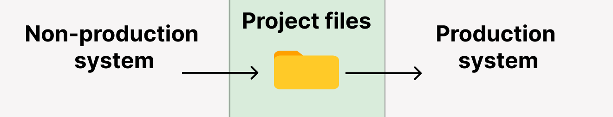

# Isolated systems guide

SQLMesh is optimized for use in systems where developers have access to production data.

Writing code against partial or unrepresentative data can cause problems because you don't become aware of changes in production data until errors have already occurred.

Other data products, such as machine learning models, may depend on the distribution of values in the training data - building them on unrepresentative data may lead to different behavior in production than in development.

However, some companies store production and non-production data in different data warehouses that can't talk to one another ("isolated systems"). This is usually due to information security concerns, as the non-production warehouse may be accessible to more users and/or have looser security restrictions.

This guide explains how to use SQLMesh with isolated systems and how isolating systems affects SQLMesh's behavior.

## Terminology

Isolated systems are sometimes referred to as "isolated environments," but we avoid that term because "environments" has a specific meaning in SQLMesh.

Instead, we will refer to them as isolated systems - the "production system" and "non-production system."

When we refer to "environments," we are always talking about [SQLMesh environments](../concepts/environments.md) - the isolated namespaces created and managed by SQLMesh.

## Configuring SQLMesh

### Separate state data

SQLMesh maintains a record of every model version so it can identify changes when models are updated. Those records are called "state" data, as in "the state of the model at that point in time."

State data can be stored alongside other data in the primary data warehouse or in a [separate database](./configuration.md#state-connection). We recommend using a separate transactional database for projects running on cloud SQL engines.

Isolated systems must use a **separate** state database for each system. The state of models and other objects in the non-production system is not accurate for the production system, and sharing state data will prevent the project from running correctly.

### Multiple gateways

SQLMesh database connections are configured with [gateways](./configuration.md#gateways) that contain [connections](./connections.md) and other configuration parameters.

A gateway must contain a connection to a SQL engine and may optionally contain a different connection to the database where SQLMesh should store its state data.

Isolated systems should configure two separate gateways: one for the production system and one for the non-production system.

For example, this configuration creates gateways named `nonproduction` and `production`. You may omit the `state_connection` keys if state data will be stored in the gateway's primary connection.

```yaml linenums="1"
gateways:
  nonproduction:
    connection:
      ...[your non-production connection parameters]...
    state_connection:
      ...[your non-production state connection parameters]...
  production:
    connection:
      ...[your production connection parameters]...
    state_connection:
      ...[your production state connection parameters]...
```

SQLMesh will use the first gateway in the configuration as the default when executing a command. For example, with the configuration above SQLMesh would use the `nonproduction` gateway when executing the command `sqlmesh plan`.

Commands can override the default gateway with the `--gateway` option, such as `sqlmesh --gateway production plan`.

### Gateway-specific schemas

We recommend using identical schema and model names in both systems, but in some scenarios that is not possible.

Schema and model names may be parameterized by gateway using the predefined [`@gateway` macro variable](../concepts/macros/macro_variables.md#runtime-variables).

This example demonstrates conditioning the model schema name on the current gateway with the SQLMesh [`@IF` macro operator](../concepts/macros/sqlmesh_macros.md#if). If the gateway is named `production`, `my_model`'s schema is `prod_schema`; otherwise, it is `dev_schema`.

```sql linenums="1"
MODEL (
  name @IF(@gateway = 'production', prod_schema, dev_schema).my_model
)
```

To embed the gateway name directly in the schema name, use the `@{gateway}` syntax:

```sql linenums="1"
MODEL (
  name @{gateway}_schema.my_model
)
```

## Workflow

### Linking systems

The point of isolating systems is to prevent sharing of data by limiting network communications between the systems. Given this, how can a SQLMesh project be shared between them at all?

The SQLMesh project files provide the link between the systems. The files should be stored in a mutually accessible location, such as a git repository.



### Workflow with one system

This section describes workflows for updating SQLMesh projects with one system.

We assume that a version of the SQLMesh project is currently running in production and serves as the starting point for code modifications.

#### Basic workflow

Use this workflow if your data system does not use CI/CD to implement changes:

- Make a change to a model
- Run `sqlmesh plan dev` (or another environment name) to preview the changes in a local environment
- Run `sqlmesh plan` to apply the changes to the `prod` environment

#### CI/CD workflow

Use this workflow with the SQLMesh [Github CI/CD bot](../integrations/github.md):

- `git clone` the project repo
- Make a change to a model in a git branch
- Push the branch to the project repo and make a pull request. The bot will create a development environment for you to preview the changes if it is configured for [synchronized deployments](../integrations/github.md#synchronized-vs-desynchronized-deployments).
- Merge the branch into `main` to apply the changes to the `prod` environment

Learn more about synchronized and desynchronized deployments [here](../integrations/github.md#synchronized-vs-desynchronized-deployments).

#### Reusing computations

Local environment previews are computed on the same data used by the `prod` environment in these workflows, so applying the changes to `prod` reuses the preview computations and only requires a virtual update.

### Workflow with isolated systems

This section describes the workflow with isolated systems.

This workflow combines the basic and CI/CD workflows above, where the basic workflow is used in the non-production system and the CI/CD workflow is used in the production system:

- `git clone` the project repo
- Make a change to a model in a git branch
- Run `sqlmesh plan dev` (or another environment name) to preview the changes in the nonproduction system. You may need to include the nonproduction `--gateway` option, depending on your project configuration.
- Push the branch to the project repo and make a pull request. The bot will create an environment to preview the changes in the production system if it is configured for [synchronized deployments](../integrations/github.md#synchronized-vs-desynchronized-deployments).
- Merge the branch into `main` to apply the changes to the `prod` environment

The breaking/non-breaking change classifications in the non-production system will not be available to the production system because the systems do not share SQLMesh state data. Therefore, the classifications must occur again in the production system.

#### Reusing computations

In isolated systems, SQLMesh's virtual data environments operate normally *within* each system, but not across systems.

In the non-production system, computations will be reused across preview environments. However, the system's data are not representative of the production data and will not be reused by the production system.

In the production system, the CI/CD bot will execute the necessary computations when a pull request is submitted if it is configured for [synchronized deployment](../integrations/github.md#synchronized-vs-desynchronized-deployments). Merging to main and applying the changes to `prod` reuses the preview computations and only requires a virtual update.

This approach enables true [blue-green deployment](https://en.m.wikipedia.org/wiki/Blue%E2%80%93green_deployment). Deploying to production occurs with no system downtime because virtual updates only require swapping views. If issues are identified after changes have been pushed to production, reverting is quick and painless because it just swaps the views back.