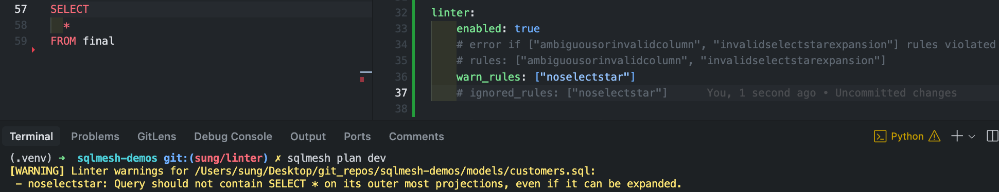

# Linter guide



Linting is a powerful tool for improving code quality and consistency. It enables you to automatically validate model definition, ensuring they adhere to your team's best practices.

When a SQLMesh plan is created, each model's code is checked for compliance with a set of rules you choose.

SQLMesh provides built-in rules, and you can define custom rules. This improves code quality and helps detect issues early in the development cycle when they are simpler to debug.

## Rules

Each linting rule is responsible for identifying a pattern in a model's code.

Some rules validate that a pattern is *not* present, such as not allowing `SELECT *` in a model's outermost query. Other rules validate that a pattern *is* present, like ensuring that every model's `owner` field is specified. We refer to both of these below as "validating a pattern".

Rules are defined in Python. Each rule is an individual Python class that inherits from SQLMesh's `Rule` base class and defines the logic for validating a pattern.

We display a portion of the `Rule` base class's code below ([full source code](https://github.com/TobikoData/sqlmesh/blob/main/sqlmesh/core/linter/rule.py)). Its methods and properties illustrate the most important components of the subclassed rules you define.

Each rule class you create has four vital components:

1. Name: the class's name is used as the rule's name.
2. Description: the class should define a docstring that provides a short explanation of the rule's purpose.
3. Pattern validation logic: the class should define a `check_model()` method containing the core logic that validates the rule's pattern. The method can access any `Model` attribute.
4. Rule violation logic: if a rule's pattern is not validated, the rule is "violated" and the class should return a `RuleViolation` object. The `RuleViolation` object should include the contextual information a user needs to understand and fix the problem.

``` python linenums="1"
# Class name used as rule's name
class Rule:
    # Docstring provides rule's description
    """The base class for a rule."""

    # Pattern validation logic goes in `check_model()` method
    @abc.abstractmethod
    def check_model(self, model: Model) -> t.Optional[RuleViolation]:
        """The evaluation function that checks for a violation of this rule."""

    # Rule violation object returned by `violation()` method
    def violation(self, violation_msg: t.Optional[str] = None) -> RuleViolation:
        """Return a RuleViolation instance if this rule is violated"""
        return RuleViolation(rule=self, violation_msg=violation_msg or self.summary)
```

### Built-in rules

SQLMesh includes a set of predefined rules that check for potential SQL errors or enforce code style.

An example of the latter is the `NoSelectStar` rule, which prohibits a model from using `SELECT *` in its query's outer-most select statement.

Here is code for the built-in `NoSelectStar` rule class, with the different components annotated:

``` python linenums="1"
# Rule's name is the class name `NoSelectStar`
class NoSelectStar(Rule):
    # Docstring explaining rule
    """Query should not contain SELECT * on its outer most projections, even if it can be expanded."""

    def check_model(self, model: Model) -> t.Optional[RuleViolation]:
        # If this model does not contain a SQL query, there is nothing to validate
        if not isinstance(model, SqlModel):
            return None

        # Use the query's `is_star` property to detect the `SELECT *` pattern.
        # If present, call the `violation()` method to return a `RuleViolation` object.
        return self.violation() if model.query.is_star else None
```

Here are all of SQLMesh's built-in linting rules:

| Name                       | Check type  | Explanation                                                                                                              |
| -------------------------- | ----------- | ------------------------------------------------------------------------------------------------------------------------ |
| `ambiguousorinvalidcolumn`  | Correctness | SQLMesh found duplicate columns or was unable to determine whether a column is duplicated or not                         |
| `invalidselectstarexpansion` | Correctness | The query's top-level selection may be `SELECT *`, but only if SQLMesh can expand the `SELECT *` into individual columns |
| `noselectstar`               | Stylistic   | The query's top-level selection may not be `SELECT *`, even if SQLMesh can expand the `SELECT *` into individual columns |
| `nomissingaudits`             | Governance  | SQLMesh did not find any `audits` in the model's configuration to test data quality.                                                 |
| `nomissingexternalmodels`   | Governance  | All external models must be registered in the external_models.yaml file                                                |
| `cronvalidator`             | Governance  | Upstream model has a cron expression with longer intervals than downstream model. Example:  step_1(`@weekly`) -> step_2(`@daily`) -> step_3(`*/5 * * * *`). step_2 and step_3 are anchored to step_1's cron and will run on the same schedule as step_1. The fix is to align the schedules where a downstream model's cron is the same or has a longer cron interval than an upstream model's.                                         |

### User-defined rules

You may define custom rules to implement your team's best practices.

For instance, you could ensure all models have an `owner` by defining the following linting rule:

``` python linenums="1" title="linter/user.py"
import typing as t

from sqlmesh.core.linter.rule import Rule, RuleViolation
from sqlmesh.core.model import Model

class NoMissingOwner(Rule):
    """Model owner should always be specified."""

    def check_model(self, model: Model) -> t.Optional[RuleViolation]:
        # Rule violated if the model's owner field (`model.owner`) is not specified
        return self.violation() if not model.owner else None

```

Place a rule's code in the project's `linter/` directory. SQLMesh will load all subclasses of `Rule` from that directory.

If the rule is specified in the project's [configuration file](#applying-linting-rules), SQLMesh will run it when:
- A plan is created during `sqlmesh plan`
- The command `sqlmesh lint` is ran

SQLMesh will error if a model violates the rule, informing you which model(s) violated the rule. In this example, `full_model.sql` violated the `NoMissingOwner` rule, essentially halting execution:

``` bash
$ sqlmesh plan

Linter errors for .../models/full_model.sql:
 - nomissingowner: Model owner should always be specified.

Error: Linter detected errors in the code. Please fix them before proceeding.
```

Or through the standalone command, for faster iterations:

``` bash
$ sqlmesh lint

Linter errors for .../models/full_model.sql:
 - nomissingowner: Model owner should always be specified.

Error: Linter detected errors in the code. Please fix them before proceeding.
```

Use `sqlmesh lint --help` for more information.


## Applying linting rules

Specify which linting rules a project should apply in the project's [configuration file](./configuration.md).

Rules are specified as lists of rule names under the `linter` key. Globally enable or disable linting with the `enabled` key, which is `false` by default.

NOTE: you **must** set the `enabled` key to `true` key to apply the project's linting rules.

### Specific linting rules

This example specifies that the `"ambiguousorinvalidcolumn"` and `"invalidselectstarexpansion"` linting rules should be enforced:

=== "YAML"

    ```yaml linenums="1"
    linter:
      enabled: true
      rules: ["ambiguousorinvalidcolumn", "invalidselectstarexpansion"]
    ```

=== "Python"

    ```python linenums="1"
    from sqlmesh.core.config import Config, LinterConfig

    config = Config(
        linter=LinterConfig(
            enabled=True,
            rules=["ambiguousorinvalidcolumn", "invalidselectstarexpansion"]
        )
    )
    ```

### All linting rules

Apply every built-in and user-defined rule by specifying `"ALL"` instead of a list of rules:

=== "YAML"

    ```yaml linenums="1"
    linter:
      enabled: True
      rules: "ALL"
    ```

=== "Python"

    ```python linenums="1"
    from sqlmesh.core.config import Config, LinterConfig

    config = Config(
        linter=LinterConfig(
            enabled=True,
            rules="all",
        )
    )
    ```

If you want to apply all rules except for a few, you can specify `"ALL"` and list the rules to ignore in the `ignored_rules` key:

=== "YAML"

    ```yaml linenums="1"
    linter:
      enabled: True
      rules: "ALL" # apply all built-in and user-defined rules and error if violated
      ignored_rules: ["noselectstar"] # but don't run the `noselectstar` rule
    ```

=== "Python"

    ```python linenums="1"
    from sqlmesh.core.config import Config, LinterConfig

    config = Config(
        linter=LinterConfig(
            enabled=True,
            # apply all built-in and user-defined linting rules and error if violated
            rules="all",
             # but don't run the `noselectstar` rule
            ignored_rules=["noselectstar"]
        )
    )
    ```

### Exclude a model from linting

You can specify that a specific *model* ignore a linting rule by specifying `ignored_rules` in its `MODEL` block.

This example specifies that the model `docs_example.full_model` should not run the `invalidselectstarexpansion` rule:

```sql linenums="1"
MODEL(
  name docs_example.full_model,
  ignored_rules ["invalidselectstarexpansion"] # or "ALL" to turn off linting completely
);
```

### Rule violation behavior

Linting rule violations raise an error by default, preventing the project from running until the violation is addressed.

You may specify that a rule's violation should not error and only log a warning by specifying it in the `warn_rules` key instead of the `rules` key.

=== "YAML"

    ```yaml linenums="1"
    linter:
      enabled: True
      # error if `ambiguousorinvalidcolumn` rule violated
      rules: ["ambiguousorinvalidcolumn"]
      # but only warn if "invalidselectstarexpansion" is violated
      warn_rules: ["invalidselectstarexpansion"]
    ```

=== "Python"

    ```python linenums="1"
    from sqlmesh.core.config import Config, LinterConfig

    config = Config(
        linter=LinterConfig(
            enabled=True,
            # error if `ambiguousorinvalidcolumn` rule violated
            rules=["ambiguousorinvalidcolumn"],
            # but only warn if "invalidselectstarexpansion" is violated
            warn_rules=["invalidselectstarexpansion"],
        )
    )
    ```

SQLMesh will raise an error if the same rule is included in more than one of the `rules`, `warn_rules`, and `ignored_rules` keys since they should be mutually exclusive.