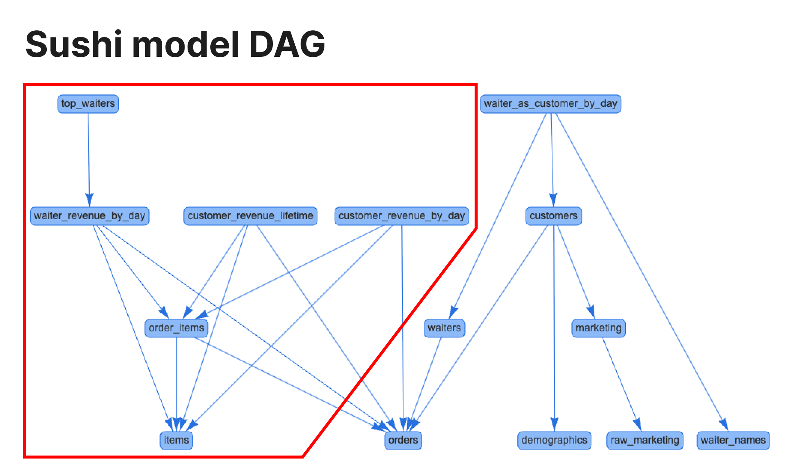

# Model Selection Guide

This guide describes how to select specific models to include in a SQLMesh plan, which can be useful when modifying a subset of the models in a SQLMesh project.

## Background

A SQLMesh [plan](../concepts/plans.md) automatically detects changes between the local version of a project and the version deployed in an environment. When applied, the plan backfills the directly modified models and their indirectly modified downstream children. This brings all model data into alignment with the local version of the project.

In large SQLMesh projects, a single model change may impact many downstream models, such that evaluating it and its affected children takes a significant amount of time. In some situations, a user is blocked by the long run time and can accomplish their task without backfilling all changed models and affected children.

SQLMesh model selection allows you to filter which direct model changes should be included into a plan. This can be useful when you only need to inspect the results of some of the model changes you have made.

Model selections only apply to models that have been directly modified. Selected models' indirectly modified children are always included in the plan, unless you additionally specify which models to backfill (more information [below](#backfill)).

## Syntax

Model selections are specified in the CLI `sqlmesh plan` argument `--select-model`. Selections may be specified in a number of ways.

The simplest selection is a single model name (e.g., `example.incremental_model`). The `--select-model` argument may be repeated to specify multiple individual model names:

```bash
sqlmesh plan --select-model "example.incremental_model" --select-model "example.full_model"
```

A selection may use the wildcard asterisk character `*` to select multiple models at once. Any model name matching the non-wildcard characters will match. For example:

- `"example.seed*"` would match both `example.seed_cities` and `example.seed_states`
- `"example.*l_model"` would match both `example.incremental_model` and `example.full_model`

Multiple models can also be selected by using the tag selector syntax `tag:tag_name`. For example, `"tag:my_tag"` would select all models with the tag `my_tag`. 

Assuming all seed models had a "seed" tag and all incremental models had an "incremental" tag:

- `"tag:seed"` would match all seed models
- `"tag:incremental"` would match all incremental models

Wildcards also apply to tags. For example, `"tag:reporting*"` would match all models that have a tag starting with "reporting". 

### Upstream/downstream indicator

By default, only the directly changed models in a selection are included in the plan.

All of a model's changed upstream and/or downstream models may be included in a selection with the plus sign `+`. A plus sign at the beginning of a selection includes changed upstream models, and a plus sign at the end of a selection includes downstream models.

For example, consider a three model project with the following structure, where all three models have been changed:

`example.seed_model` --> `example.incremental_model` --> `example.full_model`

These selections would include different sets of models in the plan:

- `--select-model "example.incremental_model"` = `incremental_model` only
- `--select-model "+example.incremental_model"` = `incremental_model` and upstream `seed_model`
- `--select-model "example.incremental_model+"` = `incremental_model` and downstream `full_model`

The upstream/downstream indicator may be combined with the wildcard operator. For example, `--select-model "+example.*l_model"` would include all three models in the project:

- `example.incremental_model` matches the wildcard
- `example.seed_model` is upstream of the incremental model
- `example.full_model` matches the wildcard

The combination of the upstream/downstream indicator, wildcards, and multiple `--select-model` arguments enables granular and complex model selections for a plan.

Upstream/downstream indicators also apply to tags. For example, `--select-model "tag:+reporting*"` would select all models with tags that start with `reporting` and their upstream models.

## Backfill

By default, SQLMesh backfills all of a plan's directly and indirectly modified models. In large projects, a single model change may impact many downstream models, such that backfilling all the children takes a significant amount of time.

You can limit which downstream models are backfilled with `plan`'s `--backfill-model` argument, which uses the same selection [syntax](#syntax) as `--select-model`.

`--select-model` determines which directly modified models are included in a `plan`, and `--backfill-model` determines which models are backfilled by the `plan`. A model's backfilled data is only current if its parents have also been backfilled, so the parents of each model specified with `--backfill-model` will also be backfilled.

Care is required if both of the `--select-model` and `--backfill-model` options are specified because a single model can be affected by both options. For example, consider a model `test_model`. We have two versions of the model: a new directly modified version ("test_model modified") and the existing version already active in an environment ("test_model existing"). If `test_model` is not selected by `--select-model`, the directly modified version "test_model modified" is excluded from the plan. However, if `test_model` is upstream of a `--backfill-model` model, the existing version "test_model existing" will be backfilled if it has any unprocessed intervals.

NOTE: the `--backfill-model` argument can only be used in development environments (i.e., environments other than `prod`).

## Examples

We now demonstrate the use of `--select-model` and `--backfill-model` with the SQLMesh `sushi` example project, available in the `examples/sushi` directory of the [SQLMesh Github repository](https://github.com/TobikoData/sqlmesh).

### sushi

The sushi project generates and transforms data collected at a sushi restaurant. In this guide, we focus on a set of the project's models related to marketing and customers.

The DAG of those models displays the primary set we will use inside the red shape:



 The root of our sub-DAG is `items` at the bottom. Immediately downstream of it are `order_items`, `waiter_revenue_by_day`, `customer_revenue_lifetime`, and `customer_revenue_by_day`. Finally, `top_waiters` is downstream of `waiter_revenue_by_day`.

To prepare for the examples, we have run an initial plan in `prod` and completed the backfill. We have modified the `sushi.items` and `sushi.order_items` models to demonstrate how model selection impacts plans.

### Selection examples

#### No selection

If we run a `plan` without selecting specific models, SQLMesh includes the two directly modified models and the four indirectly modified models downstream of `sushi.order_items`:

```bash
❯ sqlmesh plan dev
Summary of differences against `dev`:
Models:
├── Directly Modified:
│   ├── sushi.order_items
│   └── sushi.items
└── Indirectly Modified:
    ├── sushi.waiter_revenue_by_day
    ├── sushi.customer_revenue_by_day
    ├── sushi.customer_revenue_lifetime
    └── sushi.top_waiters
```

#### Select `order_items`

If we specify the `--select-model` option to select `"sushi.order_items"`, the directly modified `sushi.items` model is no longer included in the plan:

```bash
❯ sqlmesh plan dev --select-model "sushi.order_items"
Summary of differences against `dev`:
Models:
├── Directly Modified:
│   └── sushi.order_items
└── Indirectly Modified:
    ├── sushi.waiter_revenue_by_day
    ├── sushi.customer_revenue_lifetime
    ├── sushi.customer_revenue_by_day
    └── sushi.top_waiters
```

#### Select `+order_items`

If we specify the `--select-model` option with the upstream `+` to select `"+sushi.order_items"`, the `sushi.items` model is selected because it is upstream of `sushi.order_items`:

```bash
❯ sqlmesh plan dev --select-model "+sushi.order_items"
Summary of differences against `dev`:
Models:
├── Directly Modified:
│   ├── sushi.items
│   └── sushi.order_items
└── Indirectly Modified:
    ├── sushi.top_waiters
    ├── sushi.customer_revenue_lifetime
    ├── sushi.waiter_revenue_by_day
    └── sushi.customer_revenue_by_day
```

#### Select `items`

If we specify the `--select-model` option to select `"sushi.items"`, SQLMesh does not select `sushi.order_items` (so it is not classified as directly modified).

However, it does classify `sushi.order_items` as indirectly modified. Its direct modification is excluded by the model selection, but it is indirectly modified by being downstream of the selected `sushi.items` model:

```bash hl_lines="7"
❯ sqlmesh plan dev --select-model "sushi.items"
Summary of differences against `dev`:
Models:
├── Directly Modified:
│   └── sushi.items
└── Indirectly Modified:
    ├── sushi.order_items
    ├── sushi.customer_revenue_by_day
    ├── sushi.waiter_revenue_by_day
    ├── sushi.customer_revenue_lifetime
    └── sushi.top_waiters
```

#### Select `items+`

If we specify the `--select-model` option with the downstream `+` to select `"sushi.items+"`, the `sushi.order_items` model is selected and classified as directly modified because it is downstream of `sushi.items`:

```bash
❯ sqlmesh plan dev --select-model "sushi.items+"
Summary of differences against `dev`:
Models:
├── Directly Modified:
│   ├── sushi.items
│   └── sushi.order_items
└── Indirectly Modified:
    ├── sushi.waiter_revenue_by_day
    ├── sushi.customer_revenue_lifetime
    ├── sushi.customer_revenue_by_day
    └── sushi.top_waiters
```

#### Select `*items`

If we specify the `--select-model` option with the wildcard `*` to select `"sushi.*items"`, both `sushi.items` and `sushi.order_items` are selected because they match the wildcard:

```bash
❯ sqlmesh plan dev --select-model "sushi.*items"
Summary of differences against `dev`:
Models:
├── Directly Modified:
│   ├── sushi.order_items
│   └── sushi.items
└── Indirectly Modified:
    ├── sushi.waiter_revenue_by_day
    ├── sushi.top_waiters
    ├── sushi.customer_revenue_by_day
    └── sushi.customer_revenue_lifetime
```

### Backfill examples

#### No backfill selection

Recall that a plan with no selection or backfill options includes all four models, two of which were directly and two of which were indirectly modified.

The `--backfill-model` option does not affect whether a model is included in a plan (i.e., it will still appear in the output shown in the selection examples above). Instead, it determines whether a model is included in the list of models needing backfill (shown at the bottom of the plan's output).

With no options specified, the `plan` will backfill all six models. The backfills occur in the `sushi__dev` schema because we are creating a plan for the `dev` environment:

```bash
❯ sqlmesh plan dev

< output omitted>

Models needing backfill (missing dates):
├── sushi__dev.items: 2023-12-01 - 2023-12-07
├── sushi__dev.order_items: 2023-12-01 - 2023-12-07
├── sushi__dev.customer_revenue_by_day: 2023-12-01 - 2023-12-07
├── sushi__dev.customer_revenue_lifetime: 2023-12-01 - 2023-12-07
├── sushi__dev.waiter_revenue_by_day: 2023-12-01 - 2023-12-07
└── sushi__dev.top_waiters: 2023-12-01 - 2023-12-07
```

#### Backfill `sushi.waiter_revenue_by_day`

If we specify the `--backfill-model` option with `"sushi.waiter_revenue_by_day"`, there are fewer models in the backfills list.

The `sushi__dev.customer_revenue_by_day`, `sushi__dev.customer_revenue_lifetime`, and `sushi__dev.top_waiters` models are excluded because they are not upstream of `sushi.waiter_revenue_by_day`.

The `sushi__dev.items` and `sushi__dev.order_items` models are still included because they are upstream of `sushi.waiter_revenue_by_day`.

Models upstream of those selected in the `--backfill-model` expression are always included, regardless of whether the expression contains a leading `+` sign.

```bash
❯ sqlmesh plan dev --backfill-model "sushi.waiter_revenue_by_day"

< output omitted>

Models needing backfill (missing dates):
├── sushi__dev.items: 2023-12-04 - 2023-12-10
├── sushi__dev.order_items: 2023-12-04 - 2023-12-10
└── sushi__dev.waiter_revenue_by_day: 2023-12-04 - 2023-12-10
```
