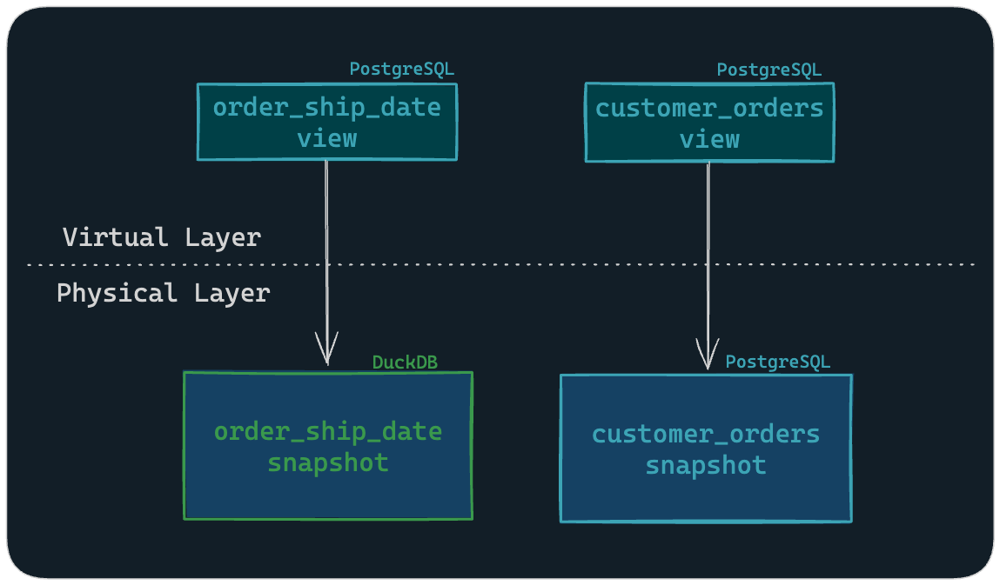

# Multi-Engine guide

Organizations typically connect to a data warehouse through a single engine to ensure data consistency. However, there are cases where the processing capabilities of one engine may be better suited to specific tasks than another.

Companies are increasingly decoupling how/where data is stored from the how computations are run on the data, requiring interoperability across platforms and tools. Open table formats like Apache Iceberg, Delta Lake, and Hive provide a common storage format that can be used by multiple SQL engines.

SQLMesh enables this decoupling by supporting multiple engine adapters within a single project, giving you the flexibility to choose the best engine for each computational task. You can specify the engine each model uses, based on what computations the model performs or other organization-specific considerations.

## Configuring a Project with Multiple Engines

Configuring your project to use multiple engines follows a simple process:

- Include all required [gateway connections](../reference/configuration.md#connection) in your configuration.
- Specify the `gateway` to be used for execution in the `MODEL` DDL.

If no gateway is explicitly defined for a model, the [default_gateway](../reference/configuration.md#default-gateway) of the project is used.

By default, virtual layer views are created in the `default_gateway`. This approach requires that all engines can read from and write to the same shared catalog, so a view in the `default_gateway` can access a table in another gateway.

Alternatively, each gateway can create the virtual layer views for the models it runs. Use this approach by setting the [gateway_managed_virtual_layer](#gateway-managed-virtual-layer) flag to `true` in your project configuration.

### Shared Virtual Layer

To dive deeper, in SQLMesh the [physical layer](../concepts/glossary.md#physical-layer) is the concrete data storage layer, where it stores and manages data in database tables and materialized views.

While, the [virtual layer](../concepts/glossary.md#virtual-layer) consists of views, one for each model, each pointing to a snapshot table in the physical layer.

In a multi-engine project with a shared data catalog, the model-specific gateway is responsible for the physical layer, while the default gateway is used for managing the virtual layer.

#### Example: DuckDB + PostgreSQL

Below is a simple example of setting up a project with connections to both DuckDB and PostgreSQL.

In this setup, the PostgreSQL engine is set as the default, so it will be used to manage views in the virtual layer. Meanwhile, DuckDB's [attach](https://duckdb.org/docs/sql/statements/attach.html) feature enables read-write access to the PostgreSQL catalog's physical tables.

=== "YAML"

    ```yaml linenums="1"
    gateways:
      duckdb:
        connection:
          type: duckdb
          catalogs:
            main_db:
              type: postgres
              path: 'dbname=main_db user=postgres host=127.0.0.1'
          extensions:
            - name: iceberg
      postgres:
        connection:
          type: postgres
          database: main_db
          user: user
          password: password
          host: 127.0.0.1
          port: 5432
    default_gateway: postgres
    ```

=== "Python"

    ```python linenums="1"
    from sqlmesh.core.config import (
        Config,
        ModelDefaultsConfig,
        GatewayConfig,
        DuckDBConnectionConfig,
        PostgresConnectionConfig
    )
    from sqlmesh.core.config.connection import DuckDBAttachOptions

    config = Config(
        model_defaults=ModelDefaultsConfig(dialect="postgres"),
        gateways={
            "duckdb": GatewayConfig(
                connection=DuckDBConnectionConfig(
                    catalogs={
                        "main_db": DuckDBAttachOptions(
                            type="postgres",
                            path="dbname=main_db user=postgres host=127.0.0.1"
                        ),
                    },
                    extensions=["iceberg"],
                )
            ),
            "postgres": GatewayConfig(
                connection=PostgresConnectionConfig(
                    host="127.0.0.1",
                    port=5432,
                    user="postgres",
                    password="password",
                    database="main_db",
                )
            ),
        },
        default_gateway="postgres",
    )
    ```

Given this configuration, when a model’s gateway is set to DuckDB, the DuckDB engine will perform the calculations before materializing the physical table in the PostgreSQL `main_db` catalog.

```sql linenums="1"
MODEL (
  name orders.order_ship_date,
  kind FULL,
  gateway duckdb,
);

SELECT
  l_orderkey,
  l_shipdate
FROM
  iceberg_scan('data/bucket/lineitem_iceberg', allow_moved_paths = true);
```

The `order_ship_date` model specifies the DuckDB engine, which will perform the computations used to create the physical table in the PostgreSQL database.

This allows you to efficiently scan data from an Iceberg table, or even query tables directly from S3 when used with the [HTTPFS](https://duckdb.org/docs/stable/extensions/httpfs/overview.html) extension.


*Figure 1: The gateways denote the execution engine, while both the virtual layer’s views and the physical layer's tables reside in Postgres*

In models where no gateway is specified, such as the `customer_orders` model, the default PostgreSQL engine will  both create the physical table and the views in the virtual layer.

### Gateway-Managed Virtual Layer

By default, all virtual layer views are created in the project's default gateway.

If your project's engines don’t have a mutually accessible catalog or your raw data is located in different engines, you may prefer for each model's virtual layer view to exist in the gateway that ran the model. This allows a single SQLMesh project to manage isolated sets of models in different gateways, which is sometimes necessary for data governance or security concerns.

To enable this, set `gateway_managed_virtual_layer` to `true` in your configuration. By default, this flag is set to false.

#### Example: Redshift + Athena + Snowflake

Consider a scenario where you need to create a project with models in Redshift, Athena and Snowflake, where each engine hosts its models' virtual layer views.

First, add the connections to your configuration and set the `gateway_managed_virtual_layer` flag to `true`:

=== "YAML"

    ```yaml linenums="1" hl_lines="30"
    gateways:
      redshift:
        connection:
          type: redshift
          user: <redshift_user>
          password: <redshift_password>
          host: <redshift_host>
          database: <redshift_database>
        variables:
          gw_var: 'redshift'
      athena:
        connection:
          type: athena
          aws_access_key_id: <athena_aws_access_key_id>
          aws_secret_access_key: <athena_aws_secret_access_key>
          s3_warehouse_location: <athena_s3_warehouse_location>
        variables:
          gw_var: 'athena'
      snowflake:
        connection:
          type: snowflake
          account: <snowflake_account>
          user: <snowflake_user>
          database: <snowflake_database>
          warehouse: <snowflake_warehouse>
        variables:
          gw_var: 'snowflake'

    default_gateway: redshift
    gateway_managed_virtual_layer: true

    variables:
      gw_var: 'global'
      global_var: 5
    ```

=== "Python"

    ```python linenums="1" hl_lines="48"
    from sqlmesh.core.config import (
        Config,
        ModelDefaultsConfig,
        GatewayConfig,
        RedshiftConnectionConfig,
        AthenaConnectionConfig,
        SnowflakeConnectionConfig,
    )

    config = Config(
        model_defaults=ModelDefaultsConfig(dialect="redshift"),
        gateways={
            "redshift": GatewayConfig(
                connection=RedshiftConnectionConfig(
                    user="<redshift_user>",
                    password="<redshift_password>",
                    host="<redshift_host>",
                    database="<redshift_database>",
                ),
                variables={
                    "gw_var": "redshift"
                },
            ),
            "athena": GatewayConfig(
                connection=AthenaConnectionConfig(
                    aws_access_key_id="<athena_aws_access_key_id>",
                    aws_secret_access_key="<athena_aws_secret_access_key>",
                    region_name="<athena_region_name>",
                    s3_warehouse_location="<athena_s3_warehouse_location>",
                ),
                variables={
                    "gw_var": "athena"
                },
            ),
            "snowflake": GatewayConfig(
                connection=SnowflakeConnectionConfig(
                    account="<snowflake_account>",
                    user="<snowflake_user>",
                    database="<snowflake_database>",
                    warehouse="<snowflake_warehouse>",
                ),
                variables={
                    "gw_var": "snowflake"
                },
            ),
        },
        default_gateway="redshift",
        gateway_managed_virtual_layer=True,
        variables={
            "gw_var": "global",
            "global_var": 5,
        },
    )
    ```

Note that gateway-specific variables take precedence over global ones. In the example above, the `gw_var` used in a model will resolve to the value specified in the model's gateway.

For further customization, you can also enable [gateway-specific model defaults](../guides/configuration.md#gateway-specific-model-defaults). This allows you to define custom behaviors, such as specifying a dialect with case-insensitivity normalization.

In the example configuration above the default gateway is `redshift`, so all models without a `gateway` specification will run on redshift, as in this `order_dates` model:

```sql linenums="1"
MODEL (
  name redshift_schema.order_dates,
  table_format iceberg,
);

SELECT
  order_date,
  order_id
FROM
  bucket.raw_data;
```

For the `athena_schema.order_status` model, we explicitly specify the `athena` gateway:

```sql linenums="1" hl_lines="4"
MODEL (
  name athena_schema.order_status,
  table_format iceberg,
  gateway athena,
);

SELECT
  order_id,
  status
FROM
  bucket.raw_data;
```

Finally, specifying the `snowflake` gateway for the `customer_orders` model ensures it is isolated from the rest and reads from a table within the Snowflake database:

```sql linenums="1" hl_lines="4"
MODEL (
  name snowflake_schema.customer_orders,
  table_format iceberg,
  gateway snowflake
);

SELECT
  customer_id,
  orders
FROM
  bronze_schema.customer_data;
```


*Figure 2: The gateways represent the execution engine and indicate where the virtual layer’s views and the physical layer's tables reside*

When you run the plan, the catalogs for each model will be set automatically based on the gateway’s connection and each corresponding model will be executed by the specified engine:

```bash
❯ sqlmesh plan

`prod` environment will be initialized

Models:
└── Added:
    ├── awsdatacatalog.athena_schema.order_status # each model uses its gateway's catalog and schema
    ├── redshift_schema.order_dates
    └── silver.snowflake_schema.customers
Models needing backfill:
├── awsdatacatalog.athena_schema.order_status: [full refresh]
├── redshift_schema.order_dates: [full refresh]
└── silver.snowflake_schema.customer_orders: [full refresh]
Apply - Backfill Tables [y/n]: y
```

The views of the virtual layer will also be created by each corresponding engine.

This approach provides isolation between your models, while maintaining centralized control over your project.
