# SQLMesh Observer

Data pipelines break. Upstream sources change without warning, buggy code gets merged, and cloud services randomly time out. These problems are ubiquitous, and someone is responsible for fixing them (probably you if you're reading this).

SQLMesh Observer provides the information you need to rapidly detect, understand, and remedy problems with SQLMesh data transformation pipelines.

This page describes how to install, run, and use SQLMesh Observer.

## Context

### The Challenge

Remediating problems with data pipelines is challenging because there are so many potential causes. For transformation pipelines, those range from upstream source timeouts to SQL query errors to Python library conflicts (and more!).

A useful observation tool should enable answering the following questions:

- Did a problem occur?
- When did it occur?
- What type of problem is it?
- Where is the problem coming from?
- What is causing the problem?

SQLMesh Observer supports answering these questions in four ways:

1. Automatically [notifying users](./notifications.md) if a problem occurs
2. Capturing, storing, and displaying historical measures to reveal when a problem occurred
3. Enabling easy navigation from aggregated to granular information about pipeline components to identify the problem source
4. Centralizing error information from multiple sources to debug the problem

### Measures

SQLMesh Observer automatically captures and stores measures from all SQLMesh actions. We now briefly review the SQLMesh workflow before describing the different measures Observer captures.

#### SQLMesh workflow

The core of a SQLMesh project is its **models**. Roughly, each model consists of one SQL query and metadata that tells SQLMesh about how the model should be processed.

Each model may have **audits** that validate the data returned by a model (e.g., verifying that a column contains no `NULL` values). By default, SQLMesh will stop running a project if an audit fails for any of its models.

When you run a project on a SQL engine, you must choose an **environment** in which to run it. Environments allow people to modify projects in an isolated space that won't interfere with anyone else (or the version of the project running in production).

SQLMesh stores a unique fingerprint of the project's content on each run so it can determine if any of that content has changed the next time you run it in that environment.

When a project's content has changed, an environment is updated to reflect those changes with a SQLMesh **plan**. The plan identifies all the changes and determines which data will be affected by them so it only has to re-run the relevant models.

After changes have been applied with a plan, the project is **run** on a schedule to process new data that has arrived since the previous run.

The five entities in bold - models, audits, environments, runs, and plans - provide the information SQLMesh Observer captures to help you efficiently identify and remediate problems with your transformation pipeline.

#### Data

We now describe the specific measures SQLMesh captures about each entity.

SQLMesh performs its primary actions during **plans** and **runs**, so most measures are generated when they occur. Both plans and runs are executed in a specific **environment**, so all of their measures are environment-specific.

These measures are recorded and stored for each plan or run in a specific environment:

- When it began and ended
- Total run time
- Whether it failed
- Whether and how any model audits failed
- The model versions evaluated during the plan/run
- Each model's run time

Additionally, you can define [custom measures](#custom-measures) that will be captured for each model.

## Installation

SQLMesh Observer is part of the `sqlmesh-enterprise` Python library and is installed via `pip`.

Installation requires a license key provided by Tobiko Data. You include the license key in the `pip` install command executed from the command line. It is quite long, so we recommend placing it in a file that the installation command reads. In this example, we have stored the key in a `txt` file:

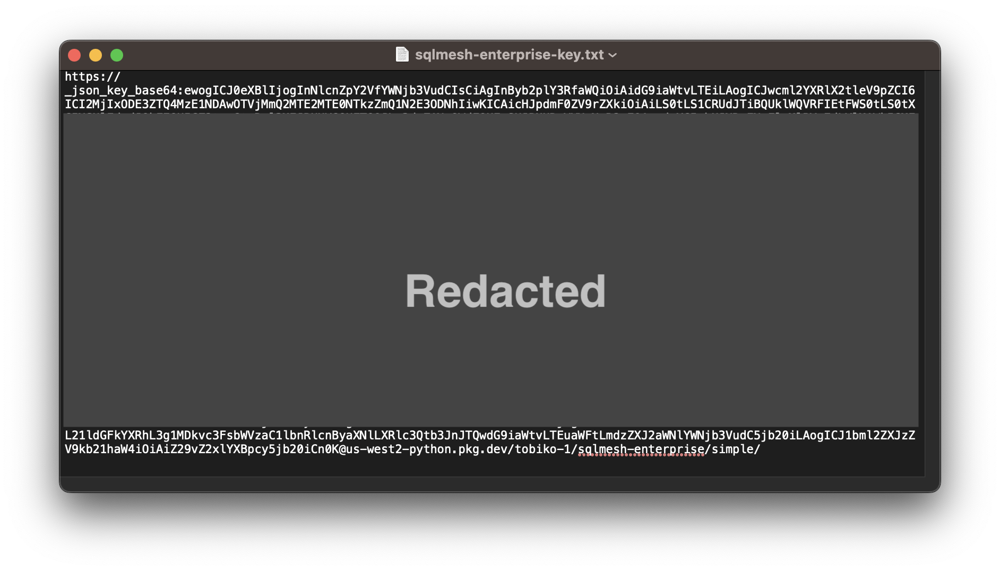{ loading=lazy }

Run the installation command and read the key file with the following command. The key is passed to the `--extra-index-url` argument, either directly by pasting the key into the command or by reading the key from file with an embedded `cat` command. You should replace `<path to key file>` with the path to your key file:

``` bash
> pip install "sqlmesh-enterprise" --extra-index-url  "$(cat <path to key file>)"
```

`sqlmesh-enterprise` works by overriding components of `sqlmesh` open source, and installing `sqlmesh-enterprise` will automatically install open-source `sqlmesh`.

SQLMesh extras, such as SQL engine drivers, can be passed directly to the `sqlmesh-enterprise` installation command. This example installs the SQLMesh Slack notification and Snowflake engine driver extras:

``` bash
> pip install "sqlmesh-enterprise[slack,snowflake]" --extra-index-url  "$(cat <path to key file>)"
```

NOTE: `sqlmesh-enterprise` will not function properly if open-source `sqlmesh` is installed after it.

## Startup

As with the open-source [SQLMesh Browser UI](../quickstart/ui.md), SQLMesh Observer is initiated from the command line then opened in a web browser.

First, navigate to your project directory in the CLI. Then start Observer by running the `sqlmesh observe` command:

```bash
sqlmesh observe
```

After starting up, SQLMesh Observer is served at `http://127.0.0.1:8000` by default:

{ loading=lazy }

Navigate to the URL by clicking the link in your terminal (if supported) or copy-pasting it into your web browser:

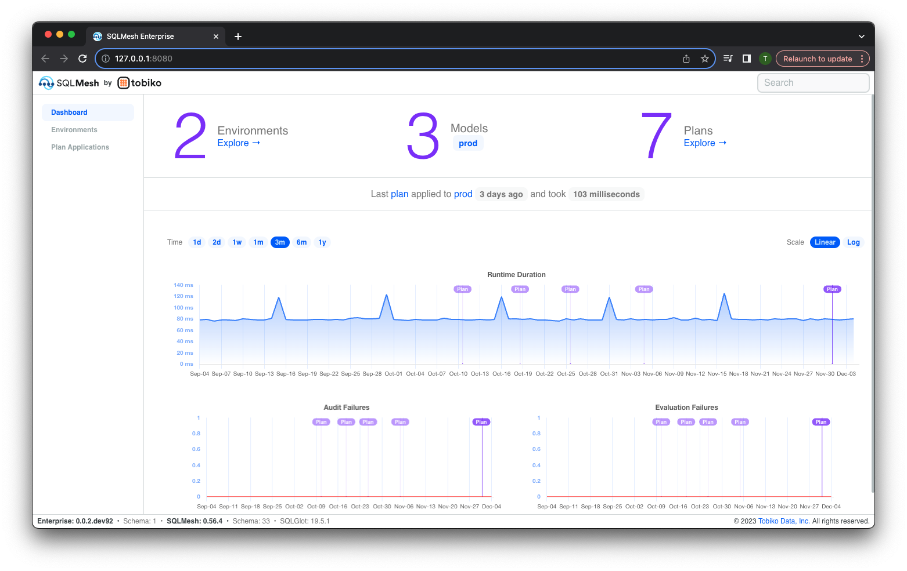{ loading=lazy }

## Interface

We now describe the components of the SQLMesh Observer user interface.

### Dashboard

The "Dashboard" page is displayed when Observer starts - it consists of the following components:

1. Links to the other two pages, "Environments" and "Plan Applications," in the top left
2. Counts and links to key information about environments, models, and plans in the top center
3. Interactive chart of historical `run` run times in the middle center
4. Interactive chart of historical audit failure counts in the bottom left
5. Interactive chart of historical `run` failures in the bottom right

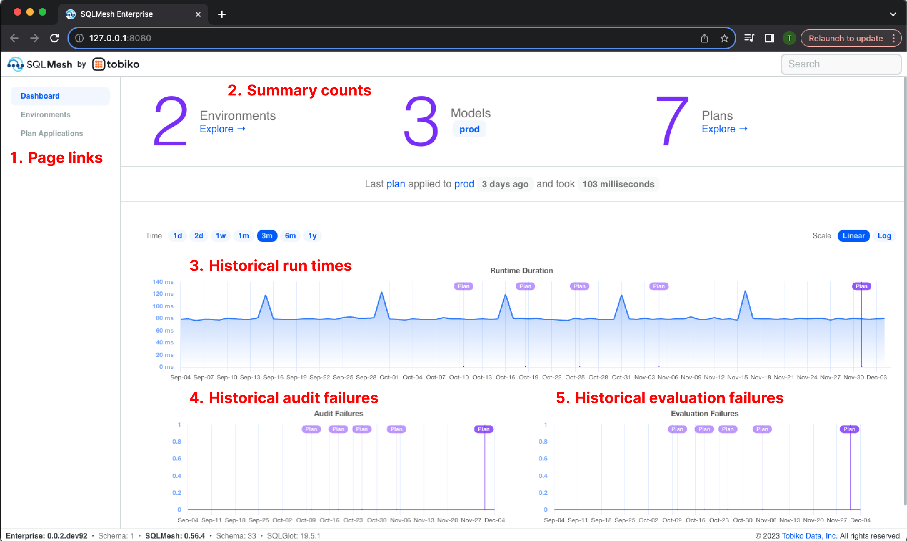{ loading=lazy }

### Charts

Observer presents historical information via charts and tables. Most charts represent time on the x-axis and share the same appearance and user options.

In a chart's top left corner is the `Time` selector, which sets the range of the x-axis. For example, the first chart displays 1 week of data, from November 27 through December 4. The second chart displays the same data but includes 3 months of historical data beginning on September 4:

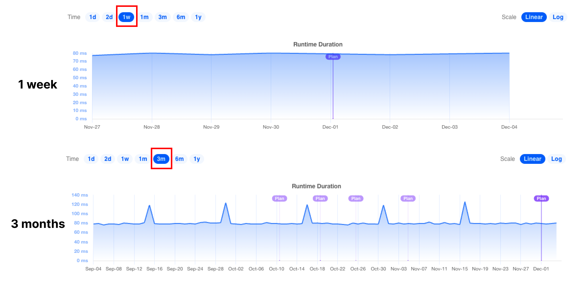{ loading=lazy }

In a chart's top right corner is the `Scale` selector, which toggles between a linear and log y-axis scale. A log scale may be helpful for comparing highly variable data series over time. This example displays the data from the second chart in the previous figure with a log y-axis scale:

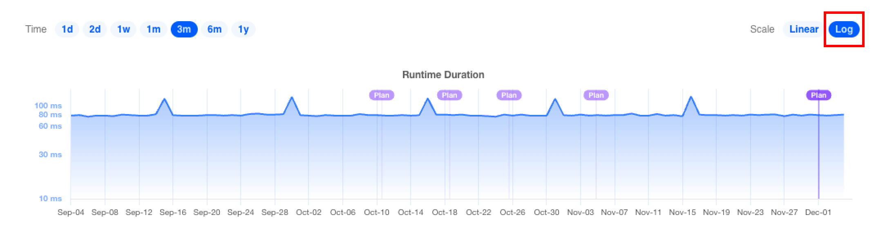{ loading=lazy }

Charts also display the data underlying a specific data point when the mouse hovers over it:

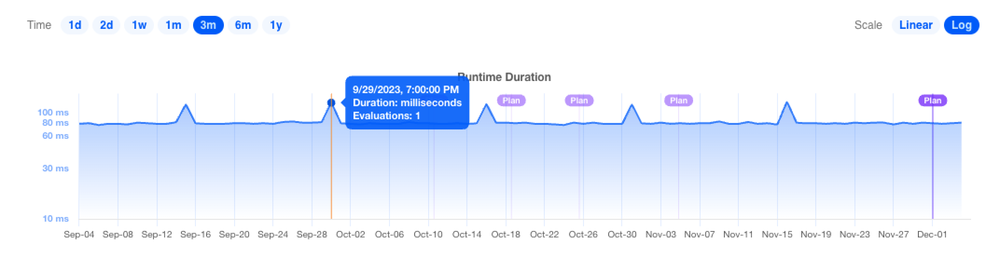{ loading=lazy }

Many charts display purple `Plan` markers, which provide contextual information about when changes to the project occurred. Clicking on the marker will open a page containing [more information about the plan](#plan-applications).

Some Observer tables include a button that toggles a chart of the measures in the table:

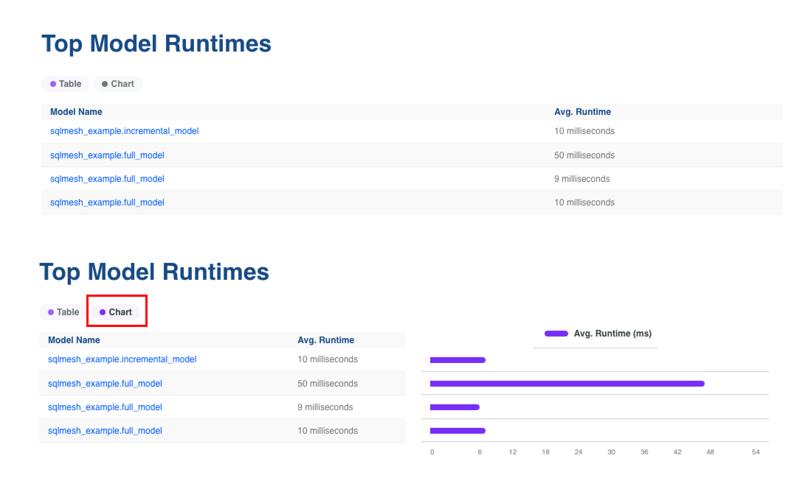{ loading=lazy }


### Environments

Access the `Environments` landing page via the navigation links in the dashboard's top left. It displays a table listing each SQLMesh environment, the date it was created, the date it was last updated, and the date it expires (after which the SQLMesh janitor will delete it). The `prod` environment is always present and has no expiration date.

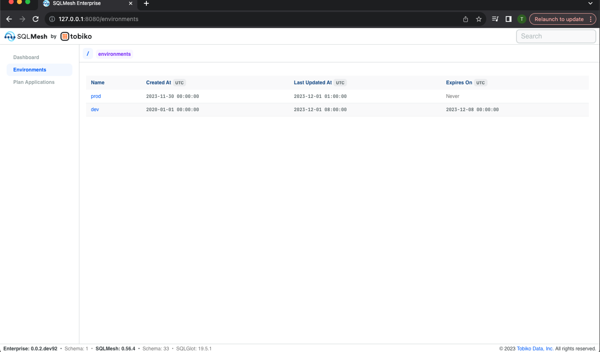{ loading=lazy }

Clicking an environment's name in the table open's the environment's information page. The page begins with historical charts of run time, audit failures, and evaluation failures:

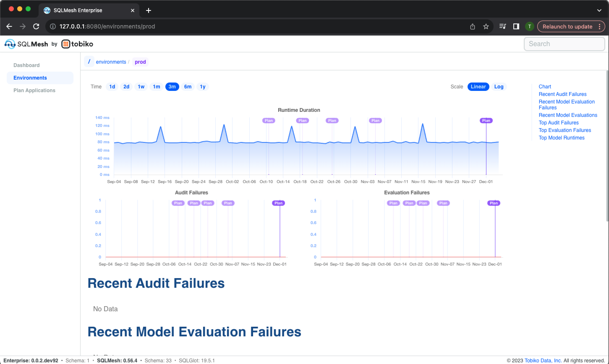{ loading=lazy }

The page continues with lists of recent audit failures, evaluation failure, and model evaluations:

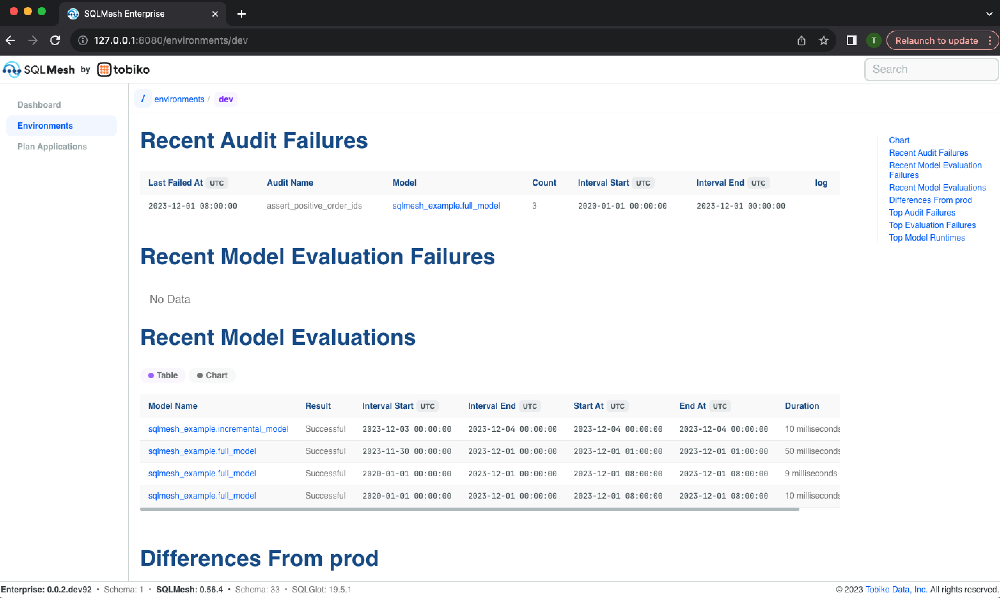{ loading=lazy }

The page finishes with a list of models that differ from those currently in the `prod` environment, a list of the audits that have historically failed most frequently, a list of the models that have historically failed most frequently, and a list of the models with the longest run times:

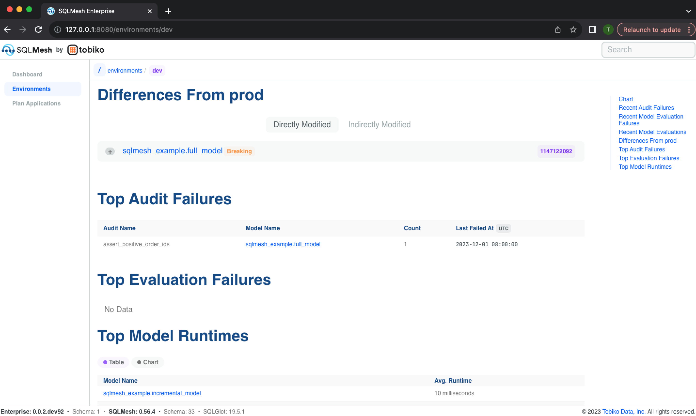{ loading=lazy }

Each model differing from the `prod` environment may be expanded to view the text diff between the two. The models are listed separately based on whether the plan directly or indirectly modified them, and breaking changes are indicated with an orange "Breaking" label:

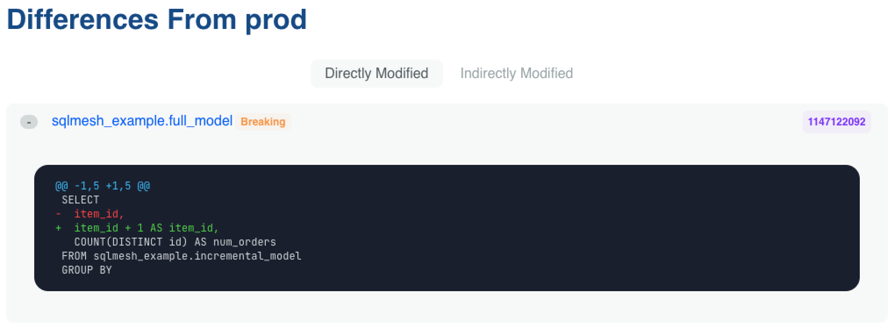{ loading=lazy }

### Plan Applications

Access the `Plan Applications` landing page via the navigation links in the dashboard's top left. It displays a table listing each SQLMesh project plan that has been applied and includes the following information about each:

- Plan ID
- Previous plan ID (most recent plan executed prior)
- Environment to which the plan was applied (with link to environment information page)
- A count of models in the plan (with link to the plan's models)
- Whether the plan included model restatements
- Whether the plan was in forward-only mode
- The start and end dates of the time interval covered by the plan
- The start and end times of the plan application

{ loading=lazy }

Clicking a Plan ID opens its information page, which lists the information included in the landing page table and links to models added or modified by the plan:

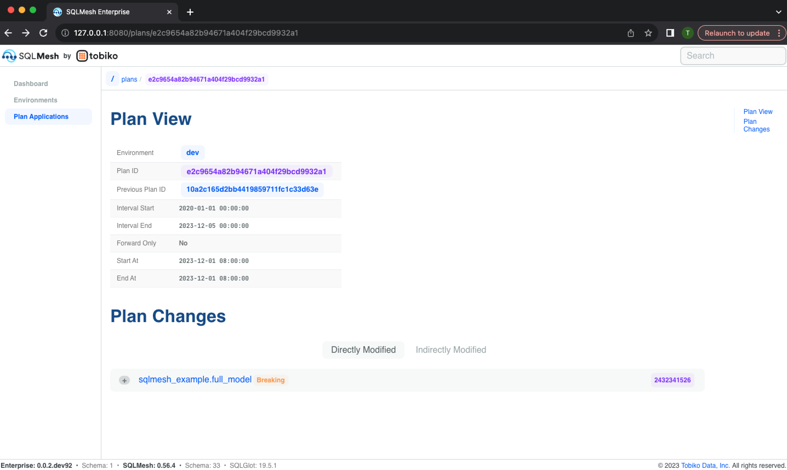{ loading=lazy }

Modified models can be expanded to display a text diff of the change:

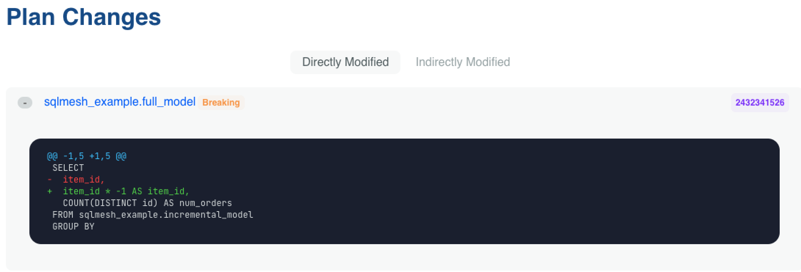{ loading=lazy }

### Models

A model can change over time, so its information is associated with a specific SQLMesh environment and plan. Access a model's page via links in a plan or environment page.

The model information page begins with historical charts of model run time, audit failures, and evaluation failures:

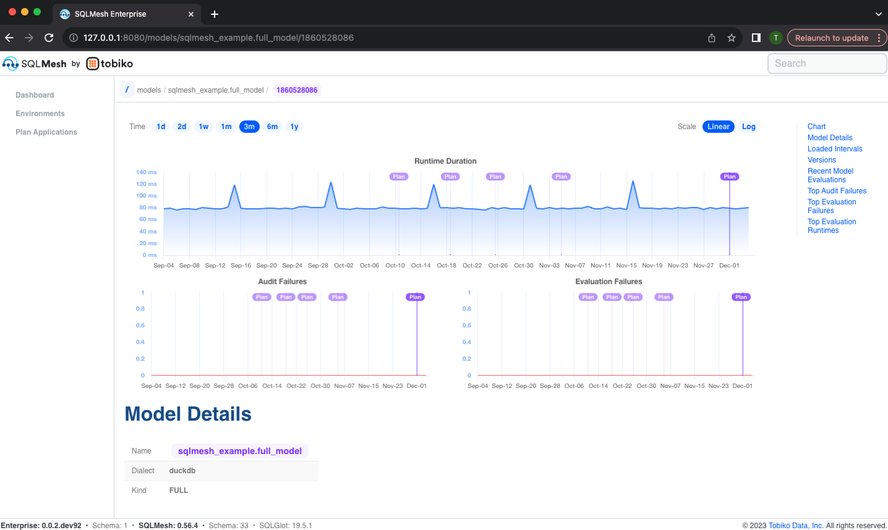{ loading=lazy }

It continues with details about the model, including its metadata (e.g., model dialect and kind), model text, and list of previous model versions and text diffs:

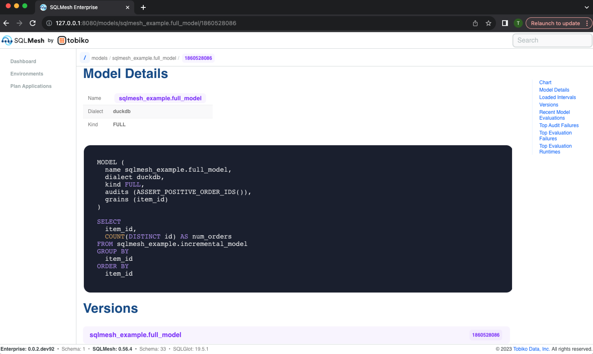{ loading=lazy }

Next, the Loaded Intervals section displays the time intervals that have been loaded and are currently present in the model's physical table, and the Recent Model Evaluations section lists the time interval each evaluation processed and the evaluation's start and end times:

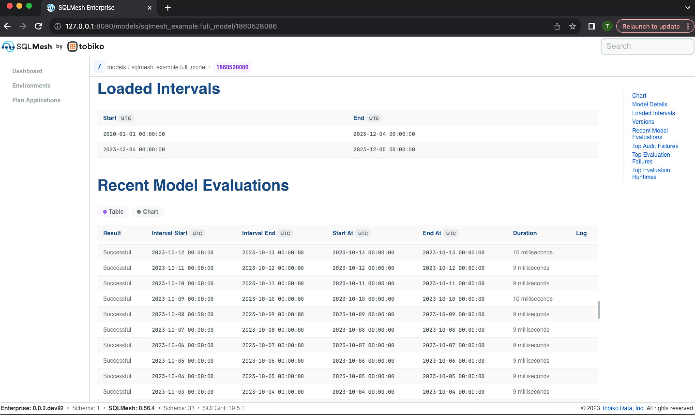{ loading=lazy }

The model information page concludes with a list of most frequent audits the model has failed, the most frequent time intervals that failed, and the largest historical model run times:

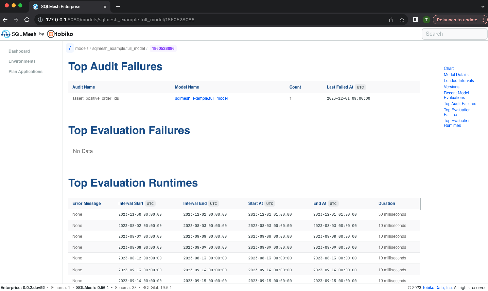{ loading=lazy }

## Custom measures

SQLMesh Observer allows you to calculate and track custom measures in addition to the ones it [automatically calculates](#data).

### Definition

Each custom measure is associated with a model and is defined by a SQL query in the model file.

The `@measure` macro is used to define custom measures. The body of the `@measure` macro is the query, and each column in the query defines a separate measure.

A measure's name is the name of the column that defined it. Measure names must be unique within a model, but a name may be used in multiple models.

A model may contain more than one `@measure` macro specification. The `@measure` macros must be specified after the model's primary query. They will be executed during a SQLMesh `plan` or `run` after the primary model query is executed.

This example shows a model definition that includes a measure query defining two measures: `row_count` (the total number of rows in the table) and `num_col_avg` (the average value of the model's `numeric_col` column).

```sql
MODEL (
  name custom_measure.example,
  kind FULL
);

SELECT
  numeric_col
FROM
  custom_measure.upstream;

@measure( -- Measure query specified in the `@measure` macro
  SELECT
    COUNT(*) AS row_count, -- Table's row count
    AVG(numeric_col) AS num_col_avg -- Average value of `numeric_col`
  FROM custom_measure.example -- Select FROM the name of the model
);
```

Every time the `custom_measure.example` model is executed, Observer will execute the measure query and store the value it returns.

By default, the measure's timestamp will be the execution time of the `plan`/`run` that captured the measure. [Incremental by time range](../concepts/models/model_kinds.md#incremental_by_time_range) models may specify [custom timestamps](#custom-time-column).

An Observer chart allows you to select which measure to display. The chart displays the value of the selected measure on the y-axis and the execution time of the associated `plan`/`run` on the x-axis, allowing you to monitor whether the value has meaningfully changed since the previous execution.

### Incremental by time models

#### Custom time column

In the previous example, Observer automatically associated each measure value with the execution time of the `plan` or `run` that executed it.

For [incremental by time range models](../concepts/models/model_kinds.md#incremental_by_time_range), you can customize how measures are associated with time by including your own time column in the measure query.

The time column must be named `ts` and may be of any datetime data type (e.g., date string, `DATE`, `TIMESTAMP`, etc.). Custom times are typically derived from a datetime column in the model data and are most useful when the measure groups by the datetime.

For example, this incremental model stores the date of each data point in the `event_datestring` column. We could measure each day's row count and numeric column average with this measure query:

```sql
MODEL (
  name custom_measure.incremental_example
  kind INCREMENTAL_BY_TIME_RANGE (
    time_column event_datestring
  )
);

SELECT
  event_datestring,
  numeric_col
FROM
  custom_measure.upstream
WHERE
  event_datestring BETWEEN @start_ds AND @end_ds;

@measure(
  SELECT
    event_datestring AS ts, -- Custom measure time column `ts`
    COUNT(*) AS daily_row_count, -- Daily row count
    AVG(numeric_col) AS daily_num_col_avg -- Daily average value of `numeric_col`
  FROM custom_measure.incremental_example
  WHERE event_datestring BETWEEN @start_ds AND @end_ds -- Filter measure on time
  GROUP BY event_datestring -- Group measure by time
);
```

The measure query both filters and groups the data based on the model's time column `event_datestring`. The filtering and grouping ensures that only one measure value is ever calculated for a specific day of data.

NOTE: the custom time column approach will not work correctly if the model's [`lookback` argument](../concepts/models/overview.md#lookback) is specified because a given day's data will be processed every time it is in the lookback window.

#### Execution and custom times

A model may contain multiple measure queries, so both execution time and custom time measures may be specified for the same model.

These two measure types help answer different questions:

1. Execution time: has something meaningfully changed **on this `plan`/`run`** compared to previous plans/runs?
2. Custom time: has something meaningfully changed **in a specific time point's data** compared to other time points?

If multiple time points of data are processed during each model execution, an anomaly at a specific time may not be detectable from an execution time measure alone.

Custom time measures enable monitoring at the temporal granularity of the data itself.
