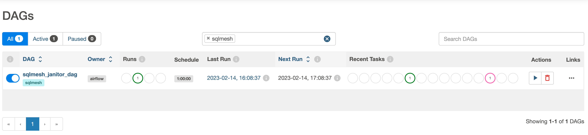
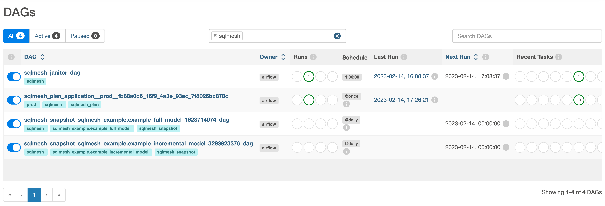

# Scheduling guide

SQLMesh currently offers two ways of scheduling model evaluation:

* Using the [built-in scheduler](#built-in-scheduler)
* By [integrating with Airflow](#integrating-with-airflow)

The built-in scheduler is appropriate for trying out SQLMesh, as well as for smaller data teams with relatively few models.

**Note:** the built-in scheduler has not been designed for scale. As your organization and data models grow, we strongly recommended that you switch to using the Airflow open-source workflow orchestrator to prevent scheduling from becoming a performance bottleneck.

## Built-in scheduler

SQLMesh comes with a built-in scheduler that can be used to schedule model evaluation without requiring any additional tools or dependencies.

To perform model evaluation using the built-in scheduler, run the following command:
```bash
sqlmesh run
```

The command above will automatically detect missing intervals for all models in the current project and then evaluate them:
```bash
$ sqlmesh run

All model batches have been executed successfully

sqlmesh_example.example_incremental_model ━━━━━━━━━━━━━━━━━━━━━━━━━━━━━━━━━━━━━━━━ 100.0% • 1/1 • 0:00:00
       sqlmesh_example.example_full_model ━━━━━━━━━━━━━━━━━━━━━━━━━━━━━━━━━━━━━━━━ 100.0% • 1/1 • 0:00:00
```

**Note:** The `sqlmesh run` command performs model evaluation based on the missing data intervals identified at the time of running. The command itself doesn't run continuously, and will exit once the evaluation is complete. It is the responsibility of users to run this command periodically with a cron job, a CI/CD tool like Jenkins, or in a similar fashion.


## Integrating with Airflow

### Configuring the Airflow cluster

SQLMesh natively integrates with the popular open source workflow orchestrator [Apache Airflow](https://airflow.apache.org/), both self-hosted and managed (e.g. Google Cloud Composer, Amazon MWAA, Astronomer).

To integrate with [Airflow](../integrations/airflow.md), ensure that you meet the [prerequisites](/prerequisites), then perform the following:

1. Install the SQLMesh Python package on all nodes of the Airflow cluster using the following command:

        pip install sqlmesh

    **Note:** The Airflow webserver must be restarted after installation.

2. Within the Airflow `dags/` folder, create a file called `sqlmesh.py`.

3. Within that file add the following, making sure to replace "spark" with your engine if you are using a different one:

        from sqlmesh.schedulers.airflow.integration import SQLMeshAirflow

        sqlmesh_airflow = SQLMeshAirflow("spark")

        for dag in sqlmesh_airflow.dags:
            globals()[dag.dag_id] = dag

    The example above uses `spark` as the engine of choice. Other engines can be configured instead by providing a corresponding string as an argument to the `SQLMeshAirflow` constructor. Supported strings are `"spark"`, `"databricks"`, `"snowflake"`, `"bigquery"` and `"redshift"`.

    **Note:** An Airflow Connection must be configured for each engine accordingly. Refer to [Engine support](../integrations/airflow.md#engine-support) for more details.

After setup is completed, the `sqlmesh_janitor_dag` DAG should become available in the Airflow UI when filtered by the `sqlmesh` tag:



### Configuring the client

On the client side, you must configure the connection to your Airflow cluster in the `config.yaml` file as follows:

        default_scheduler:
            type: airflow
            airflow_url: http://localhost:8080/
            username: airflow
            password: airflow

Alternatively, the configuration above can be generated automatically as part of the project initialization using the `airflow` template:
```bash
sqlmesh init -t airflow
```

For Airflow configuration types specific to Google Cloud Composer, configure the file as follows:

        default_scheduler:
            type: cloud_composer
            airflow_url: https:/XXXXXXXX.composer.googleusercontent.com/

**Note:** Guidelines for integrating with managed offerings other than Google Cloud Composer will be added later.

### Running the `plan` command

Run the `sqlmesh plan` command to apply all changes on the target Airflow cluster.

Below is example output from running the `sqlmesh plan` command in the example project generated by the `sqlmesh init` command:
```bash
$ sqlmesh plan
======================================================================
Successfully Ran 1 tests against duckdb
----------------------------------------------------------------------
Summary of differences against `prod`:
└── Added Models:
    ├── sqlmesh_example.example_incremental_model
    └── sqlmesh_example.example_full_model
Models needing backfill (missing dates):
├── sqlmesh_example.example_incremental_model: (2020-01-01, 2023-02-13)
└── sqlmesh_example.example_full_model: (2023-02-13, 2023-02-13)
Enter the backfill start date (eg. '1 year', '2020-01-01') or blank for the beginning of history: 2023-02-13
Apply - Backfill Tables [y/n]: y
Waiting for the plan application DAG 'sqlmesh_plan_application__prod__fb88a0c6_16f9_4a3e_93ec_7f8026bc878c' to be provisioned on Airflow
Track plan application progress using link
```

Once the command runs, the following DAGs will become available within the Airflow UI:


